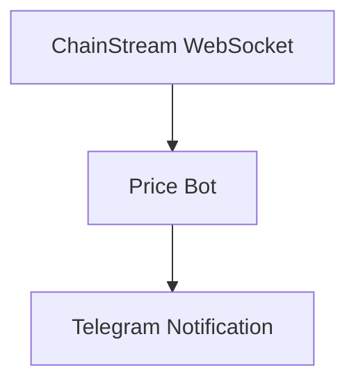

This tutorial will guide you through building a real-time price monitoring bot from scratch that automatically sends Telegram notifications when target token price changes exceed a set threshold.

<Info>
**Estimated Time**: 30 minutes  
**Difficulty Level**: ⭐⭐ Beginner
</Info>

---

## Objective

Build a bot that monitors token prices and sends automatic notifications:



**Feature Checklist**:
- ✅ Subscribe to real-time price stream
- ✅ Set price change trigger conditions (> X%)
- ✅ Send Telegram notifications
- ✅ Support multi-token monitoring

---

## Tech Stack

| Component | Technology | Purpose |
|-----------|------------|---------|
| Language | Node.js 18+ | Main development language |
| Real-time Data | WebSocket | Subscribe to price stream |
| Notification | Telegram Bot API | Send alerts |
| Configuration | Environment Variables | Store sensitive info |

---

## Prerequisites

- ChainStream account (to get Access Token)
- Node.js 18+
- Telegram Account

---

## Step 1: Connect WebSocket

### 1.1 Install Dependencies

```bash
npm install @chainstream-io/sdk node-telegram-bot-api dotenv
```

### 1.2 Create Project Structure

```
price-alert-bot/
├── .env
├── config.js
├── bot.js
└── index.js
```

### 1.3 Configuration Files

**.env**:

```
CHAINSTREAM_ACCESS_TOKEN=your_access_token
TELEGRAM_BOT_TOKEN=your_bot_token
TELEGRAM_CHAT_ID=your_chat_id
```

**config.js**:

```javascript
import 'dotenv/config';

// ChainStream Config
export const CHAINSTREAM_ACCESS_TOKEN = process.env.CHAINSTREAM_ACCESS_TOKEN;

// Telegram Config
export const TELEGRAM_BOT_TOKEN = process.env.TELEGRAM_BOT_TOKEN;
export const TELEGRAM_CHAT_ID = process.env.TELEGRAM_CHAT_ID;

// Watch Config
export const WATCH_TOKENS = [
  {
    chain: 'sol',
    address: '6p6xgHyF7AeE6TZkSmFsko444wqoP15icUSqi2jfGiPN',
    symbol: 'EXAMPLE',
    thresholdPercent: 3.0  // Trigger at 3% change
  },
  {
    chain: 'sol',
    address: 'So11111111111111111111111111111111111111112',
    symbol: 'SOL',
    thresholdPercent: 5.0  // Trigger at 5% change
  }
];
```

### 1.4 WebSocket Connection

**index.js**:

```javascript
import { ChainStreamClient } from '@chainstream-io/sdk';
import { CHAINSTREAM_ACCESS_TOKEN, WATCH_TOKENS } from './config.js';
import { sendAlert } from './bot.js';

class PriceMonitor {
  constructor() {
    this.client = new ChainStreamClient(CHAINSTREAM_ACCESS_TOKEN);
    this.lastPrices = new Map(); // Record last prices
  }

  async start() {
    console.log('✅ Starting price monitoring...');

    // Subscribe to each token's stats
    for (const token of WATCH_TOKENS) {
      this.subscribeToken(token);
    }
  }

  subscribeToken(token) {
    this.client.stream.subscribeTokenStats({
      chain: token.chain,
      tokenAddress: token.address,
      callback: (data) => this.handlePriceUpdate(token, data)
    });

    console.log(`📡 Subscribed to ${token.symbol} price stream`);
  }

  handlePriceUpdate(token, data) {
    const currentPrice = data.price || data.p;
    if (!currentPrice) return;

    const lastPrice = this.lastPrices.get(token.address);

    if (lastPrice) {
      // Calculate change percentage
      const changePercent = ((currentPrice - lastPrice) / lastPrice) * 100;

      // Check if alert should be triggered
      if (Math.abs(changePercent) >= token.thresholdPercent) {
        this.triggerAlert(token, currentPrice, changePercent);
      }
    }

    // Update price record
    this.lastPrices.set(token.address, currentPrice);
  }

  async triggerAlert(token, price, change) {
    const direction = change > 0 ? '📈 UP' : '📉 DOWN';

    const message = `
${direction} Price Alert!

🪙 Token: ${token.symbol}
💰 Current Price: $${price.toFixed(6)}
📊 Change: ${change >= 0 ? '+' : ''}${change.toFixed(2)}%
⚡ Threshold: ${token.thresholdPercent}%
    `.trim();

    await sendAlert(message);
    console.log(`🚨 Alert sent: ${token.symbol} ${change >= 0 ? '+' : ''}${change.toFixed(2)}%`);
  }
}

// Start monitoring
const monitor = new PriceMonitor();
monitor.start();
```

---

## Step 2: Set Trigger Conditions

Trigger conditions are configured in `config.js`:

```javascript
export const WATCH_TOKENS = [
  {
    symbol: 'EXAMPLE',
    thresholdPercent: 3.0  // Trigger when price change > 3%
  },
  // ...
];
```

### Advanced Trigger Conditions

Can be extended to more complex conditions:

```javascript
// Multi-condition triggers
const ALERT_CONDITIONS = {
  priceChange: {
    enabled: true,
    thresholdPercent: 5.0
  },
  priceAbove: {
    enabled: true,
    value: 100  // Trigger when price exceeds $100
  },
  priceBelow: {
    enabled: true,
    value: 50   // Trigger when price falls below $50
  }
};
```

---

## Step 3: Send Notifications

### 3.1 Create Telegram Bot

<Steps>
  <Step title="Create Bot">
    Search for `@BotFather` in Telegram, send `/newbot`
  </Step>
  <Step title="Get Token">
    Follow prompts to create Bot, get Bot Token
  </Step>
  <Step title="Get Chat ID">
    - Send a message to your Bot
    - Visit `https://api.telegram.org/bot<TOKEN>/getUpdates`
    - Find `chat.id`
  </Step>
</Steps>

### 3.2 Telegram Notification Module

**bot.js**:

```javascript
import TelegramBot from 'node-telegram-bot-api';
import { TELEGRAM_BOT_TOKEN, TELEGRAM_CHAT_ID } from './config.js';

const bot = new TelegramBot(TELEGRAM_BOT_TOKEN);

export async function sendAlert(message) {
  try {
    await bot.sendMessage(TELEGRAM_CHAT_ID, message, {
      parse_mode: 'HTML'
    });
  } catch (error) {
    console.error(`❌ Telegram send failed: ${error.message}`);
  }
}

export async function sendAlertWithRetry(message, maxRetries = 3) {
  for (let attempt = 0; attempt < maxRetries; attempt++) {
    try {
      await sendAlert(message);
      return true;
    } catch (error) {
      if (attempt < maxRetries - 1) {
        // Exponential backoff
        await new Promise(resolve => setTimeout(resolve, 2 ** attempt * 1000));
      } else {
        console.error(`❌ Notification failed after ${maxRetries} retries`);
        return false;
      }
    }
  }
}
```

---

## Verify Installation

### Run Bot

```bash
node index.js
```

### Expected Output

```
✅ Starting price monitoring...
📡 Subscribed to EXAMPLE price stream
📡 Subscribed to SOL price stream
```

### Trigger Test

Temporarily set threshold to 0.01% for quick testing:

```javascript
thresholdPercent: 0.01  // For testing
```

---

## Extension Suggestions

<Tabs>
  <Tab title="Multi-Token Monitoring">
```javascript
// Dynamically fetch watchlist from API
async function fetchWatchlist() {
  const response = await fetch('https://api.chainstream.io/v1/watchlist');
  return response.json();
}
```
  </Tab>
  <Tab title="Persistent Storage">
```javascript
import Database from 'better-sqlite3';

const db = new Database('alerts.db');

// Create table
db.exec(`
  CREATE TABLE IF NOT EXISTS alerts (
    id INTEGER PRIMARY KEY AUTOINCREMENT,
    symbol TEXT,
    price REAL,
    change REAL,
    timestamp INTEGER
  )
`);

function saveAlert(alertData) {
  const stmt = db.prepare(`
    INSERT INTO alerts (symbol, price, change, timestamp)
    VALUES (?, ?, ?, ?)
  `);
  stmt.run(
    alertData.symbol,
    alertData.price,
    alertData.change,
    Date.now()
  );
}
```
  </Tab>
  <Tab title="Web Dashboard">
```javascript
import express from 'express';

const app = express();

app.get('/alerts', (req, res) => {
  const alerts = getRecentAlerts();
  res.json({ alerts });
});

app.post('/config', (req, res) => {
  // Update monitoring config
  updateConfig(req.body);
  res.json({ success: true });
});

app.listen(3000);
```
  </Tab>
  <Tab title="Multi-Channel Notifications">
```javascript
async function sendNotification(message, channels) {
  const tasks = [];
  
  if (channels.includes('telegram')) {
    tasks.push(sendTelegram(message));
  }
  if (channels.includes('discord')) {
    tasks.push(sendDiscord(message));
  }
  if (channels.includes('email')) {
    tasks.push(sendEmail(message));
  }
  
  await Promise.all(tasks);
}
```
  </Tab>
</Tabs>

---

## FAQ

<AccordionGroup>
  <Accordion title="WebSocket connection failed?" icon="plug">
    1. Check if Access Token is correct
    2. Confirm network can access ChainStream
    3. Check if firewall is blocking WebSocket
  </Accordion>
  
  <Accordion title="Not receiving Telegram notifications?" icon="telegram">
    1. Confirm Bot Token is correct
    2. Confirm Chat ID is correct
    3. Make sure you've sent a message to the Bot (activate conversation)
  </Accordion>
  
  <Accordion title="How to monitor more tokens?" icon="coins">
    Add more configurations to the `WATCH_TOKENS` array in `config.js`.
  </Accordion>
</AccordionGroup>

---

## Related Documentation

<CardGroup cols={2}>
  <Card title="WebSocket API" icon="plug" href="/en/api-reference/endpoint/websocket/api">
    WebSocket subscription details
  </Card>
  <Card title="Webhook Fundamentals" icon="webhook" href="/en/playbooks/frameworks/webhook-fundamentals">
    Use Webhook instead of WebSocket
  </Card>
</CardGroup>
