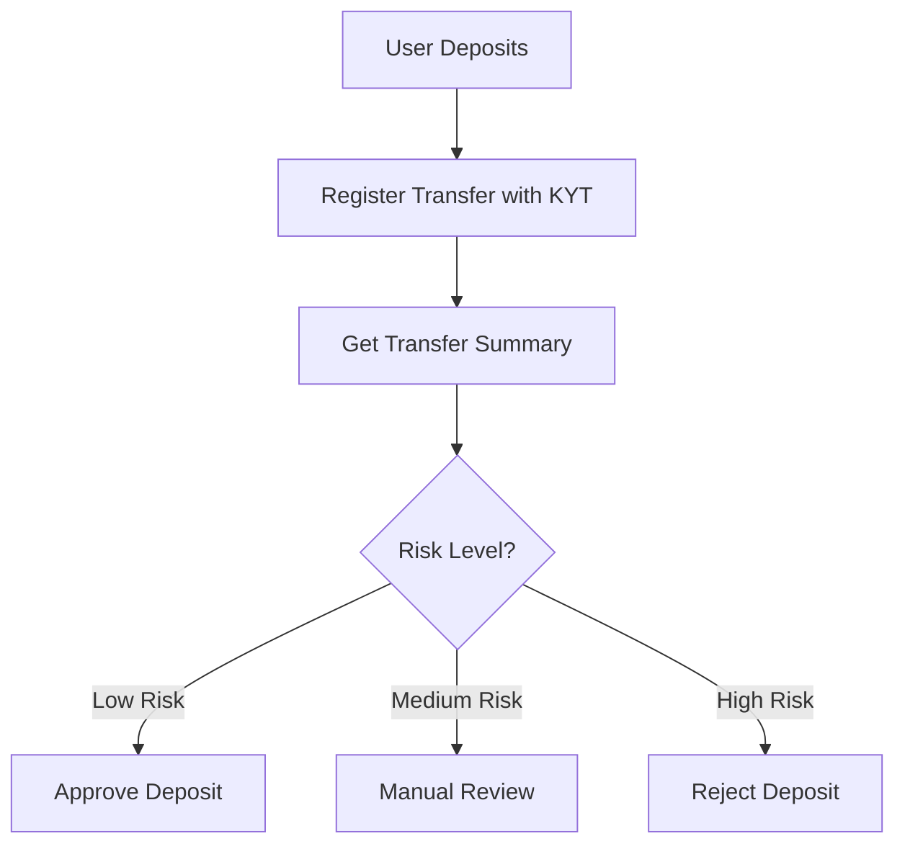

## Project Overview

This tutorial builds a deposit risk control system that automatically assesses fund source risk when users deposit.

<Info>
**Estimated Time**: 30 minutes  
**Difficulty Level**: ⭐⭐ Beginner
</Info>

**Features**:
- Register deposit transactions for KYT analysis
- Query transaction risk assessment results
- Process deposits based on risk level

---

## How It Works



---

## Step 1: Register Deposit Transaction

When a deposit is detected, register it with the KYT API for analysis.

```javascript
import { ChainStreamClient } from '@chainstream-io/sdk';

const client = new ChainStreamClient(process.env.CHAINSTREAM_ACCESS_TOKEN);

async function registerDeposit(deposit) {
  // Register the transfer for KYT analysis
  const response = await client.kyt.registerTransfer({
    network: deposit.network,        // 'bitcoin', 'ethereum', 'Solana'
    asset: deposit.asset,            // 'BTC', 'ETH', 'SOL'
    transferReference: deposit.txHash, // Transaction hash
    direction: 'received'            // Deposit = received
  });

  return response.transferId;
}
```

---

## Step 2: Get Risk Assessment

After registration, query the transfer summary to get risk information.

```javascript
async function getTransferRisk(transferId) {
  // Get transfer summary with risk assessment
  const summary = await client.kyt.getTransferSummary(transferId);

  // Get detailed alerts if any
  const alerts = await client.kyt.getTransferAlerts(transferId);

  // Get direct exposure information
  const exposures = await client.kyt.getTransferDirectExposure(transferId);

  return {
    summary,
    alerts,
    exposures
  };
}
```

---

## Step 3: Process Based on Risk

Implement risk-based processing logic.

```javascript
async function evaluateDeposit(deposit) {
  // Register the deposit
  const transferId = await registerDeposit(deposit);

  // Get risk assessment
  const { summary, alerts, exposures } = await getTransferRisk(transferId);

  // Determine risk level based on alerts
  const hasHighRiskAlert = alerts.some(
    alert => alert.severity === 'high' || alert.severity === 'critical'
  );
  const hasMediumRiskAlert = alerts.some(
    alert => alert.severity === 'medium'
  );

  // Process based on risk
  if (hasHighRiskAlert) {
    return rejectDeposit(deposit, alerts);
  }

  if (hasMediumRiskAlert) {
    return queueForReview(deposit, alerts);
  }

  return approveDeposit(deposit);
}

function approveDeposit(deposit) {
  console.log(`✅ Deposit approved: ${deposit.txHash}`);
  // Credit user account
  return { status: 'approved', deposit };
}

function queueForReview(deposit, alerts) {
  console.log(`⚠️ Deposit queued for review: ${deposit.txHash}`);
  // Notify compliance team
  return { status: 'pending_review', deposit, alerts };
}

function rejectDeposit(deposit, alerts) {
  console.log(`❌ Deposit rejected: ${deposit.txHash}`);
  // Log and notify
  return { status: 'rejected', deposit, alerts };
}
```

---

## Complete Example

```javascript
import { ChainStreamClient } from '@chainstream-io/sdk';

const client = new ChainStreamClient(process.env.CHAINSTREAM_ACCESS_TOKEN);

class DepositRiskChecker {
  async checkDeposit(deposit) {
    try {
      // Step 1: Register transfer
      const { transferId } = await client.kyt.registerTransfer({
        network: deposit.network,
        asset: deposit.asset,
        transferReference: deposit.txHash,
        direction: 'received'
      });

      console.log(`📝 Registered transfer: ${transferId}`);

      // Step 2: Get risk assessment
      const summary = await client.kyt.getTransferSummary(transferId);
      const alerts = await client.kyt.getTransferAlerts(transferId);

      console.log(`📊 Risk assessment complete`);
      console.log(`   Alerts: ${alerts.length}`);

      // Step 3: Make decision
      return this.makeDecision(deposit, summary, alerts);

    } catch (error) {
      console.error(`❌ Error checking deposit: ${error.message}`);
      // On error, queue for manual review
      return { status: 'pending_review', reason: 'system_error' };
    }
  }

  makeDecision(deposit, summary, alerts) {
    const criticalAlerts = alerts.filter(a => a.severity === 'critical');
    const highAlerts = alerts.filter(a => a.severity === 'high');
    const mediumAlerts = alerts.filter(a => a.severity === 'medium');

    if (criticalAlerts.length > 0 || highAlerts.length > 0) {
      return {
        status: 'rejected',
        reason: 'high_risk_detected',
        alerts: [...criticalAlerts, ...highAlerts]
      };
    }

    if (mediumAlerts.length > 0) {
      return {
        status: 'pending_review',
        reason: 'medium_risk_detected',
        alerts: mediumAlerts
      };
    }

    return {
      status: 'approved',
      reason: 'low_risk'
    };
  }
}

// Usage
const checker = new DepositRiskChecker();

const deposit = {
  network: 'Solana',
  asset: 'SOL',
  txHash: '39z5QAprVrzaFzfHu1JHPgBf9dSqYdNYhH31d3PEd4hWiWL1LML7qCct5MHGxaRAgjjj1nC3XUyLwtzGQmYqUk4y:address'
};

const result = await checker.checkDeposit(deposit);
console.log('Decision:', result);
```

---

## API Reference

| Endpoint | Description |
|----------|-------------|
| `POST /v1/kyt/transfer` | Register a transfer for KYT analysis |
| `GET /v1/kyt/transfers/{id}/summary` | Get transfer summary |
| `GET /v1/kyt/transfers/{id}/alerts` | Get transfer alerts |
| `GET /v1/kyt/transfers/{id}/exposures/direct` | Get direct exposure info |

---

## Next Steps

<CardGroup cols={2}>
  <Card title="KYT Concepts" icon="magnifying-glass-dollar" href="/en/guides/data-concepts/kyt-concepts">
    Learn KYT workings
  </Card>
  <Card title="KYT API Reference" icon="code" href="/en/api-reference/endpoint/kyt/v1/kyt-transfer-post">
    Complete API documentation
  </Card>
</CardGroup>
