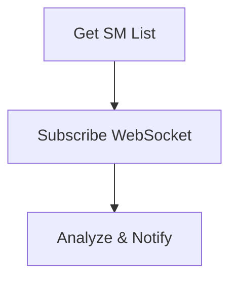

This tutorial introduces how to build a Smart Money tracking system that monitors smart money address trading behavior in real-time to obtain valuable market signals.

<Info>
**Estimated Time**: 45 minutes  
**Difficulty Level**: ⭐⭐⭐ Intermediate
</Info>

---

## Objective

Build a complete Smart Money tracking system:



**Feature Checklist**:
- ✅ Get Smart Money list
- ✅ Subscribe to SM trading stream
- ✅ Trade parsing and pattern recognition
- ✅ Signal notifications

---

## Methodology Review

Before starting, we recommend reading [Smart Money Methodology](/en/guides/data-concepts/smart-money-methodology) to understand:

- Definition and types of Smart Money
- Scoring model (Smart Score)
- Signal strength interpretation
- Usage considerations

---

## Step 1: Get SM List

### API to Get Smart Money List

```python
# sm_client.py
import requests
from config import CHAINSTREAM_ACCESS_TOKEN, CHAINSTREAM_BASE_URL

class SmartMoneyClient:
    def __init__(self):
        self.headers = {'Authorization': f'Bearer {CHAINSTREAM_ACCESS_TOKEN}'}
    
    def get_smart_money_list(self, chain: str = 'ethereum', limit: int = 100) -> list:
        """Get Smart Money list"""
        url = f"{CHAINSTREAM_BASE_URL}/discovery/smart-money"
        
        params = {
            'chain': chain,
            'limit': limit,
            'min_score': 70,  # Minimum Smart Score
            'sort': 'score_desc'
        }
        
        response = requests.get(url, headers=self.headers, params=params)
        return response.json().get('wallets', [])
        
        # Response example:
        # [
        #   {
        #     "address": "0xabc...",
        #     "smart_score": 92,
        #     "tags": ["whale", "defi_expert"],
        #     "stats": {
        #       "roi_90d": "45.2%",
        #       "win_rate": "72%"
        #     }
        #   },
        #   ...
        # ]
    
    def get_wallet_activities(self, address: str, limit: int = 20) -> list:
        """Get wallet recent transactions"""
        url = f"{CHAINSTREAM_BASE_URL}/wallets/{address}/activities"
        
        params = {'limit': limit}
        response = requests.get(url, headers=self.headers, params=params)
        return response.json().get('activities', [])
```

### Using Preset Lists

```python
# ChainStream provides preset SM lists
PRESET_LISTS = {
    'ethereum_top_100': 'eth_top_traders',
    'solana_smart_money': 'sol_smart_money',
    'base_early_adopters': 'base_early'
}

def get_preset_list(list_id: str) -> list:
    url = f"{CHAINSTREAM_BASE_URL}/discovery/lists/{list_id}"
    response = requests.get(url, headers=headers)
    return response.json().get('wallets', [])
```

---

## Step 2: Subscribe to Trades

### WebSocket Subscription

```python
# tracker.py
import asyncio
import json
import websockets
from config import CHAINSTREAM_ACCESS_TOKEN

class SmartMoneyTracker:
    def __init__(self, wallets: list):
        self.wallets = wallets
        self.ws_url = 'wss://realtime-dex.chainstream.io/connection/websocket'
        self.ws = None
    
    async def connect(self):
        """Connect to WebSocket"""
        # Pass token via URL parameter
        ws_url = f"{self.ws_url}?token={CHAINSTREAM_ACCESS_TOKEN}"
        self.ws = await websockets.connect(ws_url)
        print("✅ WebSocket connected")
    
    async def subscribe(self):
        """Subscribe to Smart Money trades"""
        # Method 1: Subscribe to specific addresses
        for wallet in self.wallets[:50]:  # Limit subscription count
            msg = {
                'action': 'subscribe',
                'channel': 'wallet_activity',
                'params': {
                    'address': wallet['address'],
                    'events': ['swap', 'transfer']
                }
            }
            await self.ws.send(json.dumps(msg))
        
        # Method 2: Subscribe to Smart Money aggregated channel (recommended)
        msg = {
            'action': 'subscribe',
            'channel': 'smart_money',
            'params': {
                'chains': ['ethereum', 'arbitrum', 'base'],
                'min_score': 70,
                'min_value_usd': 10000
            }
        }
        await self.ws.send(json.dumps(msg))
        
        print("📡 Subscribed to Smart Money trading stream")
    
    async def listen(self, callback):
        """Listen to trading events"""
        async for message in self.ws:
            data = json.loads(message)
            
            if data.get('type') == 'smart_money_activity':
                await callback(data)
    
    async def run(self, callback):
        """Run tracker"""
        while True:
            try:
                await self.connect()
                await self.subscribe()
                await self.listen(callback)
            except websockets.ConnectionClosed:
                print("⚠️ Connection closed, reconnecting in 5s...")
                await asyncio.sleep(5)
```

### Or Use Webhook

```python
# Create Webhook to subscribe to Smart Money activities
webhook_config = {
    'url': 'https://your-server.com/sm-webhook',
    'events': ['smartmoney.buy', 'smartmoney.sell', 'smartmoney.new_token'],
    'filters': {
        'min_score': 70,
        'min_value_usd': 10000,
        'chains': ['ethereum', 'arbitrum']
    }
}
```

---

## Step 3: Analysis and Notification

### Trade Parsing

```python
# analyzer.py
from dataclasses import dataclass
from typing import Optional

@dataclass
class SmartMoneySignal:
    wallet_address: str
    wallet_score: int
    wallet_tags: list
    action: str  # buy, sell
    token_symbol: str
    token_address: str
    amount_usd: float
    price: float
    signal_strength: str  # strong, medium, weak
    timestamp: str

class SignalAnalyzer:
    
    def analyze(self, event: dict) -> Optional[SmartMoneySignal]:
        """Analyze trading event, generate signal"""
        wallet = event.get('wallet', {})
        transaction = event.get('transaction', {})
        
        # Calculate signal strength
        strength = self._calc_signal_strength(wallet, transaction)
        
        if strength == 'ignore':
            return None
        
        return SmartMoneySignal(
            wallet_address=wallet['address'],
            wallet_score=wallet.get('smart_score', 0),
            wallet_tags=wallet.get('tags', []),
            action=transaction.get('type', 'unknown'),
            token_symbol=transaction.get('token', {}).get('symbol', 'Unknown'),
            token_address=transaction.get('token', {}).get('address', ''),
            amount_usd=float(transaction.get('value_usd', 0)),
            price=float(transaction.get('price', 0)),
            signal_strength=strength,
            timestamp=event.get('timestamp', '')
        )
    
    def _calc_signal_strength(self, wallet: dict, tx: dict) -> str:
        """Calculate signal strength"""
        score = wallet.get('smart_score', 0)
        value_usd = float(tx.get('value_usd', 0))
        is_new_token = tx.get('is_first_buy', False)
        
        # Strong signal conditions
        if score >= 85 and value_usd >= 100000:
            return 'strong'
        if is_new_token and score >= 80:
            return 'strong'
        
        # Medium signal
        if score >= 70 and value_usd >= 50000:
            return 'medium'
        
        # Weak signal
        if score >= 60 and value_usd >= 10000:
            return 'weak'
        
        return 'ignore'
```

### Notification Module

```python
# notifier.py
import aiohttp
from config import TELEGRAM_BOT_TOKEN, TELEGRAM_CHAT_ID

class Notifier:
    
    async def send_signal(self, signal):
        """Send signal notification"""
        
        # Signal strength emoji
        strength_emoji = {
            'strong': '🔴',
            'medium': '🟡',
            'weak': '🟢'
        }
        
        # Action emoji
        action_emoji = '📈' if signal.action == 'buy' else '📉'
        
        message = f"""
{strength_emoji.get(signal.signal_strength, '⚪')} Smart Money Signal

{action_emoji} **{signal.action.upper()}** {signal.token_symbol}

👤 Address: `{signal.wallet_address[:10]}...`
⭐ Smart Score: {signal.wallet_score}
🏷️ Tags: {', '.join(signal.wallet_tags)}

💰 Amount: ${signal.amount_usd:,.0f}
💵 Price: ${signal.price:.6f}

⏰ {signal.timestamp}
        """
        
        await self._send_telegram(message)
    
    async def _send_telegram(self, message: str):
        """Send Telegram message"""
        url = f"https://api.telegram.org/bot{TELEGRAM_BOT_TOKEN}/sendMessage"
        
        async with aiohttp.ClientSession() as session:
            await session.post(url, json={
                'chat_id': TELEGRAM_CHAT_ID,
                'text': message,
                'parse_mode': 'Markdown'
            })
```

---

## Complete Code

```python
# main.py
import asyncio
from sm_client import SmartMoneyClient
from tracker import SmartMoneyTracker
from analyzer import SignalAnalyzer
from notifier import Notifier

async def main():
    # Initialize
    client = SmartMoneyClient()
    analyzer = SignalAnalyzer()
    notifier = Notifier()
    
    # Get Smart Money list
    print("📋 Getting Smart Money list...")
    wallets = client.get_smart_money_list(chain='ethereum', limit=100)
    print(f"✅ Got {len(wallets)} Smart Money addresses")
    
    # Define callback handler
    async def on_activity(event):
        signal = analyzer.analyze(event)
        
        if signal:
            print(f"🎯 {signal.signal_strength.upper()} | {signal.action} {signal.token_symbol} | ${signal.amount_usd:,.0f}")
            await notifier.send_signal(signal)
    
    # Start tracking
    tracker = SmartMoneyTracker(wallets)
    print("🚀 Starting Smart Money tracker...")
    await tracker.run(on_activity)

if __name__ == '__main__':
    asyncio.run(main())
```

---

## Use Cases

### Copy-Trading Reference

```python
# Filter strong signals for reference
def filter_strong_signals(signals: list) -> list:
    return [
        s for s in signals 
        if s.signal_strength == 'strong' 
        and s.action == 'buy'
    ]
```

### Market Sentiment Indicator

```python
# Calculate SM buy/sell ratio
def calc_sentiment(signals: list, hours: int = 24) -> dict:
    recent = filter_recent(signals, hours)
    
    buys = sum(1 for s in recent if s.action == 'buy')
    sells = sum(1 for s in recent if s.action == 'sell')
    
    ratio = buys / max(sells, 1)
    
    return {
        'buy_count': buys,
        'sell_count': sells,
        'ratio': ratio,
        'sentiment': 'bullish' if ratio > 1.5 else 'bearish' if ratio < 0.7 else 'neutral'
    }
```

---

## Important Notes

<Warning>
**Important Reminders**:

1. **Don't blindly copy-trade** — SM signals are for reference only
2. **Mind the delay** — On-chain confirmation + analysis has latency
3. **Diversify attention** — Multiple SM resonance signals are more valuable
4. **Independent research** — Combine with fundamentals for judgment
</Warning>

---

## Related Documentation

<CardGroup cols={2}>
  <Card title="Smart Money Methodology" icon="brain" href="/en/guides/data-concepts/smart-money-methodology">
    Understand SM scoring model
  </Card>
  <Card title="Webhook Fundamentals" icon="webhook" href="/en/playbooks/frameworks/webhook-fundamentals">
    Use Webhook instead of WebSocket
  </Card>
</CardGroup>
