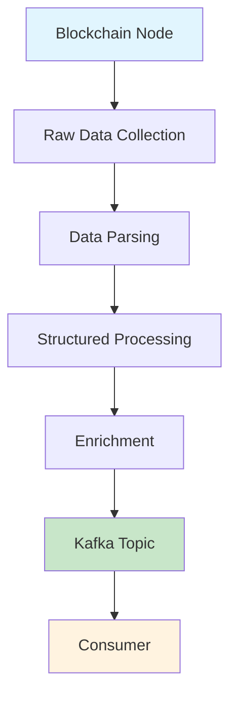

ChainStream は Kafka Streams を通じてマルチチェーンのリアルタイムオンチェーンデータストリームを提供します。GraphQL Subscriptions や WebSocket と比較して、Kafka Streams はレイテンシに敏感で高信頼性が求められるサーバーサイドアプリケーションシナリオ向けに設計されており、より低いレイテンシと高い耐障害性を備えたデータ消費を提供します。

<Card title="Protobuf スキーマリポジトリ" icon="github" href="https://github.com/chainstream-io/streaming_protobuf">
  公式 ChainStream Protobuf スキーマ定義。Go と Python をサポートし、EVM、Solana、TRON のすべてのメッセージタイプを含みます。
</Card>

---

## サポートマトリクス

| チェーン | dex.trades | tokens | balances | dex.pools | transfers | candlesticks |
|:---|:---:|:---:|:---:|:---:|:---:|:---:|
| Ethereum (eth) | ✅ | ✅ | ✅ | ✅ | ✅ | ✅ |
| BSC (bsc) | ✅ | ✅ | ✅ | ✅ | ✅ | ✅ |
| Solana (sol) | ✅ | ✅ | ✅ | ✅ | ✅ | ✅ |
| TRON (tron) | ✅ | ✅ | ✅ | ✅ | ✅ | ✅ |

<Note>
すべてのチェーンで `token-supplies`、`token-prices`、`token-holdings`、`token-market-caps`、`trade-stats` Topic もサポートしています。詳細は完全な Topic リストを参照してください。
</Note>

---

## Kafka Streams vs WebSocket 選択ガイド

### Kafka Streams を選ぶべきとき

<CardGroup cols={2}>
  <Card title="レイテンシ重視" icon="bolt">
    レイテンシが最重要課題で、アプリケーションがクラウドまたは専用サーバーにデプロイされている場合
  </Card>
  <Card title="メッセージの信頼性" icon="shield-check">
    メッセージの欠落が許容できず、耐久性があり信頼性の高いデータ消費が必要な場合
  </Card>
  <Card title="複雑な処理" icon="gears">
    前処理機能を超える複雑な計算、フィルタリング、フォーマットが必要な場合
  </Card>
  <Card title="水平スケーリング" icon="server">
    消費能力のためにマルチインスタンスの水平スケーリングが必要な場合
  </Card>
</CardGroup>

### WebSocket を選ぶべきとき

<CardGroup cols={2}>
  <Card title="高速プロトタイピング" icon="rocket">
    プロトタイプの構築で、開発速度が最優先の場合
  </Card>
  <Card title="統一インターフェース" icon="plug">
    アプリケーションが履歴データとリアルタイムデータの両方を統一されたクエリ・サブスクリプションインターフェースで必要とする場合
  </Card>
  <Card title="ブラウザサイド" icon="browser">
    アプリケーションがブラウザで直接データを消費する場合（Kafka Streams はサーバーサイドのみサポート）
  </Card>
  <Card title="動的フィルタリング" icon="filter">
    ページコンテンツに基づいてデータを動的にフィルタリングする必要がある場合
  </Card>
</CardGroup>

### 比較まとめ

| 機能 | Kafka Streams | WebSocket |
|:---|:---:|:---:|
| レイテンシ | 最低 | 低 |
| 信頼性 | 永続的、メッセージ欠落なし | 切断時に欠落の可能性 |
| スケーラビリティ | ネイティブな水平スケーリング | 追加設計が必要 |
| データフィルタリング | クライアント側処理 | サーバー側事前フィルタリング |
| クライアントサポート | サーバーサイドのみ | サーバー + ブラウザ |
| 統合の複雑さ | より高い | より低い |

---

## 認証情報の取得

Kafka Streams は独立した認証情報を使用し、ChainStream チームに連絡してアクセスを申請する必要があります。

<Steps>
  <Step title="申請連絡">
    [support@chainstream.io](mailto:support@chainstream.io) にメールを送信して Kafka Streams へのアクセスを申請
  </Step>
  <Step title="認証情報の受領">
    承認後、以下の認証情報を受け取ります：
    - ユーザー名
    - パスワード
    - ブローカーアドレスリスト
  </Step>
  <Step title="接続の設定">
    受け取った認証情報を使用して Kafka クライアントの接続を設定
  </Step>
</Steps>

---

## 接続設定

### ブローカーアドレス

<Note>
ブローカーアドレスは申請承認後に認証情報と一緒に提供されます。未許可のアドレスでの接続は行わないでください。
</Note>

### SASL_SSL 接続設定

<Tabs>
  <Tab title="Python">
    ```python
    from kafka import KafkaConsumer

    consumer = KafkaConsumer(
        'eth.dex.trades',
        bootstrap_servers=['<your_broker_address>'],
        security_protocol='SASL_SSL',
        sasl_mechanism='SCRAM-SHA-512',
        sasl_plain_username='your_username',
        sasl_plain_password='your_password',
        auto_offset_reset='latest',
        enable_auto_commit=False,
        group_id='your_group_id'
    )
    ```
  </Tab>
  <Tab title="JavaScript">
    ```javascript
    const { Kafka } = require('kafkajs');

    const kafka = new Kafka({
      clientId: 'my-app',
      brokers: ['<your_broker_address>'],
      ssl: true,
      sasl: {
        mechanism: 'scram-sha-512',
        username: 'your_username',
        password: 'your_password'
      }
    });

    const consumer = kafka.consumer({ groupId: 'your_group_id' });
    ```
  </Tab>
  <Tab title="Go">
    ```go
    package main

    import (
        "github.com/segmentio/kafka-go"
        "github.com/segmentio/kafka-go/sasl/scram"
    )

    func main() {
        mechanism, _ := scram.Mechanism(scram.SHA512, "your_username", "your_password")
        
        reader := kafka.NewReader(kafka.ReaderConfig{
            Brokers: []string{"<your_broker_address>"},
            Topic:   "eth.dex.trades",
            GroupID: "your_group_id",
            Dialer: &kafka.Dialer{
                SASLMechanism: mechanism,
                TLS:           &tls.Config{},
            },
        })
    }
    ```
  </Tab>
</Tabs>

---

## Topic 命名規則と完全リスト

### 命名規則

Topic は以下の命名パターンに従います：

```
{chain}.{message_type}              # 生イベントデータ
{chain}.{message_type}.processed    # 処理済みデータ（価格、フラグ、エンリッチメント付き）
{chain}.{message_type}.created      # 作成イベント（例：トークン作成）
```

`{chain}` には `sol`、`bsc`、`eth`、`tron` が含まれます。

### メッセージタイプ

| タイプ | 説明 |
|:---|:---|
| `dex.trades` | DEX 取引イベント |
| `dex.pools` | 流動性プールイベント |
| `tokens` | トークンイベント |
| `balances` | 残高変更イベント |
| `transfers` | 送金イベント |
| `token-supplies` | トークン供給イベント |
| `token-prices` | トークン価格イベント |
| `token-holdings` | トークン保有データ |
| `token-market-caps` | トークン時価総額イベント |
| `candlesticks` | OHLCV ローソク足データ |
| `trade-stats` | 取引統計 |

### 完全な Topic リスト

<Tabs>
  <Tab title="クロスチェーン Topic">
    以下の Topic はすべてのサポートチェーンに適用されます（`{chain}` を `sol`、`bsc`、`eth` に置き換え）：

    ```
    # DEX 取引
    {chain}.dex.trades
    {chain}.dex.trades.processed    # USD/ネイティブ価格、不審フラグ付き

    # トークンイベント
    {chain}.tokens
    {chain}.tokens.created          # トークン作成イベント
    {chain}.tokens.processed        # 説明、画像 URL、SNS リンク付き

    # 残高変更
    {chain}.balances
    {chain}.balances.processed      # USD/ネイティブ価値付き

    # 流動性プール
    {chain}.dex.pools
    {chain}.dex.pools.processed     # 流動性 USD/ネイティブ価値付き

    # トークンデータ
    {chain}.token-supplies
    {chain}.token-supplies.processed
    {chain}.token-prices
    {chain}.token-holdings
    {chain}.token-market-caps.processed

    # 集計データ
    {chain}.candlesticks            # OHLCV ローソク足データ
    {chain}.trade-stats             # 取引統計
    ```
  </Tab>
  <Tab title="Solana 固有">
    ```
    # 送金イベント
    sol.transfers
    sol.transfers.processed         # USD/ネイティブ価値付き
    ```
  </Tab>
  <Tab title="EVM 固有">
    ```
    # 送金メッセージ (BSC / ETH)
    {chain}.v1.transfers.proto
    {chain}.v1.transfers.processed.proto
    ```
  </Tab>
  <Tab title="TRON 固有">
    ```
    # 送金メッセージ
    tron.v1.transfers.proto
    tron.v1.transfers.processed.proto
    ```
  </Tab>
</Tabs>

<Tip>
完全な Protobuf スキーマと Topic マッピングについては、[streaming_protobuf リポジトリ](https://github.com/chainstream-io/streaming_protobuf)を参照してください。
</Tip>

---

## 消費モードとオフセット管理

Topic をサブスクライブする際に考慮すべき 2 つのコア設定：

### オフセット戦略の選択

コンシューマーは Kafka に接続後、どこからメッセージの読み取りを開始するかを決定する必要があります。2 つの一般的な戦略：

<Tabs>
  <Tab title="最新のみ消費">
    各接続時に現在の最新位置から開始。リアルタイムデータのみを気にするシナリオに適しています。再接続時に過去のメッセージのリプレイはありません。

    ```javascript
    {
      autoCommit: false,
      fromBeginning: false,
      'auto.offset.reset': 'latest'
    }
    ```
  </Tab>
  <Tab title="永続的消費">
    オフセットを自動コミットし、再接続時に最後に消費した位置から継続。メッセージの欠落を防ぎます。

    ```javascript
    {
      autoCommit: true,
      fromBeginning: false,
      'auto.offset.reset': 'latest'
    }
    ```

    <Warning>
    サービスが再起動すると、最後に記録されたオフセットから読み取りを継続します。再起動中のメッセージが復旧後にバックログとなる場合があります。
    </Warning>
  </Tab>
</Tabs>

### Group ID ルール

同じ Group ID で複数インスタンスをデプロイすると、フェイルオーバーと負荷分散が可能になります — 同じ Topic のメッセージは Group 内の 1 つのインスタンスのみが消費し、Kafka がインスタンス間でパーティションを自動分配します。

<Tip>
異なる Topic は異なるメッセージパースロジックを持つため、各 Topic に独立したコンシューマーを持つことを推奨します。
</Tip>

---

## クイックスタート：5 分で最初のコンシューマー

以下の例は、`eth.dex.trades` Topic を消費して DEX 取引データをパースする方法を示しています。

<Steps>
  <Step title="Protobuf スキーマの取得">
    公式リポジトリからスキーマ定義をクローン：

    ```bash
    git clone https://github.com/chainstream-io/streaming_protobuf.git
    ```

    またはプロジェクトに Git サブモジュールとして追加：

    ```bash
    git submodule add https://github.com/chainstream-io/streaming_protobuf.git
    ```
  </Step>
  <Step title="依存関係のインストール">
    ```bash
    pip install kafka-python protobuf
    ```
  </Step>
  <Step title="設定と消費">
    ```python
    from kafka import KafkaConsumer
    from common import trade_event_pb2  # streaming_protobuf リポジトリから取得

    # コンシューマーを作成
    consumer = KafkaConsumer(
        'eth.dex.trades',
        bootstrap_servers=['<your_broker_address>'],
        security_protocol='SASL_SSL',
        sasl_mechanism='SCRAM-SHA-512',
        sasl_plain_username='your_username',
        sasl_plain_password='your_password',
        auto_offset_reset='latest',
        enable_auto_commit=False,
        group_id='my-dex-consumer'
    )

    # メッセージを消費
    for message in consumer:
        # protobuf メッセージをパース
        trade_events = trade_event_pb2.TradeEvents()
        trade_events.ParseFromString(message.value)
        
        # DEX 取引情報を表示
        for event in trade_events.events:
            print(f"Pool: {event.trade.pool_address}")
            print(f"Token A: {event.trade.token_a_address}")
            print(f"Token B: {event.trade.token_b_address}")
            print(f"Amount A: {event.trade.user_a_amount}")
            print(f"Amount B: {event.trade.user_b_amount}")
            print(f"Block: {event.block.height}")
            print("---")
    ```
  </Step>
</Steps>

---

## コアデータ構造

すべてのメッセージタイプは以下のベース構造を共有しています（`common/common.proto` で定義）：

### ベース構造

<Tabs>
  <Tab title="Block">
    ブロック情報：

    | フィールド | 型 | 説明 |
    |:---|:---|:---|
    | `timestamp` | int64 | ブロックタイムスタンプ |
    | `hash` | string | ブロックハッシュ |
    | `height` | uint64 | ブロック高さ |
    | `slot` | uint64 | スロット番号（Solana） |
  </Tab>
  <Tab title="Transaction">
    トランザクション情報：

    | フィールド | 型 | 説明 |
    |:---|:---|:---|
    | `fee` | uint64 | トランザクション手数料 |
    | `fee_payer` | string | 手数料支払者 |
    | `index` | uint32 | ブロック内インデックス |
    | `signature` | string | トランザクション署名 |
    | `signer` | string | 署名者アドレス |
    | `status` | Status | 実行ステータス (SUCCESS/FAILED) |
    | `bundles` | []BundleTransaction | バンドル情報（MEV 検出） |
  </Tab>
  <Tab title="Instruction">
    インストラクション情報：

    | フィールド | 型 | 説明 |
    |:---|:---|:---|
    | `index` | uint32 | インストラクションインデックス |
    | `is_inner_instruction` | bool | 内部インストラクションかどうか |
    | `inner_instruction_index` | uint32 | 内部インストラクションインデックス |
    | `type` | string | インストラクションタイプ |
  </Tab>
  <Tab title="DApp">
    DApp 情報：

    | フィールド | 型 | 説明 |
    |:---|:---|:---|
    | `program_address` | string | プログラムアドレス |
    | `inner_program_address` | string | 内部プログラムアドレス |
    | `chain` | Chain | チェーン識別子 |
  </Tab>
</Tabs>

### 主要メッセージタイプ

<AccordionGroup>
  <Accordion title="TradeEvent - DEX 取引イベント">
    **Topic**: `{chain}.dex.trades`

    ```protobuf
    message TradeEvent {
      Instruction instruction = 1;
      Block block = 2;
      Transaction transaction = 3;
      DApp d_app = 4;
      Trade trade = 100;
      BondingCurve bonding_curve = 110;
      TradeProcessed trade_processed = 200;  // processed topic に含まれる
    }
    ```

    **Trade コアフィールド**:

    | フィールド | 説明 |
    |:---|:---|
    | `token_a_address` / `token_b_address` | 取引ペアのトークンアドレス |
    | `user_a_amount` / `user_b_amount` | ユーザー取引量 |
    | `pool_address` | プールアドレス |
    | `vault_a` / `vault_b` | プールのボールトアドレス |
    | `vault_a_amount` / `vault_b_amount` | ボールト量 |

    **TradeProcessed 拡張フィールド**（processed topic）:

    | フィールド | 説明 |
    |:---|:---|
    | `token_a_price_in_usd` / `token_b_price_in_usd` | USD 価格 |
    | `token_a_price_in_native` / `token_b_price_in_native` | ネイティブ通貨価格 |
    | `is_token_a_price_in_usd_suspect` | 価格が不審かどうか |
    | `is_token_a_price_in_usd_suspect_reason` | 不審な理由 |
  </Accordion>

  <Accordion title="TokenEvent - トークンイベント">
    **Topic**: `{chain}.tokens`、`{chain}.tokens.created`

    ```protobuf
    message TokenEvent {
      Instruction instruction = 1;
      Block block = 2;
      Transaction transaction = 3;
      DApp d_app = 4;
      EventType type = 100;        // CREATED, UPDATED
      Token token = 101;
      TokenProcessed token_processed = 200;
    }
    ```

    **Token コアフィールド**:

    | フィールド | 説明 |
    |:---|:---|
    | `address` | トークンアドレス |
    | `name` / `symbol` | 名前とシンボル |
    | `decimals` | 小数桁数 |
    | `uri` | メタデータ URI |
    | `metadata_address` | メタデータアドレス |
    | `creators` | 作成者リスト |
    | `solana_extra` | Solana 固有フィールド |
    | `evm_extra` | EVM 固有フィールド (token_standard) |
  </Accordion>

  <Accordion title="BalanceEvent - 残高変更イベント">
    **Topic**: `{chain}.balances`

    ```protobuf
    message BalanceEvent {
      Instruction instruction = 1;
      Block block = 2;
      Transaction transaction = 3;
      DApp d_app = 4;
      Balance balance = 100;
      BalanceProcessed balance_processed = 200;
    }
    ```

    **Balance コアフィールド**:

    | フィールド | 説明 |
    |:---|:---|
    | `token_account_address` | トークンアカウントアドレス |
    | `account_owner_address` | アカウントオーナーアドレス |
    | `token_address` | トークンアドレス |
    | `pre_amount` / `post_amount` | 変更前/後の残高 |
    | `decimals` | 小数桁数 |
    | `lifecycle` | アカウントライフサイクル (NEW/EXISTING/CLOSED) |
  </Accordion>

  <Accordion title="DexPoolEvent - 流動性プールイベント">
    **Topic**: `{chain}.dex.pools`

    ```protobuf
    message DexPoolEvent {
      Instruction instruction = 1;
      Block block = 2;
      Transaction transaction = 3;
      DApp d_app = 4;
      DexPoolEventType type = 100;  // INITIALIZE, INCREASE_LIQUIDITY, DECREASE_LIQUIDITY, SWAP
      DexPool pool = 101;
      DexPoolProcessed pool_processed = 200;
    }
    ```

    **DexPool コアフィールド**:

    | フィールド | 説明 |
    |:---|:---|
    | `address` | プールアドレス |
    | `token_a_address` / `token_b_address` | トークンアドレス |
    | `token_a_vault_address` / `token_b_vault_address` | ボールトアドレス |
    | `token_a_amount` / `token_b_amount` | トークン量 |
    | `lp_wallet` | LP ウォレットアドレス |
  </Accordion>

  <Accordion title="CandlestickEvent - ローソク足データ">
    **Topic**: `{chain}.candlesticks`

    | フィールド | 説明 |
    |:---|:---|
    | `token_address` | トークンアドレス |
    | `resolution` | 時間解像度 (1m, 5m, 15m, 1h 等) |
    | `timestamp` | タイムスタンプ |
    | `open` / `high` / `low` / `close` | OHLC 価格 (USD) |
    | `open_in_native` / `high_in_native` / `low_in_native` / `close_in_native` | OHLC 価格 (ネイティブ) |
    | `volume` / `volume_in_usd` / `volume_in_native` | 取引量 |
    | `trades` | 取引件数 |
    | `dimension` | ディメンションタイプ (TOKEN_ADDRESS/POOL_ADDRESS/PAIR) |
  </Accordion>

  <Accordion title="TradeStatEvent - 取引統計">
    **Topic**: `{chain}.trade-stats`

    | フィールド | 説明 |
    |:---|:---|
    | `token_address` | トークンアドレス |
    | `resolution` | 時間解像度 |
    | `buys` / `sells` | 買い/売り件数 |
    | `buyers` / `sellers` | 買い手/売り手数 |
    | `buy_volume` / `sell_volume` | 買い/売り出来高 |
    | `buy_volume_in_usd` / `sell_volume_in_usd` | USD 出来高 |
    | `high_in_usd` / `low_in_usd` | 高値/安値 |
  </Accordion>

  <Accordion title="TokenHoldingEvent - 保有統計">
    **Topic**: `{chain}.token-holdings`

    | フィールドグループ | 説明 |
    |:---|:---|
    | `top10_holders` / `top10_amount` / `top10_ratio` | トップ 10 保有者統計 |
    | `top50_holders` / `top50_amount` / `top50_ratio` | トップ 50 保有者統計 |
    | `top100_holders` / `top100_amount` / `top100_ratio` | トップ 100 保有者統計 |
    | `holders` | 総保有者数 |
    | `creators_count` / `creators_amount` / `creators_ratio` | 作成者保有統計 |
    | `fresh_count` / `fresh_amount` / `fresh_ratio` | フレッシュウォレット保有統計 |
    | `smart_count` / `smart_amount` / `smart_ratio` | スマートマネー保有統計 |
    | `sniper_count` / `sniper_amount` / `sniper_ratio` | スナイパー保有統計 |
    | `insider_count` / `insider_amount` / `insider_ratio` | インサイダー保有統計 |
  </Accordion>

  <Accordion title="TokenPriceEvent - 価格イベント">
    **Topic**: `{chain}.token-prices`

    | フィールド | 説明 |
    |:---|:---|
    | `token_address` | トークンアドレス |
    | `price_in_usd` | USD 価格 |
    | `price_in_native` | ネイティブ通貨価格 |
  </Accordion>

  <Accordion title="TokenSupplyEvent - 供給イベント">
    **Topic**: `{chain}.token-supplies`

    | フィールド | 説明 |
    |:---|:---|
    | `type` | イベントタイプ (INITIALIZE_MINT/MINT/BURN) |
    | `token_address` | トークンアドレス |
    | `amount` | 量 |
    | `decimals` | 小数桁数 |
    | `amount_with_decimals` | 小数桁数付きの量 |
  </Accordion>
</AccordionGroup>

<Tip>
完全な Protobuf 定義については [streaming_protobuf リポジトリ](https://github.com/chainstream-io/streaming_protobuf)を参照してください。
</Tip>

---

## メッセージ特性と注意事項

Kafka Streams を消費する際、開発者は以下のメッセージ特性を認識しておく必要があります：

<AccordionGroup>
  <Accordion title="フィルタリングなしの完全データストリーム">
    ストリームは事前フィルタリングを行わず、Topic 内のすべてのメッセージと完全なデータを含みます。コンシューマーには十分なネットワークスループット、サーバー性能、効率的なパースコードが必要です。
  </Accordion>
  
  <Accordion title="同一エンティティのメッセージは順序保証">
    **同じトークンまたは同じアカウントのメッセージは厳密にブロック順序で到着します**。特定のトークンやウォレットアドレスのイベントストリームは順序が保証され、状態変更の追跡が容易です。ただし、異なるトークン/アカウント間のメッセージ到着順序は保証されません。
  </Accordion>
  
  <Accordion title="メッセージの重複が発生する場合がある">
    同じメッセージが複数回配信される場合があります。重複処理が問題を引き起こす場合、コンシューマーはキャッシュやストレージを使用した冪等処理を実装する必要があります。
  </Accordion>
  
  <Accordion title="メッセージの完全性は保証">
    ChainStream は各メッセージの完全性を保証します。メッセージが分割されることはありません。ブロックに含まれるトランザクション数に関係なく、受信するメッセージは完全なデータ単位です。
  </Accordion>
  
  <Accordion title="Protobuf バイナリ形式">
    メッセージは Protobuf エンコーディングを使用し、JSON よりコンパクトです。コンシューマーは対応する言語の Protobuf ライブラリを使用してパースする必要があります。
  </Accordion>
</AccordionGroup>

---

## レイテンシモデル

Kafka Streams のレイテンシは、データがパイプライン内で通過する処理ステージに依存します。同じチェーンの異なる Topic は異なるレイテンシを持ちます：



### Broadcasted vs Committed

| タイプ | 説明 | レイテンシ | データ確実性 |
|:---|:---|:---:|:---:|
| Broadcasted | ブロードキャスト段階で消費可能、ブロック確認不要 | 最低 | 低め |
| Committed | ブロック確認後にストリームに入る | 高め | 最高 |

### パイプラインレイテンシ

ブロックチェーンノードから Kafka Topic までの各変換レイヤー（パーシング、構造化、エンリッチメント）がおよそ 100〜1000ms のレイテンシを追加します：

- **raw topic**: 最低レイテンシ、生のノードデータに最も近い
- **transactions topic**: パース・構造化済み
- **dextrades topic**: 相対的に高いレイテンシだが、よりリッチなデータ

<Tip>
レイテンシが最優先の場合は、効果的にパースできる生データに最も近い Topic を選択してください。
</Tip>

---

## ベストプラクティス

### パーティション並列消費

Kafka Topic は複数のパーティションに分割されており、各パーティションの並列読み取りがスループットを最大化します。

メッセージパーティションキーは**トークンアドレス**または**ウォレットアドレス**（全チェーンで統一）に設定されており、以下が保証されます：
- 同じトークンのすべてのイベントが同じパーティションにルーティングされ、順序を保証
- 同じウォレットのすべての残高変更が同じパーティションにルーティングされ、状態追跡が容易

各パーティションに独立したスレッドを割り当てて負荷分散することを推奨します。

### 継続的消費、メインループをブロックしない

コンシューマーの読み取りループは継続的に実行し、メッセージ処理のブロックによるバックログを避けてください。メッセージの処理が必要な場合は非同期処理モードを採用：メインループは読み取りを担当し、処理ロジックはワーカースレッドに委任します。

### メッセージ処理効率

バッチ処理はオーバーヘッドを削減できますが、バッチサイズとレイテンシのバランスが必要です。Go では channel + ワーカーグループを使用した並行処理が効果的です。

---

## チェーン別ドキュメント

<CardGroup cols={3}>
  <Card title="EVM Streams" icon="ethereum" href="/jp/docs/access-methods/kafka-streams/evm-streams">
    Ethereum、BSC、Base、Polygon、Optimism
  </Card>
  <Card title="Solana Streams" icon="circle-s" href="/jp/docs/access-methods/kafka-streams/solana-streams">
    Solana 高スループットデータストリーム
  </Card>
  <Card title="TRON Streams" icon="circle-t" href="/jp/docs/access-methods/kafka-streams/tron-streams">
    TRON ネットワークデータストリーム
  </Card>
</CardGroup>

---

## 関連ドキュメント

<CardGroup cols={2}>
  <Card title="リアルタイムストリーミング" icon="bolt" href="/jp/docs/access-methods/websocket">
    WebSocket リアルタイムデータ統合ガイド
  </Card>
  <Card title="認証ガイド" icon="key" href="/jp/docs/platform/authentication/api-keys-oauth">
    Access Token の取得
  </Card>
</CardGroup>
