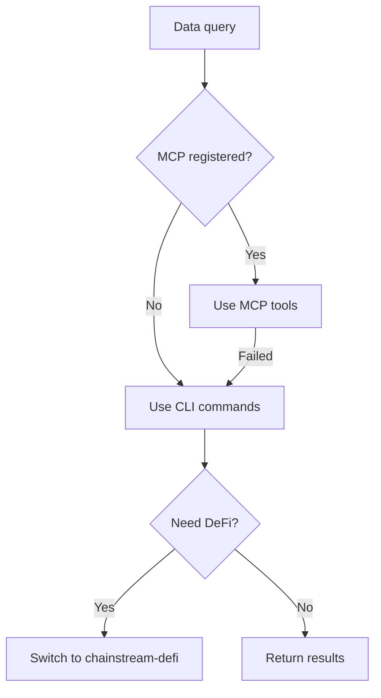
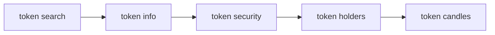
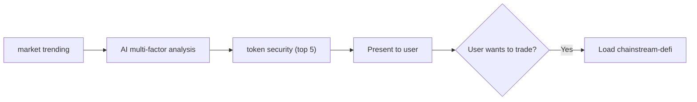
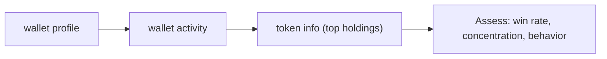

## 概要

`chainstream-data` スキルは、Solana、BSC、Ethereum にまたがる読み取り専用のオンチェーンデータ機能を提供します。トークン分析、市場ランキング、ウォレットプロファイル、WebSocket ストリーミングをカバーします。

- **パターン**: ツール（読み取り専用、署名なし）
- **MCP サーバー**: `https://mcp.chainstream.io/mcp`（17 ツール）
- **CLI**: `npx @chainstream-io/cli`
- **API ベース URL**: `https://api.chainstream.io`

## 統合パス

スキルは意思決定ツリーで適切な実行チャネルにルーティングします。



## チャネル対応表

| 操作 | MCP ツール | CLI コマンド | SDK メソッド |
|-----------|----------|-------------|------------|
| トークン検索 | `tokens_search` | `token search` | `client.token.search` |
| トークン分析 | `tokens_analyze` | `token info` | `client.token.getToken` |
| セキュリティ確認 | `tokens_analyze` | `token security` | `client.token.getSecurity` |
| 上位ホルダー | `tokens_analyze` | `token holders` | `client.token.getHolders` |
| 価格履歴（K 線） | `tokens_price_history` | `token candles` | `client.token.getCandles` |
| 流動性プール | `tokens_discover` | `token pools` | `client.token.getPools` |
| トレンドトークン | `market_trending` | `market trending` | `client.ranking.*` |
| 新規上場 | `market_trending` | `market new` | `client.ranking.*` |
| 直近の取引 | `trades_recent` | `market trades` | `client.trade.*` |
| ウォレットプロファイル | `wallets_profile` | `wallet profile` | `client.wallet.*` |
| ウォレット PnL | `wallets_profile` | `wallet pnl` | `client.wallet.*` |
| トークン残高 | `wallets_profile` | `wallet holdings` | `client.wallet.*` |
| 送金履歴 | `wallets_activity` | `wallet activity` | `client.wallet.*` |
| DEX 見積もり | `dex_quote` | `dex route` | `client.dex.quote` |

## AI ワークフロー

### トークンリサーチ

トークン分析の一連の流れです。いかなるトークンを推奨する前にも必ずセキュリティチェックを実行してください。



<Tabs>
  <Tab title="CLI">
    ```bash
    npx @chainstream-io/cli token search --keyword PUMP --chain sol
    npx @chainstream-io/cli token info --chain sol --address <addr>
    npx @chainstream-io/cli token security --chain sol --address <addr>
    npx @chainstream-io/cli token holders --chain sol --address <addr>
    npx @chainstream-io/cli token candles --chain sol --address <addr> --resolution 1h
    ```
  </Tab>
  <Tab title="MCP">
    ```
    tokens_search { "query": "PUMP", "chain": "solana" }
    tokens_analyze { "chain": "solana", "address": "<addr>" }
    tokens_price_history { "chain": "solana", "address": "<addr>", "resolution": "1h" }
    ```
  </Tab>
</Tabs>

### 市場の発見

トレンドトークンを探し、多因子分析を行い、上位候補のセキュリティを確認します。



<Tabs>
  <Tab title="CLI">
    ```bash
    npx @chainstream-io/cli market trending --chain sol --duration 1h --limit 50
    # AI analyzes: smart money signals, volume, momentum, safety
    npx @chainstream-io/cli token security --chain sol --address <candidate_1>
    npx @chainstream-io/cli token security --chain sol --address <candidate_2>
    ```
  </Tab>
  <Tab title="MCP">
    ```
    market_trending { "chain": "solana", "duration": "1h", "limit": 50 }
    tokens_analyze { "chain": "solana", "address": "<candidate>" }
    ```
  </Tab>
</Tabs>

### ウォレットプロファイル

ウォレットのパフォーマンス、保有資産、取引行動を分析します。



<Tabs>
  <Tab title="CLI">
    ```bash
    npx @chainstream-io/cli wallet profile --chain sol --address <wallet>
    npx @chainstream-io/cli wallet activity --chain sol --address <wallet>
    npx @chainstream-io/cli token info --chain sol --address <top_holding>
    ```
  </Tab>
  <Tab title="MCP">
    ```
    wallets_profile { "chain": "solana", "address": "<wallet>" }
    wallets_activity { "chain": "solana", "address": "<wallet>" }
    ```
  </Tab>
</Tabs>

## 安全ルール

<Warning>
これらのルールはスキルによって強制され、データの正確性と責任ある AI の振る舞いを保証します。
</Warning>

| ルール | 理由 |
|------|--------|
| 学習データだけで価格に答えない | 暗号資産の価格は数秒で古くなる — 常にライブ API を呼び出す |
| 推奨前に必ず `token security` を実行 | ChainStream のリスクモデルがハニーポット、ラグプル、集中度シグナルをカバー |
| 依頼がない限り MCP に `format: "detailed"` を渡さない | `concise` の 4〜10 倍のデータになり、コンテキストを浪費する |
| `/multi` エンドポイントで 50 を超えるアドレスをまとめて送らない | API のハード上限 |
| 公開 RPC の代替として使わない | 結果が異なり、ChainStream 固有のエンリッチメントが欠ける |

## エラー復旧

| エラー | 対処 |
|-------|----------|
| 401 / "Not authenticated" | API Key を設定するか `chainstream login` を実行 |
| 402 / "Payment required" | [x402 決済フロー](/jp/guides/cli/x402-payment) に従う |
| 429 / レート制限 | 1 秒待ち、指数バックオフ |
| 5xx / サーバーエラー | 2 秒後に 1 回だけリトライ |

## 関連

<CardGroup cols={2}>
  <Card title="chainstream-defi" icon="right-left" href="/jp/guides/ai-infrastructure/agent-skills/chainstream-defi">
    リサーチ後の取引実行に
  </Card>
  <Card title="CLI コマンド" icon="terminal" href="/jp/guides/cli/commands">
    CLI コマンドの完全リファレンス
  </Card>
</CardGroup>
