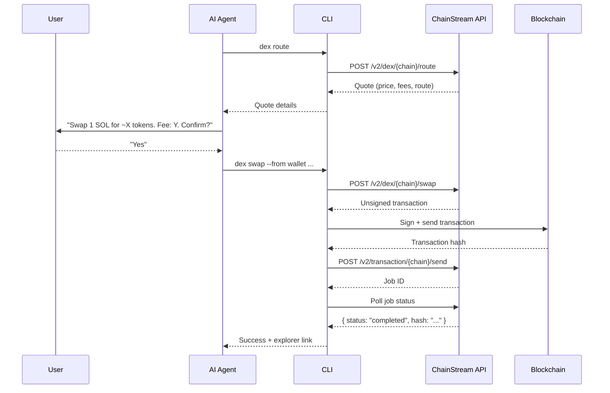
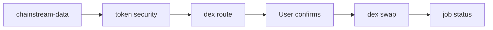

<Warning>
すべての DeFi 操作は **実際のオンチェーンで取り消し不可** です。破壊的な操作の前には毎回ユーザーの明示的な確認が必要です。トランザクションを自動実行しないでください。
</Warning>

## 概要

`chainstream-defi` スキルは、Solana、BSC、Ethereum にまたがるオンチェーン DeFi 実行を扱います。トークンスワップ、クロスチェーンブリッジ、ローンチパッドでのトークン作成、トランザクションのブロードキャストをカバーします。

- **パターン**: プロセス（破壊的、署名が必要）
- **CLI**: `npx @chainstream-io/cli`（主な実行経路）
- **SDK**: `WalletSigner` 付きの `@chainstream-io/sdk`
- **MCP**: 見積もり、スワップ、作成ツールは利用可能 — ただしオンチェーン実行にはホスト側のウォレットに裏付けられた認証が必要

## ウォレット要件

DeFi 操作にはトランザクション署名ができるウォレットが必要です。

| 経路 | 署名 | セットアップ |
|------|---------|-------|
| CLI + TEE ウォレット | TEE ベースの署名 | `chainstream login` |
| CLI + 生キー | ローカル署名 | `chainstream wallet set-raw --chain base` |
| SDK + WalletSigner | カスタム署名 | `signMessage` と `signTypedData` を実装 |
| MCP のみ | **非対応** | MCP にウォレットはない — CLI または SDK を使用 |
| API Key のみ | **非対応** | API Key では署名できない — `chainstream login` を実行 |

## 4 フェーズのプロトコル

破壊的な DeFi 操作はすべて、厳密な 4 フェーズのプロトコルに従います。



### フェーズ 1: 見積もり

実行の前に価格見積もりを取得します。読み取り専用で安全です。

```bash
chainstream dex route --chain sol --from <wallet> --input-token SOL --output-token <addr> --amount 1000000
```

### フェーズ 2: ユーザー確認

**必須。** 見積もりの要約をユーザーに示し、明示的な承認を待ちます。

- 入力数量とトークン
- 予想される出力数量
- 価格インパクトと手数料
- スリッページ許容

### フェーズ 3: 署名と送信

確認後にスワップを実行します。CLI が設定済みウォレット経由で署名を処理します。

```bash
chainstream dex swap --chain sol --from <wallet> --input-token SOL --output-token <addr> --amount 1000000
```

### フェーズ 4: ジョブのポーリング

CLI は完了までジョブを自動的にポーリングし、トランザクションハッシュとエクスプローラーリンクを出力します。

```bash
# Manual polling (if needed)
chainstream job status --id <job_id> --wait
```

## 対応操作

### トークンスワップ

```bash
# Get route + unsigned tx first
chainstream dex route --chain sol --from <wallet> --input-token SOL --output-token <token> --amount 1000000

# Then swap (after user confirms)
chainstream dex swap --chain sol --from <wallet> --input-token SOL --output-token <token> --amount 1000000 --slippage 5
```

### トークン作成（ローンチパッド）

```bash
chainstream dex create --chain sol --name "My Token" --symbol MTK --uri <metadata_uri> --dex pumpfun
```

### ジョブステータス

```bash
chainstream job status --id <job_id> --wait --timeout 60000
```

## ブロックエクスプローラー

トランザクション成功後、CLI はエクスプローラーリンクを出力します。

| チェーン | エクスプローラー URL |
|-------|-------------|
| Solana | `https://solscan.io/tx/{hash}` |
| BSC | `https://bscscan.com/tx/{hash}` |
| Ethereum | `https://etherscan.io/tx/{hash}` |

## 通貨の解決

よく使うトークン識別子：

| トークン | Solana アドレス | EVM アドレス |
|-------|---------------|-------------|
| SOL (native) | `So11111111111111111111111111111111111111112` | — |
| BNB (native) | — | `0xEeeeeEeeeEeEeeEeEeEeeEEEeeeeEeeeeeeeEEeE` |
| ETH (native) | — | `0xEeeeeEeeeEeEeeEeEeEeeEEEeeeeEeeeeeeeEEeE` |
| USDC (Solana) | `EPjFWdd5AufqSSqeM2qN1xzybapC8G4wEGGkZwyTDt1v` | — |
| USDC (Base) | — | `0x833589fCD6eDb6E08f4c7C32D4f71b54bdA02913` |

## 安全ルール

<Warning>
これらのルールは譲れず、スキルによって強制されます。
</Warning>

| ルール | 理由 |
|------|--------|
| **見積もりなしでスワップしない** | ユーザーがコミット前に価格を見る必要がある |
| **ユーザーの同意を推測しない** | 破壊的操作には毎回明示的な「yes」が必要 |
| **手数料や価格インパクトを隠さない** | コストの完全な透明性 |
| **本番で `--yes` フラグを使わない** | 確認の省略は自動テスト用のみ |
| **アドレスは常に検証する** | Solana: base58、32〜44 文字；EVM: `0x` + 40 桁の hex |
| **外部の価格データを盲信しない** | 常に ChainStream の見積もりエンドポイントを使う |

## エラー復旧

| エラー | 対処 |
|-------|----------|
| スリッページ超過 | `--slippage` を上げるか、新しい見積もりで再試行 |
| 残高不足 | `wallet balance --chain <chain>` で確認 |
| トランザクションリバート | エクスプローラーでリバート理由を確認；自動リトライしない |
| ジョブタイムアウト | `job status --id <id>` で確認 — まだ処理中の可能性あり |
| 402 Payment required | CLI が [x402 決済](/jp/guides/cli/x402-payment) で自動処理 |
| 署名が無効 | `chainstream login` で再ログイン |

## 取引前のリサーチ

DeFi を実行する前は、常に `chainstream-data` でリサーチしてください。



## 関連

<CardGroup cols={2}>
  <Card title="chainstream-data" icon="magnifying-glass" href="/jp/guides/ai-infrastructure/agent-skills/chainstream-data">
    取引前のトークンリサーチ
  </Card>
  <Card title="CLI コマンド" icon="terminal" href="/jp/guides/cli/commands">
    CLI コマンドの完全リファレンス
  </Card>
</CardGroup>
