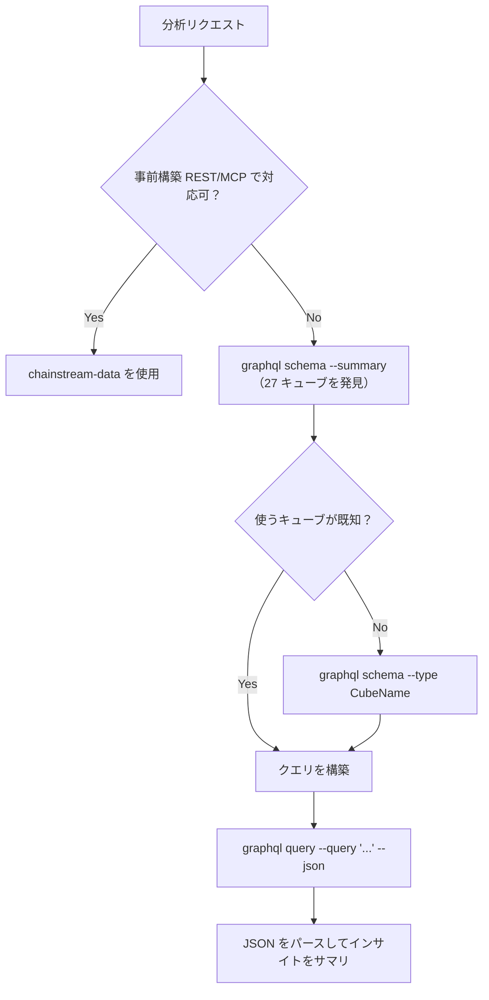

## 概要

`chainstream-graphql` skill は、AI エージェントが ChainStream のオンチェーンデータウェアハウスに GraphQL 経由で柔軟な SQL ライクアクセスを行うためのものです。REST / MCP の事前構築済みエンドポイントでは表現力が足りない場合 — キューブ横断 JOIN、カスタム集計、多条件フィルタ、カスタム時系列解像度、GraphQL でしか公開されていないデータ（PolyMarket の予測市場キューブなど）— に適した選択肢です。

- **パターン**: ツール（読み取り専用、署名なし）
- **エンドポイント**: `https://graphql.chainstream.io/graphql`（APISIX 経由でルーティング）
- **CLI**: `npx @chainstream-io/cli graphql`
- **認証**: API Key（`X-API-KEY`）、または SIWX ウォレットトークン
- **支払い**: REST と同じ API Key / サブスクリプションプール（x402 / MPP は CLI が自動処理）
- **スコープ**: 3 つのチェーングループにわたる 27 キューブ — `Solana`、`EVM(network: eth | bsc | polygon)`、`Trading`

## 使うべきとき

`chainstream-data` との判断マトリクス：

| シナリオ | 使うもの | 理由 |
|----------|-----|-----|
| 標準的なトークン検索、マーケットトレンド、ウォレットプロフィール | `chainstream-data` | 事前構築された REST / MCP エンドポイントで十分・シンプル |
| キューブ横断 JOIN（trades + transfers、pools + events） | **chainstream-graphql** | `joinXxx` サポート |
| カスタム集計（`groupBy` による count / sum / avg） | **chainstream-graphql** | メトリクス＋ディメンション集計 |
| 多条件フィルタ（ネスト、`any` による OR） | **chainstream-graphql** | 完全なフィルタオペレータセット |
| カスタム解像度／バケットの時系列 | **chainstream-graphql** | 時間間隔バケットに対応 |
| 予測市場データ（Polygon の PolyMarket） | **chainstream-graphql** | `PredictionTrades / Managements / Settlements` キューブ |

## 統合パス



## チャネルマトリクス

GraphQL は単一の表面ですが、呼び出し元ごとに利用方法が異なります：

| 操作 | CLI コマンド | SDK メソッド |
|-----------|-------------|------------|
| 全キューブ一覧（サマリ） | `graphql schema --summary` | N/A — 探索には CLI を使用 |
| 単一キューブの詳細 | `graphql schema --type <CubeName>` | N/A |
| 完全スキーマリファレンス | `graphql schema --full` | N/A |
| キャッシュされたスキーマを強制更新 | `graphql schema --summary --refresh` | N/A |
| インラインクエリ | `graphql query --query '<gql>'` | `client.graphql.query(gql)` |
| ファイルからクエリ | `graphql query --file ./q.graphql` | `client.graphql.query(fs.readFileSync(...))` |
| 変数付きクエリ | `graphql query --query '...' --var '{"k":"v"}'` | `client.graphql.query(gql, vars)` |
| 機械可読出力 | `--json` を付与 | ネイティブに JSON を返却 |

## AI ワークフロー

### スキーマ探索

どのキューブを使うかエージェントがまだ把握していない場合は、必ずここから始めます。

```bash
npx @chainstream-io/cli graphql schema --summary
npx @chainstream-io/cli graphql schema --type DEXTrades
```

`--summary` は全 27 キューブをチェーン別（EVM / Solana / Trading）にグルーピングしたコンパクトなカタログを返します（トップレベルフィールドと説明付き）。`--type` は 1 つのキューブのフィールドツリーを展開し、クエリ構築に使います。

### クエリの構築と実行

スキーマは **チェーングループラッパー** をトップレベルのエントリポイントとして使用します。

<Tabs>
  <Tab title="Solana">
    ```graphql
    query {
      Solana {
        DEXTrades(
          limit: { count: 25 }
          orderBy: { descending: Block_Time }
        ) {
          Block { Time }
          Trade {
            Buy  { Currency { MintAddress } Amount PriceInUSD }
            Sell { Currency { MintAddress } Amount }
            Dex  { ProtocolName }
          }
        }
      }
    }
    ```
  </Tab>
  <Tab title="EVM">
    ```graphql
    query {
      EVM(network: eth) {
        DEXTrades(
          limit: { count: 25 }
          orderBy: { descending: Block_Time }
          where: { Trade: { Buy: { Amount: { gt: "0" } } } }
        ) {
          Block { Time }
          Trade { Buy { Currency { Symbol } Amount } Sell { Currency { Symbol } Amount } }
        }
      }
    }
    ```
  </Tab>
  <Tab title="Trading">
    ```graphql
    query {
      Trading {
        Pairs(
          tokenAddress: { is: "So11111111111111111111111111111111111111112" }
          limit: { count: 24 }
        ) {
          TimeMinute
          Price { Open High Low Close }
        }
      }
    }
    ```
  </Tab>
</Tabs>

CLI から実行：

```bash
npx @chainstream-io/cli graphql query --file ./query.graphql --json
```

またはインラインで：

```bash
npx @chainstream-io/cli graphql query \
  --query 'query { Solana { DEXTrades(limit:{count:5}) { Block { Time } } } }' \
  --json
```

## クエリ構築クイックリファレンス

- **チェーングループラッパー**: トップレベルで必須。`Solana`、`EVM(network: ...)`、`Trading` のいずれか。
- **`network`**: `EVM` のみ。値: `eth`、`bsc`、`polygon`。
- **`limit`**: `{ count: N, offset: M }`。既定値は 25。
- **`orderBy`**: `{ descending: Field }` / `{ ascending: Field }`。計算フィールドには `{ descendingByField: "field_name" }` を使用。
- **`where`**: `{ Group: { Field: { operator: value } } }`。OR 条件は `any: [{...}, {...}]` で指定。
- **DateTime 形式**: `"YYYY-MM-DD HH:MM:SS"` — **`T` なし、`Z` なし**（ClickHouse の要件）。
- **DateTime フィルタ**: `since`、`till`、`after`、`before` — DateTime フィールドに **`gt` / `lt` を使わない**。
- **`joinXxx`**: 関連キューブへの LEFT JOIN。複数クエリよりもこちらを優先。
- **`dataset`** ラッパー引数: `realtime`、`archive`、`combined`（既定）。
- **`aggregates`** ラッパー引数: `yes`、`no`、`only`。

## チェーングループとキューブ

| チェーングループ | ラッパー | キューブ |
|-------------|---------|-------|
| **Solana** | `Solana { ... }` | DEXTrades, DEXTradeByTokens, Transfers, BalanceUpdates, Blocks, Transactions, DEXPools, Instructions, InstructionBalanceUpdates, Rewards, DEXOrders, TokenSupplyUpdates |
| **EVM** | `EVM(network: eth\|bsc\|polygon) { ... }` | DEXTrades, DEXTradeByTokens, Transfers, BalanceUpdates, Blocks, Transactions, DEXPoolEvents, Events, Calls, MinerRewards, DEXPoolSlippages, TokenHolders, TransactionBalances, Uncles, PredictionTrades\*, PredictionManagements\*, PredictionSettlements\* |
| **Trading** | `Trading { ... }` | Pairs, Tokens, Currencies, Trades |

\* 予測市場系のキューブは `polygon` ネットワークでのみ利用可能です。

## セーフティルール

<Warning>
これらのルールはクエリの正当性を担保し、無駄なクォータ消費を避けるために skill 側で強制しています。
</Warning>

| ルール | 理由 |
|------|--------|
| フラットな `CubeName(network: sol)` を使わない — 必ずチェーングループで包む | サーバーが未ラップのクエリを拒否します |
| フィールド名を推測しない — 先に `graphql schema --type <cube>` を実行 | 「フィールドが存在しない」エラーの往復を削減 |
| ISO-8601 `"2026-03-31T00:00:00Z"` を使わない — `"2026-03-31 00:00:00"` を使う | ClickHouse の DateTime 形式 |
| DateTime に `gt` / `lt` を使わない — `since` / `after` / `before` / `till` を使う | DateTime フィルタは名前付き |
| `joinXxx` でまとめられるデータを複数クエリに分けない | 課金リクエストが 1 回で済む |
| 支払いプランを自動選択しない — 必ずユーザーに選ばせる | 課金の同意 |

## エラー復旧

| エラー | 復旧 |
|-------|----------|
| 401 / "Not authenticated" | `config auth` を確認 — 未ログインなら `login`（nano トライアル 50K CU を自動付与）。その後リトライ。 |
| 402 / "Payment required" | `plan status` を確認。アクティブなサブスクリプションがなければ `wallet pricing` → `plan purchase --plan <choice>`。[x402 ペイメント](/jp/docs/platform/billing-payments/x402-payments) を参照。 |
| `GraphQL error: field X does not exist` | `graphql schema --type <cube>` でフィールドを再確認。 |
| 429 | 1 秒待機後に指数バックオフ。 |
| 5xx | 2 秒後に 1 回リトライ。 |

## 関連

<CardGroup cols={2}>
  <Card title="chainstream-data" icon="magnifying-glass" href="/jp/docs/ai-agents/agent-skills/chainstream-data">
    トークン、マーケット、ウォレット分析向けの標準 REST/MCP クエリ
  </Card>
  <Card title="chainstream-defi" icon="right-left" href="/jp/docs/ai-agents/agent-skills/chainstream-defi">
    分析後の取引実行 — swap、トークン作成
  </Card>
  <Card title="GraphQL アクセス方法" icon="diagram-project" href="/jp/docs/access-methods/graphql">
    エンドポイントリファレンス、認証、スキーマ概要
  </Card>
  <Card title="CLI `graphql` サブコマンド" icon="terminal" href="/jp/docs/access-methods/cli#graphql-subcommand">
    `chainstream graphql schema` と `query` のリファレンス
  </Card>
</CardGroup>
