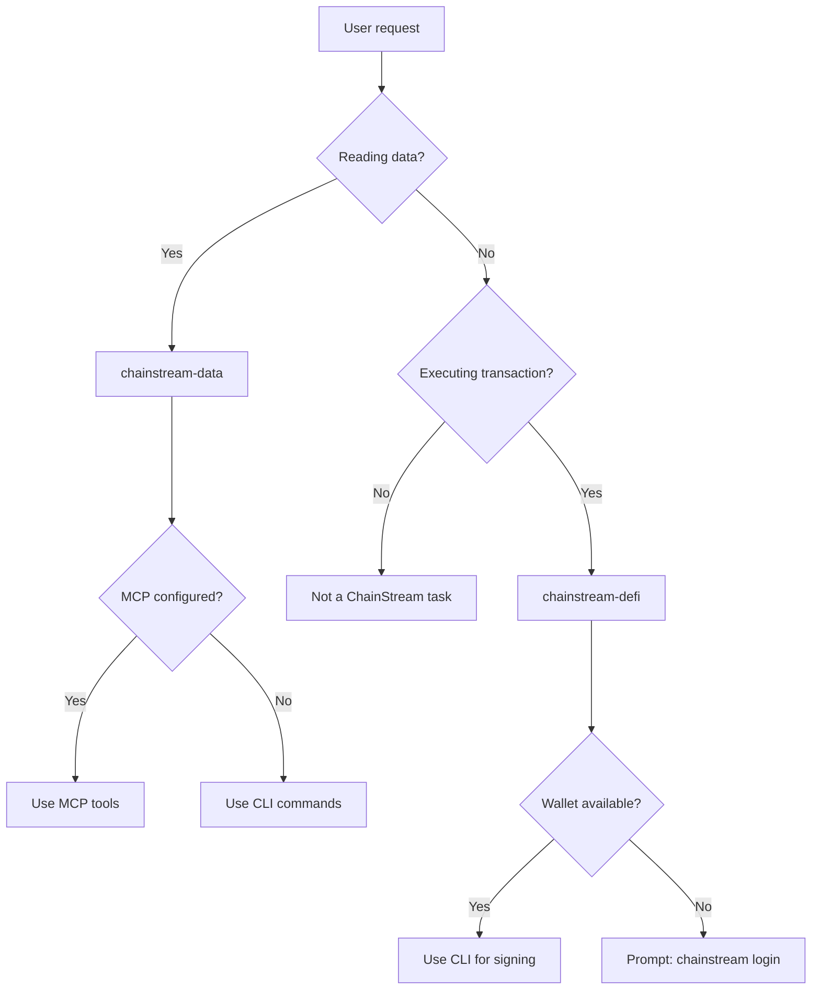

## エージェントスキルとは

エージェントスキルは、AIコーディングアシスタントに ChainStream のオンチェーンデータと DeFi 機能の使い方を教える、構造化された指示パッケージ（`SKILL.md` ファイル）です。生の API ドキュメントとは異なり、スキルは **意思決定ツリー、ワークフロー、安全ルール、エラー復旧** を提供し、AI エージェントが自律的に動くために必要な要素を揃えています。

<CardGroup cols={2}>
  <Card title="chainstream-data" icon="magnifying-glass" color="#4D9CFF">
    **ツール型** — 読み取り専用のオンチェーンデータ：トークン分析、市場トレンド、ウォレットプロファイル、WebSocket ストリーム
  </Card>
  <Card title="chainstream-defi" icon="right-left" color="#9333EA">
    **プロセス型** — 取り消し不可の DeFi 実行：スワップ、ブリッジ、ローンチパッド、トランザクション送信
  </Card>
</CardGroup>

## スキル vs MCP vs SDK

| レイヤー | 内容 | 向いている用途 |
|-------|-----------|----------|
| **エージェントスキル** | 意思決定ツリー、ワークフロー、安全ルールを含む高レベルな AI 指示セット（SKILL.md） | AI コーディングアシスタント（Cursor、Claude Code、Codex） |
| **MCP サーバー** | Model Context Protocol — AI モデルから呼び出せる 17 のツール | AI チャットアシスタント（Claude Desktop、ChatGPT） |
| **CLI** | ウォレットと x402 決済付きのコマンドラインツール | スクリプト、CI/CD、DeFi が必要な AI エージェント |
| **SDK** | TypeScript / Python / Go / Rust のクライアントライブラリ | カスタムアプリケーション |

スキルは **最も抽象度の高いレイヤー** に位置し、内部で MCP ツールや CLI コマンドを参照し、タスクごとに適切なツールへエージェントをルーティングします。

## ルーティングの意思決定ツリー

## スキルの比較

| 観点 | chainstream-data | chainstream-defi |
|--------|-----------------|-----------------|
| パターン | ツール（読み取り専用） | プロセス（実行） |
| リスク | 低い | 高い（取り消し不可） |
| ウォレット | 不要（API Key で可） | 必要（署名が必要） |
| MCP 対応 | 完全（17 ツール） | ツールは利用可能だが、実行にはホスト側のウォレットが必要 |
| ユーザー確認 | 不要 | 各トランザクションの前に **必須** |
| 典型的な操作 | 検索、分析、追跡、ストリーム | スワップ、ブリッジ、作成、ブロードキャスト |

## 共通リソース

両方のスキルで共通の参照ドキュメントを共有します。

| リソース | 内容 |
|----------|---------|
| **認証** | 4 つの認証パス（API Key、ウォレットログイン、生キー、Tempo MPP） |
| **x402 決済** | x402 と MPP の決済プロトコル、プラン選択の流れ |
| **エラー処理** | HTTP ステータス、リトライ戦略、DeFi 固有のエラー |
| **チェーン** | 対応チェーン一覧、ネイティブトークンアドレス、ブロックエクスプローラー |

## 対応プラットフォーム

`SKILL.md` を読み込める AI コーディングアシスタントであれば、スキルを利用できます。

| プラットフォーム | インストール方法 |
|----------|-------------------|
| Cursor | `.cursor-plugin/` による自動検出 |
| Claude Code | `/plugin install chainstream` |
| Codex | クローン + シンボリックリンク |
| OpenCode | クローン + シンボリックリンク |
| Gemini CLI | `gemini extensions install` |

セットアップ手順は [インストールガイド](/jp/guides/ai-infrastructure/agent-skills/installation) を参照してください。

## 次のステップ

<CardGroup cols={2}>
  <Card title="インストール" icon="download" href="/jp/guides/ai-infrastructure/agent-skills/installation">
    各プラットフォームでのスキル設定
  </Card>
  <Card title="chainstream-data" icon="magnifying-glass" href="/jp/guides/ai-infrastructure/agent-skills/chainstream-data">
    データクエリと分析
  </Card>
  <Card title="chainstream-defi" icon="right-left" href="/jp/guides/ai-infrastructure/agent-skills/chainstream-defi">
    DeFi 実行ワークフロー
  </Card>
  <Card title="MCP サーバー" icon="plug" href="/jp/guides/ai-infrastructure/mcp-server/introduction">
    下位の MCP プロトコル
  </Card>
</CardGroup>
