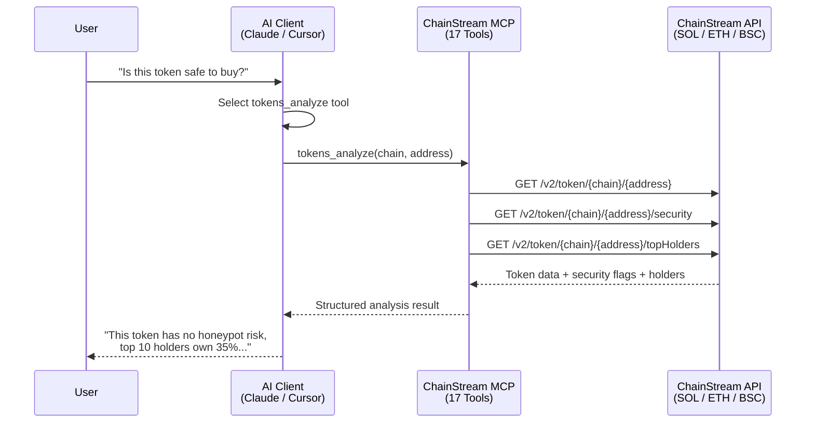

## MCPとは

**MCP（Model Context Protocol）**は、AIアプリケーションが外部データソースに接続する方法を標準化するために、Anthropicが提案したオープンプロトコルです。

<Info>
簡単に言えば、MCPによってAIは以下のことが可能になります：
- 利用可能なツールとデータソースを発見する
- 外部ツールを呼び出して操作を実行する
- 返されたstructured dataを理解する
</Info>

### 従来方式 vs MCP

| 方式 | フロー |
|------|--------|
| **従来方式** | ユーザー → コードを書く → APIを呼ぶ → データを解析 → AIに入力 → 回答を得る |
| **MCP** | ユーザー → 自然言語で質問 → AIが自動でツールを呼び出す → 回答を得る |

### コアコンセプト

| コンセプト | 説明 |
|-----------|------|
| **MCP Server** | ツールとデータを提供するサーバー（ChainStream MCP Serverなど） |
| **MCP Client** | ツールを使用するクライアント（Claude Desktop、Cursorなど） |
| **Tools** | AIが呼び出せる関数（残高クエリ、ウォレット分析など） |
| **Resources** | AIがアクセスできるデータリソース |

---

## なぜMCPが重要なのか

### AIエージェントには「手と目」が必要

AI大規模言語モデルは強力な推論能力を持っていますが：

- ❌ リアルタイムデータに直接アクセスできない
- ❌ 外部操作を実行できない
- ❌ ナレッジカットオフがある

MCPはAIに以下の能力を与えることで、これを解決します：

- ✅ リアルタイムのオンチェーンデータを取得
- ✅ プロフェッショナルなツールを呼び出して分析
- ✅ 外部世界と対話

<Note>
**例え**

AIにとってのMCPは：
- **目** → AIにリアルタイムデータを見せる
- **手** → AIに操作を実行させる
- **ツール** → AIにプロフェッショナルな機能を使わせる
</Note>

---

## ChainStream MCPの機能

ChainStream MCP Serverは、MCPプロトコルを通じてブロックチェーンデータと分析機能をAIアプリケーションに公開します。

**MCPエンドポイント**: `https://mcp.chainstream.io/mcp`

### 機能マトリクス

ChainStream MCP Serverは、APIリファレンスに記載されたすべてのREST APIおよびWebSocketサブスクリプション機能をサポートしています：

<Tabs>
  <Tab title="Token API">
    | 機能 | 説明 |
    |------|------|
    | トークン検索 | 名前/シンボルでトークンを検索 |
    | トークン情報 | トークンの基本情報とメタデータを取得 |
    | トークン価格 | リアルタイムおよび過去の価格 |
    | トークン統計 | 取引量、時価総額の統計 |
    | 保有者分析 | 保有者分布とトップ保有者 |
    | ローソク足データ | 各期間のOHLCVデータ |
    | マーケットデータ | 流動性、取引ペア情報 |
    | セキュリティチェック | トークンコントラクトのセキュリティ分析 |
    | 作成情報 | トークン作成者と時間 |
    | Mint/Burn履歴 | トークンの発行・焼却記録 |
    | 流動性スナップショット | 過去の流動性データ |
  </Tab>
  
  <Tab title="Wallet API">
    | 機能 | 説明 |
    |------|------|
    | 残高クエリ | ウォレットのトークン残高 |
    | PnL計算 | 損益分析 |
    | ウォレット統計 | トランザクション数、アクティビティなど |
    | 残高履歴 | 残高変動記録 |
  </Tab>
  
  <Tab title="Trade API">
    | 機能 | 説明 |
    |------|------|
    | 取引履歴 | 取引記録の取得 |
    | 取引アクティビティ | リアルタイムの取引活動 |
    | トップトレーダー | トップトレーダーランキング |
  </Tab>
  
  <Tab title="DEX API">
    | 機能 | 説明 |
    |------|------|
    | クオートクエリ | 取引見積もりの取得 |
    | ルート計算 | 最適な取引パス |
    | スワップ実行 | スワップトランザクションの構築 |
    | DEXリスト | サポートされているDEX情報 |
  </Tab>
  
  <Tab title="Ranking API">
    | 機能 | 説明 |
    |------|------|
    | 注目トークン | 期間別ランキング |
    | 新着トークン | 新規上場トークン |
    | Final Stretch | Bonding Curveで卒業間近 |
    | Migrated | DEXに移行済み |
  </Tab>
  
  <Tab title="WebSocket">
    | サブスクリプション | 説明 |
    |-------------------|------|
    | トークンローソク足 | リアルタイムのローソク足更新 |
    | トークン統計 | リアルタイムの統計情報 |
    | トークン保有者 | 保有者の変動 |
    | 新着トークン | 新規トークン作成通知 |
    | ウォレット残高 | リアルタイムの残高更新 |
    | ウォレット取引 | リアルタイムの取引通知 |
    | 流動性プール | プール残高の変動 |
  </Tab>
</Tabs>

### 対応ブロックチェーン

| チェーン | 識別子 | タイプ | ステータス |
|---------|--------|--------|-----------|
| Solana | `sol` | L1 | ✅ |
| Ethereum | `eth` | L1 | ✅ |
| BSC | `bsc` | L1 | ✅ |

<Note>
すべてのMCPツールパラメータでは小文字のチェーン識別子を使用してください：`sol`、`eth`、`bsc`。
</Note>

---

## 対応プラットフォーム

### Claude Desktop

公式サポートのMCPクライアントで、最も完全な機能をサポートしています。

| 機能 | ステータス |
|------|-----------|
| ツール呼び出し | ✅ |
| マルチターン対話 | ✅ |
| ストリーミング応答 | ✅ |

```json
// claude_desktop_config.json
{
  "mcpServers": {
    "chainstream": {
      "url": "https://mcp.chainstream.io/mcp",
      "headers": {
        "X-API-KEY": "your-api-key"
      }
    }
  }
}
```

### Cursor IDE

MCP統合を備えた開発者向けAIコーディングアシスタント。

| 機能 | ステータス |
|------|-----------|
| ツール呼び出し | ✅ |
| コードコンテキスト | ✅ |

```json
// .cursor/mcp.json
{
  "mcpServers": {
    "chainstream": {
      "url": "https://mcp.chainstream.io/mcp",
      "headers": {
        "X-API-KEY": "your-api-key"
      }
    }
  }
}
```

### カスタムエージェント

MCPプロトコルに準拠した任意のクライアントが統合できます。

```javascript
import { Client } from '@modelcontextprotocol/sdk/client/index.js';
import { StreamableHTTPClientTransport } from '@modelcontextprotocol/sdk/client/streamableHttp.js';

const transport = new StreamableHTTPClientTransport(
  new URL('https://mcp.chainstream.io/mcp'),
  {
    requestInit: {
      headers: {
        'X-API-KEY': process.env.CHAINSTREAM_API_KEY
      }
    }
  }
);

const client = new Client({
  name: 'my-agent',
  version: '1.0.0'
});

await client.connect(transport);

// List available tools
const { tools } = await client.listTools();

// Call a tool
const result = await client.callTool({
  name: 'wallets_profile',
  arguments: {
    address: '0x...',
    chain: 'eth'
  }
});
```

---

## 典型的なユースケース

### ケース1：AIリサーチアシスタント

**ニーズ**: AIを使って特定のウォレットの取引行動を分析する

<Steps>
  <Step title="ユーザーの質問">
    アドレス `0xd8dA6BF26964aF9D7eEd9e03E53415D37aA96045` の取引スタイルを分析して
  </Step>
  <Step title="AIがツールを呼び出す">
    `wallets_profile` ツールを呼び出す
  </Step>
  <Step title="AIが分析結果を返す">
    分析に基づき、このアドレス（Vitalik）の特徴：
    - ウォレット年齢：5年以上
    - 主な保有資産：ETH、各種ERC-20トークン
    - 取引スタイル：長期保有、時折寄付やプロジェクト支援
    - アクティブなプロトコル：Uniswap、ENS、Gitcoin
    - ラベル：コア開発者、フィランソロピスト
  </Step>
</Steps>

### ケース2：Smart Moneyトラッキング

**ニーズ**: Smart Moneyの大口取引を追跡する

<Steps>
  <Step title="ユーザーの質問">
    過去24時間でARBを購入しているSmart Moneyアドレスはどれ？
  </Step>
  <Step title="AIがツールを呼び出す">
    `market_trending` ツールを呼び出す
  </Step>
  <Step title="AIが結果を返す">
    過去24時間で以下のSmart MoneyアドレスがARBを購入しました：

    1. `0xabc...123`（ラベル：whale、defi_expert）
       - 数量：500,000 ARB
       - 金額：$450,000
       - 時間：2時間前

    2. `0xdef...456`（ラベル：institution）
       - 数量：200,000 ARB
       - 金額：$180,000
       - 時間：5時間前

    全体的なトレンド：Smart MoneyはARBを純買い越し
  </Step>
</Steps>

### ケース3：トークンセキュリティ分析

**ニーズ**: トークンのセキュリティを分析する

<Steps>
  <Step title="ユーザーの質問">
    このトークン `0x...` が安全か確認して
  </Step>
  <Step title="AIがツールを呼び出す">
    `tokens_analyze` ツールを呼び出す
  </Step>
  <Step title="AIが結果を返す">
    トークンセキュリティチェック結果：

    | チェック項目 | 結果 |
    |------------|------|
    | コントラクト検証済み | ✅ |
    | 悪意のある関数なし | ✅ |
    | 流動性ロック済み | ✅ |
    | 保有者分布 | ⚠️ トップ10が45%を保有 |
    | 取引税 | 買い1% / 売り1% |
    
    リスクレベル：中（保有者集中に注意）
  </Step>
</Steps>

---

## 技術アーキテクチャ



### 接続モード

| モード | エンドポイント | 最適な用途 |
|--------|-------------|-----------|
| **Cloud** | `https://mcp.chainstream.io/mcp` | セットアップ不要、常に最新 |
| **npm stdio** | `npx @chainstream-io/mcp` | ローカルIDE統合（Claude Desktop、Cursor） |
| **npm HTTP** | `chainstream-mcp --transport http` | チームサーバー、クラウドデプロイメント |

---

## 従来のAPIとの違い

| 特徴 | 従来のAPI | MCP |
|------|----------|-----|
| 呼び出し方法 | HTTP REST | プロトコル標準化 |
| 対象ユーザー | 開発者 | AIモデル |
| パラメータ処理 | 手動構築 | AI自動推論 |
| エラー処理 | ステータスコード | セマンティックエラー |
| コンテキスト | ステートレス | セッションコンテキスト維持 |

---

## 認証

ChainStream MCP Serverは**APIキー**で認証します。[ChainStream Dashboard](https://www.chainstream.io/dashboard)でキーを取得し、トランスポートに応じて設定してください：

| トランスポート | APIキーの渡し方 |
|--------------|----------------|
| **npmパッケージ**（stdio） | `CHAINSTREAM_API_KEY` 環境変数または `--api-key` CLIフラグ |
| **クラウドエンドポイント** | `X-API-KEY` リクエストヘッダー |

```bash
# Stdio: set env var
export CHAINSTREAM_API_KEY=your-key
chainstream-mcp

# Stdio: or use CLI flag
chainstream-mcp --api-key your-key
```

<Note>
APIキーは、Dashboardで有効期限を設定しない限り期限切れになりません。トークンのリフレッシュは不要です。
</Note>

---

## セキュリティモデル

<AccordionGroup>
  <Accordion title="認証" icon="key">
    両方の接続モードでAPIキーによる認証を行います。npmパッケージは環境変数 `CHAINSTREAM_API_KEY` を読み取ります。クラウドエンドポイントは `X-API-KEY` ヘッダーを受け付けます。
  </Accordion>
  
  <Accordion title="ツールの安全性" icon="lock">
    ツールはリスクレベルによって分類されています：
    - **読み取り専用ツール**: トークン検索、ウォレットプロフィール、マーケットデータ — デフォルトで安全
    - **取引ツール**（`dex_swap`、`dex_create_token`、`transaction_send`）: 高リスクとしてマーク、MCPクライアントはユーザーの明示的な確認を要求する必要があります
  </Accordion>
  
  <Accordion title="監査ログ" icon="file-lines">
    すべてのツール呼び出しは完全にログに記録され、Dashboardで確認できます。
  </Accordion>
</AccordionGroup>

---

## 次のステップ

<CardGroup cols={2}>
  <Card title="セットアップガイド" icon="gear" href="/jp/docs/ai-agents/mcp-server/setup">
    5分でMCP Serverを設定
  </Card>
  <Card title="ツールカタログ" icon="wrench" href="/jp/docs/ai-agents/mcp-server/tools">
    利用可能な全ツールの詳細を確認
  </Card>
</CardGroup>
