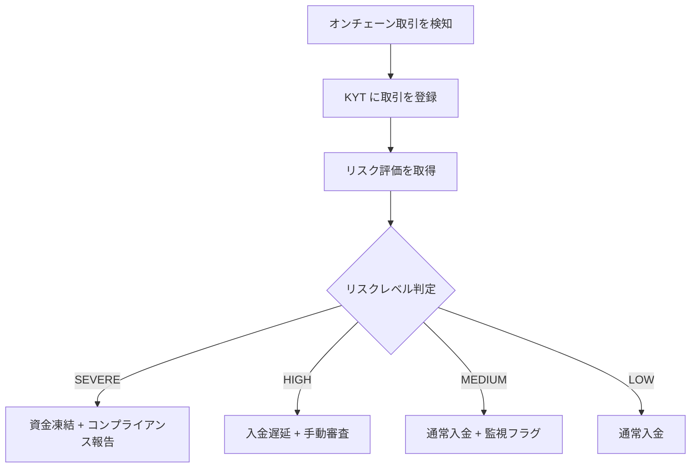
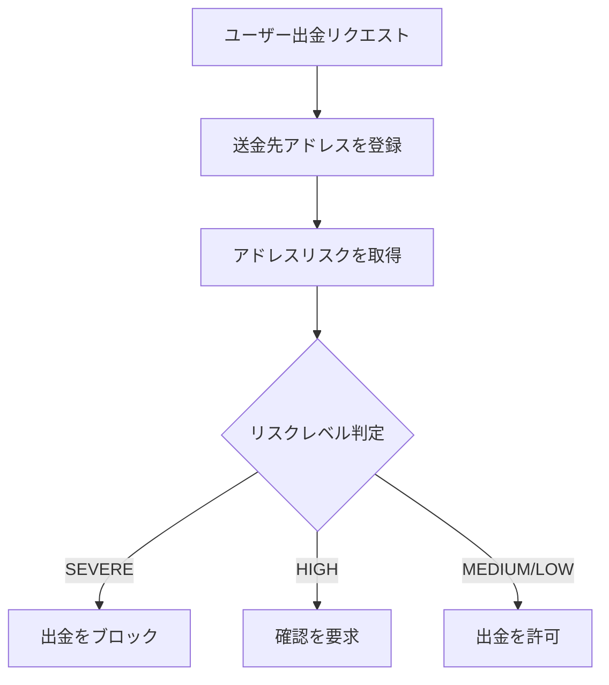
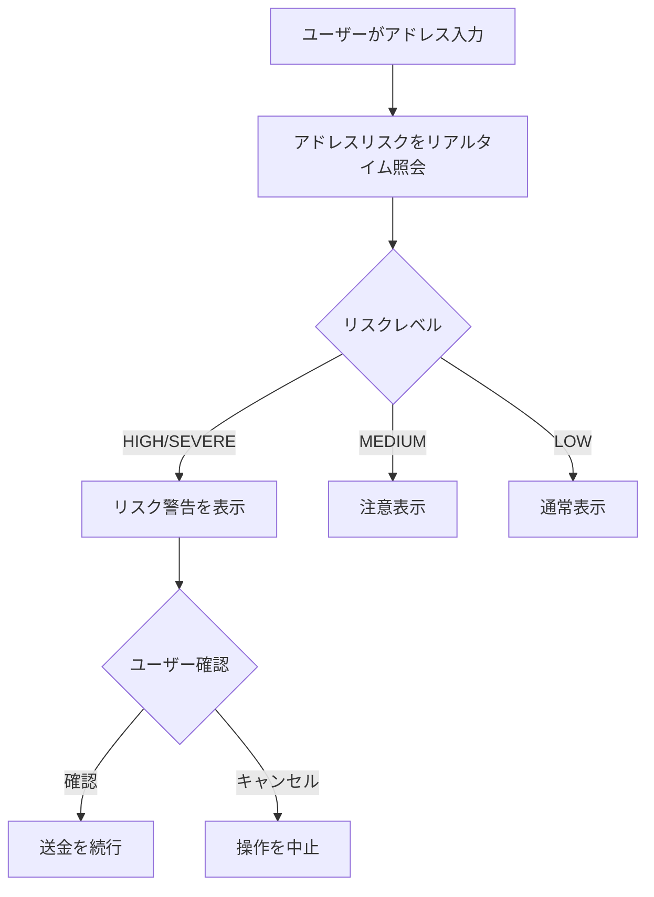

本ガイドでは、ChainStream の KYT/KYA コンプライアンス機能をアプリケーションに組み込む方法を説明します。CEX の入出金リスク管理、ウォレットのリスクアラート、一括スクリーニングまで、一連のシナリオをカバーします。

---

## 前提条件

### API 設定

| 設定項目 | 値 |
|:--|:--|
| Base URL | `https://api.chainstream.io/` |
| Auth Domain | `dex.asia.auth.chainstream.io` |
| Audience | `https://api.dex.chainstream.io` |

### KYT 関連スコープ

| スコープ | 説明 |
|:--|:--|
| `kyt.read` | KYT API の読み取り権限（取引リスクの照会） |
| `kyt.write` | KYT API の書き込み権限（取引分析の登録） |

### アクセストークンの取得

<CodeGroup>
```javascript JavaScript
import { AuthenticationClient } from 'auth0';

const auth0Client = new AuthenticationClient({
  domain: 'dex.asia.auth.chainstream.io',
  clientId: 'your-client-id',
  clientSecret: 'your-client-secret'
});

// Get Token with full KYT permissions
const response = await auth0Client.oauth.clientCredentialsGrant({
  audience: 'https://api.dex.chainstream.io',
  scope: 'kyt.read kyt.write'
});

const accessToken = response.data.access_token;
```

```python Python
from auth0.authentication import GetToken

get_token = GetToken(
    'dex.asia.auth.chainstream.io',
    'your-client-id',
    client_secret='your-client-secret'
)

token = get_token.client_credentials(
    audience='https://api.dex.chainstream.io',
    scope='kyt.read kyt.write'
)

access_token = token['access_token']
```
</CodeGroup>

### API 呼び出し

すべてのリクエストで、ヘッダーにトークンを付与する必要があります。

```javascript
const response = await fetch('https://api.chainstream.io/v1/kyt/transfer', {
  method: 'POST',
  headers: {
    'Authorization': `Bearer ${accessToken}`,
    'Content-Type': 'application/json'
  },
  body: JSON.stringify({ /* request body */ })
});
```

---

## CEX 入金時のリスク管理

取引所の入金シナリオは KYT の中核ユースケースであり、資金を計上する前にリスク評価が必要です。

### 業務フロー



### 連携手順

<Steps>
  <Step title="クライアントの初期化">
    ```javascript
    import { AuthenticationClient } from 'auth0';

    // Generate Token (recommend caching, refresh before expiry)
    async function getAccessToken() {
      const auth0Client = new AuthenticationClient({
        domain: 'dex.asia.auth.chainstream.io',
        clientId: process.env.CHAINSTREAM_CLIENT_ID,
        clientSecret: process.env.CHAINSTREAM_CLIENT_SECRET
      });

      const { data } = await auth0Client.oauth.clientCredentialsGrant({
        audience: 'https://api.dex.chainstream.io',
        scope: 'kyt.read kyt.write'
      });

      return data.access_token;
    }
    ```
  </Step>

  <Step title="取引の検知">
    ユーザーの入金アドレスへの着金を監視します。
    ```javascript
    async function onDepositDetected(tx) {
      const deposit = {
        network: 'ethereum',           // Network: bitcoin, ethereum, Solana
        asset: tx.asset,               // Asset type: ETH, SOL, etc.
        transferReference: tx.hash,    // Transaction hash
        direction: 'received'          // Direction: sent or received
      };
      
      // Call KYT analysis
      const result = await registerTransfer(deposit);
      
      // Get risk assessment
      const risk = await getTransferSummary(result.externalId);
      
      // Execute decision
      await executeDecision(tx, risk);
    }
    ```
  </Step>

  <Step title="取引の登録">
    KYT API を呼び出して取引を登録します。
    ```javascript
    async function registerTransfer(deposit) {
      const response = await fetch('https://api.chainstream.io/v1/kyt/transfer', {
        method: 'POST',
        headers: {
          'Authorization': `Bearer ${accessToken}`,
          'Content-Type': 'application/json'
        },
        body: JSON.stringify({
          network: deposit.network,
          asset: deposit.asset,
          transferReference: deposit.transferReference,
          direction: deposit.direction
        })
      });
      
      return await response.json();
    }
    ```
  </Step>

  <Step title="リスク評価の取得">
    取引のリスクサマリーを照会します。
    ```javascript
    async function getTransferSummary(transferId) {
      const response = await fetch(
        `https://api.chainstream.io/v1/kyt/transfers/${transferId}/summary`,
        {
          headers: {
            'Authorization': `Bearer ${accessToken}`
          }
        }
      );
      
      return await response.json();
    }
    ```
  </Step>

  <Step title="自動判定">
    リスクレベルに応じた処理を実行します。
    ```javascript
    async function executeDecision(tx, risk) {
      const riskLevel = risk.rating; // SEVERE, HIGH, MEDIUM, LOW
      
      switch (riskLevel) {
        case 'SEVERE':
          await freezeDeposit(tx);
          await createSARReport(tx, risk);
          await notifyCompliance(tx, risk);
          break;
          
        case 'HIGH':
          await holdDeposit(tx, { hours: 24 });
          await createManualReview(tx, risk);
          break;
          
        case 'MEDIUM':
          await creditDeposit(tx);
          await flagForMonitoring(tx, risk);
          break;
          
        case 'LOW':
          await creditDeposit(tx);
          break;
      }
      
      // Record audit log
      await auditLog.record({
        action: 'DEPOSIT_RISK_DECISION',
        txHash: tx.hash,
        riskLevel,
        timestamp: new Date()
      });
    }
    ```
  </Step>
</Steps>

---

## フロー詳細（エンドツーエンド）

コンプライアンス連携の一連の流れは、検知 → 登録 → ポーリング → リスク判定 → 解放／凍結 です。

### 1. 検知フェーズ

| トリガー | 説明 | レイテンシ |
|:--|:--|:--|
| オンチェーン監視 | 入金アドレスを監視 | ブロック確定までの時間 |
| ユーザー申請 | 出金リクエスト | 即時 |
| 定期スキャン | 取りこぼし対策 | 設定可能 |

### 2. 登録フェーズ

```bash
POST https://api.chainstream.io/v1/kyt/transfer
Authorization: Bearer <access_token>
Content-Type: application/json

{
  "network": "ethereum",
  "asset": "ETH",
  "transferReference": "0x1234567890abcdef...",
  "direction": "received"
}
```

**レスポンス:**

```json
{
  "externalId": "123e4567-e89b-12d3-a456-426614174000",
  "asset": "ETH",
  "network": "ethereum",
  "transferReference": "0x1234567890abcdef...",
  "direction": "received",
  "updatedAt": "2024-01-15T10:30:00.000Z"
}
```

### 3. 照会フェーズ

<Tabs>
  <Tab title="ポーリング">
    ```javascript
    async function pollForResult(transferId, maxAttempts = 10) {
      for (let i = 0; i < maxAttempts; i++) {
        const response = await fetch(
          `https://api.chainstream.io/v1/kyt/transfers/${transferId}/summary`,
          {
            headers: { 'Authorization': `Bearer ${accessToken}` }
          }
        );
        const data = await response.json();
        
        if (data.rating) {
          return data;
        }
        
        await new Promise(r => setTimeout(r, 3000)); // 3 second interval
      }
      
      throw new Error('Analysis timeout');
    }
    ```
  </Tab>
  <Tab title="詳細情報の取得">
    リスクエクスポージャの詳細を取得します。
    ```javascript
    // Get direct risk exposures
    const exposures = await fetch(
      `https://api.chainstream.io/v1/kyt/transfers/${transferId}/exposures/direct`,
      { headers: { 'Authorization': `Bearer ${accessToken}` } }
    );

    // Get risk alerts
    const alerts = await fetch(
      `https://api.chainstream.io/v1/kyt/transfers/${transferId}/alerts`,
      { headers: { 'Authorization': `Bearer ${accessToken}` } }
    );
    ```
  </Tab>
</Tabs>

### 4. 判定フェーズ

リスク判定ルールの設定例:

```yaml
risk_rules:
  severe:
    action: FREEZE
    auto_execute: true
    notify:
      - compliance@company.com
      - security@company.com
    
  high:
    action: MANUAL_REVIEW
    auto_execute: false
    hold_period: 24h
    escalation: 4h
    
  medium:
    action: FLAG
    auto_execute: true
    monitoring_period: 30d
    
  low:
    action: PASS
    auto_execute: true
```

### 5. 実行フェーズ

| アクション | 発動条件 | フォローアップ |
|:--|:--|:--|
| 解放 | LOW リスク | 通常の入金／支払い |
| フラグ | MEDIUM リスク | 入金はするが継続監視 |
| 保留 | HIGH リスク | 手動審査キューへ |
| 凍結 | SEVERE リスク | 凍結 + コンプライアンス報告 |

---

## サービス実装の全体例

<CodeGroup>
```javascript JavaScript
import { AuthenticationClient } from 'auth0';

class ComplianceService {
  constructor() {
    this.accessToken = null;
    this.tokenExpiry = null;
  }

  // Get or refresh Token
  async getAccessToken() {
    if (this.accessToken && this.tokenExpiry > Date.now()) {
      return this.accessToken;
    }

    const auth0Client = new AuthenticationClient({
      domain: 'dex.asia.auth.chainstream.io',
      clientId: process.env.CHAINSTREAM_CLIENT_ID,
      clientSecret: process.env.CHAINSTREAM_CLIENT_SECRET
    });

    const { data } = await auth0Client.oauth.clientCredentialsGrant({
      audience: 'https://api.dex.chainstream.io',
      scope: 'kyt.read kyt.write'
    });

    this.accessToken = data.access_token;
    // Token usually valid 24 hours, refresh 1 hour early
    this.tokenExpiry = Date.now() + (23 * 60 * 60 * 1000);
    
    return this.accessToken;
  }

  // Deposit compliance check
  async checkDeposit(deposit) {
    const token = await this.getAccessToken();
    
    // 1. Register transaction
    const registerResponse = await fetch('https://api.chainstream.io/v1/kyt/transfer', {
      method: 'POST',
      headers: {
        'Authorization': `Bearer ${token}`,
        'Content-Type': 'application/json'
      },
      body: JSON.stringify({
        network: deposit.network,
        asset: deposit.asset,
        transferReference: deposit.txHash,
        direction: 'received'
      })
    });
    const registered = await registerResponse.json();

    // 2. Wait and get risk assessment
    const risk = await this.waitForAnalysis(token, registered.externalId);
    
    // 3. Generate decision
    const decision = this.makeDecision(risk);
    
    // 4. Record audit
    await this.auditLog(deposit, risk, decision);
    
    return decision;
  }

  async waitForAnalysis(token, transferId, maxAttempts = 10) {
    for (let i = 0; i < maxAttempts; i++) {
      const response = await fetch(
        `https://api.chainstream.io/v1/kyt/transfers/${transferId}/summary`,
        { headers: { 'Authorization': `Bearer ${token}` } }
      );
      const result = await response.json();
      
      if (result.rating) {
        return result;
      }
      await new Promise(r => setTimeout(r, 3000));
    }
    throw new Error('Analysis timeout');
  }

  makeDecision(risk) {
    const decisions = {
      'SEVERE': {
        action: 'FREEZE',
        requireSAR: true,
        notify: ['compliance@company.com', 'security@company.com']
      },
      'HIGH': {
        action: 'HOLD',
        requireReview: true,
        holdHours: 24
      },
      'MEDIUM': {
        action: 'PASS',
        flagMonitoring: true
      },
      'LOW': {
        action: 'PASS'
      }
    };
    return decisions[risk.rating] || decisions['LOW'];
  }

  async auditLog(deposit, risk, decision) {
    console.log({
      timestamp: new Date().toISOString(),
      type: 'COMPLIANCE_CHECK',
      deposit,
      risk,
      decision
    });
  }
}

// Usage example
const compliance = new ComplianceService();

app.post('/deposit/process', async (req, res) => {
  const deposit = req.body;
  const decision = await compliance.checkDeposit(deposit);
  res.json(decision);
});
```

```python Python
import os
import time
import requests
from auth0.authentication import GetToken

class ComplianceService:
    def __init__(self):
        self.access_token = None
        self.token_expiry = 0
        self.base_url = 'https://api.chainstream.io'
    
    def get_access_token(self):
        if self.access_token and self.token_expiry > time.time():
            return self.access_token
        
        get_token = GetToken(
            'dex.asia.auth.chainstream.io',
            os.environ['CHAINSTREAM_CLIENT_ID'],
            client_secret=os.environ['CHAINSTREAM_CLIENT_SECRET']
        )
        
        token = get_token.client_credentials(
            audience='https://api.dex.chainstream.io',
            scope='kyt.read kyt.write'
        )
        
        self.access_token = token['access_token']
        self.token_expiry = time.time() + (23 * 60 * 60)
        
        return self.access_token
    
    def check_deposit(self, deposit: dict) -> dict:
        token = self.get_access_token()
        headers = {
            'Authorization': f'Bearer {token}',
            'Content-Type': 'application/json'
        }
        
        # Register transaction
        register_response = requests.post(
            f'{self.base_url}/v1/kyt/transfer',
            headers=headers,
            json={
                'network': deposit['network'],
                'asset': deposit['asset'],
                'transferReference': deposit['tx_hash'],
                'direction': 'received'
            }
        )
        registered = register_response.json()
        
        # Wait for result
        risk = self.wait_for_analysis(token, registered['externalId'])
        
        # Return decision
        return self.make_decision(risk['rating'])
    
    def wait_for_analysis(self, token, transfer_id, max_attempts=10):
        headers = {'Authorization': f'Bearer {token}'}
        
        for _ in range(max_attempts):
            response = requests.get(
                f'{self.base_url}/v1/kyt/transfers/{transfer_id}/summary',
                headers=headers
            )
            result = response.json()
            
            if result.get('rating'):
                return result
            time.sleep(3)
        
        raise Exception('Analysis timeout')
    
    def make_decision(self, rating):
        decisions = {
            'SEVERE': {'action': 'FREEZE', 'requireSAR': True},
            'HIGH': {'action': 'HOLD', 'requireReview': True},
            'MEDIUM': {'action': 'PASS', 'flagMonitoring': True},
            'LOW': {'action': 'PASS'}
        }
        return decisions.get(rating, decisions['LOW'])
```
</CodeGroup>

---

## CEX 出金時のリスク管理

出金シナリオでは、ユーザーが出金を開始した際の送金先アドレスのリスクを確認する必要があります。

### 業務フロー



### 実装例

```javascript
async function handleWithdrawal(request) {
  const { toAddress } = request;
  const token = await complianceService.getAccessToken();
  
  // 1. Register address
  const registerResponse = await fetch('https://api.chainstream.io/v1/kyt/address', {
    method: 'POST',
    headers: {
      'Authorization': `Bearer ${token}`,
      'Content-Type': 'application/json'
    },
    body: JSON.stringify({ address: toAddress })
  });
  await registerResponse.json();
  
  // 2. Get address risk
  const riskResponse = await fetch(
    `https://api.chainstream.io/v1/kyt/addresses/${toAddress}/risk`,
    { headers: { 'Authorization': `Bearer ${token}` } }
  );
  const addressRisk = await riskResponse.json();
  
  // 3. Risk handling
  switch (addressRisk.rating) {
    case 'SEVERE':
      return {
        status: 'REJECTED',
        reason: 'Target address is associated with known criminal activity',
        riskLevel: 'SEVERE'
      };
      
    case 'HIGH':
      return {
        status: 'PENDING_CONFIRMATION',
        warning: 'This address has been flagged as high risk',
        riskDetails: addressRisk,
        requiresConfirmation: true
      };
      
    default:
      return {
        status: 'APPROVED',
        riskLevel: addressRisk.rating
      };
  }
}

// Express route example
app.post('/withdraw/request', async (req, res) => {
  const result = await handleWithdrawal(req.body);
  res.json(result);
});
```

---

## ウォレットのリスクアラート

ウォレットアプリでは、ユーザーが送金する前にリスクアラートを表示します。

### ユーザー体験フロー



### フロントエンド／バックエンド連携

<Warning>
フロントエンドに `clientSecret` を直接置かないでください。ChainStream 呼び出しはバックエンド API 経由のプロキシにしてください。
</Warning>

<Tabs>
  <Tab title="フロントエンドからの呼び出し">
    ```javascript
    // Trigger on address input change
    async function onAddressChange(address) {
      if (!isValidAddress(address)) return;
      
      setLoading(true);
      
      try {
        // Call backend proxy API
        const response = await fetch('/api/risk/check-address', {
          method: 'POST',
          headers: { 'Content-Type': 'application/json' },
          body: JSON.stringify({ address })
        });
        const risk = await response.json();
        
        setRiskInfo({
          level: risk.rating,
          labels: risk.labels,
          warnings: risk.warnings
        });
      } finally {
        setLoading(false);
      }
    }
    ```
  </Tab>
  <Tab title="バックエンドプロキシ">
    ```javascript
    app.post('/api/risk/check-address', async (req, res) => {
      const { address } = req.body;
      const token = await complianceService.getAccessToken();
      
      // Register address
      await fetch('https://api.chainstream.io/v1/kyt/address', {
        method: 'POST',
        headers: {
          'Authorization': `Bearer ${token}`,
          'Content-Type': 'application/json'
        },
        body: JSON.stringify({ address })
      });
      
      // Get risk
      const riskResponse = await fetch(
        `https://api.chainstream.io/v1/kyt/addresses/${address}/risk`,
        { headers: { 'Authorization': `Bearer ${token}` } }
      );
      const result = await riskResponse.json();
      
      res.json({
        rating: result.rating,
        riskScore: result.riskScore,
        labels: result.labels || [],
        warnings: generateWarnings(result)
      });
    });

    function generateWarnings(result) {
      const warnings = [];
      if (result.exposures?.direct?.severe > 0) {
        warnings.push('Directly linked to known criminal address');
      }
      if (result.labels?.includes('Mixer User')) {
        warnings.push('Has interacted with mixing services');
      }
      return warnings;
    }
    ```
  </Tab>
</Tabs>

---

## アドレスの一括スクリーニング

既存アドレスに対するエンタープライズ向けコンプライアンス一括チェックです。

### ユースケース

- 定期的なコンプライアンス監査
- 新たな規制要件への対応
- M&A のデューデリジェンス
- リスクスクリーニング

### 一括スクリーニングの実装

```javascript
async function batchScreenAddresses(addresses) {
  const token = await complianceService.getAccessToken();
  const results = [];
  
  for (const address of addresses) {
    try {
      // Register address
      await fetch('https://api.chainstream.io/v1/kyt/address', {
        method: 'POST',
        headers: {
          'Authorization': `Bearer ${token}`,
          'Content-Type': 'application/json'
        },
        body: JSON.stringify({ address })
      });
      
      // Get risk
      const riskResponse = await fetch(
        `https://api.chainstream.io/v1/kyt/addresses/${address}/risk`,
        { headers: { 'Authorization': `Bearer ${token}` } }
      );
      const risk = await riskResponse.json();
      
      results.push({
        address,
        rating: risk.rating,
        riskScore: risk.riskScore
      });
    } catch (error) {
      results.push({
        address,
        error: error.message
      });
    }
  }
  
  // Process high-risk addresses
  const highRiskAddresses = results.filter(
    r => r.rating === 'SEVERE' || r.rating === 'HIGH'
  );
  
  return { all: results, highRisk: highRiskAddresses };
}
```

---

## ベストプラクティス

### しきい値設定の目安

事業形態に応じてリスクしきい値を調整します。

| 事業タイプ | SEVERE 時 | HIGH 時 | MEDIUM 時 |
|:--|:--|:--|:--|
| ライセンス取得済み CEX | 自動凍結 | 手動審査 | 監視フラグ |
| ウォレットアプリ | 強い警告 | 警告 | 注意表示 |
| DeFi プロトコル | インタラクション拒否 | 警告 | 通常 |
| OTC プラットフォーム | 取引拒否 | 追加 KYC | 通常 |

### 監査ログの要件

監査証跡を完全に残します。

```json
{
  "eventId": "evt_123456",
  "timestamp": "2024-01-15T10:30:00Z",
  "eventType": "RISK_DECISION",
  "subject": {
    "transferId": "123e4567-e89b-12d3-a456-426614174000",
    "txHash": "0x...",
    "userId": "user_789"
  },
  "riskAssessment": {
    "rating": "HIGH",
    "riskScore": 72
  },
  "decision": {
    "action": "HOLD",
    "decidedBy": "SYSTEM",
    "reason": "Auto-hold per risk policy"
  },
  "metadata": {
    "policyVersion": "1.2.0",
    "engineVersion": "2024.01"
  }
}
```

---

## 次のステップ

<CardGroup cols={2}>
  <Card title="認証ドキュメント" icon="key" href="/jp/docs/platform/authentication/api-keys-oauth">
    認証の詳細ガイド
  </Card>
  <Card title="KYT の概念" icon="shield" href="/jp/docs/compliance/kyt-concepts">
    KYT の中核概念
  </Card>
  <Card title="KYA の概念" icon="user-shield" href="/jp/docs/compliance/kya-concepts">
    KYA の中核概念
  </Card>
  <Card title="KYT API リファレンス" icon="code" href="/jp/api-reference/endpoint/data/kyt/v2/kyt-transfer-post">
    KYT API の完全ドキュメント
  </Card>
</CardGroup>
