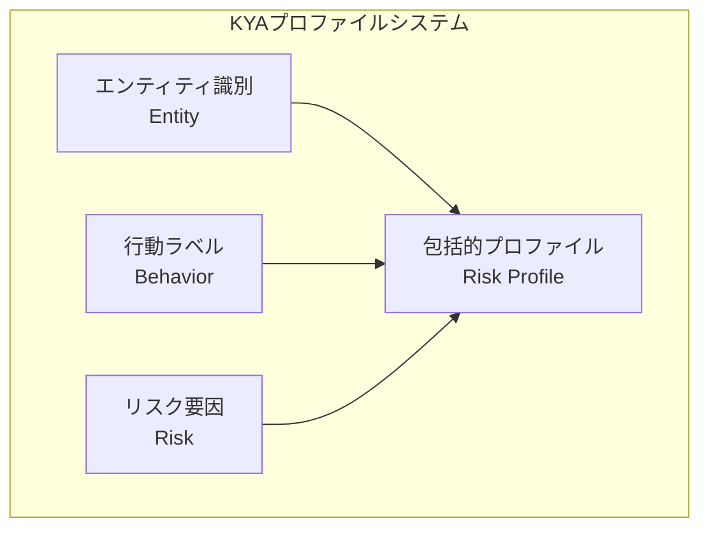
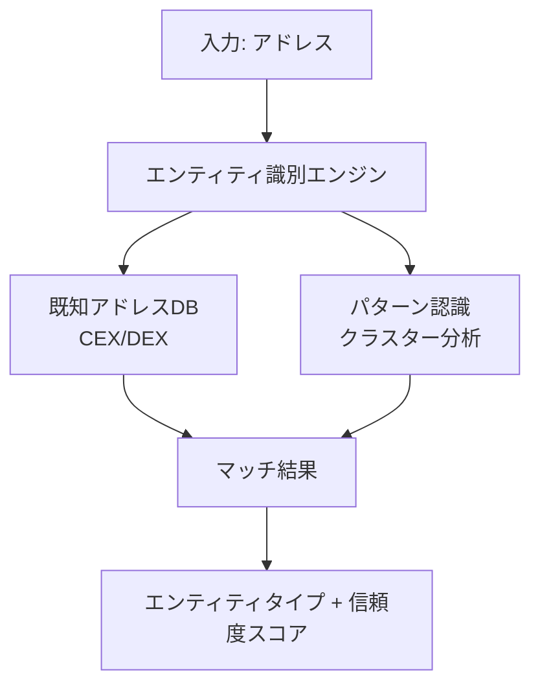
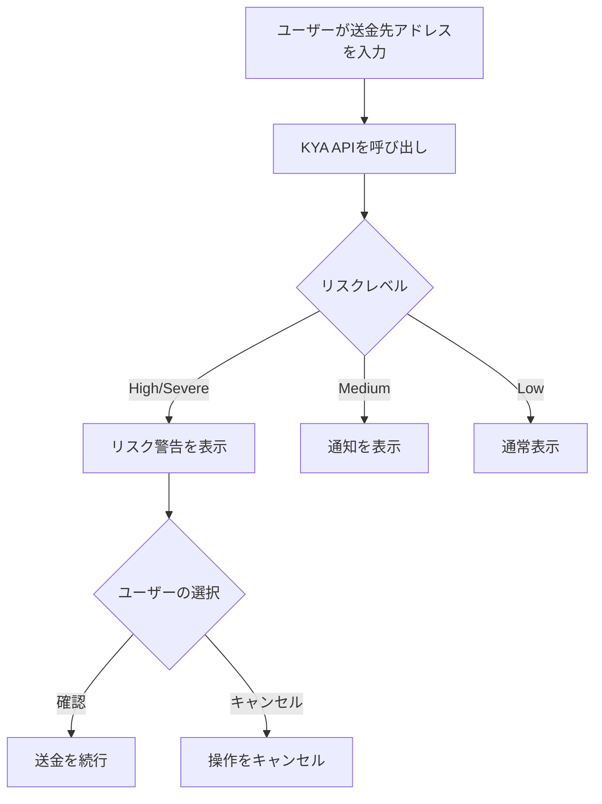
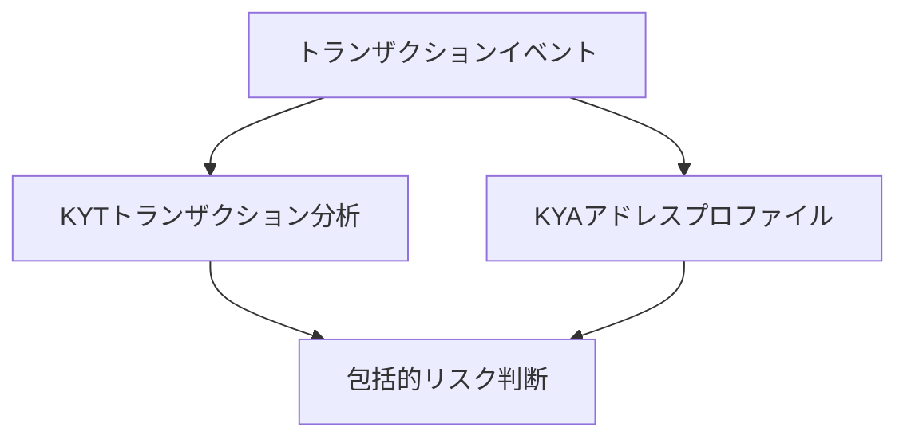

## KYAとは

**KYA（Know Your Address）** は、暗号通貨アドレスのプロファイリングとリスク評価を行う包括的なメカニズムです。アドレスの過去の行動、関連ネットワーク、ラベル情報を分析して、完全なリスクプロファイルを構築します。

<Info>
**コアクエスチョン**: このアドレスは信頼できるか？

KYAは、アドレスとやり取りする前に、そのアドレスの過去の行動とリスク状態を完全に把握するのに役立ちます。
</Info>

## KYA vs KYT

KYAとKYTは異なる次元からリスクを評価する、相互補完的なリスク管理ツールです：

| 次元 | KYT | KYA |
|-----------|-----|-----|
| **分析対象** | 個別のトランザクション | アドレス全体 |
| **時間次元** | リアルタイムスナップショット | 過去の累積 |
| **コアクエスチョン** | この取引は安全か？ | このアドレスは信頼できるか？ |
| **更新頻度** | トランザクションごとにトリガー | 定期的/オンデマンド |
| **データ深度** | トランザクションレベル | プロファイルレベル |

---

## プロファイリング次元

KYAは3つのコア次元からアドレスプロファイルを構築します：



---

## エンティティ識別

アドレスの背後にあるエンティティの種類を特定し、その性質と信頼性を理解します。

### エンティティ分類

| カテゴリ | 説明 | リスクウェイト | 識別方法 |
|----------|-------------|-------------|----------------------|
| **CEX** | 中央集権型取引所 | 低 | 既知のホットウォレットアドレス、入金アドレスパターン |
| **DEX** | 分散型取引所 | 低〜中 | スマートコントラクト識別、ルーターアドレス |
| **個人** | 一般ユーザーアドレス | 中 | 行動パターン分析、残高特性 |
| **コントラクト** | スマートコントラクト | 様々 | オンチェーンコード検証 |
| **既知の犯罪者** | 確認済み犯罪アドレス | 非常に高い | 法執行機関報告、制裁リスト |

### エンティティ識別フロー



### 信頼度レベル

エンティティ識別結果には信頼度スコアが含まれ、信頼性を評価するのに役立ちます：

| レベル | 信頼度 | 説明 | 推奨使用方法 |
|-------|------------|-------------|-----------------|
| **確認済み** | &gt;95% | 公式に確認済みまたは法執行機関による報告 | そのまま使用 |
| **高信頼度** | 80-95% | 強い特徴の一致 | 使用推奨 |
| **中信頼度** | 50-80% | 部分的な特徴の一致 | 参考として使用 |
| **低信頼度** | &lt;50% | 推測 | 参考程度 |

---

## 行動ラベル

オンチェーンの行動特性に基づき、システムが自動的に対応するラベルを付与します。

<Tabs>
  <Tab title="役割ラベル">
    オンチェーンエコシステムにおけるアドレスの役割を反映：
    
    | ラベル | 定義 | リスクの含意 |
    |-------|------------|------------------|
    | `whale` | 大口保有アドレス（&gt;$1M） | 市場への影響力が大きい |
    | `trader` | 高頻度取引行動 | 通常の活動 |
    | `holder` | 長期保有、動きなし | 低リスク |
    | `bot` | プログラム的な取引特性 | 注意が必要 |
    | `smart_money` | スマートマネー | プロトレーダー |
  </Tab>
  
  <Tab title="行動ラベル">
    特定の行動パターンを反映：
    
    | ラベル | 定義 | リスクの含意 |
    |-------|------------|------------------|
    | `mixer_user` | ミキシングサービスの使用歴あり | 高リスク |
    | `bridge_user` | クロスチェーンブリッジユーザー | 中リスク |
    | `defi_active` | 頻繁なDeFiプロトコルとのやり取り | 通常 |
    | `nft_trader` | 活発なNFT取引 | 通常 |
    | `new_address` | 新規作成アドレス | 観察が必要 |
  </Tab>
  
  <Tab title="エンティティラベル">
    識別されたオーナーシップエンティティ：
    
    | ラベル | 説明 |
    |-------|-------------|
    | `exchange:binance` | Binance取引所 |
    | `exchange:coinbase` | Coinbase取引所 |
    | `defi:uniswap` | Uniswapプロトコル |
    | `bridge:multichain` | クロスチェーンブリッジ |
    | `sanctions` | 制裁対象アドレス |
  </Tab>
</Tabs>

### ラベル組み合わせリスク

特定のラベルの組み合わせはリスクシグナルを増幅します：

<Warning>
**高リスク組み合わせの例**

`mixer_user` + `high_value` + `new_address`

**リスクレベル**: HIGH

**理由**: ミキサーから大口資金を受け取る新規アドレスは、マネーロンダリングパターンに一致
</Warning>

<Check>
**低リスク組み合わせの例**

`whale` + `holder` + `exchange:binance`

**リスクレベル**: LOW

**理由**: 取引所関連の長期大口保有者、通常の行動
</Check>

---

## リスク要因

リスク評価を定量化するためのコアメトリクスで、包括的なリスクスコアの算出に使用されます。

### コアリスク要因

| 要因 | 説明 | 算出方法 |
|--------|-------------|-------------------|
| **ブラックリストエクスポージャー** | ブラックリストアドレスとの関連度 | 直接/間接エクスポージャー比率 |
| **異常指数** | 通常行動からの逸脱度 | 統計的異常検知 |
| **プライバシーサービス利用** | ミキサー/プライバシープロトコルの使用 | インタラクション履歴分析 |
| **地理的リスク** | 高リスク管轄区域との関連 | IP/取引所の相関 |
| **時間的異常** | 異常な時間パターン | トランザクション時間分析 |

---

## ユースケース

### 1. カウンターパーティデューデリジェンス

<Steps>
  <Step title="カウンターパーティのアドレスを収集">
    OTC取引相手からウォレットアドレスを収集
  </Step>
  <Step title="アドレスを登録">
    ```bash
    POST https://api.chainstream.io/v1/kyt/address
    Authorization: Bearer <access_token>
    Content-Type: application/json

    {
      "address": "0x1234567890abcdef1234567890abcdef12345678"
    }
    ```
  </Step>
  <Step title="リスク評価を取得">
    ```bash
    GET https://api.chainstream.io/v1/kyt/addresses/{address}/risk
    Authorization: Bearer <access_token>
    ```
  </Step>
  <Step title="判断を実行">
    - `Severe/High` → 取引を拒否
    - `Medium` → 追加KYCを要求
    - `Low` → 通常通り処理
  </Step>
</Steps>

### 2. バッチアドレススクリーニング

既存ユーザーアドレスの定期的なスクリーニング：

```javascript
async function batchScreenAddresses(addresses) {
  const results = [];
  
  for (const address of addresses) {
    // 1. アドレスを登録
    await fetch('https://api.chainstream.io/v1/kyt/address', {
      method: 'POST',
      headers: {
        'Authorization': `Bearer ${accessToken}`,
        'Content-Type': 'application/json'
      },
      body: JSON.stringify({ address })
    });
    
    // 2. リスク評価を取得
    const riskResponse = await fetch(
      `https://api.chainstream.io/v1/kyt/addresses/${address}/risk`,
      { headers: { 'Authorization': `Bearer ${accessToken}` } }
    );
    const risk = await riskResponse.json();
    
    results.push({
      address,
      risk: risk.risk,
      addressType: risk.addressType
    });
  }
  
  return results;
}
```

**ビジネスフロー**:
1. ユーザーアドレスリストをエクスポート
2. バッチ登録とリスク照会
3. 高リスクアドレスをフィルタリング
4. 後続処理をトリガー

### 3. リアルタイムリスクアラート

ウォレットユーザーの送金前にリスクアラートを提供：



---

## データ要素

### 入力データ

| フィールド | 必須 | 説明 |
|-------|----------|-------------|
| address | ✅ | 照会するアドレス |

### 出力データ

```json
{
  "address": "0x0038AC785dfB6C82b2c9A7B3B6854e08a10cb9f1",
  "risk": "Low",
  "riskReason": null,
  "addressType": "PRIVATE_WALLET",
  "cluster": null,
  "addressIdentifications": [],
  "exposures": [
    {
      "category": "sanctions",
      "value": 0.0
    }
  ],
  "triggers": [],
  "status": "COMPLETE"
}
```

### レスポンスフィールド説明

| フィールド | 型 | 説明 |
|-------|------|-------------|
| address | string | 照会されたアドレス |
| risk | string | リスクレベル: `Severe`, `High`, `Medium`, `Low` |
| riskReason | string | リスク理由（nullの場合あり） |
| addressType | string | アドレスタイプ: `PRIVATE_WALLET`, `EXCHANGE`, `CONTRACT` など |
| cluster | string | 関連クラスター名（nullの場合あり） |
| addressIdentifications | array | アドレス識別ラベル |
| exposures | array | リスクエクスポージャーリスト |
| triggers | array | トリガーされたリスクルール |
| status | string | 分析ステータス: `COMPLETE`, `PENDING` |

---

## KYTとの相乗効果

KYAとKYTは実務において併用し、包括的なリスク管理を実現すべきです。

### 相乗効果パターン



### 判断マトリクス

| KYT結果 | KYA結果 | 統合判断 |
|------------|------------|-------------------|
| SEVERE | いずれか | 即時凍結 |
| HIGH | HIGH/SEVERE | レビュー保留で凍結 |
| HIGH | LOW/MEDIUM | 手動レビュー |
| MEDIUM | HIGH/SEVERE | 手動レビュー |
| MEDIUM | MEDIUM | 強化モニタリング |
| LOW | LOW | 自動承認 |
| LOW | HIGH | モニタリング対象としてフラグ |

---

## ベストプラクティス

### 1. キャッシュ戦略

KYA結果は適度にキャッシュ可能です：

| リスクレベル | 推奨キャッシュ期間 | 理由 |
|------------|---------------------------|--------|
| SEVERE | キャッシュなし | 更新がある可能性 |
| HIGH | 1時間 | 新鮮なデータが必要 |
| MEDIUM | 6時間 | パフォーマンスのバランス |
| LOW | 24時間 | 低リスクは安定している |

### 2. 差分更新

既存アドレスのモニタリング用：

<Note>
**推奨アプローチ**

1. 初回フルクエリでベースラインを確立
2. HIGH以上のアドレスは日次差分更新
3. MEDIUMアドレスは週次差分更新
4. 月次フルリフレッシュ
</Note>

### 3. 閾値チューニング

ビジネスシナリオに応じて閾値を調整：

| シナリオ | 推奨調整 |
|----------|----------------------|
| 高価値顧客 | MEDIUM閾値を引き上げ |
| 新規ユーザー | デフォルト閾値を厳格に適用 |
| バッチスクリーニング | 過度な誤検知を避けるため若干緩和 |

---

## 次のステップ

<CardGroup cols={2}>
  <Card title="コンプライアンス統合ガイド" icon="plug" href="/jp/docs/compliance/integration-guide">
    KYAの統合を開始
  </Card>
  <Card title="KYTコアコンセプト" icon="magnifying-glass-dollar" href="/jp/docs/compliance/kyt-concepts">
    トランザクションレベルのリスク管理を学ぶ
  </Card>
  <Card title="API認証" icon="key" href="/jp/docs/platform/authentication/api-keys-oauth">
    認証方法を理解
  </Card>
  <Card title="KYA APIリファレンス" icon="code" href="/jp/api-reference/endpoint/data/kyt/v2/kyt-address-post">
    APIドキュメントを確認
  </Card>
</CardGroup>
