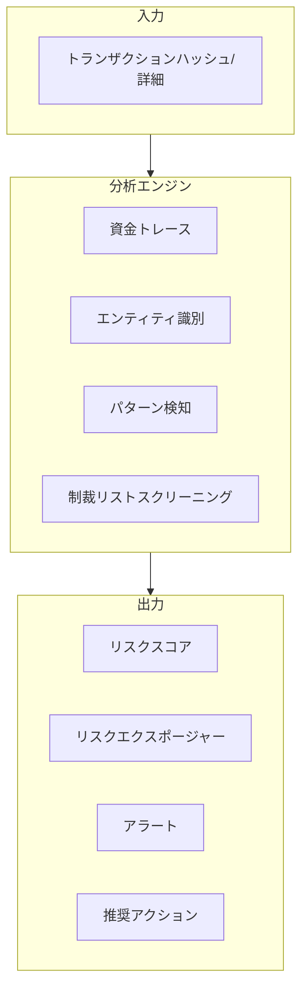
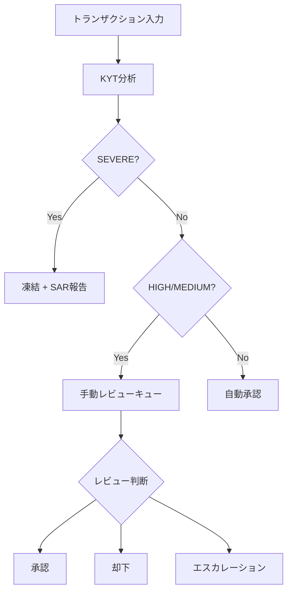

## KYTとは

**KYT（Know Your Transaction）** は、個々の暗号通貨取引に対するリスク識別メカニズムであり、各オンチェーン取引をリアルタイムで分析し、そのリスクレベルを判定して対処の推奨を提供します。

<Info>
**コアクエスチョン**: この取引は安全か？

KYTは、各取引を処理する前に、リスクレベルと関連するリスクエンティティを素早く特定するのに役立ちます。
</Info>

## 従来の金融との比較

| 次元 | 従来の金融 | 暗号通貨KYT |
|-----------|---------------------|------------|
| **監視方法** | 銀行取引モニタリング | オンチェーン取引分析 |
| **データ基盤** | 口座履歴ベース | アドレス関連性ベース |
| **処理時間** | T+1バッチ処理 | リアルタイム/準リアルタイム |
| **ルールエンジン** | 主にマニュアルルール | アルゴリズム＋ラベル駆動 |

## 仕組み



### 分析フロー

1. **資金トレース**: 資金の送金元と送金先を前方/後方にトレース
2. **エンティティ識別**: 取引に関与する既知のエンティティを特定（取引所、プロトコル、ラベル付きアドレス）
3. **パターン検知**: 不審な取引パターンを特定（分割、難読化、レイヤリング）
4. **制裁リストスクリーニング**: 制裁リストとの照合

---

## リスクレベル定義

ChainStreamは4段階のリスク分類システムを使用します：

| レベル | インジケーター | 定義 | 典型的なトリガー |
|-------|-----------|------------|------------------|
| **SEVERE** | 🔴 | 既知の犯罪との関連 | 制裁対象アドレス、確認済みハッカーアドレス、ダークネットマーケット |
| **HIGH** | 🟠 | 高リスクパターン | ミキサー出力、詐欺関連、無認可ギャンブル |
| **MEDIUM** | 🟡 | 注意が必要 | 高リスク取引所、プライバシーコイン交換、異常パターン |
| **LOW** | 🟢 | 通常 | 既知のコンプライアンス準拠エンティティ、通常のユーザー行動 |

### レベル詳細

<AccordionGroup>
  <Accordion title="SEVERE" icon="circle-exclamation">
    - **定義**: 確認済みの犯罪活動との直接的な関連
    - **データソース**: OFAC制裁リスト、法執行機関報告、確認済みハッキング事件
    - **誤検知率**: 非常に低い（&lt;0.1%）
    - **推奨アクション**: 即時凍結、規制当局への報告
  </Accordion>
  
  <Accordion title="HIGH" icon="triangle-exclamation">
    - **定義**: 高リスク特性があるが犯罪活動は未確認
    - **データソース**: ミキサー識別、詐欺アドレスクラスタリング、行動パターン分析
    - **誤検知率**: 低い（&lt;5%）
    - **推奨アクション**: 手動レビュー、処理遅延
  </Accordion>
  
  <Accordion title="MEDIUM" icon="circle-info">
    - **定義**: リスクシグナルはあるがさらなる評価が必要
    - **データソース**: 関連性分析、行動異常検知
    - **誤検知率**: 中程度（5-15%）
    - **推奨アクション**: 強化モニタリング、処理可能
  </Accordion>
  
  <Accordion title="LOW" icon="circle-check">
    - **定義**: 明らかなリスク特性がない
    - **データソース**: 通常の取引パターン、既知のコンプライアンス準拠エンティティ
    - **推奨アクション**: 通常処理
  </Accordion>
</AccordionGroup>

---

## 推奨アクションマッピング

リスクレベルに基づき、システムは標準化されたアクション推奨を提供します：

| リスクレベル | 推奨アクション | 自動化レベル | SLA |
|------------|-------------------|------------------|-----|
| **SEVERE** | 凍結 | 自動 | 即時 |
| **HIGH** | 手動レビュー | 手動確認が必要 | 4時間 |
| **MEDIUM** | 強化モニタリング | 半自動 | 24時間 |
| **LOW** | 通過 | 自動 | 即時 |

### アクションフロー



---

## エクスポージャータイプ

ChainStreamは2種類のリスクエクスポージャーを区別します：

<Tabs>
  <Tab title="直接エクスポージャー">
    **定義**: 取引がリスクアドレスと直接やり取りしている
    
    ```
    リスクアドレス ──────────────> ターゲットアドレス
                   直接送金
                 
    エクスポージャータイプ: DIRECT
    リスク伝播: 100%
    ```
    
    **特徴**:
    - 1ホップの関連
    - リスクの確実性が高い
    - 通常、即時対応をトリガー
    
    **シナリオ例**:
    - 既知のハッカーアドレスからの資金受領
    - 制裁対象アドレスへの送金
    - ミキサー出力からの直接受領
    
    ```json
    {
      "type": "DIRECT",
      "category": "SANCTIONS",
      "entity": "OFAC Sanctioned Address",
      "percentage": 100
    }
    ```
  </Tab>
  
  <Tab title="間接エクスポージャー">
    **定義**: Nホップを経由してリスクアドレスと関連
    
    ```
    リスクアドレス ──> 中間1 ──> 中間2 ──> ターゲットアドレス
                 Nホップの関連
                 
    エクスポージャータイプ: INDIRECT
    リスク伝播: 減衰計算
    ```
    
    **特徴**:
    - マルチホップの関連（通常2-5ホップ）
    - リスクは距離に応じて減衰
    - 総合的な評価が必要
    
    **減衰モデル**:
    
    `リスクスコア = ベースリスク × (減衰係数 ^ ホップ数)`
    
    例: ベースリスク100、減衰係数0.5、3ホップ後 = 100 × 0.5³ = 12.5
    
    ```json
    {
      "type": "INDIRECT",
      "category": "MIXER",
      "entity": "Tornado Cash",
      "percentage": 12.5,
      "hops": 3
    }
    ```
  </Tab>
</Tabs>

### エクスポージャー対応ガイドライン

| シナリオ | 直接の対応 | 間接の対応 |
|----------|-----------------|-------------------|
| SEVEREソース | 即時凍結 | 2ホップ以内は凍結、3ホップ以上は手動レビュー |
| HIGHソース | 手動レビュー | モニタリング対象としてフラグ |
| MEDIUMソース | 通常処理 | 無視 |

---

## ビジネスフロー

### 標準KYTフロー

<Steps>
  <Step title="トランザクション登録">
    KYT APIにトランザクション情報を送信
    ```bash
    POST https://api.chainstream.io/v1/kyt/transfer
    Authorization: Bearer <access_token>
    Content-Type: application/json

    {
      "network": "ethereum",
      "asset": "ETH",
      "transferReference": "0x1234...abcd:0xRecipientAddress",
      "direction": "received"
    }
    ```
  </Step>
  <Step title="分析完了を待機">
    ポーリングで分析完了を待機（通常30秒以内）
  </Step>
  <Step title="結果を照会">
    リスク評価結果を取得
    ```bash
    GET https://api.chainstream.io/v1/kyt/transfers/{externalId}/summary
    Authorization: Bearer <access_token>
    ```
  </Step>
  <Step title="判断の実行">
    リスクレベルと推奨に基づいてビジネスロジックを実行
  </Step>
</Steps>

### 処理時間

| フェーズ | 目標時間 | SLAコミットメント |
|-------|-------------|----------------|
| トランザクション登録 | &lt;100ms | 99.9% |
| リスク分析 | &lt;30s | 95% |
| 結果返却 | &lt;30s | 95% |
| エンドツーエンド | &lt;1分 | 90% |

<Note>
有効なトランザクションは30秒以内に分析が完了します。複雑な関連性がある場合は、より長い処理時間が必要になることがあります。
</Note>

---

## データ要素

### 入力データ（送金登録）

| フィールド | 必須 | 説明 |
|-------|----------|-------------|
| `network` | ✅ | ネットワーク: `bitcoin`, `ethereum`, `Solana` |
| `asset` | ✅ | 資産タイプ: `BTC`, `ETH`, `SOL` など |
| `transferReference` | ✅ | 送金リファレンス（txハッシュ:アドレス） |
| `direction` | ✅ | 方向: `sent` または `received` |

### 入力データ（出金登録）

| フィールド | 必須 | 説明 |
|-------|----------|-------------|
| `network` | ✅ | ネットワーク: `bitcoin`, `ethereum`, `Solana` |
| `asset` | ✅ | 資産タイプ |
| `address` | ✅ | 出金先アドレス |
| `assetAmount` | ✅ | 資産数量 |
| `attemptTimestamp` | ✅ | 試行タイムスタンプ |
| `assetPrice` | 任意 | 資産価格 |

### 出力データ

```json
{
  "externalId": "393905a7-bb96-394b-9e20-3645298c1079",
  "asset": "ETH",
  "network": "ethereum",
  "transferReference": "0x1234...abcd:0xAddress",
  "direction": "received",
  "tx": "0x1234...abcd",
  "outputAddress": "0xAddress",
  "assetAmount": "1.5",
  "usdAmount": "3000.00",
  "timestamp": "2024-01-15T10:30:00.000Z",
  "updatedAt": "2024-01-15T10:30:15.000Z"
}
```

### レスポンスフィールド説明

| フィールド | 型 | 説明 |
|-------|------|-------------|
| externalId | string | 送金ID（UUID）、後続のクエリに使用 |
| asset | string | 資産タイプ |
| network | string | ブロックチェーンネットワーク |
| transferReference | string | 送金リファレンス |
| direction | string | 送金方向 |
| tx | string | トランザクションハッシュ |
| outputAddress | string | 出力アドレス |
| assetAmount | string | 資産数量 |
| usdAmount | string | USD金額 |
| timestamp | string | トランザクションタイムスタンプ |
| updatedAt | string | 更新日時 |

---

## API使用方法

### 入金トランザクション登録（Transfer）

```bash
POST https://api.chainstream.io/v1/kyt/transfer
Authorization: Bearer <access_token>
Content-Type: application/json

{
  "network": "ethereum",
  "asset": "ETH",
  "transferReference": "0x9f318afbad2a183f97750bc51a75b582ad8f9e9c:0x17A16QmavnUfCW11DAApi",
  "direction": "received"
}
```

### 出金トランザクション登録

```bash
POST https://api.chainstream.io/v1/kyt/withdrawal
Authorization: Bearer <access_token>
Content-Type: application/json

{
  "network": "Solana",
  "asset": "SOL",
  "address": "D1Mc6j9xQWgR1o1Z7yU5nVVXFQiAYx7FG9AW1aVfwrUM",
  "assetAmount": "5",
  "attemptTimestamp": "2024-01-15T10:30:00.000Z"
}
```

### 評価詳細の取得

```bash
# 送金サマリーを取得
GET https://api.chainstream.io/v1/kyt/transfers/{externalId}/summary

# 直接リスクエクスポージャーを取得
GET https://api.chainstream.io/v1/kyt/transfers/{externalId}/exposures/direct

# リスクアラートを取得
GET https://api.chainstream.io/v1/kyt/transfers/{externalId}/alerts

# ネットワーク識別を取得
GET https://api.chainstream.io/v1/kyt/transfers/{externalId}/network-identifications
```

### 出金関連クエリ

```bash
# 出金サマリーを取得
GET https://api.chainstream.io/v1/kyt/withdrawal/{withdrawalId}/summary

# 出金直接エクスポージャーを取得
GET https://api.chainstream.io/v1/kyt/withdrawal/{withdrawalId}/exposures/direct

# 出金アラートを取得
GET https://api.chainstream.io/v1/kyt/withdrawal/{withdrawalId}/alerts

# 詐欺評価を取得
GET https://api.chainstream.io/v1/kyt/withdrawal/{withdrawalId}/fraud-assessment
```

---

## ベストプラクティス

<AccordionGroup>
  <Accordion title="リスク閾値の設定" icon="sliders">
    ビジネスのリスク許容度に応じて閾値を調整：
    
    | ビジネスタイプ | SEVERE閾値 | HIGH閾値 | 推奨 |
    |---------------|------------------|----------------|----------------|
    | ライセンス付きCEX | デフォルト | デフォルト | 厳格モード |
    | ウォレットサービス | デフォルト | 10%引き上げ | バランスモード |
    | DeFiプロトコル | デフォルト | 20%引き上げ | 緩和モード |
  </Accordion>
  
  <Accordion title="誤検知の処理" icon="flag">
    誤検知フィードバック機構を確立：
    
    1. 手動で覆されたすべてのケースを記録
    2. 定期的に誤検知パターンを分析
    3. ChainStreamに誤検知フィードバックを送信
    4. ローカルの閾値設定を調整
  </Accordion>
  
  <Accordion title="監査証跡" icon="file-lines">
    コンプライアンス監査要件を確保：
    
    - すべてのKYTリクエストとレスポンスを保存
    - 手動決定とその理由を記録
    - 少なくとも5年間保持（規制要件に基づく）
    - 標準レポート形式でのエクスポートをサポート
  </Accordion>
  
  <Accordion title="継続的モニタリング" icon="rotate">
    リスクステータスは変化する可能性があります（例: 事後的にアドレスが制裁対象に）。推奨事項：
    
    - 定期的に過去のトランザクションを再評価
    - 関連アドレスの新しいアクティビティを監視
    - リスクステータス変更のアラートメカニズムを確立
  </Accordion>
</AccordionGroup>

---

## 関連リソース

<CardGroup cols={2}>
  <Card title="KYAコアコンセプト" icon="user-shield" href="/jp/docs/compliance/kya-concepts">
    アドレスレベルのリスク管理を学ぶ
  </Card>
  <Card title="コンプライアンス統合ガイド" icon="plug" href="/jp/docs/compliance/integration-guide">
    KYTの統合を開始
  </Card>
  <Card title="API認証" icon="key" href="/jp/docs/platform/authentication/api-keys-oauth">
    認証方法を理解
  </Card>
  <Card title="KYT APIリファレンス" icon="code" href="/jp/api-reference/endpoint/kyt/v1/kyt-transfer-post">
    APIドキュメントを確認
  </Card>
</CardGroup>
