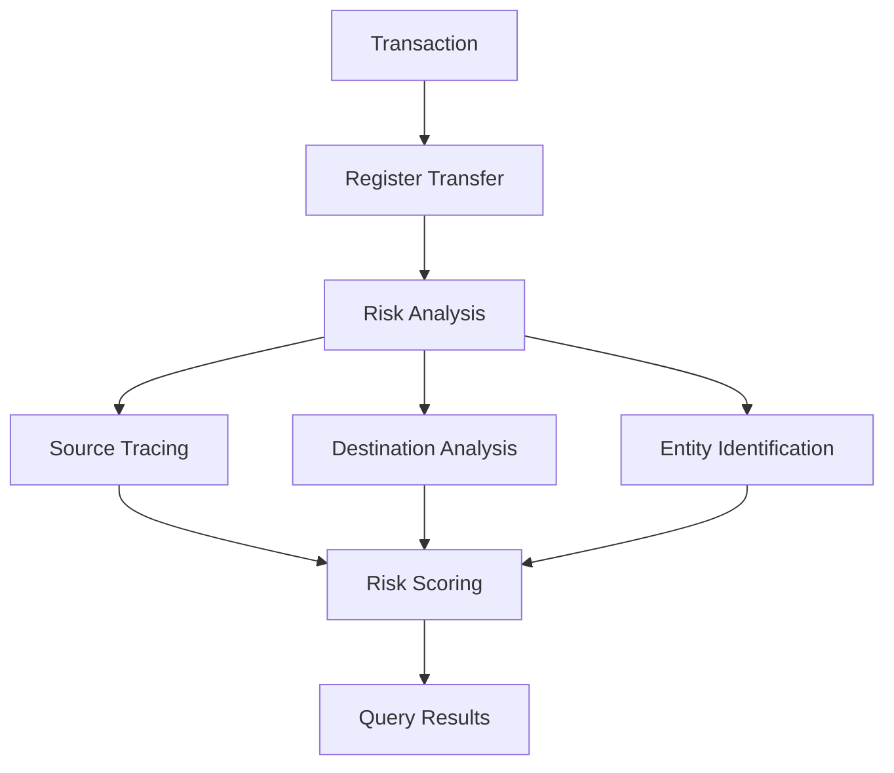

## 概要

暗号資産が主流化するにつれ、コンプライアンス要件はますます厳格化しています。ChainStreamは包括的なセキュリティおよびコンプライアンスソリューションを提供し、企業が規制要件を満たし、リスクの高い取引を特定し、ユーザー資産を保護できるよう支援します。

<CardGroup cols={2}>
  <Card title="KYT - 取引の把握" icon="magnifying-glass-dollar" color="#4D9CFF">
    取引の資金源と送金先をリアルタイムで分析し、高リスクな関連性を特定
  </Card>
  <Card title="KYA - アドレスの把握" icon="user-shield" color="#16A34A">
    ウォレットアドレスのリスクレベルと関連エンティティを評価
  </Card>
</CardGroup>

## なぜオンチェーンコンプライアンスが必要か

<AccordionGroup>
  <Accordion title="規制要件" icon="gavel">
    主要な管轄区域（米国、EU、シンガポール、香港など）は、暗号資産取引所やサービスプロバイダーに対して明確なAML/CFTコンプライアンス要件を定めています。
  </Accordion>
  
  <Accordion title="リスク管理" icon="shield-halved">
    以下を特定・ブロック：
    - ハッキング関連の資金
    - ランサムウェアの支払い
    - ミキサーおよびプライバシープロトコルとの関連
    - 詐欺およびフィッシングアドレス
  </Accordion>
  
  <Accordion title="ユーザー保護" icon="user-shield">
    - ユーザーが高リスクアドレスとやり取りすることを防止
    - トークンのセキュリティチェックを提供
    - ハニーポットやラグプルを検出
  </Accordion>
</AccordionGroup>

## ChainStreamのコンプライアンス機能

### KYT（Know Your Transaction）

**個別取引**に対するリスク評価：



**主要機能**：
- 取引リスクスコアリング
- 資金の送金元/送金先追跡
- エンティティ特定
- アラート生成

詳細は[KYTコンセプト](/jp/guides/data-concepts/kyt-concepts)をご覧ください。

### KYA（Know Your Address）

**ウォレットアドレス**に対するリスク評価：

- アドレスリスク格付け
- 過去の行動分析
- エンティティ特定
- ラベル分類

詳細は[KYAコンセプト](/jp/guides/data-concepts/kya-concepts)をご覧ください。

## 対応範囲

### 対応チェーン

| チェーン | KYT | KYA | 備考 |
|-------|-----|-----|-------|
| Ethereum | 完全対応 | 完全対応 | ERC-20を含む |
| BSC | 完全対応 | 完全対応 | BEP-20を含む |
| Polygon | 完全対応 | 完全対応 | |
| Arbitrum | 完全対応 | 完全対応 | |
| Solana | 完全対応 | 完全対応 | SPLトークン |
| Tron | 完全対応 | 完全対応 | TRC-20 |
| Bitcoin | 部分対応 | 部分対応 | メインネット |

### リスクカテゴリ

ChainStreamは以下のリスクカテゴリを特定できます：

| カテゴリ | 説明 | リスクレベル |
|----------|-------------|------------|
| 制裁対象 | 制裁対象のエンティティ/アドレス | 重大 |
| ダークネット | ダークネットマーケットとの関連 | 重大 |
| ランサムウェア | ランサムウェアとの関連 | 重大 |
| ハッキング | ハッキング関連の資金 | 重大 |
| 詐欺 | 詐欺/フィッシングとの関連 | 高 |
| ミキサー | ミキサー/プライバシープロトコル | 高 |
| ギャンブル | ギャンブルプラットフォーム | 中 |
| 高リスク取引所 | 高リスクな取引所 | 中 |

## 統合

KYT/KYAは**登録＋クエリ**の2ステップモデルを使用します。まず取引またはアドレスを登録し、システムがリスク分析を完了した後に評価結果をクエリします。

<Tabs>
  <Tab title="取引リスク（KYT）">
    **ステップ1：送金を登録**
    
    ```bash
    POST /v1/kyt/transfer
    {
      "network": "ethereum",
      "asset": "ETH",
      "transferReference": "your-unique-reference",
      "direction": "received",
      "transferTimestamp": "2024-01-15T10:30:00Z",
      "txHash": "0x...",
      "outputAddress": "0x..."
    }
    ```
    
    **ステップ2：結果をクエリ**
    
    ```bash
    # Get risk summary
    GET /v1/kyt/transfers/{transferId}/summary
    
    # Get risk alerts
    GET /v1/kyt/transfers/{transferId}/alerts
    
    # Get direct risk exposure
    GET /v1/kyt/transfers/{transferId}/exposures/direct
    ```
  </Tab>
  
  <Tab title="アドレスリスク（KYA）">
    **ステップ1：アドレスを登録**
    
    ```bash
    POST /v1/kyt/address
    {
      "network": "ethereum",
      "address": "0x...",
      "asset": "ETH"
    }
    ```
    
    **ステップ2：リスク格付けをクエリ**
    
    ```bash
    GET /v1/kyt/addresses/{address}/risk
    ```
  </Tab>
  
  <Tab title="統合例">
    入金フローにKYTを統合する：
    
    ```javascript
    import { ChainStreamClient } from '@chainstream-io/sdk';
    
    const client = new ChainStreamClient(process.env.CHAINSTREAM_ACCESS_TOKEN);
    
    async function processDeposit(txHash, toAddress) {
      // Step 1: Register transfer
      const transfer = await client.kyt.registerTransfer({
        network: 'ethereum',
        asset: 'ETH',
        transferReference: `deposit-${txHash}`,
        direction: 'received',
        transferTimestamp: new Date().toISOString(),
        txHash: txHash,
        outputAddress: toAddress
      });
      
      // Step 2: Query risk summary
      const summary = await client.kyt.getTransferSummary(transfer.transferId);
      
      // Step 3: Make decision based on risk level
      if (summary.rating === 'highRisk' || summary.rating === 'severe') {
        // Get detailed alerts
        const alerts = await client.kyt.getTransferAlerts(transfer.transferId);
        await flagForReview(txHash, alerts);
        return { status: 'pending_review', alerts };
      }
      
      return { status: 'approved', rating: summary.rating };
    }
    ```
  </Tab>
</Tabs>

## ユースケース

<CardGroup cols={2}>
  <Card title="入金モニタリング" icon="arrow-down-to-arc">
    入金時に資金源のリスクを評価し、問題のある資金をブロック
  </Card>
  
  <Card title="出金前チェック" icon="arrow-up-from-arc">
    出金前に送金先アドレスのリスクを評価し、制裁対象エンティティへの資金流出を防止
  </Card>
  
  <Card title="ウォレットスクリーニング" icon="wallet">
    ユーザー登録やKYC時にウォレットの履歴リスクをチェック
  </Card>
  
  <Card title="コンプライアンスレポート" icon="file-lines">
    規制に準拠した取引モニタリングレポートを生成
  </Card>
</CardGroup>

## 次のステップ

<CardGroup cols={3}>
  <Card title="KYTコンセプト" icon="magnifying-glass-dollar" href="/jp/guides/data-concepts/kyt-concepts">
    取引リスク評価の詳細
  </Card>
  <Card title="KYAコンセプト" icon="user-shield" href="/jp/guides/data-concepts/kya-concepts">
    アドレスリスク評価の詳細
  </Card>
  <Card title="統合ガイド" icon="plug" href="/jp/guides/data-concepts/compliance-integration">
    コンプライアンスAPIの統合方法
  </Card>
</CardGroup>
