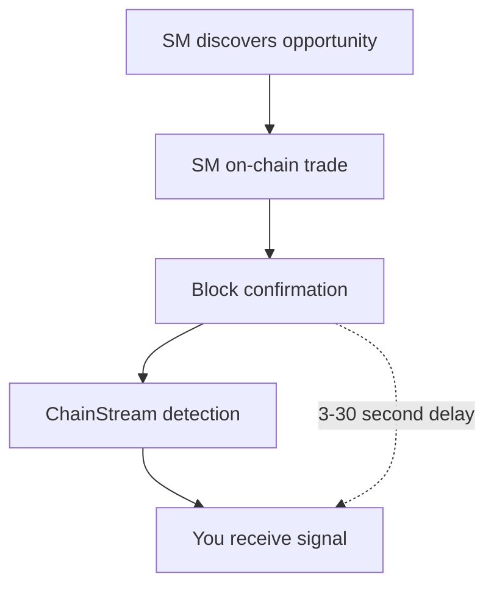

ChainStream のスマートマネー機能は、開発者が「スマートマネー」を追跡・分析するのに役立ちます — 暗号資産市場で一貫して市場平均を上回るリターンを達成するアドレスです。このドキュメントでは、スマートマネーの識別手法とデータ更新メカニズムを詳しく説明します。

---

## スマートマネーとは

### 定義

スマートマネーとは、暗号資産市場で以下の特徴を示すアドレスを指します：

- 一貫して市場ベンチマークを上回る
- 質の高いプロジェクトに早期参入する
- 高い勝率を維持する
- プロフェッショナルなリスク管理能力を持つ

### スマートマネーのタイプ

| タイプ | 説明 | 典型的な特徴 |
|:--|:--|:--|
| 機関投資家 | プロフェッショナルな投資機関、ファンド | 大口取引、長期保有、分散投資 |
| プロトレーダー | フルタイムの暗号資産トレーダー | 高頻度取引、テクニカル分析、複数戦略 |
| 早期投資家 | プロジェクトの早期参加者 | プライマリーマーケット参加、長期ロックアップ |
| KOL/インフルエンサーウォレット | 業界の著名人 | コミュニティへの影響力、情報優位性 |

### 一般アドレスとの比較

| 観点 | スマートマネー | 一般アドレス |
|:--|:--|:--|
| リターン | 一貫したプラスリターン、市場を上回る | 高ボラティリティ、頻繁な損失 |
| エントリータイミング | 早期発見、安値で購入 | 高値追い、天井で購入 |
| 勝率 | &gt; 60% | &lt; 50% |
| ポジション管理 | 明確な利確/損切り戦略 | ランダム取引、規律なし |
| 資金規模 | 通常 $100K 超 | 幅広く分布 |

---

## 識別手法

### データソース

ChainStream は以下のオンチェーンデータを分析します：

- すべての DEX 取引記録
- トークン保有の変化
- 資金フローの軌跡
- 取引時間の分布
- ガス手数料のパターン

### 候補プール選定方法

ChainStream は新規ローンチトークンのパフォーマンスに基づく逆追跡手法を使用して、スマートマネー候補プールを構築します：

#### 選定プロセス

<Steps>
  <Step title="トークンパフォーマンスのスクリーニング">
    過去 60 日間にローンチされたすべてのトークンから、時価総額成長/取引量の指標に基づいてパフォーマンス上位 1000 トークンを選出
  </Step>
  <Step title="早期参加者の特定">
    上記のトークンについて、早期段階（ローンチ後 24 時間以内）に購入したアドレスを特定
  </Step>
  <Step title="アドレスのノイズ除去">
    以下のアドレスタイプを除外：
    - DEV/プロジェクトアドレス（取引パターンで識別）
    - マーケットメーカーアドレス（高頻度のウォッシュトレードで識別）
    - CEX ホットウォレットアドレス（既知のアドレスデータベースとマッチング）
    - シビルアタックアドレス（相関分析で識別）
  </Step>
  <Step title="頻度統計とランキング">
    各アドレスのトップ 1000 トークンでの早期購入頻度をカウントし、最も頻度の高い上位 200 アドレスをスマートマネー候補プールとする
  </Step>
</Steps>

### 動的ローリング更新メカニズム

スマートマネーデータの適時性と正確性を維持するために、ChainStream は重み減衰を伴う週次ローリング更新を実施しています：

| 設定 | 値 |
|:--|:--|
| 更新サイクル | 毎週月曜日 UTC 00:00 |
| ウィンドウサイズ | 60 日（約 8 週間） |
| ローリング方法 | 最も古い週のデータを毎週除外し、最新週のデータを含める |

#### 重み減衰モデル

| データ期間 | 重み |
|:--|:--|
| 直近 1 週間 | 100% |
| 2 週間前 | 85% |
| 3 週間前 | 70% |
| 4 週間前 | 55% |
| 5〜8 週間前 | 40% |

<Warning>
ローリング更新により、スマートマネーリストは動的に変化します。直近のパフォーマンスが悪い過去のスマートマネーアドレスは、候補プールから徐々に除外されます。
</Warning>

---

## データ更新サイクル

### リアルタイム更新

| データタイプ | 更新レイテンシ |
|:--|:--|
| 新規取引の検出 | 1 分未満 |
| ポジション変更 | 5 分未満 |

### 定期更新

| データタイプ | 更新サイクル |
|:--|:--|
| スマートマネーリスト | 毎週月曜日 UTC 00:00 |
| スコアの再計算 | 24 時間ごと |
| 完全な再評価 | 30 日ごと |

---

## ユースケース

<CardGroup cols={2}>
  <Card title="コピートレード" icon="copy">
    スマートマネーの買いシグナルを監視して取引判断を支援します。
  </Card>
  <Card title="プロジェクト発見" icon="magnifying-glass">
    スマートマネーが注目する新規プロジェクトを分析：
    - 複数のスマートマネーが同時に購入
    - 短期売買ではなく継続的な蓄積
  </Card>
  <Card title="マーケットセンチメント" icon="chart-mixed">
    スマートマネーの行動を通じてマーケットセンチメントを判断：
    - 大量購入: 強気シグナル
    - 集中売却: 弱気シグナル
  </Card>
  <Card title="リスク警告" icon="triangle-exclamation">
    異常な資金フローを監視：
    - ホエールの大口送金
    - プロジェクトチームのアドレスの動き
  </Card>
</CardGroup>

---

## 利用ガイドライン

<Warning>
スマートマネーシグナルは参考情報であり、投資アドバイスではありません。
</Warning>

### 正しい使い方

- 注目すべきトークンを発見するためのリサーチの出発点として使用
- ファンダメンタル分析と組み合わせて独自の判断を行う
- シグナルのレイテンシを理解する — オンチェーントランザクションには確認時間が必要
- 精度を高めるために複数のシグナルの収束に注目

### 誤った使い方

- リサーチなしにスマートマネーを盲目的にコピー
- 取引コスト（ガス、スリッページ）を無視
- マーケット環境やマクロ要因を無視
- 単一のシグナルソースに過度に依存

---

## 制限事項

### 1. 情報遅延

### 2. カウンタートレードリスク

- 一部の SM は追跡されていることに気づき、意図的にカウンタートレードする可能性がある
- 大口購入はダンプのための偽シグナルの場合がある

### 3. 市場キャパシティの制限

- SM の買いに追随すると価格が上昇する
- 小さな時価総額のトークンはキャパシティに限界があり、コピートレードの効果が低下する

### 4. 過去のパフォーマンスは将来の結果を保証しない

- 過去の高リターンは将来のパフォーマンスを保証しない
- マーケット環境の変化により戦略が失敗する場合がある

---

## 関連ドキュメント

<CardGroup cols={2}>
  <Card title="スマートマネートラッカー" icon="user-secret" href="/jp/playbooks/tutorials/smart-money-tracker">
    ハンズオンチュートリアル：SM 追跡システムの構築
  </Card>
  <Card title="リアルタイムストリーミング" icon="bolt" href="/jp/guides/data-concepts/realtime-streaming">
    リアルタイムストリーム処理
  </Card>
</CardGroup>
