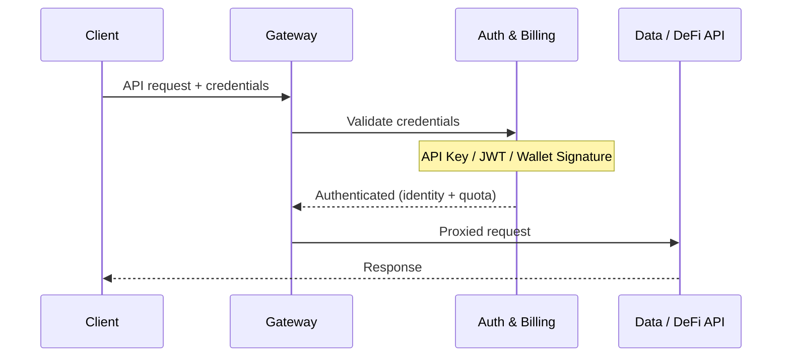

## アーキテクチャ

すべての API リクエストは**ゲートウェイ**を通過し、バックエンドサービスに転送される前に認証情報が検証されます。ゲートウェイは認証とクォータチェックを内部の**認証・課金サービス**に委任し、すべてのリクエストが 1 ホップで検証されるようにしています。



認証に失敗すると、ゲートウェイはバックエンドを経由せず直接エラーを返します（401 Unauthorized、または x402 が有効な場合は 402 Payment Required）。

---

## 3 つの認証方式

ChainStream は**3 つ**の認証情報タイプをサポートしており、以下の優先順位で評価されます：

| 優先度 | 方式 | ヘッダー | 最適な用途 |
|----------|--------|--------|----------|
| 1 | **ウォレット署名 (SIWX)** | `Authorization: SIWX <token>` | オンチェーンウォレットを持つ AI エージェント（x402 サブスクライバー） |
| 2 | **API Key** | `X-API-KEY: <key>` | アプリケーション、スクリプト、CLI、MCP Server |
| 3 | **JWT Bearer Token** | `Authorization: Bearer <jwt>` | OAuth 2.0 Client Credentials を使用する Dashboard アプリ |

<Info>
有効な認証情報が見つからず、x402 が有効な場合、ゲートウェイは **HTTP 402 Payment Required** を返し、`/x402/purchase` へのポインターを提供します。これにより AI エージェントがサブスクリプションを自動購入できます。
</Info>

---

## 方式 1: API Key（推奨）

最もシンプルな認証方式です。Dashboard で API Key を作成し、`X-API-KEY` ヘッダーに渡します。

### API Key の取得

<Steps>
  <Step title="Dashboard にログイン">
    [ChainStream Dashboard](https://www.chainstream.io/dashboard) にアクセスしてログイン
  </Step>
  <Step title="Applications に移動">
    サイドバーで「Applications」を見つけます
  </Step>
  <Step title="新しいアプリを作成">
    「Create New App」をクリックして API Key を生成します
  </Step>
</Steps>

### API Key の使用

<Tabs>
  <Tab title="cURL">
```bash
curl https://api.chainstream.io/v2/token/sol/So11111111111111111111111111111111111111112 \
  -H "X-API-KEY: your_api_key"
```
  </Tab>
  <Tab title="SDK">
```typescript
import { ChainStreamClient } from "@chainstream-io/sdk";

const cs = new ChainStreamClient({
  apiKey: "your_api_key",
});

const token = await cs.token.getToken("So11111111111111111111111111111111111111112", "solana");
```
  </Tab>
  <Tab title="CLI">
```bash
chainstream config set --key apiKey --value your_api_key
chainstream token info --chain sol --address So11111111111111111111111111111111111111112
```
  </Tab>
  <Tab title="MCP Server">
```bash
export CHAINSTREAM_API_KEY=your_api_key
npx @chainstream-io/mcp
```
  </Tab>
</Tabs>

### 仕組み

1. ゲートウェイが `X-API-KEY` ヘッダーを抽出
2. 認証サービスがデータベースに対してキーを検証
3. 成功すると、関連するオーガニゼーションと権限コンテキストを付与してリクエストが転送される
4. キーは `active` であり、期限切れでないことが必要

<Warning>
API Key を安全に保管してください。コードリポジトリにコミットしないでください。漏洩した場合は、Dashboard で直ちに無効化してください。
</Warning>

---

## 方式 2: JWT Bearer Token (OAuth 2.0)

OAuth 2.0 Client Credentials フローを使用するアプリケーション向けです。Client ID と Client Secret を使用して JWT アクセストークンを取得します。

### アクセストークンの生成

<Tabs>
  <Tab title="cURL">
```bash
curl -X POST "https://dex.asia.auth.chainstream.io/oauth/token" \
  -H "Content-Type: application/json" \
  -d '{
    "client_id": "YOUR_CLIENT_ID",
    "client_secret": "YOUR_CLIENT_SECRET",
    "audience": "https://api.dex.chainstream.io",
    "grant_type": "client_credentials"
  }'
```
  </Tab>
  <Tab title="JavaScript">
```javascript
const response = await fetch('https://dex.asia.auth.chainstream.io/oauth/token', {
  method: 'POST',
  headers: { 'Content-Type': 'application/json' },
  body: JSON.stringify({
    client_id: 'YOUR_CLIENT_ID',
    client_secret: 'YOUR_CLIENT_SECRET',
    audience: 'https://api.dex.chainstream.io',
    grant_type: 'client_credentials'
  })
});

const { access_token } = await response.json();
```
  </Tab>
  <Tab title="Python">
```python
import requests

response = requests.post(
    'https://dex.asia.auth.chainstream.io/oauth/token',
    json={
        'client_id': 'YOUR_CLIENT_ID',
        'client_secret': 'YOUR_CLIENT_SECRET',
        'audience': 'https://api.dex.chainstream.io',
        'grant_type': 'client_credentials'
    }
)

access_token = response.json()['access_token']
```
  </Tab>
</Tabs>

### トークンの使用

```bash
curl https://api.chainstream.io/v2/token/sol/So11111111111111111111111111111111111111112 \
  -H "Authorization: Bearer YOUR_ACCESS_TOKEN"
```

### 仕組み

1. ゲートウェイが `Authorization: Bearer <jwt>` ヘッダーを抽出
2. 認証サービスが JWT 署名、発行者、オーディエンスを検証
3. `client_id` クレームがクォータ追跡用のオーガニゼーションに解決される

### トークンの詳細

- **有効期間**: デフォルトで 24 時間
- **アルゴリズム**: RS256
- **発行者**: `https://dex.asia.auth.chainstream.io/`
- **オーディエンス**: `https://api.dex.chainstream.io`

### スコープ権限

特定のエンドポイントには特定のスコープが必要です：

| スコープ | 説明 | 対象エンドポイント |
|-------|-------------|---------------------|
| `webhook.read` | Webhook 読み取りアクセス | Webhook 設定のクエリ |
| `webhook.write` | Webhook 書き込みアクセス | Webhook の作成/変更/削除 |
| `kyt.read` | KYT 読み取りアクセス | リスク評価結果のクエリ |
| `kyt.write` | KYT 書き込みアクセス | リスク評価用のトランザクション/アドレスの登録 |

```javascript
const response = await auth0Client.oauth.clientCredentialsGrant({
  audience: 'https://api.dex.chainstream.io',
  scope: 'webhook.read webhook.write kyt.read kyt.write'
});
```

<Note>
スコープを指定しない場合、トークンはすべての一般 API エンドポイントにアクセスできます。スコープは Webhook と KYT エンドポイントにのみ必要です。
</Note>

---

## 方式 3: ウォレット署名 (SIWX)

[x402 支払い](/jp/guides/getting-started/x402-payments)でサブスクリプションを購入したオンチェーンウォレットを持つ AI エージェント向けです。**Sign-In with X (SIWX)** 標準（EVM 向けの EIP-4361、Solana 向けの同等規格）を使用します。

### 仕組み

1. エージェントがドメイン、アドレス、ナンス、有効期限を含む標準的なサインインメッセージを構築
2. エージェントがウォレットの秘密鍵でメッセージに署名
3. 署名されたトークンを `Authorization: SIWX base64(message).signature` として送信
4. 認証サービスが署名を検証し、有効な x402 サブスクリプションを確認
5. 有効で期限切れでないサブスクリプションが存在すれば、認証成功

### トークンフォーマット

```
Authorization: SIWX base64(message).signature
```

メッセージは EIP-4361 フォーマットに準拠：

```
api.chainstream.io wants you to sign in with your Ethereum account:
0xYourWalletAddress

Sign in to ChainStream API

URI: https://api.chainstream.io
Version: 1
Chain ID: 8453
Nonce: abc123
Issued At: 2026-03-26T10:00:00Z
Expiration Time: 2026-03-27T10:00:00Z
```

### 対応チェーン

| チェーン | アドレス形式 | 署名タイプ |
|-------|---------------|---------------|
| EVM (Base, Ethereum) | `0x` プレフィックス、40 文字の 16 進数 | EIP-191 personal_sign |
| Solana | Base58 エンコード、32-44 文字 | Ed25519 |

### SDK の使用

```typescript
const cs = new ChainStreamClient({
  auth: {
    type: "siwx",
    address: "0xYourWalletAddress",
    signMessage: async (message: string) => {
      return await wallet.signMessage(message);
    },
  },
});
```

<Note>
SIWX 認証にはアクティブな x402 サブスクリプションが必要です。サブスクリプションが期限切れの場合、リクエストは拒否されます。サブスクリプションの購入については、[x402 支払い](/jp/guides/getting-started/x402-payments)を参照してください。
</Note>

---

## WebSocket 認証

WebSocket 接続は同じ 3 つの認証方式を使用します。ゲートウェイは以下を行います：

1. WebSocket アップグレードリクエストを検出
2. ハンドシェイクを許可する前に認証情報を検証
3. 使用量メータリングのためにセッションを追跡
4. 切断時に使用量メトリクス（転送バイト数、接続時間）を報告

WebSocket トークンはクエリパラメータとしても渡せます：

```
wss://realtime-dex.chainstream.io/connection/websocket?token=YOUR_ACCESS_TOKEN
```

---

## 認証の優先順位

1 つのリクエストに複数の認証情報が含まれる場合、以下の順序で評価されます：

1. **SIWX** -- `Authorization` ヘッダーが `SIWX ` で始まり、x402 が設定されている場合
2. **API Key** -- `X-API-KEY` ヘッダーが存在する場合
3. **JWT Bearer** -- `Authorization` ヘッダーが `Bearer ` で始まる場合
4. **402 Payment Required** -- 認証情報が一致せず、x402 が有効な場合

最初に成功したマッチが採用され、以降の方式は評価されません。

---

## API エンドポイント

| サービス | URL |
|---------|-----|
| メインネット API | `https://api.chainstream.io/` |
| WebSocket | `wss://realtime-dex.chainstream.io/connection/websocket` |
| 認証サービス (OAuth) | `https://dex.asia.auth.chainstream.io/` |
| x402 料金表 | `https://api.chainstream.io/x402/pricing` |
| x402 購入 | `https://api.chainstream.io/x402/purchase` |

---

## 認証方式の選択

<CardGroup cols={3}>
  <Card title="API Key" icon="key" color="#4D9CFF">
    **最適な用途**: アプリケーション、スクリプト、CLI、MCP Server

    最もシンプルなセットアップ。Dashboard で作成し、ヘッダーに渡すだけ。トークンの更新は不要です。
  </Card>
  <Card title="JWT Bearer" icon="shield-check" color="#9333EA">
    **最適な用途**: Dashboard アプリ、サーバー間通信

    標準的な OAuth 2.0 フロー。スコープ付き権限をサポート。トークンの TTL は 24 時間。
  </Card>
  <Card title="SIWX ウォレット" icon="wallet" color="#16A34A">
    **最適な用途**: オンチェーンウォレットを持つ AI エージェント

    x402 サブスクリプションによるウォレットネイティブ認証。API Key の管理は不要です。
  </Card>
</CardGroup>

---

## FAQ

<AccordionGroup>
  <Accordion title="どの方式を使うべきですか？">
    ほとんどのユースケースには **API Key** が推奨されます。セットアップが最もシンプルで、すべての ChainStream プロダクト（SDK、CLI、MCP Server）で使用できます。スコープ付き権限を持つ OAuth 2.0 統合が必要な場合は **JWT** を使用してください。独自のウォレットを持つ AI エージェントを構築し、x402 で支払いたい場合は **SIWX** を使用してください。
  </Accordion>
  <Accordion title="トークンが期限切れになったら？">
    JWT の場合：Client ID と Client Secret を使用して新しいトークンを生成します。SIWX の場合：将来の有効期限を設定して新しいメッセージに署名します。API Key は、Dashboard で有効期限を設定しない限り期限切れになりません。
  </Accordion>
  <Accordion title="複数の認証方式を同時に使用できますか？">
    1 つのリクエストにつき 1 つの方式のみが評価されます。`X-API-KEY` と `Authorization: Bearer` の両方を送信した場合、API Key が優先されます（SIWX > API Key > JWT）。
  </Accordion>
  <Accordion title="402 Payment Required レスポンスとは？">
    有効な認証情報が見つからず、x402 が有効な場合、ゲートウェイは HTTP 402 を返し、`/x402/purchase` でサブスクリプションを購入するよう案内します。これにより AI エージェントがアクセスを自動購入できます。[x402 支払い](/jp/guides/getting-started/x402-payments)を参照してください。
  </Accordion>
  <Accordion title="認証情報を無効化するには？">
    **API Key**: Dashboard でアプリを削除します。キーは即座に無効化されます。**JWT**: Dashboard で Client ID/Secret を取り消します。**SIWX**: サブスクリプションは自然に期限切れとなり、手動での無効化はありません。
  </Accordion>
</AccordionGroup>
