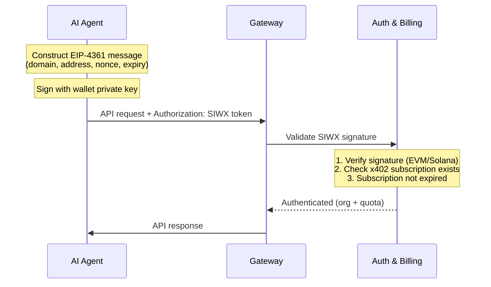

Sign-In with X (SIWX) を使用すると、各 API リクエストでウォレットによるメッセージ署名で ChainStream に認証できます — API Key や OAuth トークンは不要です。[x402 支払い](/jp/docs/platform/billing-payments/x402-payments)でサブスクリプションを購入した**オンチェーンウォレットを持つ AI エージェント**向けに設計されています。

<Info>
SIWX は API Key を置き換えます。`X-API-KEY` を渡す代わりに、各リクエストで `Authorization: SIWX <token>` を渡します。ゲートウェイが署名を検証し、有効な x402 サブスクリプションの存在をリアルタイムでチェックします。
</Info>

## 仕組み

従来のチャレンジ/レスポンスフローとは異なり、SIWX は**ステートレスかつ自己完結型**です。クライアントがメッセージをローカルで構築・署名し、各リクエストに添付します。



### ステップバイステップ

1. ウォレットアドレス、ドメイン、ナンス、有効期限を含む **EIP-4361 メッセージを構築**
2. ウォレットの秘密鍵で**メッセージに署名**
3. **SIWX トークンとしてエンコード**: `base64(message).signature`
4. **各 API リクエストに添付**: `Authorization: SIWX <token>`
5. ゲートウェイが署名を検証し、ウォレットにアクティブな x402 サブスクリプションがあることを確認
6. 有効であれば、リクエストは通常通り処理される（API Key 認証と同様）

## トークンフォーマット

```
Authorization: SIWX base64(message).signature
```

メッセージは EIP-4361 標準に準拠：

```
api.chainstream.io wants you to sign in with your Ethereum account:
0xYourWalletAddress

Sign in to ChainStream API

URI: https://api.chainstream.io
Version: 1
Chain ID: 8453
Nonce: abc123def456
Issued At: 2026-03-26T10:00:00Z
Expiration Time: 2026-03-27T10:00:00Z
```

### 必須フィールド

| フィールド | 説明 |
|---|---|
| Domain | `api.chainstream.io` であること |
| Address | ウォレットアドレス（EVM の `0x...` または Solana の base58） |
| URI | `https://api.chainstream.io` |
| Version | `1` |
| Nonce | ランダム文字列（クライアント生成、リプレイ保護用） |
| Issued At | ISO 8601 タイムスタンプ |
| Expiration Time | ISO 8601 タイムスタンプ（この時刻を過ぎるとトークンは拒否される） |

<Note>
有効期限はクライアントが設定します。数分、数時間、数日間有効なメッセージに署名できます。有効期限が長いほど再署名の頻度が減りますが、短い方がより安全です。
</Note>

## 対応チェーン

| チェーン | アドレス形式 | 署名検証 |
|---|---|---|
| EVM (Base, Ethereum) | `0x` プレフィックス、40 文字の 16 進数 | EIP-191 `personal_sign` リカバリ |
| Solana | Base58 エンコード、32-44 文字 | Ed25519 署名検証 |

## 前提条件

SIWX 認証には、ウォレットアドレスにリンクされた**アクティブな x402 サブスクリプション**が必要です。サブスクリプションがない場合、ゲートウェイはエラーでリクエストを拒否します。

サブスクリプションの取得：

```bash
# CLI 経由（自動）
chainstream login
chainstream token info --chain sol --address So11111111111111111111111111111111111111112
# → 402 でプラン選択をトリガー → x402 支払い → API Key 保存

# または直接 x402 購入
curl https://api.chainstream.io/x402/purchase?plan=nano
# → x402 支払いフローに従う
```

詳細は [x402 支払い](/jp/docs/platform/billing-payments/x402-payments)を参照してください。

## 使用例

### cURL

```bash
# 1. メッセージを構築して署名（お好みのツールを使用）
# 2. メッセージを Base64 エンコードし、署名を付加
TOKEN="base64EncodedMessage.signatureHex"

# 3. 任意の API 呼び出しで使用
curl https://api.chainstream.io/v2/token/sol/So11111111111111111111111111111111111111112 \
  -H "Authorization: SIWX $TOKEN"
```

### SDK

```typescript
import { ChainStreamClient } from "@chainstream-io/sdk";

const cs = new ChainStreamClient({
  auth: {
    type: "siwx",
    address: "0xYourWalletAddress",
    signMessage: async (message: string) => {
      return await wallet.signMessage(message);
    },
  },
});

const token = await cs.token.getToken("So11111111111111111111111111111111111111112", "sol");
```

### CLI

CLI はウォレットでログインすると自動的に SIWX を使用します：

```bash
chainstream login
chainstream token info --chain sol --address So11111111111111111111111111111111111111112
```

## SIWX vs API Key

| | SIWX | API Key |
|---|---|---|
| **ヘッダー** | `Authorization: SIWX <token>` | `X-API-KEY: <key>` |
| **認証情報の管理** | キーの保管不要 — オンデマンドで署名 | キーの保管と保護が必要 |
| **前提条件** | ウォレット + x402 サブスクリプション | Dashboard アカウント |
| **最適な用途** | ウォレットを持つ AI エージェント | アプリケーション、スクリプト、MCP |
| **トークン有効期限** | クライアントが設定（メッセージごと） | Dashboard で設定（または無期限） |

## セキュリティに関する考慮事項

- **ステートレス**: サーバー側のセッションなし。各リクエストが独立して検証されます。
- **有効期限**: クライアントが `Expiration Time` フィールドでトークンの有効期間を制御します。期限切れのトークンは拒否されます。
- **ドメインバインディング**: メッセージにはドメインとして `api.chainstream.io` が含まれます。他のドメインの署名は拒否されます。
- **秘密鍵の非露出**: ウォレットはプレーンテキストメッセージに署名するだけです — 秘密鍵は決して送信されません。
- **サブスクリプションチェック**: 有効な署名があっても、ウォレットにアクティブな x402 サブスクリプションがない場合、リクエストは拒否されます。
