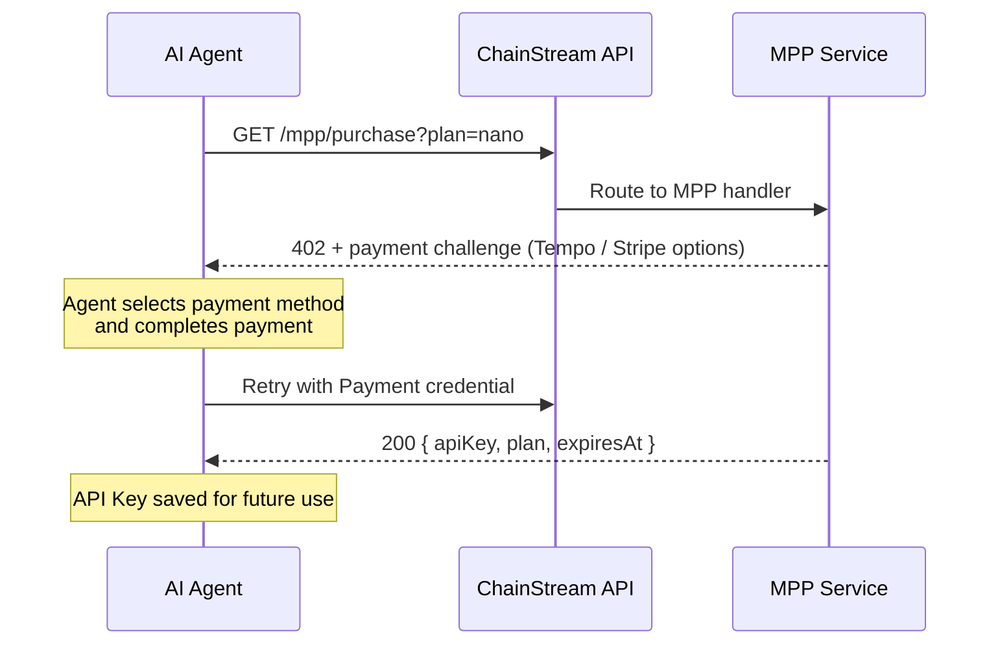

MPP（Machine Payment Protocol）は、AI エージェントと自動化システム向けに設計された支払いプロトコルです。x402 のスーパーセットであり、**Tempo ステーブルコイン決済**と **Stripe カード決済**を単一の統合フローでサポートします。

<Info>
x402 はオンチェーン USDC のみをサポートしますが、MPP は Tempo ネットワークのステーブルコインと従来のカード決済を追加オプションとして提供します。
</Info>

## 仕組み



### 詳細フロー

1. **エージェントが** `GET /mpp/purchase?plan=<plan>` を支払い認証情報なしで呼び出し
2. **MPP サービスが 402 を返却** — `WWW-Authenticate: Payment` チャレンジに金額、通貨、受取先を含む
3. **エージェントが支払いに署名** — Tempo Wallet または Stripe を使用
4. **エージェントが** `Authorization: Payment` 認証情報付きで購入リクエストをリトライ
5. **MPP サービスが支払いを検証**し、サブスクリプションを作成して API Key を返却

## 対応する支払い方法

| 方法 | ネットワーク | 通貨 | ガス手数料 | 最適な用途 |
|--------|---------|----------|---------|----------|
| **Tempo** | Tempo (チェーン ID 4217) | USDC.e (ERC-20) | **無料**（ステーブルコインでガスを支払い） | AI エージェント、ETH 不要 |
| **Stripe** | 従来型 | USD（カード） | N/A | カードアクセスがあるエージェント、暗号資産不要 |

<Tip>
Tempo 決済はネイティブガストークンを必要としません — ガスはステーブルコインで直接支払われます。ステーブルコインのみを保有する AI エージェントに最適です。
</Tip>

## API エンドポイント

| エンドポイント | メソッド | 説明 |
|----------|--------|-------------|
| `/mpp/purchase?plan=<plan>` | GET / POST | MPP 経由でサブスクリプションを購入 |
| `/mpp/pricing` | GET | 利用可能なプランと支払い方法の一覧 |
| `/mpp/health` | GET | ヘルスチェック |

### 料金レスポンス

```bash
curl https://api.chainstream.io/mpp/pricing
```

```json
{
  "plans": [
    { "name": "nano", "priceUsd": 5, "quotaTotal": 500000, "durationDays": 30 },
    { "name": "starter", "priceUsd": 199, "quotaTotal": 10000000, "durationDays": 30 }
  ],
  "currency": "USD",
  "paymentMethods": ["tempo", "stripe"],
  "note": "Prices in USD. Pay via MPP (Tempo stablecoin or Stripe card)."
}
```

### 購入レスポンス（成功時）

```json
{
  "status": "ok",
  "plan": "nano",
  "expiresAt": "2026-04-25T12:00:00.000Z",
  "apiKey": "cs_live_..."
}
```

## CLI での使用

ChainStream CLI は自動購入フロー中に MPP を支払いオプションとしてサポートします：

```bash
chainstream token info --chain sol --address So11111111111111111111111111111111111111112
# → 402 → プラン選択 → "MPP Tempo" を選択 → 支払い → API Key 保存
```

ChainStream ウォレットを持たないエージェントの場合、CLI は Tempo コマンドを表示します：

```bash
tempo request "https://api.chainstream.io/mpp/purchase?plan=nano"
```

## 手動統合（Tempo Wallet）

### セットアップ

Tempo Wallet CLI をインストールしてログイン（ブラウザ経由の一回限りのパスキー認証）：

```bash
curl -fsSL https://tempo.xyz/install | bash
tempo wallet login
```

<Note>
Tempo Wallet はパスキー（WebAuthn）認証を使用します。初回セットアップにはブラウザ操作が必要です。その後はセッションが持続し、エージェント操作はブラウザ操作なしで動作します。
</Note>

### 購入

```bash
# 残高を確認
tempo wallet balance

# プランを購入（402 → 署名 → リトライを自動処理）
tempo request "https://api.chainstream.io/mpp/purchase?plan=nano"
```

Tempo CLI は `WWW-Authenticate: Payment` チャレンジを自動的に処理し、トランザクションに署名し、成功時に API Key を返します。

### 互換ウォレット

Tempo は EVM 互換（チェーン ID 4217）です。Tempo 上で USDC.e を保有する任意のウォレットが使用可能：

- **Tempo Wallet CLI**（`tempo request`） — 推奨、パスキー認証、組み込み MPP サポート
- 任意の EVM ウォレット（MetaMask、Coinbase CDP、Privy） — カスタムネットワークとして Tempo を追加

## MPP vs x402

| | MPP | x402 |
|---|---|---|
| **支払い方法** | Tempo ステーブルコイン + Stripe カード | オンチェーン USDC のみ |
| **ネットワーク** | Tempo (チェーン ID 4217) + Stripe | Base (EVM) + Solana |
| **ガス手数料** | 無料 (Tempo) / N/A (Stripe) | 無料（ファシリテーター） |
| **暗号資産ウォレットが必要** | いいえ（Stripe オプションあり） | はい |
| **購入エンドポイント** | `/mpp/purchase` | `/x402/purchase` |
| **プロトコル** | MPP (HTTP 402) | x402 プロトコル |
| **最適な用途** | 暗号資産ウォレットなしのエージェント | Base/Solana に USDC を持つエージェント |

## 次のステップ

<CardGroup cols={2}>
  <Card title="x402 支払いプロトコル" icon="money-bill-wave" href="/jp/guides/getting-started/x402-payments">
    x402 プロトコルによるオンチェーン USDC 支払い
  </Card>
  <Card title="課金とユニット" icon="receipt" href="/jp/guides/getting-started/billing-and-units">
    CU 消費量とプランの詳細を理解する
  </Card>
</CardGroup>
