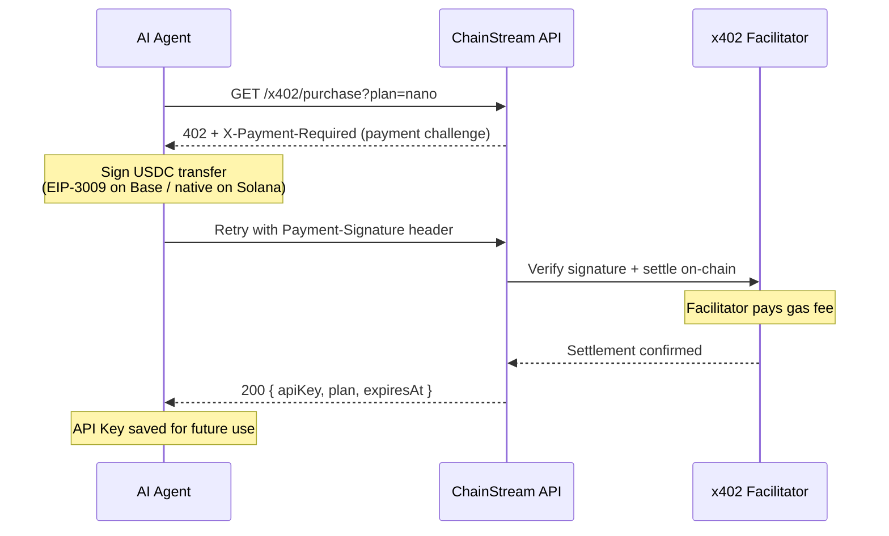

x402 は HTTP 402 Payment Required ステータスコードに基づいて構築された支払いプロトコルです。手動の請求処理、クレジットカード、サブスクリプション管理なしで、マシン間のAPI アクセスに対するマイクロペイメントを実現します。USDC でリクエストごとに支払い、即座に API アクセスが得られます。

## 仕組み



### 詳細フロー

1. **クライアントがリクエストを送信** — API Key なし、または期限切れのキーで ChainStream API にリクエスト。

2. **ゲートウェイが HTTP 402 を返却** — `/x402/purchase` へのポインターを含むメッセージ。

3. **クライアントが `GET /x402/purchase?plan=<plan>` を呼び出し**（支払いヘッダーなし）。サーバーが HTTP 402 を返し、x402 支払い要件を提示：

   | レスポンスヘッダー | 説明 |
   |---|---|
   | `X-Payment-Required` | Base64 エンコードされた支払い詳細の JSON |
   | `Payment-Required` | 同じ値（x402 クライアント互換性のため） |

   デコードされた JSON ボディは x402 v2 プロトコルに準拠：

   ```json
   {
     "x402Version": 2,
     "resource": {
       "url": "/x402/purchase?plan=nano",
       "description": "ChainStream API access: nano plan"
     },
     "accepts": [
       {
         "scheme": "exact",
         "network": "eip155:8453",
         "asset": "0x833589fCD6eDb6E08f4c7C32D4f71b54bdA02913",
         "amount": "5000000",
         "payTo": "0xRecipientAddress",
         "maxTimeoutSeconds": 60
       },
       {
         "scheme": "exact",
         "network": "solana:5eykt4UsFv8P8NJdTREpY1vzqKqZKvdp",
         "asset": "EPjFWdd5AufqSSqeM2qN1xzybapC8G4wEGGkZwyTDt1v",
         "amount": "5000000",
         "payTo": "SolanaRecipientAddress",
         "maxTimeoutSeconds": 60
       }
     ]
   }
   ```

4. **クライアントが USDC 送金に署名** — `@x402` SDK を使用し、支払い証明付きで `GET /x402/purchase?plan=<plan>` をリトライ：

   | リクエストヘッダー | 説明 |
   |---|---|
   | `Payment-Signature` | Base64 エンコードされた署名済み支払いペイロード |

5. **サーバーが支払いを検証・決済**し、サブスクリプション詳細を返却：

   ```json
   {
     "status": "ok",
     "plan": "nano",
     "chain": "evm",
     "address": "0xPayerAddress",
     "expiresAt": "2026-04-25T12:00:00.000Z",
     "txHash": "0xabc123...",
     "apiKey": "cs_live_..."
   }
   ```

   クライアントは今後のすべての API 呼び出しに `apiKey` を保存します。

## CLI 統合

ChainStream CLI は `callWithAutoPayment` を通じて x402 支払いを自動的に処理します。コマンドが 402 に遭遇すると、CLI がプラン選択と支払いをガイドします。

### 自動フロー

CLI が 402 レスポンスに遭遇すると：

1. `/x402/pricing` から利用可能なプランを取得し、選択テーブルを表示
2. プランの選択を促す
3. 支払い方法を選択: **x402**（Base/Solana の USDC）または **MPP**（Tempo の USDC.e）
4. x402 の場合: `@x402/fetch` で支払いに署名・送信し、返された API Key を設定に保存
5. MPP の場合: 手動購入用の `tempo request` コマンドを表示
6. 新しい API Key で元のコマンドをリトライ

```bash
$ chainstream token info --chain sol --address So11111111111111111111111111111111111111112

[chainstream] No active subscription. Available plans:

   #  Plan       Price    Quota           Duration
   ── ────────── ──────── ──────────────── ────────
   1  nano       $5             500,000 CU  30 days
   2  starter    $199        10,000,000 CU  30 days
   3  pro        $699        50,000,000 CU  30 days

Select plan (1-3): 1

[chainstream] Choose payment method:
  1. x402 (USDC on Base/Solana)
  2. MPP Tempo (USDC.e on Tempo)

Select method (1-2): 1

[chainstream] Purchasing nano plan via x402...
[chainstream] Subscription activated: nano (expires: 2026-04-25T12:00:00.000Z)
[chainstream] API Key saved to config.
```

<Note>
API Key のみ（ウォレットなし）の場合、CLI は x402 をスキップし、MPP の手順を表示します。
</Note>

### ウォレットセットアップ

CLI で x402 支払いを行うには、資金が入ったウォレットが必要です：

```bash
# ChainStream TEE ウォレットを作成（推奨）
chainstream login

# または生の秘密鍵をインポート（開発/テスト用のみ）
chainstream wallet set-raw --chain base
```

## 手動統合

カスタム統合の場合、`@x402` パッケージファミリーを使用して x402 フローを実装できます。

### 依存関係

```bash
npm install @x402/core @x402/evm @x402/svm @x402/fetch
```

| パッケージ | 用途 |
|---|---|
| `@x402/core` | プロトコル型定義、ヘッダーパーシング、検証ロジック |
| `@x402/evm` | EVM 支払い実行（viem ベース） |
| `@x402/svm` | Solana 支払い実行（@solana/kit ベース） |
| `@x402/fetch` | 自動 402 ハンドリング付きドロップイン `fetch` ラッパー |

### @x402/fetch の使用（推奨）

最もシンプルな統合方法 — 標準の `fetch` を x402 サポートでラップします：

```typescript
import { createX402Fetch } from "@x402/fetch";
import { createWalletClient, http } from "viem";
import { base } from "viem/chains";
import { privateKeyToAccount } from "viem/accounts";

// 支払い用ウォレットを作成
const account = privateKeyToAccount(process.env.PRIVATE_KEY as `0x${string}`);
const walletClient = createWalletClient({
  account,
  chain: base,
  transport: http(),
});

// x402 対応の fetch を作成
const x402Fetch = createX402Fetch({
  evm: { walletClient },
  autoApprove: true, // プロンプトなしで自動支払い
  maxAmount: "10.00", // リクエストあたりの安全上限
});

// 通常の fetch と同じように使用 — 402 支払いは自動処理
const response = await x402Fetch(
  "https://api.chainstream.io/v1/tokens/analyze",
  {
    method: "POST",
    headers: { "Content-Type": "application/json" },
    body: JSON.stringify({ tokenAddress: "0x1234...abcd", chain: "ethereum" }),
  }
);

const data = await response.json();
console.log(data);
```

### 手動フロー（上級）

支払いフローを完全に制御する場合：

```typescript
import { parsePaymentHeaders, createPaymentProof } from "@x402/core";
import { sendPayment } from "@x402/evm";

// 1. 初期リクエストを送信
const response = await fetch("https://api.chainstream.io/v1/tokens/analyze", {
  method: "POST",
  headers: { "Content-Type": "application/json" },
  body: JSON.stringify({ tokenAddress: "0x1234...abcd" }),
});

if (response.status === 402) {
  // 2. ヘッダーから支払い詳細をパース
  const payment = parsePaymentHeaders(response.headers);
  console.log(`Payment required: ${payment.amount} USDC on ${payment.chain}`);

  // 3. USDC 支払いを送信
  const txHash = await sendPayment({
    walletClient,
    to: payment.address,
    amount: payment.amount,
    token: payment.token,
    memo: payment.memo,
  });

  // 4. 支払い署名付きでリトライ
  const retryResponse = await fetch(
    "https://api.chainstream.io/x402/purchase?plan=nano",
    {
      headers: {
        "Payment-Signature": paymentSignature,
      },
    }
  );

  // 5. レスポンスから API Key を取得
  const result = await retryResponse.json();
  console.log("API key for future use:", result.apiKey);
  console.log("Expires at:", result.expiresAt);
}
```

## 支払い対応チェーン

| チェーン | トークン | 確認時間 |
|---|---|---|
| Base | USDC | 約 2 秒 |
| Solana | USDC | 約 400ms |

## ゼロガス手数料

ChainStream は独自の **x402 ファシリテーター**を運営しており、エージェントに代わってオンチェーン支払いトランザクションを送信します。つまり：

- **ガス手数料なし** — ファシリテーターがすべてのガスコスト（Base ETH / Solana SOL）を負担
- **エージェントウォレットには USDC のみが必要** — ガス用のネイティブトークンの保有は不要
- エージェントは USDC 送金認可に署名するだけ。ファシリテーターがブロードキャストと実行費用を支払う

これにより、AI エージェントにとっての最大の障壁であるネイティブガストークンの取得と管理が不要になります。

## セキュリティに関する考慮事項

- **支払い上限**: `@x402/fetch` を使用する際は、予期しない請求を防ぐため、常に `maxAmount` を設定してください。
- **検証**: ファシリテーターは決済前にオンチェーンで署名済み支払いを検証します。無効な署名は拒否されます。
- **冪等性**: 支払いが決済されたがレスポンスが失敗した場合（ネットワークエラー）、同じ `Payment-Signature` を再送信できます。支払いは一度だけ消費されます。
- **コンプライアンス**: 決済前に支払い者アドレスがスクリーニングされます。制裁対象アドレスは拒否されます。
