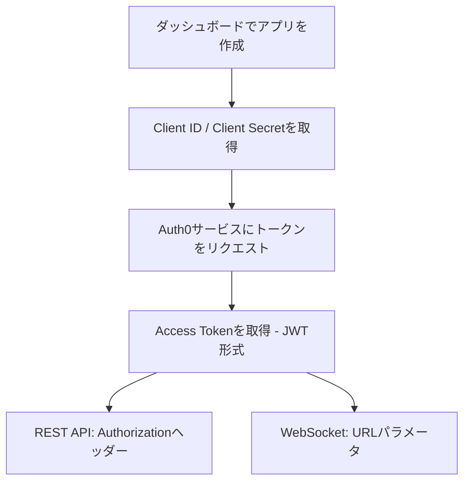

ChainStreamは、APIアクセスを保護するために複数のセキュリティ機構を採用しています。本ドキュメントでは、APIセキュリティのベストプラクティス、一般的な脅威への対策、セキュリティ設定ガイドラインについて説明します。

<Info>
**最終更新:** 2026年2月 | **バージョン:** v2.0
</Info>

---

## 認証セキュリティ

### アクセストークンメカニズム

ChainStreamはOAuth 2.0ベースの認証メカニズムを使用しています。Client IDとClient Secretを使用してJWT Access Tokenを生成し、API認証を行います。

**認証フロー:**



**認証情報の仕様**

| 項目 | 仕様 |
|:--|:--|
| Client ID | アプリケーション固有識別子 |
| Client Secret | 64文字のランダム文字列 |
| Access Token | JWT形式、有効期限とスコープを含む |
| トークン有効期間 | 24時間 |

### アクセストークンの生成

<CodeGroup>
```javascript JavaScript
import { AuthenticationClient } from 'auth0';

const auth0Client = new AuthenticationClient({
  domain: 'dex.asia.auth.chainstream.io',
  clientId: process.env.CHAINSTREAM_CLIENT_ID,
  clientSecret: process.env.CHAINSTREAM_CLIENT_SECRET
});

const { data } = await auth0Client.oauth.clientCredentialsGrant({
  audience: 'https://api.dex.chainstream.io'
});

const accessToken = data.access_token;
```

```python Python
from auth0.authentication import GetToken

get_token = GetToken(
    'dex.asia.auth.chainstream.io',
    os.environ['CHAINSTREAM_CLIENT_ID'],
    client_secret=os.environ['CHAINSTREAM_CLIENT_SECRET']
)

token = get_token.client_credentials(
    audience='https://api.dex.chainstream.io'
)

access_token = token['access_token']
```
</CodeGroup>

### 認証情報のセキュリティ

**保管要件**

<Warning>
Client SecretはChainStreamサービスにアクセスするための重要な認証情報です。漏洩するとサービスの不正利用や金銭的損失につながる可能性があります。
</Warning>

| 保管方法 | セキュリティレベル | 備考 |
|:--|:--|:--|
| 環境変数 | ✅ 推奨 | バージョン管理に含めない |
| シークレット管理サービス | ✅ 最適 | AWS Secrets Manager、HashiCorp Vaultなど |
| 設定ファイル | ⚠️ 注意 | 必ず.gitignoreに追加 |
| ハードコード | ❌ 禁止 | 漏洩リスクが高い |

### コード例

<CodeGroup>
```javascript JavaScript
// ❌ 危険: 認証情報のハードコード
const clientId = "your_client_id";
const clientSecret = "your_secret";

// ❌ 危険: バージョン管理にコミット
// config.json: { "client_id": "...", "client_secret": "..." }

// ✅ 安全: 環境変数を使用
const clientId = process.env.CHAINSTREAM_CLIENT_ID;
const clientSecret = process.env.CHAINSTREAM_CLIENT_SECRET;

// ✅ 安全: シークレット管理サービスを使用
const credentials = await secretsManager.getSecret('chainstream-credentials');
```

```python Python
import os

# ❌ 危険: ハードコード
client_id = "your_client_id"
client_secret = "your_secret"

# ✅ 安全: 環境変数を使用
client_id = os.environ.get('CHAINSTREAM_CLIENT_ID')
client_secret = os.environ.get('CHAINSTREAM_CLIENT_SECRET')

# ✅ 安全: シークレット管理サービスを使用（AWS Secrets Managerの例）
import boto3
client = boto3.client('secretsmanager')
credentials = client.get_secret_value(SecretId='chainstream-credentials')['SecretString']
```

```go Go
// ❌ 危険: ハードコード
clientID := "your_client_id"
clientSecret := "your_secret"

// ✅ 安全: 環境変数を使用
clientID := os.Getenv("CHAINSTREAM_CLIENT_ID")
clientSecret := os.Getenv("CHAINSTREAM_CLIENT_SECRET")
```
</CodeGroup>

### マルチアプリ管理

異なる環境やサービスごとに個別のアプリを作成することを推奨します：

| 用途 | 推奨アプリ名 | 説明 |
|:--|:--|:--|
| 本番環境 | `prod-main` | 本番ワークロード |
| テスト | `test-dev` | 開発・テスト |
| CI/CD | `ci-pipeline` | 自動テスト |
| 監視 | `monitoring` | モニタリングとアラート |

---

## 通信セキュリティ

### TLS要件

| 項目 | 要件 |
|:--|:--|
| 最低バージョン | TLS 1.2 |
| 推奨バージョン | TLS 1.3 |
| 証明書検証 | 有効にする必要あり |
| 非対応 | HTTP、TLS 1.0/1.1 |

### 証明書検証

<Warning>
本番環境では証明書検証を絶対にスキップしないでください。中間者攻撃のリスクにさらされます。
</Warning>

<CodeGroup>
```javascript JavaScript
// ❌ 危険: 証明書検証のスキップ
process.env.NODE_TLS_REJECT_UNAUTHORIZED = '0';

// ✅ 安全: 通常の証明書検証（デフォルト動作）
const response = await fetch('https://api.chainstream.io/v1/...');
```

```python Python
import requests

# ❌ 危険: 証明書検証のスキップ
requests.get(url, verify=False)

# ✅ 安全: 通常の証明書検証（デフォルト動作）
requests.get(url)
```

```bash cURL
# ❌ 危険: 証明書検証のスキップ
curl -k https://api.chainstream.io/v1/...

# ✅ 安全: 通常の証明書検証（デフォルト動作）
curl https://api.chainstream.io/v1/...
```
</CodeGroup>

---

## Webhookセキュリティ

Webhookメッセージは署名メカニズムを使用して、メッセージの送信元の信頼性を確保します。

### 署名検証

Webhookメッセージを受信したら、Webhook Secretを使用して署名を検証し、メッセージがChainStreamからのものであり、改ざんされていないことを確認する必要があります。

| 項目 | 説明 |
|:--|:--|
| アルゴリズム | HMAC-SHA256 |
| キー | Webhook Secret（ダッシュボードで設定） |
| 署名ヘッダー | `X-Webhook-Signature` |

### 検証例

<CodeGroup>
```javascript JavaScript
const crypto = require('crypto');

function verifyWebhookSignature(payload, signature, secret) {
  const expectedSignature = crypto
    .createHmac('sha256', secret)
    .update(JSON.stringify(payload))
    .digest('hex');
  
  return crypto.timingSafeEqual(
    Buffer.from(signature),
    Buffer.from(expectedSignature)
  );
}

// Expressミドルウェアの例
app.post('/webhook', (req, res) => {
  const signature = req.headers['x-webhook-signature'];
  const isValid = verifyWebhookSignature(
    req.body,
    signature,
    process.env.WEBHOOK_SECRET
  );
  
  if (!isValid) {
    return res.status(401).send('Invalid signature');
  }
  
  // Webhookメッセージを処理
  console.log('Received webhook:', req.body);
  res.status(200).send('OK');
});
```

```python Python
import hmac
import hashlib
import json

def verify_webhook_signature(payload, signature, secret):
    expected_signature = hmac.new(
        secret.encode(),
        json.dumps(payload).encode(),
        hashlib.sha256
    ).hexdigest()
    
    return hmac.compare_digest(signature, expected_signature)

# Flaskの例
@app.route('/webhook', methods=['POST'])
def webhook():
    signature = request.headers.get('X-Webhook-Signature')
    is_valid = verify_webhook_signature(
        request.json,
        signature,
        os.environ['WEBHOOK_SECRET']
    )
    
    if not is_valid:
        return 'Invalid signature', 401
    
    # Webhookメッセージを処理
    print('Received webhook:', request.json)
    return 'OK', 200
```
</CodeGroup>

### Webhook Secretのローテーション

Webhook Secretをローテーションするには：

<Steps>
  <Step title="新しいSecretを生成">
    ダッシュボード → Webhooks → エンドポイントを選択 → Secretをローテーション
  </Step>
  <Step title="アプリケーション設定を更新">
    アプリケーションで新しいWebhook Secretに更新
  </Step>
  <Step title="署名を検証">
    新しいSecretで署名が正しく検証されることを確認
  </Step>
</Steps>

---

## 使用状況の監視

### メトリクスダッシュボード

ダッシュボードのメトリクスパネルで、APIおよびWebSocketの呼び出し統計を確認できます：

| メトリクス | 説明 |
|:--|:--|
| リクエストIP | 送信元IPアドレス |
| User Agent | クライアント識別子 |
| ステータスコード | HTTPステータスコード |
| レイテンシー | リクエストの応答時間 |
| 消費ユニット | このリクエストで消費された使用量ユニット |
| 累計使用量 | 累計消費使用量 |

### チャートデータ

メトリクスパネルでは、複数の時間軸でチャートを提供します：

- **時間単位** — 過去24時間の呼び出しトレンドを確認
- **日単位** — 過去30日間の呼び出しトレンドを確認
- **月単位** — 過去の月次統計を確認

**確認パス:** ダッシュボード → メトリクス

---

## セキュリティモニタリング

<Note>
🚧 **近日公開** — セキュリティモニタリング機能は開発中で、間もなく利用可能になります。
</Note>

利用可能になると、以下をサポートします：

- **異常検知** — 認証失敗の急増、異常な地域からのアクセスなどを自動検知
- **アラート通知** — メールおよびWebhookアラート
- **自動保護** — 一時的なブロック、レート制限など

---

## IPホワイトリスト

<Note>
🚧 **近日公開** — IPホワイトリスト機能は開発中で、間もなく利用可能になります。
</Note>

利用可能になると、以下をサポートします：

- 単一IPの設定（例: `203.0.113.50`）
- IP範囲の設定（例: `203.0.113.0/24`）
- 複数IP（カンマ区切り）

---

## 一般的な攻撃への対策

### 中間者攻撃

**攻撃手法:** 攻撃者がクライアントとサーバー間の通信を傍受する。

**対策:**

| 対策 | 説明 |
|:--|:--|
| HTTPS強制 | TLS 1.2以上のみサポート |
| 証明書検証 | 証明書の検証を有効にする必要あり |
| HSTS | HTTPS接続を強制 |

### インジェクション攻撃

**攻撃手法:** 攻撃者が悪意のある入力データを使用して不正な操作を試みる。

**対策:**

| 対策 | 説明 |
|:--|:--|
| 入力バリデーション | 厳格なパラメータ型チェック |
| パラメータ化クエリ | SQL/NoSQLインジェクションの防止 |
| 出力エンコーディング | XSSの防止 |

### 認証情報漏洩時の対応

Client Secretが漏洩した疑いがある場合は、直ちに以下の手順を実行してください：

<Steps>
  <Step title="アプリを即座に削除">
    ダッシュボード → アプリ → 対象アプリを選択 → 削除
  </Step>
  <Step title="新しいアプリを作成">
    ダッシュボード → アプリ → 新しいアプリを作成
  </Step>
  <Step title="アプリケーション設定を更新">
    古い認証情報を使用しているすべてのアプリケーションで、新しいClient IDとSecretに更新
  </Step>
  <Step title="メトリクスを確認">
    ダッシュボード → メトリクス → 異常な呼び出しがないかチェック
  </Step>
  <Step title="セキュリティプラクティスを見直す">
    漏洩原因を調査し、セキュリティ対策を改善
  </Step>
</Steps>

---

## セキュリティエラーコード

### 認証関連

| エラーコード | HTTPステータス | 説明 |
|:--|:--|:--|
| `UNAUTHORIZED` | 401 | 認証情報が提供されていない |
| `EXPIRED_TOKEN` | 401 | Access Tokenが期限切れ |
| `INVALID_TOKEN` | 401 | Access Tokenが無効 |
| `INVALID_CREDENTIALS` | 401 | Client IDまたはSecretが不正 |

### アクセス制御関連

| エラーコード | HTTPステータス | 説明 |
|:--|:--|:--|
| `FORBIDDEN` | 403 | 権限がないまたはクォータ超過 |
| `RATE_LIMITED` | 429 | リクエストレート超過 |
| `INSUFFICIENT_SCOPE` | 403 | トークンの権限が不足 |

### Webhook関連

| エラーコード | 説明 |
|:--|:--|
| `INVALID_SIGNATURE` | Webhook署名検証に失敗 |
| `MISSING_SIGNATURE` | 署名ヘッダーがない |

### エラーレスポンス例

```json
{
  "error": {
    "code": "EXPIRED_TOKEN",
    "message": "Access token has expired",
    "details": {
      "expired_at": "2024-01-15T10:30:00Z"
    }
  }
}
```

---

## セキュリティ設定チェックリスト

### 基本設定（必須）

- [ ] APIアクセスにHTTPSを使用
- [ ] Client IDとClient Secretを環境変数またはシークレット管理サービスに保管
- [ ] 認証情報をコードリポジトリにコミットしない
- [ ] 本番環境/テスト環境で異なるアプリを使用
- [ ] Webhook署名を適切に検証

### 上級設定（推奨）

- [ ] シークレット管理サービスの統合（AWS Secrets Manager / HashiCorp Vault）
- [ ] メトリクスダッシュボードで呼び出し統計を定期的に確認
- [ ] 異なるサービスごとに個別のアプリを作成

### エンタープライズ設定（任意）

- [ ] SIEMシステムと統合してログ分析
- [ ] セキュリティインシデント対応プロセスの確立

---

## FAQ

<AccordionGroup>
  <Accordion title="Client Secretが漏洩した場合はどうすればよいですか？">
    直ちにダッシュボードにログインしてそのアプリを削除し、新しいアプリを作成して、すべてのアプリケーション設定を更新してください。[認証情報漏洩時の対応](#認証情報漏洩時の対応)を参照してください。
  </Accordion>

  <Accordion title="Access Tokenが期限切れになった場合は？">
    Access Tokenの有効期間は24時間です。推奨事項：
    
    1. **トークンのキャッシュ** — 有効期間内は同じトークンを再利用
    2. **早めの更新** — 期限切れの約1時間前にトークンを更新
    3. **エラーリトライ** — 401エラーを受信したら自動的に新しいトークンを取得
  </Accordion>

  <Accordion title="API呼び出し統計はどこで確認できますか？">
    ダッシュボード → メトリクスにログインすると、リクエストIP、ステータスコード、レイテンシー、消費ユニット、時間軸チャートを確認できます。
  </Accordion>

  <Accordion title="Webhook署名検証の失敗をトラブルシューティングするには？">
    一般的な原因：
    
    1. **Secretの不一致** — 正しいWebhook Secretを使用しているか確認
    2. **ペイロード処理エラー** — 署名計算に元のJSON文字列を使用しているか確認
    3. **署名ヘッダーの欠落** — リクエストヘッダーに`X-Webhook-Signature`が含まれているか確認
  </Accordion>

  <Accordion title="複数のアプリを作成できますか？">
    はい。異なる環境（本番/テスト）や異なるサービスごとに個別のアプリを作成することを推奨します。管理やトラブルシューティングが容易になります。
  </Accordion>
</AccordionGroup>

---

## 関連ドキュメント

<CardGroup cols={2}>
  <Card title="認証" icon="key" href="/jp/guides/getting-started/authentication">
    認証と認証情報の管理
  </Card>
  <Card title="データプライバシー" icon="shield" href="/jp/guides/data-concepts/data-privacy">
    データプライバシーポリシー
  </Card>
  <Card title="エラーコード" icon="circle-exclamation" href="/jp/guides/resources/error-codes">
    完全なエラーコード一覧
  </Card>
  <Card title="Webhookの基礎" icon="webhook" href="/jp/playbooks/frameworks/webhook-fundamentals">
    Webhookの設定と使用方法
  </Card>
</CardGroup>
