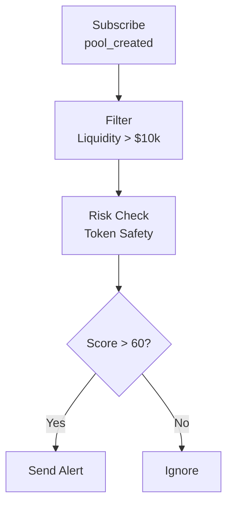

<Info>
ChainStreamは現在、**Solana**（`sol`）、**Ethereum**（`eth`）、**BSC**（`bsc`）をサポートしています。対応DEXは Jupiter、Raydium、PumpFun、Moonshot、Candy（Solana）、KyberSwap（Ethereum/BSC）です。以下の一部の例は概念的な説明のために追加のプロトコルを参照しています。現在のカバレッジは[対応チェーン](/jp/docs/supported-chains)をご確認ください。
</Info>

<Warning>
**Coming Soon** - この機能は現在開発中です。お楽しみに！
</Warning>

本ドキュメントでは、ChainStreamを使用してDeFiプロトコルのアクティビティを監視する方法を紹介します。流動性の変化、大口取引、利回り追跡、リスクアラートを含みます。

---

## 対応DeFiプロトコル

### DEX（分散型取引所）

| プロトコル | チェーン | 対応機能 |
|----------|--------|-------------------|
| **Jupiter** | Solana | アグリゲート取引 |
| **Raydium** | Solana | 取引、LP、プールデータ |
| **PumpFun** | Solana | ローンチ/ボンディング、取引 |
| **Moonshot** | Solana | 取引 |
| **Candy** | Solana | 取引 |
| **KyberSwap** | Ethereum, BSC | 取引、クオート |

### その他のDeFi分野

レンディング、イールドアグリゲーター、リキッドステーキングは一般的なDeFiモニタリング対象です。ChainStreamのインデックスされたスワップおよびDEX分析は、**Solana**、**Ethereum**、**BSC**上の上記プロトコルに焦点を当てています。レンディングやVault固有のアラートを構築する前に、APIリファレンスと[対応チェーン](/jp/docs/supported-chains)でデプロイメントが公開している内容を確認してください。

---

## モニタリング次元

### 1. 流動性モニタリング

#### 監視イベント

| イベント | 説明 | 重要性 |
|-------|-------------|------------|
| `pool_created` | 新規プール作成 | 新たな機会の発見 |
| `liquidity_add` | 流動性追加 | 信頼性の指標 |
| `liquidity_remove` | 流動性削除 | ⚠️ ラグプル警告 |
| `pool_update` | プールパラメータ変更 | プロトコルガバナンス |

#### 主要指標

| 指標 | 説明 | 健全性基準 |
|--------|-------------|------------------|
| TVL | 総ロック価値 | 安定的または成長 |
| TVL変動率 | 24h/7d TVL変化 | &gt; -10%/日 |
| LPホルダー数 | LPトークンホルダー分布 | 分散しているほど良い |
| 流動性深度 | ±2%価格帯内の流動性 | 深いほど良い |

#### ラグプルリスクシグナル

<Tabs>
  <Tab title="🔴 高リスク">
    - 単一引き出し &gt; プールの30%
    - 24h累積引き出し &gt; 50%
    - LPが少数アドレスに集中（&lt; 5）
  </Tab>
  <Tab title="🟡 中リスク">
    - 単一引き出し &gt; プールの10%
    - LPロック期限が間近
    - プロジェクトチームアドレスが引き出し開始
  </Tab>
  <Tab title="🟢 低リスク">
    - LPが広く分布
    - LPロック期間 &gt; 6ヶ月
    - TVLが安定成長
  </Tab>
</Tabs>

---

### 2. 取引モニタリング

#### リアルタイム取引フロー

WebSocket経由でリアルタイム取引を購読：

| イベントタイプ | 説明 | データフィールド |
|------------|-------------|-------------|
| `swap` | DEX取引 | token_in, token_out, amount, price |
| `large_trade` | 大口取引 | threshold, trade_details |
| `arbitrage` | アービトラージ取引 | profit, path |
| `mev` | MEV関連取引 | type, extracted_value |

```typescript
// DEX取引フローを購読
ws.subscribe('defi_trades', {
  protocol: 'kyberswap',
  chain: 'eth',
  min_amount_usd: 10000
}, (trade) => {
  console.log(`${trade.type}: ${trade.token_in} → ${trade.token_out}`);
});
```

#### 取引分析の次元

| 分析次元 | 指標 | 意味 |
|--------------------|---------|----|
| 買い/売り圧力 | 買い出来高/売り出来高比率 | &gt; 1 は強気 |
| 出来高トレンド | 出来高移動平均 | 活性度 |
| クジラ行動 | 大口取引の割合 | 市場への影響 |
| ペアの人気度 | 取引頻度ランキング | 市場の注目度 |

---

### 3. 利回り追跡

#### 追跡内容

| 利回りタイプ | 説明 | 計算方法 |
|------------|-------------|-------------------|
| **LPマイニング** | 流動性提供による取引手数料 | 手数料 × シェア割合 |
| **レンディング利息** | 預入/借入利息 | 元本 × APY |
| **ステーキング報酬** | プロトコルトークン報酬 | ステーキング量 × 報酬率 |
| **エアドロップ利回り** | プロトコルエアドロップ | スナップショット保有量 |

#### 利回り指標

| 指標 | 説明 | 注記 |
|--------|-------------|-------|
| **APY** | 年間複利利回り | 実質利回りの参考 |
| **APR** | 年間単利利回り | 基本利回り |
| **インパーマネントロス** | 単純保有と比較したLP損失 | 重要なリスク要因 |
| **純利回り** | 利回り - ガス代 - インパーマネントロス | 最終利回り |

#### インパーマネントロスの推定

<Info>
**インパーマネントロスの計算式**

```
インパーマネントロス = 2 × √(価格比率) / (1 + 価格比率) - 1
```
</Info>

| 価格変動 | インパーマネントロス |
|--------------|------------------|
| ±10% | -0.11% |
| ±25% | -0.64% |
| ±50% | -2.02% |
| ±100% | -5.72% |
| ±200% | -13.4% |

---

### 4. リスクアラート

#### プロトコルレベルのリスク

| リスクタイプ | 説明 | アラートトリガー |
|-----------|-------------|---------------|
| **大口引き出し** | 大幅な流動性の減少 | 単一 &gt; プールの5% |
| **TVL急落** | プロトコルTVLの急速な低下 | 1hで &gt; 20%低下 |
| **フラッシュローン攻撃** | フラッシュローンパターン検出 | 自動検出 |
| **ガバナンス攻撃** | 異常な提案や投票 | 自動検出 |
| **オラクル異常** | 異常な価格データ | 乖離 &gt; 5% |

#### ポジションレベルのリスク

| リスクタイプ | 説明 | アラートトリガー |
|-----------|-------------|---------------|
| **清算リスク** | レンディングポジションが清算に近い | ヘルスファクター &lt; 1.2 |
| **インパーマネントロス** | LPのインパーマネントロス拡大 | 損失 &gt; 5% |
| **利回り低下** | APYの大幅低下 | 低下 &gt; 50% |

#### アラート設定例

```json
{
  "alert_type": "liquidity_remove",
  "protocol": "kyberswap",
  "pool": "0x...",
  "threshold": {
    "type": "percentage",
    "value": 10
  },
  "notification": {
    "webhook": "https://your-server.com/webhook",
    "email": "alert@example.com"
  }
}
```

---

## モニタリングシナリオ

### シナリオ1：新規プール発見

**目標**：新しく作成されたトレーディングプールをできるだけ早く発見する



```typescript
ws.subscribe('pool_created', {
  chain: 'sol',
  min_liquidity_usd: 10000
}, async (pool) => {
  // トークンの安全性を確認
  const risk = await checkTokenRisk(pool.token_address);
  if (risk.score > 60) {
    notify(`新規プール発見: ${pool.pair_name}, 流動性: $${pool.liquidity_usd}`);
  }
});
```

### シナリオ2：ラグプル警告

**目標**：保有するプールのラグプルリスクを監視する

<Steps>
  <Step title="モニタリング追加">
    対象プールをモニタリングリストに追加
  </Step>
  <Step title="閾値設定">
    引き出し閾値を設定（例：単一 &gt; 10%）
  </Step>
  <Step title="アラート受信">
    リアルタイムでアラートを受信
  </Step>
  <Step title="ポジション調整">
    速やかにポジションを調整
  </Step>
</Steps>

```typescript
ws.subscribe('liquidity_remove', {
  pool: '0x...',
  threshold_percentage: 10
}, (event) => {
  alert(`⚠️ ラグプル警告: ${event.percentage}%の流動性が削除されました`);
});
```

### シナリオ3：アービトラージ機会の発見

**目標**：DEX間の価格差を発見する

<Steps>
  <Step title="価格フィード購読">
    複数のDEXの価格フィードを購読
  </Step>
  <Step title="スプレッド計算">
    スプレッド率を計算
  </Step>
  <Step title="コスト評価">
    ガス代とスリッページコストを考慮
  </Step>
  <Step title="アラート送信">
    純利益 &gt; 閾値のときアラート
  </Step>
</Steps>

```typescript
// 複数DEXの価格を監視
const prices = {};

ws.subscribe('token_price', { 
  token: 'SOL',
  dex: ['jupiter', 'raydium', 'pumpfun']
}, (data) => {
  prices[data.dex] = data.price;
  checkArbitrage(prices);
});

function checkArbitrage(prices) {
  const maxPrice = Math.max(...Object.values(prices));
  const minPrice = Math.min(...Object.values(prices));
  const spread = (maxPrice - minPrice) / minPrice;
  
  if (spread > 0.005) {  // 0.5%のスプレッド
    notify(`アービトラージ機会: ${spread * 100}%のスプレッド`);
  }
}
```

### シナリオ4：清算モニタリング

**目標**：レンディングポジションのヘルスを監視する

<Steps>
  <Step title="ポジション取得">
    対象アドレスのレンディングポジションを取得
  </Step>
  <Step title="ヘルスファクター計算">
    リアルタイムのヘルスファクターを計算
  </Step>
  <Step title="警告">
    ヘルスファクター &lt; 1.5のとき警告
  </Step>
  <Step title="緊急アラート">
    ヘルスファクター &lt; 1.2のとき緊急アラート
  </Step>
</Steps>

```typescript
async function monitorLiquidationRisk(address: string) {
  // デプロイメントが公開しているレンディングAPIに接続（DEX固有ではない）
  const position = await getLendingPosition(address);

  if (position.health_factor < 1.2) {
    urgentAlert(`🚨 清算リスク！ヘルスファクター: ${position.health_factor}`);
  } else if (position.health_factor < 1.5) {
    warnAlert(`⚠️ 低ヘルスファクター: ${position.health_factor}`);
  }
}
```

---

## データレイテンシー

| データタイプ | レイテンシー | 説明 |
|-----------|---------|-------------|
| リアルタイム取引 | &lt; 3秒 | ブロック確認後にプッシュ |
| TVLデータ | &lt; 1分 | 分単位で更新 |
| APYデータ | &lt; 5分 | 直近の取引から計算 |
| ホルダーデータ | &lt; 1時間 | 時間ごとのスナップショット |

---

## APIエンドポイント

| 機能 | エンドポイント |
|----------|----------|
| プロトコルTVL取得 | `GET /v1/defi/{protocol}/tvl` |
| プール情報取得 | `GET /v1/defi/{protocol}/pools/{pool_id}` |
| ユーザーポジション取得 | `GET /v1/defi/{protocol}/positions/{address}` |
| 利回りデータ取得 | `GET /v1/defi/{protocol}/yields` |

---

## 関連ドキュメント

<CardGroup cols={2}>
  <Card title="アービトラージスキャナー" icon="magnifying-glass-dollar" href="/jp/docs/tutorials/build-arbitrage-scanner">
    アービトラージスキャニングツールの構築
  </Card>
  <Card title="価格アラートBot" icon="bell" href="/jp/docs/tutorials/build-price-alert-bot">
    価格アラートシステムの構築
  </Card>
</CardGroup>
