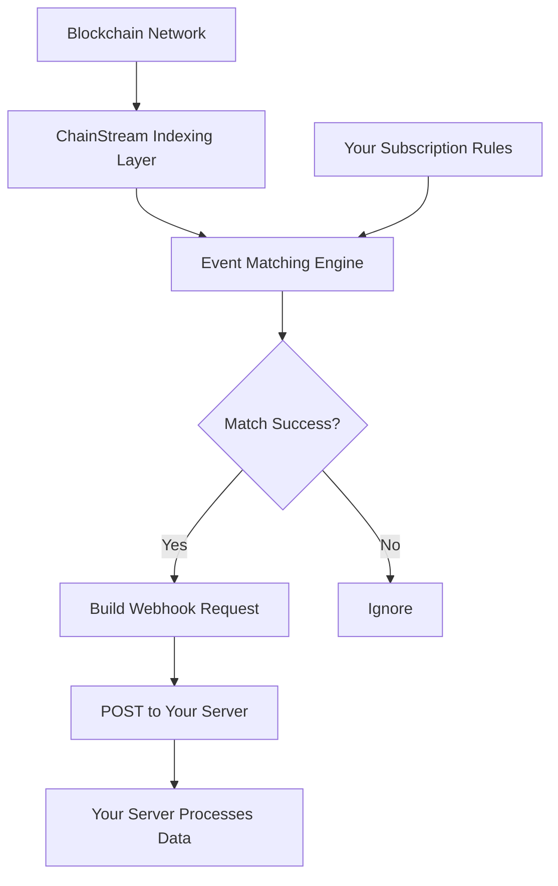
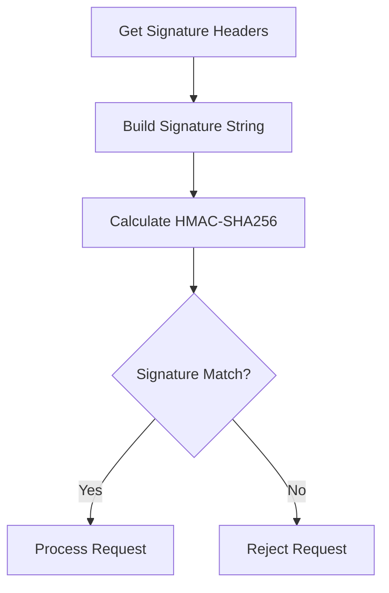

<Warning>
**Beta** — この機能は現在ベータ版です。APIは変更される場合があります。
</Warning>

本ドキュメントでは、ChainStream Webhookの動作原理、設定方法、ベストプラクティスを紹介し、リアルタイムのオンチェーンイベント配信の実装を支援します。

<Note>
Webhook機能はすべてのユーザーが利用可能です。
</Note>

---

## 動作原理

### データフロー



### コア機能

| 機能 | 説明 |
|---------|-------------|
| **リアルタイム配信** | イベント発生後ミリ秒単位で配信 |
| **信頼性の高い配信** | 失敗時に自動リトライ |
| **署名検証** | HMAC署名による偽造防止 |
| **フィルタールール** | イベントタイプフィルタリングをサポート |

---

## 対応イベントタイプ

Webhookは現在、以下のイベントタイプ（チャネル）をサポートしています：

| チャネル | 説明 | 一般的な用途 |
|---------|-------------|-------------|
| `sol.token.created` | Solana新規トークン作成 | 新規トークン発見、初期の機会 |
| `sol.token.migrated` | Solanaトークン卒業/マイグレーション | Pump.funなどのプラットフォームからの卒業トークンの追跡 |

<Info>
追加のイベントタイプは開発中です。お楽しみに！
</Info>

---

## Webhookエンドポイントの作成

### APIエンドポイント

```bash
POST /v1/webhook/endpoint
Content-Type: application/json
Authorization: Bearer YOUR_ACCESS_TOKEN
```

### リクエストパラメータ

| パラメータ | 型 | 必須 | 説明 |
|-----------|------|----------|-------------|
| `url` | string | はい | Webhookコールバック URL（HTTPSが必須） |
| `channels` | array | はい | 購読するイベントタイプのリスト |
| `description` | string | いいえ | エンドポイントの説明 |
| `disabled` | boolean | いいえ | 無効かどうか、デフォルトはfalse |
| `filterTypes` | array | いいえ | フィルタータイプ |
| `metadata` | object | いいえ | カスタムメタデータ |
| `rateLimit` | integer | いいえ | レート制限 |

### リクエスト例

```json
{
  "url": "https://your-server.com/webhook",
  "channels": ["sol.token.created", "sol.token.migrated"],
  "description": "Monitor new tokens and graduated tokens"
}
```

### レスポンス例

```json
{
  "id": "ep_abc123",
  "url": "https://your-server.com/webhook",
  "channels": ["sol.token.created", "sol.token.migrated"],
  "description": "Monitor new tokens and graduated tokens",
  "disabled": false
}
```

---

## Webhook通知フォーマット

Webhook通知のデータ構造はWebSocketプッシュと一貫しています。

### 新規トークン作成（sol.token.created）

```json
{
  "channel": "sol.token.created",
  "timestamp": 1706947200000,
  "data": {
    "a": "6p6xgHyF7AeE6TZkSmFsko444wqoP15icUSqi2jfGiPN",
    "n": "Example Token",
    "s": "EXT",
    "dec": 9,
    "cts": 1706947200000,
    "lf": {
      "pa": "6EF8rrecthR5Dkzon8Nwu78hRvfCKubJ14M5uBEwF6P",
      "pf": "pump_fun",
      "pn": "Pump.fun"
    }
  }
}
```

**フィールド説明**：

| フィールド | 説明 |
|-------|-------------|
| `a` | トークンアドレス |
| `n` | トークン名 |
| `s` | トークンシンボル |
| `dec` | 小数点桁数 |
| `cts` | 作成タイムスタンプ（ミリ秒） |
| `lf.pa` | ローンチプラットフォームプログラムアドレス |
| `lf.pf` | プロトコルファミリー |
| `lf.pn` | プロトコル名 |

### トークン卒業（sol.token.migrated）

```json
{
  "channel": "sol.token.migrated",
  "timestamp": 1706947200000,
  "data": {
    "a": "6p6xgHyF7AeE6TZkSmFsko444wqoP15icUSqi2jfGiPN",
    "n": "Example Token",
    "s": "EXT",
    "cts": 1706947200000,
    "lf": {
      "pa": "6EF8rrecthR5Dkzon8Nwu78hRvfCKubJ14M5uBEwF6P",
      "pf": "pump_fun",
      "pn": "Pump.fun"
    },
    "mt": {
      "pa": "675kPX9MHTjS2zt1qfr1NYHuzeLXfQM9H24wFSUt1Mp8",
      "pf": "raydium",
      "pn": "Raydium"
    }
  }
}
```

**追加フィールド**：

| フィールド | 説明 |
|-------|-------------|
| `mt.pa` | マイグレーション先プラットフォームプログラムアドレス |
| `mt.pf` | マイグレーション先プロトコルファミリー |
| `mt.pn` | マイグレーション先プロトコル名 |

---

## Webhook URLの要件

| 要件 | 説明 |
|-------------|-------------|
| ✅ HTTPS | HTTPSプロトコルの使用が必須 |
| ✅ 公開アクセス可能 | URLはパブリックインターネットからアクセス可能であること |
| ✅ 2xxレスポンス | 成功時に2xxステータスコードを返すこと |
| ✅ レスポンス時間 | 5秒以内にレスポンスすること |
| ✅ 冪等処理 | 重複リクエストを処理できること |

---

## セキュリティ検証

### Webhookシークレットの取得

エンドポイント作成後、このAPIでシークレットを取得：

```bash
GET /v1/webhook/endpoint/{id}/secret
```

**レスポンス**：

```json
{
  "secret": "whsec_abcdXXX"
}
```

### 署名検証

各Webhookリクエストには、リクエスト元を検証するための署名ヘッダーが含まれています：

```
X-Webhook-Signature: <signature>
X-Webhook-Timestamp: <timestamp>
```

### 検証フロー



### コード例

<Tabs>
  <Tab title="Node.js">
```javascript
const crypto = require('crypto');

function verifyWebhook(req, secret) {
  const signature = req.headers['x-webhook-signature'];
  const timestamp = req.headers['x-webhook-timestamp'];
  const body = JSON.stringify(req.body);
  
  // タイムスタンプの確認（5分間のウィンドウ）
  const now = Date.now();
  if (Math.abs(now - parseInt(timestamp)) > 300000) {
    return false;
  }
  
  // 署名の計算
  const message = `${timestamp}.${body}`;
  const expectedSignature = crypto
    .createHmac('sha256', secret)
    .update(message)
    .digest('hex');
  
  // 安全な比較
  return crypto.timingSafeEqual(
    Buffer.from(signature),
    Buffer.from(expectedSignature)
  );
}
```
  </Tab>
  <Tab title="Python">
```python
import hmac
import hashlib
import time

def verify_webhook(request, secret):
    signature = request.headers.get('X-Webhook-Signature')
    timestamp = request.headers.get('X-Webhook-Timestamp')
    body = request.get_data(as_text=True)
    
    # タイムスタンプの確認（5分間のウィンドウ）
    now = int(time.time() * 1000)
    if abs(now - int(timestamp)) > 300000:
        return False
    
    # 署名の計算
    message = f"{timestamp}.{body}"
    expected_signature = hmac.new(
        secret.encode(),
        message.encode(),
        hashlib.sha256
    ).hexdigest()
    
    # 安全な比較
    return hmac.compare_digest(signature, expected_signature)
```
  </Tab>
  <Tab title="Go">
```go
import (
    "crypto/hmac"
    "crypto/sha256"
    "encoding/hex"
    "strconv"
    "time"
)

func verifyWebhook(signature, timestamp, body, secret string) bool {
    // タイムスタンプの確認
    ts, _ := strconv.ParseInt(timestamp, 10, 64)
    now := time.Now().UnixMilli()
    if abs(now-ts) > 300000 {
        return false
    }
    
    // 署名の計算
    message := timestamp + "." + body
    mac := hmac.New(sha256.New, []byte(secret))
    mac.Write([]byte(message))
    expected := hex.EncodeToString(mac.Sum(nil))
    
    return hmac.Equal([]byte(signature), []byte(expected))
}
```
  </Tab>
</Tabs>

---

## Webhookエンドポイントの管理

### エンドポイント一覧

```bash
GET /v1/webhook/endpoint
```

**クエリパラメータ**：

| パラメータ | 型 | 説明 |
|-----------|------|-------------|
| `limit` | integer | 1ページあたりの件数（1-100、デフォルト100） |
| `iterator` | string | ページネーションイテレータ |
| `order` | string | ソート順（昇順/降順） |

### エンドポイント詳細取得

```bash
GET /v1/webhook/endpoint/{id}
```

### エンドポイント更新

```bash
PATCH /v1/webhook/endpoint
```

```json
{
  "endpointId": "ep_abc123",
  "channels": ["sol.token.created"],
  "description": "Monitor new tokens only"
}
```

### エンドポイント削除

```bash
DELETE /v1/webhook/endpoint/{id}
```

### シークレットのローテーション

```bash
POST /v1/webhook/endpoint/{id}/secret/rotate
```

---

## ベストプラクティス

### ✅ 高速レスポンス

```python
# 推奨：先にレスポンスを返し、後で処理
@app.route('/webhook', methods=['POST'])
def webhook():
    # 署名の検証
    if not verify_webhook(request, SECRET):
        return "Invalid signature", 401
    
    # キューに入れて非同期処理
    queue.put(request.json)
    
    # すぐに200を返す
    return "OK", 200
```

### ✅ 冪等性の処理

各イベントにはユニークな識別子が含まれています。サーバー側で処理済みイベントを記録してください：

```python
# Redisを使用して処理済みイベントを記録
def process_webhook(event):
    event_id = f"{event['channel']}:{event['data']['a']}:{event['timestamp']}"
    
    # 処理済みか確認
    if redis.exists(f"processed:{event_id}"):
        return {"status": "already_processed"}
    
    # イベントを処理
    handle_event(event)
    
    # 処理済みとしてマーク（TTL 24時間）
    redis.setex(f"processed:{event_id}", 86400, "1")
    
    return {"status": "ok"}
```

### ✅ セキュリティ

<CardGroup cols={2}>
  <Card title="常に署名を検証" icon="shield-check">
    すべてのリクエストで署名を検証
  </Card>
  <Card title="HTTPSを使用" icon="lock">
    通信のセキュリティを確保
  </Card>
  <Card title="シークレットを定期的にローテーション" icon="rotate">
    90日ごとを推奨
  </Card>
  <Card title="機密データを保護" icon="eye-slash">
    機密データをログに記録しない
  </Card>
</CardGroup>

### ✅ 信頼性

<CardGroup cols={2}>
  <Card title="冪等性を実装" icon="repeat">
    重複リクエストを処理
  </Card>
  <Card title="メッセージキューバッファ" icon="layer-group">
    キューを使用した非同期処理
  </Card>
  <Card title="適切なタイムアウト" icon="clock">
    長時間のブロッキングを避ける
  </Card>
  <Card title="包括的なログ" icon="file-lines">
    トラブルシューティングのために重要な情報を記録
  </Card>
</CardGroup>

---

## FAQ

<AccordionGroup>
  <Accordion title="Webhookリクエストが届かない場合" icon="circle-question">
    **トラブルシューティング手順**：

    1. **URLがアクセス可能か確認** — URLがパブリックインターネットから到達可能かテスト
    2. **HTTPSを確認** — 有効なSSL証明書を使用していること
    3. **エンドポイントステータスを確認** — `disabled`が`true`でないことを確認
    4. **チャネルを確認** — 正しいイベントタイプを購読しているか確認
  </Accordion>
  
  <Accordion title="重複イベントを受信する場合" icon="clone">
    これはリトライメカニズムによる可能性があります。冪等性の処理を実装してください：

    1. ユニークなイベント識別子を使用（チャネル + トークンアドレス + タイムスタンプ）
    2. リクエスト受信時に処理済みか確認
    3. TTL付きキャッシュ（Redisなど）を使用して保存
  </Accordion>
  
  <Accordion title="Webhookをテストするには？" icon="flask">
    1. ngrokを使用してローカルサービスを公開
    2. ngrok URLを指すWebhookエンドポイントを作成
    3. 実際のイベントのトリガーを待つか、テスト環境を使用
    4. ローカルサービスのログを確認
  </Accordion>
</AccordionGroup>

---

## APIエンドポイント一覧

| 機能 | エンドポイント |
|----------|----------|
| エンドポイント一覧 | `GET /v1/webhook/endpoint` |
| エンドポイント作成 | `POST /v1/webhook/endpoint` |
| エンドポイント更新 | `PATCH /v1/webhook/endpoint` |
| エンドポイント詳細取得 | `GET /v1/webhook/endpoint/{id}` |
| エンドポイント削除 | `DELETE /v1/webhook/endpoint/{id}` |
| シークレット取得 | `GET /v1/webhook/endpoint/{id}/secret` |
| シークレットローテーション | `POST /v1/webhook/endpoint/{id}/secret/rotate` |

---

## 関連ドキュメント

<CardGroup cols={2}>
  <Card title="WebSocket API" icon="plug" href="/jp/api-reference/endpoint/websocket/api">
    リアルタイムデータ購読
  </Card>
  <Card title="エンドポイントAPIリファレンス" icon="code" href="/jp/api-reference/endpoint/data/webhook/v2/webhook-endpoint-post">
    完全なAPIドキュメント
  </Card>
</CardGroup>
