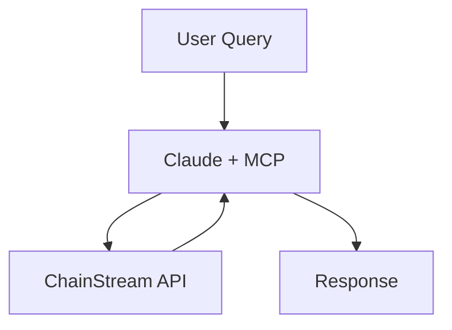

本チュートリアルでは、ChainStream MCP Serverを使用して、オンチェーンデータの照会、市場分析、トレーディング意思決定の支援が可能なAIアシスタントの構築方法を紹介します。

<Info>
**所要時間**: 30分  
**難易度**: ⭐⭐ 初級
</Info>

---

## 目標

オンチェーン認識能力を持つAIアシスタントを構築します：



**機能**：
- ✅ トークン価格と残高の照会
- ✅ ウォレット保有量の分析
- ✅ スマートマネーの追跡

---

## ステップ1：MCPの設定

### 前提条件

- ChainStreamアカウント（Client IDとClient Secretの取得用）
- Claude DesktopまたはCursor
- Node.js 18+

### MCP Serverのインストール

```bash
npm install -g @chainstream/mcp-server
```

### Claude Desktopの設定

設定ファイルを編集：

<Tabs>
  <Tab title="macOS">
```bash
# 設定ファイルのパス
~/Library/Application Support/Claude/claude_desktop_config.json
```
  </Tab>
  <Tab title="Windows">
```bash
# 設定ファイルのパス
%APPDATA%\Claude\claude_desktop_config.json
```
  </Tab>
</Tabs>

設定を追加：

```json
{
  "mcpServers": {
    "chainstream": {
      "url": "https://mcp.chainstream.io/mcp",
      "headers": {
        "Authorization": "Bearer your_access_token"
      }
    }
  }
}
```

Claude Desktopを再起動してください。

<Note>
詳細な手順は[MCPセットアップガイド](/jp/guides/ai-infrastructure/mcp-server/setup-guide)を参照してください。
</Note>

---

## ステップ2：会話例

### 例1：ETH価格の確認

```
ユーザー: ETHの価格を教えて

Claude: [get_token_priceツールを呼び出し]

ETHの現在価格:
- 価格: $2,015.32
- 24h変動: +2.5%
- 24h出来高: $12.5B
- 時価総額: $242B
```

### 例2：ウォレット保有量の分析

```
ユーザー: 0xd8dA6BF26964aF9D7eEd9e03E53415D37aA96045の保有量を分析して

Claude: [get_token_balanceとanalyze_walletツールを呼び出し]

このアドレス（vitalik.eth）の保有量分析:

保有概要
| トークン | 数量 | 価値 |
|-------|--------|-------|
| ETH | 1,234 | $2.48M |
| USDC | 50,000 | $50K |
| ENS | 10,000 | $25K |

ウォレットの特徴
- ウォレット年齢: 7年以上
- タグ: コア開発者, 長期保有者
- 主な活動: DeFi, NFT, 寄付
```

### 例3：スマートマネーの追跡

```
ユーザー: 最近ARBを買っているスマートマネーアドレスは？

Claude: [get_smart_money_activitiesツールを呼び出し]

過去24hのスマートマネーARB購入記録:

1. 0xabc...123 (Smart Score: 92)
   - 購入: 500,000 ARB ($450K)
   - 時刻: 2時間前
   - タグ: DeFiエキスパート, 高勝率トレーダー

2. 0xdef...456 (Smart Score: 85)
   - 購入: 200,000 ARB ($180K)
   - 時刻: 5時間前
   - タグ: 機関ウォレット

トレンド分析: スマートマネー全体としてARBに対して純買いスタンス
```

---

## ステップ3：高度な使い方

### マルチステップ分析

```
ユーザー: まずこのアドレスの保有量を確認し、次に最近の取引を分析して、
投資スタイルを判定して

Claude: ステップごとに分析します：

ステップ1: 保有量照会
[get_token_balanceを呼び出し]
...

ステップ2: トランザクション履歴
[get_transaction_historyを呼び出し]
...

ステップ3: 総合分析
[analyze_walletを呼び出し]

上記データに基づき、このアドレスの投資スタイルは：
- タイプ: 中長期保有者
- 好み: DeFiブルーチップ + Layer2
- リスク許容度: 中程度
- 特徴: 押し目での買い増しが上手
```

### 比較分析

```
ユーザー: この2つのアドレスのトレーディング戦略を比較して

Claude: [analyze_wallet x2を呼び出し]

| 次元 | アドレスA | アドレスB |
|-----------|-----------|-----------|
| 取引頻度 | 高 (50/日) | 低 (5/日) |
| 保有スタイル | 短期 | 長期 |
| 勝率 | 62% | 78% |
| 好みのセクター | ミームコイン | DeFi |
| リスクレベル | 高 | 中 |
```

---

## セキュリティの考慮

### 戦略の制限

AIアシスタントはデータ照会と分析のみを提供し、直接的なトレード実行は行いません。

```
ユーザー: 100 USDC分のETHを買って

Claude: 現在のETH価格と最適な取引ルートの照会はお手伝いできますが、
直接トレードを実行することはできません。

現在のETH価格: $2,015
推奨実行方法:
1. Uniswap V3 - 予想スリッページ 0.1%
2. 1inch Aggregator - より良い価格が得られる可能性

ウォレットで手動でトレードを実行してください。
```

### 人間による確認

重要な意思決定について、AIは分析を提供しつつ人間の確認を推奨します：

<Warning>
分析に基づき、複数のスマートマネーアドレスがARBを購入していますが、以下にご注意ください：
- これは投資アドバイスではありません
- 市場にはリスクがあります。独自に判断してください
- より多くの情報ソースと組み合わせることを推奨します
</Warning>

---

## 拡張：カスタムエージェント

### MCP SDKを使った構築

```javascript
import Anthropic from '@anthropic-ai/sdk';
import { Client } from '@modelcontextprotocol/sdk/client/index.js';
import { SSEClientTransport } from '@modelcontextprotocol/sdk/client/sse.js';

const anthropic = new Anthropic();

// MCPクライアントの初期化
async function createMcpClient() {
  const transport = new SSEClientTransport(
    new URL('https://mcp.chainstream.io/sse'),
    {
      requestInit: {
        headers: {
          'Authorization': `Bearer ${process.env.CHAINSTREAM_ACCESS_TOKEN}`
        }
      }
    }
  );

  const client = new Client({
    name: 'custom-agent',
    version: '1.0.0'
  });

  await client.connect(transport);
  return client;
}

async function chat(userMessage) {
  const mcp = await createMcpClient();

  // 利用可能なツールを取得
  const { tools } = await mcp.listTools();

  // Anthropicフォーマットに変換
  const anthropicTools = tools.map(tool => ({
    name: tool.name,
    description: tool.description,
    input_schema: tool.inputSchema
  }));

  // Claudeを呼び出し
  let response = await anthropic.messages.create({
    model: 'claude-sonnet-4-20250514',
    max_tokens: 1024,
    tools: anthropicTools,
    messages: [{ role: 'user', content: userMessage }]
  });

  // ツール呼び出しの処理
  while (response.stop_reason === 'tool_use') {
    const toolUse = response.content.find(c => c.type === 'tool_use');

    // MCPツールを呼び出し
    const toolResult = await mcp.callTool({
      name: toolUse.name,
      arguments: toolUse.input
    });

    // ツール結果で会話を続行
    response = await anthropic.messages.create({
      model: 'claude-sonnet-4-20250514',
      max_tokens: 1024,
      tools: anthropicTools,
      messages: [
        { role: 'user', content: userMessage },
        { role: 'assistant', content: response.content },
        {
          role: 'user',
          content: [{
            type: 'tool_result',
            tool_use_id: toolUse.id,
            content: JSON.stringify(toolResult.content)
          }]
        }
      ]
    });
  }

  await mcp.close();

  return response.content.find(c => c.type === 'text')?.text;
}

// 使用方法
const result = await chat('EthereumのETH価格を確認して');
console.log(result);
```

---

## 利用可能なMCPツール

| ツール | 説明 |
|------|-------------|
| `get_token_balance` | アドレスのトークン残高を照会 |
| `get_token_price` | リアルタイムのトークン価格を取得 |
| `get_transaction_history` | アドレスのトランザクション履歴を照会 |
| `get_smart_money_activities` | スマートマネーのアクティビティを取得 |
| `get_defi_positions` | DeFiポジションを照会 |
| `analyze_wallet` | ウォレットの特徴を分析 |
| `get_token_holders` | トークンホルダー分析を取得 |

---

## FAQ

<AccordionGroup>
  <Accordion title="ClaudeがMCPツールを呼び出さない場合" icon="circle-question">
    1. MCP Serverが正しく設定されているか確認
    2. Claude Desktopを再起動
    3. Client IDとClient Secretが有効か確認
    4. 「ChainStreamを使って照会して...」のようにより明示的なプロンプトを試す
  </Accordion>

  <Accordion title="レスポンスが遅い場合" icon="clock">
    オンチェーンデータの照会には時間がかかります。特に複雑な分析の場合はなおさらです。以下をお試しください：
    1. ステップごとに質問して単一クエリの負荷を軽減
    2. 特定のチェーンを指定してクエリ範囲を縮小
  </Accordion>

  <Accordion title="AIは自動トレードできますか？" icon="robot">
    現在のバージョンはデータ照会のみをサポートしており、直接的なトレード実行はサポートしていません。これはセキュリティ上の理由です。自動トレードについては、AI分析結果に基づいて別途トレーディングシステムで実行することを推奨します。
  </Accordion>
</AccordionGroup>

---

## 関連ドキュメント

<CardGroup cols={2}>
  <Card title="MCPセットアップガイド" icon="gear" href="/jp/guides/ai-infrastructure/mcp-server/setup-guide">
    詳細な設定手順
  </Card>
  <Card title="MCPツールカタログ" icon="wrench" href="/jp/guides/ai-infrastructure/mcp-server/tools-catalog">
    すべての利用可能なツールを確認
  </Card>
</CardGroup>
