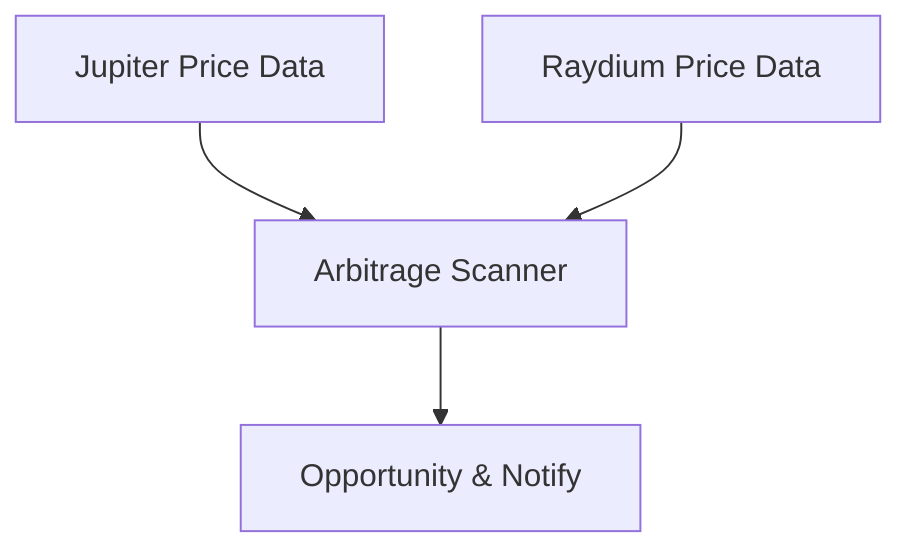

<Info>
ChainStreamは現在、**Solana**（`sol`）、**Ethereum**（`eth`）、**BSC**（`bsc`）をサポートしています。対応DEXは Jupiter、Raydium、PumpFun、Moonshot、Candy（Solana）、KyberSwap（Ethereum/BSC）です。以下の一部のコード例は概念的な説明のために追加のDEXを参照しています。現在のカバレッジは[対応チェーン](/jp/guides/getting-started/supported-chains)をご確認ください。
</Info>

<Warning>
**Coming Soon** — この機能は開発中であり、まだ利用できません。
</Warning>

本チュートリアルでは、取引所間の価格差をリアルタイムで発見し、潜在的なアービトラージ機会を特定するクロスDEXアービトラージスキャナーの構築方法を説明します。

<Info>
**所要時間**: 45分  
**難易度**: ⭐⭐⭐ 中級
</Info>

---

## 目標

クロスDEX価格差のアービトラージ機会を発見します：



**機能チェックリスト**：
- ✅ 複数DEXの取引ペア価格の取得
- ✅ スプレッド率の計算
- ✅ 実行可能性の評価（Gas、スリッページ、深度を考慮）
- ✅ リスクアラート（MEV、フロントランニング）

---

## アービトラージの原理

### クロスDEXアービトラージ

同じトークンが異なるDEXで価格差を持つ場合があります：

```
例: Solana上のSOL/USDC

Jupiter:  1 SOL = $140.00
Raydium:  1 SOL = $140.70

スプレッド = ($140.70 - $140.00) / $140.00 = 0.5%

アービトラージパス：
JupiterでSOLを購入 → RaydiumでSOLを売却 → 差額で利益
```

### 利益の計算式

<Info>
**純利益 = スプレッド収益 - ガス代 - スリッページ損失**
</Info>

実務上の考慮事項：
- 2つのトランザクションのガス代
- 売買のスリッページ
- 流動性深度の制限
- MEVフロントランニングリスク

---

## ステップ1：取引ペアの取得

### 1.1 依存関係のインストール

```bash
npm install @chainstream-io/sdk dotenv
```

### 1.2 設定ファイル

```javascript
// config.js
import 'dotenv/config';

export const CHAINSTREAM_ACCESS_TOKEN = process.env.CHAINSTREAM_ACCESS_TOKEN;

// 監視するDEX（Solana: Jupiter, Raydium, PumpFun, Moonshot, Candy; EVM: KyberSwap on eth/bsc）
export const DEXES = ['jupiter', 'raydium', 'pumpfun', 'moonshot', 'candy'];

// 監視する取引ペア（マルチDEXスプレッドチェックは現在のカバレッジではSolanaが最も強力）
export const TRADING_PAIRS = [
  { base: 'SOL', quote: 'USDC', chain: 'sol' },
  { base: 'SOL', quote: 'USDT', chain: 'sol' },
];

// アービトラージ閾値
export const MIN_PROFIT_PERCENT = 0.3;   // 最小利益率
export const MIN_LIQUIDITY_USD = 50000;  // 最小流動性
```

### 1.3 価格データの取得

```javascript
// scanner.js
import { ChainStreamClient } from '@chainstream-io/sdk';
import { CHAINSTREAM_ACCESS_TOKEN, DEXES } from './config.js';

export class PriceScanner {
  constructor() {
    this.client = new ChainStreamClient(CHAINSTREAM_ACCESS_TOKEN);
  }

  async getDexPrices(base, quote, chain) {
    // DEX間の取引ペア価格を取得
    const prices = await this.client.dex.getPrices({
      base,
      quote,
      chain,
      dexes: DEXES
    });
    return prices;
  }
}
```

---

## ステップ2：スプレッドの計算

```javascript
// evaluator.js
import { MIN_PROFIT_PERCENT, MIN_LIQUIDITY_USD } from './config.js';

export class ArbitrageEvaluator {

  findOpportunity(prices, pair) {
    // 低流動性をフィルタリング
    const validPrices = prices.filter(
      p => (p.liquidityUsd || 0) >= MIN_LIQUIDITY_USD
    );

    if (validPrices.length < 2) {
      return null;
    }

    // 最安値と最高値を見つける
    const sortedPrices = [...validPrices].sort((a, b) => a.price - b.price);
    const buyFrom = sortedPrices[0];   // 最安値 - 購入
    const sellTo = sortedPrices[sortedPrices.length - 1]; // 最高値 - 売却

    // スプレッドの計算
    const spread = (sellTo.price - buyFrom.price) / buyFrom.price * 100;

    // コストの見積もり
    const gasCostPercent = 0.1;  // 約0.1%
    const slippagePercent = 0.2; // 約0.2%
    const totalCost = gasCostPercent + slippagePercent;

    // 純利益
    const netProfit = spread - totalCost;

    if (netProfit < MIN_PROFIT_PERCENT) {
      return null;
    }

    return {
      pair: `${pair.base}/${pair.quote}`,
      buyDex: buyFrom.dex,
      buyPrice: buyFrom.price,
      sellDex: sellTo.dex,
      sellPrice: sellTo.price,
      spreadPercent: Number(spread.toFixed(3)),
      netProfitPercent: Number(netProfit.toFixed(3)),
      maxSizeUsd: Math.min(buyFrom.liquidityUsd, sellTo.liquidityUsd) * 0.02
    };
  }
}
```

---

## ステップ3：実行可能性の評価

### リスク評価

```javascript
// risk.js
export function assessRisk(opportunity) {
  const risks = [];

  // MEVリスク
  if (opportunity.netProfitPercent > 1.0) {
    risks.push('🔴 高利益はMEVにフロントランされやすい');
  }

  // 流動性リスク
  if (opportunity.maxSizeUsd < 5000) {
    risks.push('🟡 実行可能なサイズが小さい');
  }

  // タイミングリスク
  risks.push('⚠️ 価格データにはレイテンシーがある');

  return {
    risks,
    executable: risks.filter(r => r.includes('🔴')).length === 0
  };
}
```

### リスク警告

<Warning>
**重要なリスク警告**：

1. **MEVフロントランニング**: アービトラージ取引はMEVボットにフロントランされやすい
2. **価格のレイテンシー**: 実行時には価格が変わっている可能性がある
3. **Gas代の変動**: ネットワーク混雑時にコストが急騰する場合がある
4. **スリッページ**: 実際のスリッページは見積もりより大きくなる場合がある

このツールは機会の発見のみを目的としており、投資アドバイスを構成するものではありません。
</Warning>

---

## 完全なコード

```javascript
// index.js
import { PriceScanner } from './scanner.js';
import { ArbitrageEvaluator } from './evaluator.js';
import { TRADING_PAIRS } from './config.js';

async function main() {
  const scanner = new PriceScanner();
  const evaluator = new ArbitrageEvaluator();

  console.log('🔍 アービトラージスキャナーを開始...');

  while (true) {
    for (const pair of TRADING_PAIRS) {
      const prices = await scanner.getDexPrices(
        pair.base, 
        pair.quote, 
        pair.chain
      );

      const opp = evaluator.findOpportunity(prices, pair);

      if (opp) {
        console.log(`
🎯 アービトラージ機会を発見！
   ペア: ${opp.pair}
   購入: ${opp.buyDex} @ $${opp.buyPrice}
   売却: ${opp.sellDex} @ $${opp.sellPrice}
   スプレッド: ${opp.spreadPercent}%
   純利益: ${opp.netProfitPercent}%
   最大サイズ: $${opp.maxSizeUsd.toLocaleString()}
        `);
      }
    }

    // 10秒ごとにスキャン
    await new Promise(resolve => setTimeout(resolve, 10000));
  }
}

main();
```

---

## 拡張提案

<CardGroup cols={3}>
  <Card title="フラッシュローン統合" icon="bolt">
    フラッシュローンを使用したゼロ資本アービトラージ
  </Card>
  <Card title="マルチチェーンスキャン" icon="layer-group">
    Solanaの取引所にeth/bscのKyberSwapクオートを追加
  </Card>
  <Card title="自動実行" icon="robot">
    ウォレットを統合して自動取引（注意して使用）
  </Card>
</CardGroup>

---

## 関連ドキュメント

<CardGroup cols={2}>
  <Card title="DeFiモニタリング概要" icon="landmark" href="/jp/playbooks/frameworks/defi-monitoring-overview">
    DeFiモニタリングの次元を学ぶ
  </Card>
  <Card title="価格アラートBot" icon="bell" href="/jp/playbooks/tutorials/build-price-alert-bot">
    リアルタイム価格監視を始める
  </Card>
</CardGroup>
