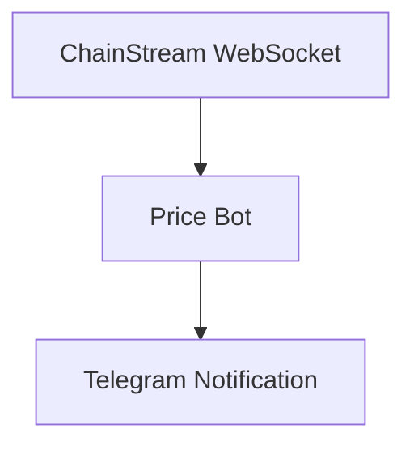

本チュートリアルでは、対象トークンの価格変動が設定した閾値を超えた際に、自動的にTelegram通知を送信するリアルタイム価格監視Botをゼロから構築する方法を説明します。

<Info>
**所要時間**: 30分  
**難易度**: ⭐⭐ 初級
</Info>

---

## 目標

トークン価格を監視し、自動通知を送信するBotを構築します：



**機能チェックリスト**：
- ✅ リアルタイム価格ストリームの購読
- ✅ 価格変動トリガー条件の設定（> X%）
- ✅ Telegram通知の送信
- ✅ 複数トークン監視のサポート

---

## 技術スタック

| コンポーネント | 技術 | 用途 |
|-----------|------------|---------|
| 言語 | Node.js 18+ | メイン開発言語 |
| リアルタイムデータ | WebSocket | 価格ストリーム購読 |
| 通知 | Telegram Bot API | アラート送信 |
| 設定 | 環境変数 | 機密情報の保管 |

---

## 前提条件

- ChainStreamアカウント（Access Tokenの取得用）
- Node.js 18+
- Telegramアカウント

---

## ステップ1：WebSocket接続

### 1.1 依存関係のインストール

```bash
npm install @chainstream-io/sdk node-telegram-bot-api dotenv
```

### 1.2 プロジェクト構成

```
price-alert-bot/
├── .env
├── config.js
├── bot.js
└── index.js
```

### 1.3 設定ファイル

**.env**:

```
CHAINSTREAM_ACCESS_TOKEN=your_access_token
TELEGRAM_BOT_TOKEN=your_bot_token
TELEGRAM_CHAT_ID=your_chat_id
```

**config.js**:

```javascript
import 'dotenv/config';

// ChainStream設定
export const CHAINSTREAM_ACCESS_TOKEN = process.env.CHAINSTREAM_ACCESS_TOKEN;

// Telegram設定
export const TELEGRAM_BOT_TOKEN = process.env.TELEGRAM_BOT_TOKEN;
export const TELEGRAM_CHAT_ID = process.env.TELEGRAM_CHAT_ID;

// 監視設定
export const WATCH_TOKENS = [
  {
    chain: 'sol',
    address: '6p6xgHyF7AeE6TZkSmFsko444wqoP15icUSqi2jfGiPN',
    symbol: 'EXAMPLE',
    thresholdPercent: 3.0  // 3%変動でトリガー
  },
  {
    chain: 'sol',
    address: 'So11111111111111111111111111111111111111112',
    symbol: 'SOL',
    thresholdPercent: 5.0  // 5%変動でトリガー
  }
];
```

### 1.4 WebSocket接続

**index.js**:

```javascript
import { ChainStreamClient } from '@chainstream-io/sdk';
import { CHAINSTREAM_ACCESS_TOKEN, WATCH_TOKENS } from './config.js';
import { sendAlert } from './bot.js';

class PriceMonitor {
  constructor() {
    this.client = new ChainStreamClient(CHAINSTREAM_ACCESS_TOKEN);
    this.lastPrices = new Map(); // 直近の価格を記録
  }

  async start() {
    console.log('✅ 価格監視を開始...');

    // 各トークンの統計を購読
    for (const token of WATCH_TOKENS) {
      this.subscribeToken(token);
    }
  }

  subscribeToken(token) {
    this.client.stream.subscribeTokenStats({
      chain: token.chain,
      tokenAddress: token.address,
      callback: (data) => this.handlePriceUpdate(token, data)
    });

    console.log(`📡 ${token.symbol}の価格ストリームを購読`);
  }

  handlePriceUpdate(token, data) {
    const currentPrice = data.price || data.p;
    if (!currentPrice) return;

    const lastPrice = this.lastPrices.get(token.address);

    if (lastPrice) {
      // 変動率を計算
      const changePercent = ((currentPrice - lastPrice) / lastPrice) * 100;

      // アラートをトリガーすべきか確認
      if (Math.abs(changePercent) >= token.thresholdPercent) {
        this.triggerAlert(token, currentPrice, changePercent);
      }
    }

    // 価格記録を更新
    this.lastPrices.set(token.address, currentPrice);
  }

  async triggerAlert(token, price, change) {
    const direction = change > 0 ? '📈 UP' : '📉 DOWN';

    const message = `
${direction} 価格アラート！

🪙 トークン: ${token.symbol}
💰 現在価格: $${price.toFixed(6)}
📊 変動: ${change >= 0 ? '+' : ''}${change.toFixed(2)}%
⚡ 閾値: ${token.thresholdPercent}%
    `.trim();

    await sendAlert(message);
    console.log(`🚨 アラート送信: ${token.symbol} ${change >= 0 ? '+' : ''}${change.toFixed(2)}%`);
  }
}

// 監視を開始
const monitor = new PriceMonitor();
monitor.start();
```

---

## ステップ2：トリガー条件の設定

トリガー条件は`config.js`で設定します：

```javascript
export const WATCH_TOKENS = [
  {
    symbol: 'EXAMPLE',
    thresholdPercent: 3.0  // 価格変動 > 3%でトリガー
  },
  // ...
];
```

### 高度なトリガー条件

より複雑な条件に拡張できます：

```javascript
// 複数条件トリガー
const ALERT_CONDITIONS = {
  priceChange: {
    enabled: true,
    thresholdPercent: 5.0
  },
  priceAbove: {
    enabled: true,
    value: 100  // 価格が$100を超えたらトリガー
  },
  priceBelow: {
    enabled: true,
    value: 50   // 価格が$50を下回ったらトリガー
  }
};
```

---

## ステップ3：通知の送信

### 3.1 Telegram Botの作成

<Steps>
  <Step title="Botを作成">
    Telegramで`@BotFather`を検索し、`/newbot`を送信
  </Step>
  <Step title="トークンを取得">
    プロンプトに従ってBotを作成し、Bot Tokenを取得
  </Step>
  <Step title="Chat IDを取得">
    - Botにメッセージを送信
    - `https://api.telegram.org/bot<TOKEN>/getUpdates`にアクセス
    - `chat.id`を見つける
  </Step>
</Steps>

### 3.2 Telegram通知モジュール

**bot.js**:

```javascript
import TelegramBot from 'node-telegram-bot-api';
import { TELEGRAM_BOT_TOKEN, TELEGRAM_CHAT_ID } from './config.js';

const bot = new TelegramBot(TELEGRAM_BOT_TOKEN);

export async function sendAlert(message) {
  try {
    await bot.sendMessage(TELEGRAM_CHAT_ID, message, {
      parse_mode: 'HTML'
    });
  } catch (error) {
    console.error(`❌ Telegram送信失敗: ${error.message}`);
  }
}

export async function sendAlertWithRetry(message, maxRetries = 3) {
  for (let attempt = 0; attempt < maxRetries; attempt++) {
    try {
      await sendAlert(message);
      return true;
    } catch (error) {
      if (attempt < maxRetries - 1) {
        // エクスポネンシャルバックオフ
        await new Promise(resolve => setTimeout(resolve, 2 ** attempt * 1000));
      } else {
        console.error(`❌ ${maxRetries}回のリトライ後に通知失敗`);
        return false;
      }
    }
  }
}
```

---

## 動作確認

### Botの実行

```bash
node index.js
```

### 期待される出力

```
✅ 価格監視を開始...
📡 EXAMPLEの価格ストリームを購読
📡 SOLの価格ストリームを購読
```

### トリガーテスト

テストを素早く行うために閾値を一時的に0.01%に設定：

```javascript
thresholdPercent: 0.01  // テスト用
```

---

## 拡張提案

<Tabs>
  <Tab title="複数トークン監視">
```javascript
// APIからウォッチリストを動的に取得
async function fetchWatchlist() {
  const response = await fetch('https://api.chainstream.io/v1/watchlist');
  return response.json();
}
```
  </Tab>
  <Tab title="永続ストレージ">
```javascript
import Database from 'better-sqlite3';

const db = new Database('alerts.db');

// テーブル作成
db.exec(`
  CREATE TABLE IF NOT EXISTS alerts (
    id INTEGER PRIMARY KEY AUTOINCREMENT,
    symbol TEXT,
    price REAL,
    change REAL,
    timestamp INTEGER
  )
`);

function saveAlert(alertData) {
  const stmt = db.prepare(`
    INSERT INTO alerts (symbol, price, change, timestamp)
    VALUES (?, ?, ?, ?)
  `);
  stmt.run(
    alertData.symbol,
    alertData.price,
    alertData.change,
    Date.now()
  );
}
```
  </Tab>
  <Tab title="Webダッシュボード">
```javascript
import express from 'express';

const app = express();

app.get('/alerts', (req, res) => {
  const alerts = getRecentAlerts();
  res.json({ alerts });
});

app.post('/config', (req, res) => {
  // 監視設定を更新
  updateConfig(req.body);
  res.json({ success: true });
});

app.listen(3000);
```
  </Tab>
  <Tab title="マルチチャネル通知">
```javascript
async function sendNotification(message, channels) {
  const tasks = [];
  
  if (channels.includes('telegram')) {
    tasks.push(sendTelegram(message));
  }
  if (channels.includes('discord')) {
    tasks.push(sendDiscord(message));
  }
  if (channels.includes('email')) {
    tasks.push(sendEmail(message));
  }
  
  await Promise.all(tasks);
}
```
  </Tab>
</Tabs>

---

## FAQ

<AccordionGroup>
  <Accordion title="WebSocket接続に失敗する場合" icon="plug">
    1. Access Tokenが正しいか確認
    2. ネットワークがChainStreamにアクセスできるか確認
    3. ファイアウォールがWebSocketをブロックしていないか確認
  </Accordion>
  
  <Accordion title="Telegram通知が届かない場合" icon="telegram">
    1. Bot Tokenが正しいか確認
    2. Chat IDが正しいか確認
    3. Botにメッセージを送信済みか確認（会話をアクティベート）
  </Accordion>
  
  <Accordion title="監視トークンを追加するには？" icon="coins">
    `config.js`の`WATCH_TOKENS`配列に設定を追加してください。
  </Accordion>
</AccordionGroup>

---

## 関連ドキュメント

<CardGroup cols={2}>
  <Card title="WebSocket API" icon="plug" href="/jp/api-reference/endpoint/websocket/api">
    WebSocket購読の詳細
  </Card>
  <Card title="Webhookの基本" icon="webhook" href="/jp/docs/recipes/webhook-fundamentals">
    WebSocketの代わりにWebhookを使用
  </Card>
</CardGroup>
