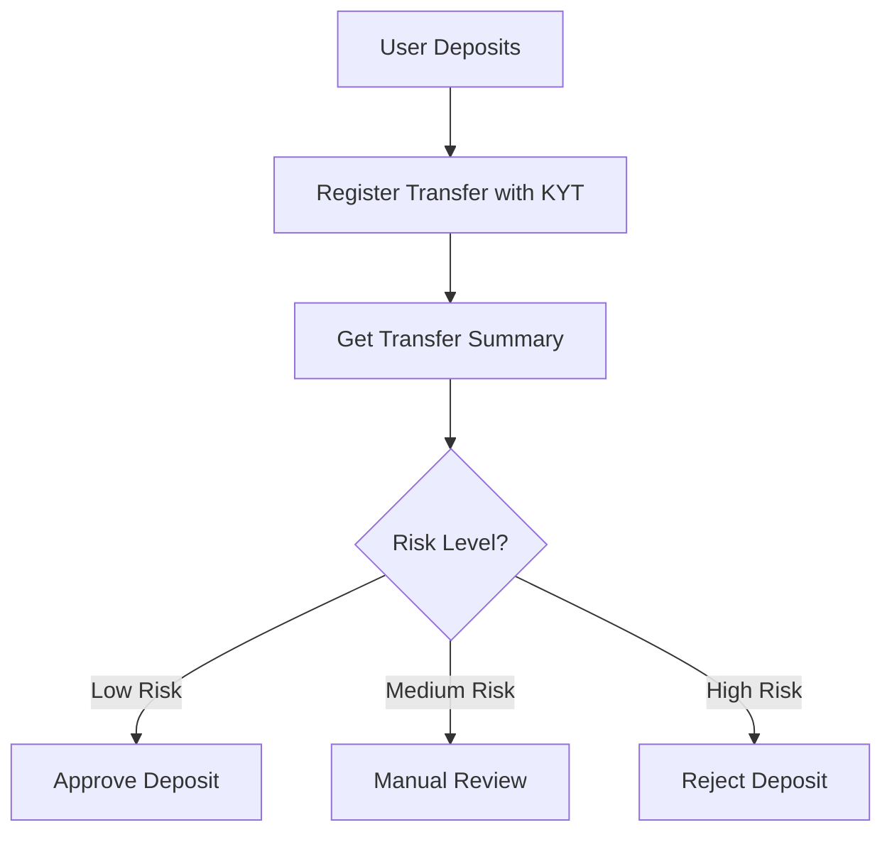

## プロジェクト概要

本チュートリアルでは、ユーザーの入金時に資金源のリスクを自動評価する入金リスク管理システムを構築します。

<Info>
**所要時間**: 30分  
**難易度**: ⭐⭐ 初級
</Info>

**機能**：
- KYT分析のための入金トランザクションの登録
- トランザクションリスク評価結果の照会
- リスクレベルに基づく入金処理

---

## 動作原理



---

## ステップ1：入金トランザクションの登録

入金が検出されたら、KYT APIに登録して分析を行います。

```javascript
import { ChainStreamClient } from '@chainstream-io/sdk';

const client = new ChainStreamClient(process.env.CHAINSTREAM_ACCESS_TOKEN);

async function registerDeposit(deposit) {
  // KYT分析のためにトランスファーを登録
  const response = await client.kyt.registerTransfer({
    network: deposit.network,        // 'bitcoin', 'ethereum', 'Solana'
    asset: deposit.asset,            // 'BTC', 'ETH', 'SOL'
    transferReference: deposit.txHash, // トランザクションハッシュ
    direction: 'received'            // 入金 = received
  });

  return response.transferId;
}
```

---

## ステップ2：リスク評価の取得

登録後、トランスファーサマリーを照会してリスク情報を取得します。

```javascript
async function getTransferRisk(transferId) {
  // リスク評価付きのトランスファーサマリーを取得
  const summary = await client.kyt.getTransferSummary(transferId);

  // アラートがある場合、詳細を取得
  const alerts = await client.kyt.getTransferAlerts(transferId);

  // 直接エクスポージャー情報を取得
  const exposures = await client.kyt.getTransferDirectExposure(transferId);

  return {
    summary,
    alerts,
    exposures
  };
}
```

---

## ステップ3：リスクに基づく処理

リスクベースの処理ロジックを実装します。

```javascript
async function evaluateDeposit(deposit) {
  // 入金を登録
  const transferId = await registerDeposit(deposit);

  // リスク評価を取得
  const { summary, alerts, exposures } = await getTransferRisk(transferId);

  // アラートに基づきリスクレベルを判定
  const hasHighRiskAlert = alerts.some(
    alert => alert.severity === 'high' || alert.severity === 'critical'
  );
  const hasMediumRiskAlert = alerts.some(
    alert => alert.severity === 'medium'
  );

  // リスクに基づき処理
  if (hasHighRiskAlert) {
    return rejectDeposit(deposit, alerts);
  }

  if (hasMediumRiskAlert) {
    return queueForReview(deposit, alerts);
  }

  return approveDeposit(deposit);
}

function approveDeposit(deposit) {
  console.log(`✅ 入金承認: ${deposit.txHash}`);
  // ユーザーアカウントに入金
  return { status: 'approved', deposit };
}

function queueForReview(deposit, alerts) {
  console.log(`⚠️ 入金レビュー待ち: ${deposit.txHash}`);
  // コンプライアンスチームに通知
  return { status: 'pending_review', deposit, alerts };
}

function rejectDeposit(deposit, alerts) {
  console.log(`❌ 入金拒否: ${deposit.txHash}`);
  // ログ記録と通知
  return { status: 'rejected', deposit, alerts };
}
```

---

## 完全な例

```javascript
import { ChainStreamClient } from '@chainstream-io/sdk';

const client = new ChainStreamClient(process.env.CHAINSTREAM_ACCESS_TOKEN);

class DepositRiskChecker {
  async checkDeposit(deposit) {
    try {
      // ステップ1: トランスファーの登録
      const { transferId } = await client.kyt.registerTransfer({
        network: deposit.network,
        asset: deposit.asset,
        transferReference: deposit.txHash,
        direction: 'received'
      });

      console.log(`📝 トランスファー登録: ${transferId}`);

      // ステップ2: リスク評価の取得
      const summary = await client.kyt.getTransferSummary(transferId);
      const alerts = await client.kyt.getTransferAlerts(transferId);

      console.log(`📊 リスク評価完了`);
      console.log(`   アラート: ${alerts.length}件`);

      // ステップ3: 判定
      return this.makeDecision(deposit, summary, alerts);

    } catch (error) {
      console.error(`❌ 入金チェックエラー: ${error.message}`);
      // エラー時は手動レビューに回す
      return { status: 'pending_review', reason: 'system_error' };
    }
  }

  makeDecision(deposit, summary, alerts) {
    const criticalAlerts = alerts.filter(a => a.severity === 'critical');
    const highAlerts = alerts.filter(a => a.severity === 'high');
    const mediumAlerts = alerts.filter(a => a.severity === 'medium');

    if (criticalAlerts.length > 0 || highAlerts.length > 0) {
      return {
        status: 'rejected',
        reason: 'high_risk_detected',
        alerts: [...criticalAlerts, ...highAlerts]
      };
    }

    if (mediumAlerts.length > 0) {
      return {
        status: 'pending_review',
        reason: 'medium_risk_detected',
        alerts: mediumAlerts
      };
    }

    return {
      status: 'approved',
      reason: 'low_risk'
    };
  }
}

// 使用方法
const checker = new DepositRiskChecker();

const deposit = {
  network: 'Solana',
  asset: 'SOL',
  txHash: '39z5QAprVrzaFzfHu1JHPgBf9dSqYdNYhH31d3PEd4hWiWL1LML7qCct5MHGxaRAgjjj1nC3XUyLwtzGQmYqUk4y:address'
};

const result = await checker.checkDeposit(deposit);
console.log('判定結果:', result);
```

---

## APIリファレンス

| エンドポイント | 説明 |
|----------|-------------|
| `POST /v1/kyt/transfer` | KYT分析のためにトランスファーを登録 |
| `GET /v1/kyt/transfers/{id}/summary` | トランスファーサマリーの取得 |
| `GET /v1/kyt/transfers/{id}/alerts` | トランスファーアラートの取得 |
| `GET /v1/kyt/transfers/{id}/exposures/direct` | 直接エクスポージャー情報の取得 |

---

## 次のステップ

<CardGroup cols={2}>
  <Card title="KYTの概念" icon="magnifying-glass-dollar" href="/jp/docs/compliance/kyt-concepts">
    KYTの仕組みを学ぶ
  </Card>
  <Card title="KYT APIリファレンス" icon="code" href="/jp/api-reference/endpoint/data/kyt/v2/kyt-transfer-post">
    完全なAPIドキュメント
  </Card>
</CardGroup>
