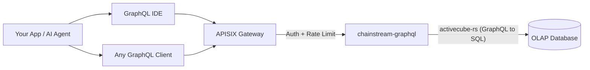

<Info>
ChainStream GraphQLは、マルチチェーンオンチェーンデータ（Solana、Ethereum、BSC、Polygon）を単一のGraphQLエンドポイントで提供するOLAP分析APIです。必要なフィールドだけをクエリし、データをリアルタイムに集計し、スキーマをインタラクティブに探索できます。すべて高性能OLAPデータベースで動作しています。
</Info>

## ChainStream GraphQLとは

ChainStream GraphQLは、オンチェーン分析データのための**宣言型クエリインターフェース**を提供します。固定されたレスポンス形式を持つ多数のRESTエンドポイントを呼び出す代わりに、必要なデータ、フィルタリング方法、集計方法を正確に指定する単一のGraphQLクエリを記述できます。

このサービスは**activecube-rs**上に構築されており、**Cube**定義からGraphQLスキーマを動的に生成します。各Cubeは分析データモデル（例：DEXトレード、トークントランスファー、OHLCローソク足）を表します。クエリは最適化されたSQLにコンパイルされ、高性能OLAPデータベースに対して実行されます。

---

## GraphQL vs REST Data API

| | **GraphQL API** | **REST Data API** |
|:--|:--|:--|
| **クエリスタイル** | 宣言型 — 形状、フィルタ、集計を自分で定義 | 命令型 — 事前定義されたパラメータを持つ固定エンドポイント |
| **フィールド選択** | クライアントが必要なフィールドだけを選択 | サーバーが固定のレスポンススキーマを返す |
| **集計** | クエリごとに`count`、`sum`、`avg`、`min`、`max`が組み込み | 事前定義された集計エンドポイントのみ |
| **エンドポイント** | すべてのデータモデルに対して単一のエンドポイント | リソースごとに1つのエンドポイント |
| **ページネーション** | クエリ引数内の`limit` + `offset` | クエリパラメータの`limit` + `offset` / カーソル |
| **最適な用途** | 分析、ダッシュボード、柔軟な探索 | シンプルな検索、リアルタイム価格、ウォレット残高 |
| **レイテンシ** | レイテンシよりもスループットに最適化 | 単一リソースの低レイテンシ読み取りに最適化 |

<Tip>
トレードの集計、時間範囲にわたるPnLの計算、カスタムダッシュボードの構築など、柔軟な分析クエリが必要な場合は**GraphQL**を使用してください。現在のトークン価格やウォレット残高など、高速でシンプルな検索が必要な場合は**REST API**を使用してください。
</Tip>

---

## 主な利点

<CardGroup cols={3}>
  <Card title="単一エンドポイント" icon="bullseye">
    1つのURLで4チェーンにわたる25のデータCubeを提供。エンドポイントの乱立なし — クエリを変えるだけです。
  </Card>
  <Card title="クライアント側フィールド選択" icon="filter">
    必要なカラムだけをリクエスト。オーバーフェッチもアンダーフェッチもなし — 帯域幅制約のあるクライアントに最適です。
  </Card>
  <Card title="組み込み集計" icon="chart-column">
    `count`、`sum`、`avg`、`min`、`max`をクエリ内で直接計算。後処理は不要です。
  </Card>
</CardGroup>

---

## 対応チェーン

| Network ID | ブロックチェーン | チェーングループ | カバレッジ |
|:--|:--|:--|:--|
| `eth` | Ethereum | EVM | 完全なDEX、トランスファー、残高更新、イベント、トレース、トークン統計 |
| `bsc` | BNB Chain (BSC) | EVM | 完全なDEX、トランスファー、残高更新、イベント、トレース、トークン統計 |
| `polygon` | Polygon | EVM | 完全なDEX、トランスファー、残高更新、予測市場 |
| `sol` | Solana | Solana | 完全なDEX、トランスファー、インストラクション、トークンホルダー、OHLC、PnL |

<Note>
クエリは3つの**チェーングループ**に整理されています：**EVM**（`network`引数が必要）、**Solana**、**Trading**（クロスチェーンOHLCとトークン統計）。詳細は[チェーングループ](/jp/graphql/schema/chain-groups)をご覧ください。
</Note>

---

## 利用可能なデータキューブ

3つのチェーングループにわたる25のCubeが利用可能で、それぞれが独自の分析モデルを表しています：

<AccordionGroup>
  <Accordion title="DEXトレーディング">
    - **DEXTrades** — 個別のDEXスワップイベント（売買金額、価格、DEXプロトコル情報を含む）
    - **DEXTradeByTokens** — 効率的なトークン単位のクエリ用にトークンでインデックス化されたDEXトレード
    - **DEXOrders** — リミットオーダーを含むDEXオーダーイベント *(Solanaのみ)*
  </Accordion>
  <Accordion title="プールと流動性">
    - **DEXPoolEvents** — DEXプールの流動性追加/削除イベント
    - **DEXPools** — 現在のリザーブとメタデータを含むDEXプールスナップショット
    - **DEXPoolSlippages** — プールスリッページデータ *(EVMのみ)*
    - **TokenSupplyUpdates** — トークンサプライに影響するミントとバーンイベント
  </Accordion>
  <Accordion title="トークンとトランスファー">
    - **Transfers** — 送信者、受信者、金額、USD値を含むトークントランスファーイベント
    - **BalanceUpdates** — トークンごとのウォレット残高変更イベント
    - **TokenHolders** — トークンの現在のホルダーリストと分布
    - **WalletTokenPnL** — ウォレット-トークンペアごとのPnL
  </Accordion>
  <Accordion title="トレーディング分析（クロスチェーン）">
    - **Pairs** — 設定可能な時間間隔でのOHLCローソク足データ（旧OHLCとして参照）
    - **Tokens** — トークンごとの集計トレード統計：出来高、トレード数、ユニークトレーダー数（旧TokenTradeStatsとして参照）
  </Accordion>
  <Accordion title="ブロックチェーンインフラストラクチャ">
    - **Blocks** — ブロックレベルデータ（タイムスタンプ、高さ、マイナー/バリデータ）
    - **Transactions** — トランザクションレベルデータ（ハッシュ、ステータス、ガス/手数料）
    - **TransactionBalances** — トランザクションごとの残高変更
    - **Events** — スマートコントラクトイベントログ *(EVMのみ)*
    - **Calls** — 内部コールトレース *(EVMのみ)*
    - **Instructions** — インストラクションレベルデータ *(Solanaのみ)*
    - **InstructionBalanceUpdates** — インストラクションレベルの残高変更 *(Solanaのみ)*
  </Accordion>
  <Accordion title="リワードとネットワーク">
    - **Rewards** — バリデータ/ステーキングリワード *(Solanaのみ)*
    - **MinerRewards** — マイナー/バリデータリワード *(EVMのみ)*
    - **Uncles** — アンクルブロックデータ *(EVMのみ)*
  </Accordion>
  <Accordion title="予測市場">
    - **PredictionTrades** — 予測市場トレードイベント *(EVM — Polygon)*
    - **PredictionManagements** — 予測市場管理イベント *(EVM — Polygon)*
    - **PredictionSettlements** — 予測市場決済イベント *(EVM — Polygon)*
  </Accordion>
</AccordionGroup>

---

## 主要クエリパラメータ

標準的なフィルタリングとページネーションに加えて、ChainStream GraphQLはチェーングループレベルで2つの強力なパラメータをサポートしています：

| パラメータ | 値 | 説明 |
|:--|:--|:--|
| **`dataset`** | `realtime`、`archive`、`combined`（デフォルト） | データソーススコープを制御 — 最新データのみ、履歴データ、または全範囲 |
| **`aggregates`** | `yes`、`no`、`only` | より高速な分析クエリのために事前集計テーブルを使用するかどうかを制御 |

<Tip>
詳細な使用方法と例については[データセットとアグリゲート](/jp/graphql/schema/dataset-aggregates)をご覧ください。
</Tip>

---

## アーキテクチャ

<Info>
すべてのリクエストは認証とレート制限のためにAPISIXゲートウェイを通過します。`chainstream-graphql`サービスはGraphQLクエリをOLAP分析データベースに対して実行される最適化されたSQLにコンパイルします。
</Info>

---

## 次のステップ

<CardGroup cols={3}>
  <Card title="エンドポイントと認証" icon="key" href="/jp/graphql/getting-started/endpoints">
    エンドポイントURL、認証ヘッダーの設定、リクエスト/レスポンス形式の理解。
  </Card>
  <Card title="最初のクエリ" icon="play" href="/jp/graphql/getting-started/first-query">
    IDEまたはcURLからステップバイステップで最初のGraphQLクエリを実行。
  </Card>
  <Card title="GraphQL IDE" icon="code" href="/jp/graphql/ide/introduction">
    自動補完、クエリテンプレート、コードエクスポートを備えたインタラクティブなGraphQL IDEを探索。
  </Card>
</CardGroup>
