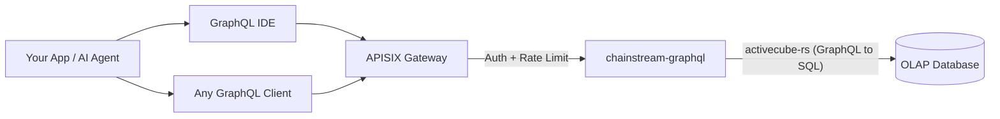

<Info>
ChainStream GraphQL は、Solana、Ethereum、BSC、Polygon などマルチチェーンのオンチェーンデータを単一の GraphQL エンドポイントで公開する OLAP 向け分析 API です。必要なフィールドだけをクエリし、オンデマンドで集計し、スキーマを対話的に探索できます — すべて高性能 OLAP データベース上で動作します。
</Info>

## ChainStream GraphQL とは

ChainStream GraphQL は、オンチェーン分析データ向けの **宣言的クエリインターフェース** を提供します。固定レスポンス形の REST エンドポイントを多数呼ぶ代わりに、欲しいデータ、フィルタ、集計を 1 つの GraphQL クエリで指定します。

サービスは **activecube-rs** 上に構築されており、**Cube** 定義から GraphQL スキーマを動的に生成します — 各 Cube は分析データモデル（例: DEX 取引、トークン転送、OHLC ローソク足）を表します。クエリは最適化された SQL にコンパイルされ、高性能 OLAP データベースで実行されます。

---

## GraphQL と REST Data API の比較

| | **GraphQL API** | **REST Data API** |
|:--|:--|:--|
| **クエリのスタイル** | 宣言的 — 形・フィルタ・集計を自分で定義 | 命令的 — 事前定義パラメータの固定エンドポイント |
| **フィールド選択** | クライアントが必要なフィールドだけ選択 | サーバーが固定のレスポンススキーマを返す |
| **集計** | クエリごとに `count`、`sum`、`avg`、`min`、`max` を内蔵 | 事前定義された集計エンドポイントのみ |
| **エンドポイント** | 全データモデルで単一エンドポイント | リソースごとに 1 エンドポイント |
| **ページネーション** | クエリ引数の `limit` + `offset` | クエリパラメータの `limit` + `offset` / カーソル |
| **向いている用途** | 分析、ダッシュボード、柔軟な探索 | 単純な参照、リアルタイム価格、ウォレット残高 |
| **レイテンシ** | スループット重視の最適化 | 単一リソース読み取りの低レイテンシ重視 |

<Tip>
柔軟な分析クエリ — 取引の集計、期間横断の PnL、カスタムダッシュボード — には **GraphQL** を。現在のトークン価格やウォレット残高など、高速で単純な参照には **REST API** を使うとよいでしょう。
</Tip>

---

## 主な利点

<CardGroup cols={3}>
  <Card title="単一エンドポイント" icon="bullseye">
    1 つの URL で 4 チェーンにまたがる 25 データ Cube にアクセス。エンドポイントが増えすぎることはなく、クエリを変えるだけです。
  </Card>
  <Card title="クライアントが選ぶフィールド" icon="filter">
    必要な列だけ要求。過剰取得も不足もなく、帯域が限られたクライアントに適しています。
  </Card>
  <Card title="内蔵の集計" icon="chart-column">
    後処理なしで、クエリ内で直接 `count`、`sum`、`avg`、`min`、`max` を計算できます。
  </Card>
</CardGroup>

---

## 対応チェーン

| ネットワーク ID | ブロックチェーン | Chain Group | カバレッジ |
|:--|:--|:--|:--|
| `eth` | Ethereum | EVM | フル DEX、転送、残高更新、イベント、トレース、トークン統計 |
| `bsc` | BNB Chain (BSC) | EVM | フル DEX、転送、残高更新、イベント、トレース、トークン統計 |
| `polygon` | Polygon | EVM | 予測市場（PredictionTrades / Managements / Settlements）。その他 Cube は展開中。 |
| `sol` | Solana | Solana | フル DEX、転送、命令、トークンホルダー、OHLC、PnL |

<Note>
クエリは 3 つの **Chain Group** に分かれます: **`network` 引数が必要な EVM**、**Solana**、およびクロスチェーンの OHLC とトークン統計の **Trading**。詳しくは [Chain Groups](/jp/graphql/schema/chain-groups) を参照してください。
</Note>

---

## 利用可能なデータ Cube

25 個の Cube が 3 つの Chain Group にまたがり、それぞれが独立した分析モデルを表します。

<AccordionGroup>
  <Accordion title="DEX 取引">
    - **DEXTrades** — 買い／売り数量、価格、DEX プロトコル情報を含む個別 DEX スワップイベント
    - **DEXTradeByTokens** — トークン単位のクエリ向けにインデックスされた DEX 取引
    - **DEXOrders** — 指値注文などを含む DEX オーダーイベント *（Solana のみ）*
  </Accordion>
  <Accordion title="プールと流動性">
    - **DEXPoolEvents** — DEX プールへの流動性追加／削除イベント
    - **DEXPools** — 現在の準備金とメタデータを含む DEX プールのスナップショット
    - **DEXPoolSlippages** — プールのスリッページデータ *（EVM のみ）*
    - **TokenSupplyUpdates** — トークン供給に影響するミントとバーンイベント
  </Accordion>
  <Accordion title="トークンと転送">
    - **Transfers** — 送受信者、数量、USD 換算を含むトークン転送イベント
    - **BalanceUpdates** — トークンごとのウォレット残高変化イベント
    - **TokenHolders** — トークンの現在のホルダー一覧と分布
    - **WalletTokenPnL** — ウォレット–トークン単位の PnL
  </Accordion>
  <Accordion title="取引分析（クロスチェーン）">
    - **Pairs** — 設定可能な時間間隔での OHLC ローソク足データ（従来 OHLC として言及）
    - **Tokens** — トークン別の集計取引統計: 出来高、取引件数、ユニークトレーダー（従来 TokenTradeStats として言及）
  </Accordion>
  <Accordion title="ブロックチェーン基盤">
    - **Blocks** — ブロック単位データ（タイムスタンプ、高さ、マイナー／バリデータ）
    - **Transactions** — トランザクション単位データ（ハッシュ、ステータス、ガス／手数料）
    - **TransactionBalances** — トランザクションごとの残高変化
    - **Events** — スマートコントラクトのイベントログ *（EVM のみ）*
    - **Calls** — 内部コールトレース *（EVM のみ）*
    - **Instructions** — 命令レベルデータ *（Solana のみ）*
    - **InstructionBalanceUpdates** — 命令レベルの残高変化 *（Solana のみ）*
  </Accordion>
  <Accordion title="報酬とネットワーク">
    - **Rewards** — バリデータ／ステーキング報酬 *（Solana のみ）*
    - **MinerRewards** — マイナー／バリデータ報酬 *（EVM のみ）*
    - **Uncles** — アンクルブロックデータ *（EVM のみ）*
  </Accordion>
  <Accordion title="予測市場">
    - **PredictionTrades** — 予測市場の取引イベント *（EVM — Polygon）*
    - **PredictionManagements** — 予測市場の管理イベント *（EVM — Polygon）*
    - **PredictionSettlements** — 予測市場の決済イベント *（EVM — Polygon）*
  </Accordion>
</AccordionGroup>

---

## 主要なクエリパラメータ

標準的なフィルタとページネーションに加え、ChainStream GraphQL は Chain Group レベルで次の 2 つの強力なパラメータをサポートします。

| パラメータ | 値 | 説明 |
|:--|:--|:--|
| **`dataset`** | `realtime`、`archive`、`combined`（デフォルト） | データソースの範囲 — 直近のみ、履歴のみ、または両方 |
| **`aggregates`** | `yes`、`no`、`only` | 分析クエリを高速化する事前集計テーブルの利用可否 |

<Tip>
詳細な使い方と例は [Dataset & Aggregates](/jp/graphql/schema/dataset-aggregates) を参照してください。
</Tip>

---

## アーキテクチャ

<Info>
すべてのリクエストは認証とレート制限のため APISIX ゲートウェイを経由します。`chainstream-graphql` サービスが GraphQL を最適化された SQL にコンパイルし、OLAP 分析データベースで実行します。
</Info>

---

## 次のステップ

<CardGroup cols={3}>
  <Card title="エンドポイントと認証" icon="key" href="/jp/graphql/getting-started/endpoints">
    エンドポイント URL、認証ヘッダー、リクエスト／レスポンス形式の設定。
  </Card>
  <Card title="最初のクエリ" icon="play" href="/jp/graphql/getting-started/first-query">
    IDE または cURL から最初の GraphQL クエリを段階的に実行。
  </Card>
  <Card title="GraphQL IDE" icon="code" href="/jp/graphql/ide/introduction">
    自動補完、クエリテンプレート、コードエクスポート付きの対話型 GraphQL IDE。
  </Card>
</CardGroup>
