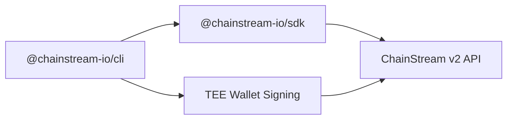

## ChainStream CLI とは

ChainStream CLI（`@chainstream-io/cli`）は、Solana、BSC、Ethereum 向けにオンチェーンデータを問い合わせ、DeFi 操作を実行するためのコマンドラインツールです。人間の開発者と AI エージェントの両方を想定して設計されています。

<CardGroup cols={2}>
  <Card title="データクエリ" icon="magnifying-glass" color="#4D9CFF">
    トークン検索、ウォレット分析、市場トレンドの追跡、直近の取引の問い合わせ
  </Card>
  <Card title="DeFi 実行" icon="right-left" color="#9333EA">
    トークンスワップ、ローンチパッドでのトークン作成、組み込みウォレット署名によるトランザクション送信
  </Card>
</CardGroup>

## インストール

グローバルインストールは不要です。`npx` でそのまま実行できます。

```bash
npx @chainstream-io/cli token search --keyword PUMP --chain sol
```

グローバルに入れる場合:

```bash
npm install -g @chainstream-io/cli
chainstream token search --keyword PUMP --chain sol
```

<Note>Node.js 18 以上が必要です。</Note>

## アーキテクチャ



- **SDK ベース** — すべての API 呼び出しは `@chainstream-io/sdk` 経由で、型付きレスポンス、自動リトライ、ジョールポーリングに対応
- **TEE 署名** — DeFi トランザクションは TEE（Trusted Execution Environment）上でリモート署名。デバイス用キーは `~/.config/chainstream/keys/` にローカル保存
- **API Key 優先** — x402 購入で API Key が設定に自動保存。ウォレット署名が必要なのは主に DeFi 実行時

## 対応チェーン

| チェーン | CLI ID | データ API | DeFi | WebSocket |
|-------|--------|----------|------|-----------|
| Solana | `sol` | あり | あり | あり |
| BSC | `bsc` | あり | あり | あり |
| Ethereum | `eth` | あり | あり | あり |

## CLI と MCP と SDK

| 機能 | CLI | MCP Server | SDK |
|------------|-----|------------|-----|
| トークン検索・分析 | あり | あり | あり |
| 市場トレンド・ランキング | あり | あり | あり |
| ウォレットプロファイル・PnL | あり | あり | あり |
| DEX 見積 | あり | あり | あり |
| DEX スワップ（署名） | あり | なし | あり（WalletSigner 使用時） |
| トークン作成 | あり | なし | あり（WalletSigner 使用時） |
| x402 自動決済 | あり | 該当なし | 手動 |
| 向いている用途 | AI エージェント、スクリプト、CI | AI チャットアシスタント | カスタムアプリ |

## クイックスタート

```bash
# 1. 認証（初回のみ）
npx @chainstream-io/cli login

# 2. トークン検索
npx @chainstream-io/cli token search --keyword PUMP --chain sol

# 3. トークンのセキュリティ確認
npx @chainstream-io/cli token security --chain sol --address <token_address>

# 4. トレンドトークンを表示
npx @chainstream-io/cli market trending --chain sol --duration 1h

# 5. ウォレットの PnL を分析
npx @chainstream-io/cli wallet pnl --chain sol --address <wallet_address>
```

## 次のステップ

<CardGroup cols={3}>
  <Card title="認証" icon="key" href="/jp/guides/cli/authentication">
    API Key またはウォログインの設定
  </Card>
  <Card title="コマンドリファレンス" icon="book" href="/jp/guides/cli/commands">
    コマンドとオプションの一覧
  </Card>
  <Card title="x402 決済" icon="credit-card" href="/jp/guides/cli/x402-payment">
    USDC でサブスクリプションを自動購入
  </Card>
</CardGroup>
