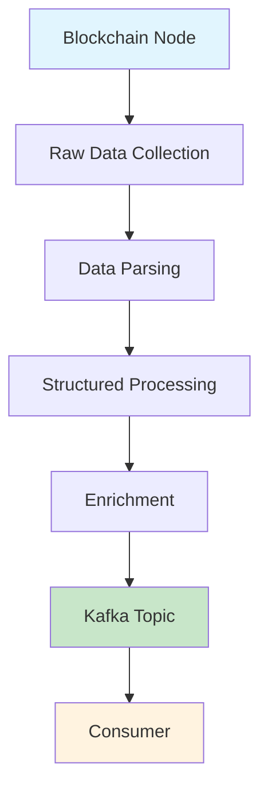

ChainStream은 Kafka Streams를 통해 멀티체인 실시간 온체인 데이터 스트림을 제공합니다. GraphQL Subscriptions 및 WebSocket과 비교하여, Kafka Streams는 지연 시간에 민감하고 높은 안정성이 요구되는 서버 사이드 애플리케이션 시나리오를 위해 설계되었으며, 더 낮은 지연 시간과 강력한 내결함성을 제공합니다.

<Card title="Protobuf 스키마 리포지토리" icon="github" href="https://github.com/chainstream-io/streaming_protobuf">
  공식 ChainStream Protobuf 스키마 정의로, Go와 Python을 지원하며, EVM, Solana, TRON의 모든 메시지 유형을 포함합니다.
</Card>

---

## 지원 매트릭스

| 체인 | dex.trades | tokens | balances | dex.pools | transfers | candlesticks |
|:---|:---:|:---:|:---:|:---:|:---:|:---:|
| Ethereum (eth) | ✅ | ✅ | ✅ | ✅ | ✅ | ✅ |
| BSC (bsc) | ✅ | ✅ | ✅ | ✅ | ✅ | ✅ |
| Solana (sol) | ✅ | ✅ | ✅ | ✅ | ✅ | ✅ |
| TRON (tron) | ✅ | ✅ | ✅ | ✅ | ✅ | ✅ |

<Note>
모든 체인은 `token-supplies`, `token-prices`, `token-holdings`, `token-market-caps`, `trade-stats` Topic도 지원합니다. 전체 Topic 목록을 참고하세요.
</Note>

---

## Kafka Streams vs WebSocket 선택 가이드

### Kafka Streams를 선택해야 할 때

<CardGroup cols={2}>
  <Card title="지연 시간 민감" icon="bolt">
    지연 시간이 최우선 관심사이며, 클라우드 또는 전용 서버에 배포된 애플리케이션
  </Card>
  <Card title="메시지 안정성" icon="shield-check">
    메시지 손실을 허용할 수 없으며, 내구성 있고 안정적인 데이터 소비가 필요
  </Card>
  <Card title="복잡한 처리" icon="gears">
    사전 처리 기능을 넘어서는 복잡한 연산, 필터링, 포맷팅이 필요
  </Card>
  <Card title="수평 확장" icon="server">
    소비 용량을 위한 멀티 인스턴스 수평 확장이 필요
  </Card>
</CardGroup>

### WebSocket을 선택해야 할 때

<CardGroup cols={2}>
  <Card title="빠른 프로토타이핑" icon="rocket">
    프로토타입 구축 중이며, 개발 속도가 최우선
  </Card>
  <Card title="통합 인터페이스" icon="plug">
    애플리케이션이 히스토리컬 데이터와 실시간 데이터를 통합된 쿼리/구독 인터페이스로 필요
  </Card>
  <Card title="브라우저 사이드" icon="browser">
    브라우저에서 직접 데이터를 소비하는 애플리케이션 (Kafka Streams는 서버 사이드만 지원)
  </Card>
  <Card title="동적 필터링" icon="filter">
    페이지 콘텐츠에 따라 동적으로 데이터를 필터링해야 함
  </Card>
</CardGroup>

### 비교 요약

| 기능 | Kafka Streams | WebSocket |
|:---|:---:|:---:|
| 지연 시간 | 최저 | 낮음 |
| 안정성 | 영구적, 메시지 손실 없음 | 연결 끊김 시 손실 가능 |
| 확장성 | 네이티브 수평 확장 | 추가 설계 필요 |
| 데이터 필터링 | 클라이언트 사이드 처리 | 서버 사이드 사전 필터링 |
| 클라이언트 지원 | 서버 사이드 전용 | 서버 + 브라우저 |
| 통합 복잡도 | 높음 | 낮음 |

---

## 자격 증명 발급

Kafka Streams는 독립적인 인증 자격 증명을 사용하며, ChainStream 팀에 연락하여 접근을 신청해야 합니다.

<Steps>
  <Step title="신청 연락">
    [support@chainstream.io](mailto:support@chainstream.io)로 이메일을 보내 Kafka Streams 접근을 신청하세요
  </Step>
  <Step title="자격 증명 수령">
    승인 후 다음 자격 증명 정보를 수령합니다:
    - 사용자 이름
    - 비밀번호
    - 브로커 주소 목록
  </Step>
  <Step title="연결 설정">
    수령한 자격 증명으로 Kafka 클라이언트 연결을 설정하세요
  </Step>
</Steps>

---

## 연결 설정

### 브로커 주소

<Note>
브로커 주소는 신청이 승인된 후 자격 증명과 함께 제공됩니다. 승인되지 않은 주소로 연결하지 마세요.
</Note>

### SASL_SSL 연결 설정

<Tabs>
  <Tab title="Python">
    ```python
    from kafka import KafkaConsumer

    consumer = KafkaConsumer(
        'eth.dex.trades',
        bootstrap_servers=['<your_broker_address>'],
        security_protocol='SASL_SSL',
        sasl_mechanism='SCRAM-SHA-512',
        sasl_plain_username='your_username',
        sasl_plain_password='your_password',
        auto_offset_reset='latest',
        enable_auto_commit=False,
        group_id='your_group_id'
    )
    ```
  </Tab>
  <Tab title="JavaScript">
    ```javascript
    const { Kafka } = require('kafkajs');

    const kafka = new Kafka({
      clientId: 'my-app',
      brokers: ['<your_broker_address>'],
      ssl: true,
      sasl: {
        mechanism: 'scram-sha-512',
        username: 'your_username',
        password: 'your_password'
      }
    });

    const consumer = kafka.consumer({ groupId: 'your_group_id' });
    ```
  </Tab>
  <Tab title="Go">
    ```go
    package main

    import (
        "github.com/segmentio/kafka-go"
        "github.com/segmentio/kafka-go/sasl/scram"
    )

    func main() {
        mechanism, _ := scram.Mechanism(scram.SHA512, "your_username", "your_password")
        
        reader := kafka.NewReader(kafka.ReaderConfig{
            Brokers: []string{"<your_broker_address>"},
            Topic:   "eth.dex.trades",
            GroupID: "your_group_id",
            Dialer: &kafka.Dialer{
                SASLMechanism: mechanism,
                TLS:           &tls.Config{},
            },
        })
    }
    ```
  </Tab>
</Tabs>

---

## Topic 네이밍 규칙 및 전체 목록

### 네이밍 규칙

Topic은 다음 네이밍 패턴을 따릅니다:

```
{chain}.{message_type}              # 원시 이벤트 데이터
{chain}.{message_type}.processed    # 처리된 데이터 (가격, 플래그, 보강 포함)
{chain}.{message_type}.created      # 생성 이벤트 (예: 토큰 생성)
```

여기서 `{chain}`은: `sol`, `bsc`, `eth`, `tron`

### 메시지 유형

| 유형 | 설명 |
|:---|:---|
| `dex.trades` | DEX 거래 이벤트 |
| `dex.pools` | 유동성 풀 이벤트 |
| `tokens` | 토큰 이벤트 |
| `balances` | 잔액 변경 이벤트 |
| `transfers` | 전송 이벤트 |
| `token-supplies` | 토큰 공급량 이벤트 |
| `token-prices` | 토큰 가격 이벤트 |
| `token-holdings` | 토큰 보유 데이터 |
| `token-market-caps` | 토큰 시가총액 이벤트 |
| `candlesticks` | OHLCV 캔들스틱 데이터 |
| `trade-stats` | 거래 통계 |

### 전체 Topic 목록

<Tabs>
  <Tab title="크로스체인 Topic">
    다음 Topic은 모든 지원 체인에 적용됩니다 (`{chain}`을 `sol`, `bsc`, `eth`로 대체):

    ```
    # DEX 거래
    {chain}.dex.trades
    {chain}.dex.trades.processed    # USD/네이티브 가격, 의심 플래그 포함

    # 토큰 이벤트
    {chain}.tokens
    {chain}.tokens.created          # 토큰 생성 이벤트
    {chain}.tokens.processed        # 설명, 이미지 URL, 소셜 링크 포함

    # 잔액 변경
    {chain}.balances
    {chain}.balances.processed      # USD/네이티브 가치 포함

    # 유동성 풀
    {chain}.dex.pools
    {chain}.dex.pools.processed     # 유동성 USD/네이티브 가치 포함

    # 토큰 데이터
    {chain}.token-supplies
    {chain}.token-supplies.processed
    {chain}.token-prices
    {chain}.token-holdings
    {chain}.token-market-caps.processed

    # 집계 데이터
    {chain}.candlesticks            # OHLCV 캔들스틱 데이터
    {chain}.trade-stats             # 거래 통계
    ```
  </Tab>
  <Tab title="Solana 전용">
    ```
    # 전송 이벤트
    sol.transfers
    sol.transfers.processed         # USD/네이티브 가치 포함
    ```
  </Tab>
  <Tab title="EVM 전용">
    ```
    # 전송 메시지 (BSC / ETH)
    {chain}.v1.transfers.proto
    {chain}.v1.transfers.processed.proto
    ```
  </Tab>
  <Tab title="TRON 전용">
    ```
    # 전송 메시지
    tron.v1.transfers.proto
    tron.v1.transfers.processed.proto
    ```
  </Tab>
</Tabs>

<Tip>
전체 Protobuf 스키마 및 Topic 매핑은 [streaming_protobuf 리포지토리](https://github.com/chainstream-io/streaming_protobuf)를 참고하세요.
</Tip>

---

## 소비 모드 및 오프셋 관리

Topic을 구독할 때 고려해야 할 두 가지 핵심 설정:

### 오프셋 전략 선택

컨슈머는 Kafka에 연결한 후 어디서부터 메시지를 읽기 시작할지 결정해야 합니다. 두 가지 일반적인 전략:

<Tabs>
  <Tab title="최신만 소비">
    연결할 때마다 현재 최신 위치에서 시작하며, 실시간 데이터만 중요한 시나리오에 적합합니다. 재연결 시 히스토리컬 메시지 리플레이 없음.

    ```javascript
    {
      autoCommit: false,
      fromBeginning: false,
      'auto.offset.reset': 'latest'
    }
    ```
  </Tab>
  <Tab title="영구적 소비">
    오프셋을 자동 커밋하며, 재연결 시 마지막으로 소비된 위치에서 계속하여 메시지 손실을 방지합니다.

    ```javascript
    {
      autoCommit: true,
      fromBeginning: false,
      'auto.offset.reset': 'latest'
    }
    ```

    <Warning>
    서비스가 재시작되면 마지막으로 기록된 오프셋에서 읽기를 계속합니다. 재시작 중 메시지가 복구 후 백로그를 발생시킬 수 있습니다.
    </Warning>
  </Tab>
</Tabs>

### Group ID 규칙

동일한 Group ID로 여러 인스턴스를 배포하면 장애 조치 및 로드 밸런싱이 가능합니다 — 같은 topic의 메시지는 Group 내 한 인스턴스에서만 소비되며, Kafka가 자동으로 인스턴스 간 파티션을 배분합니다.

<Tip>
각 topic에 대해 독립적인 컨슈머를 두는 것을 추천합니다. 서로 다른 topic은 메시지 파싱 로직이 다르기 때문입니다.
</Tip>

---

## 빠른 시작: 5분 만에 첫 번째 컨슈머

다음 예시는 `eth.dex.trades` topic을 소비하고 DEX 거래 데이터를 파싱하는 방법을 보여줍니다.

<Steps>
  <Step title="Protobuf 스키마 가져오기">
    공식 리포지토리에서 스키마 정의를 클론합니다:

    ```bash
    git clone https://github.com/chainstream-io/streaming_protobuf.git
    ```

    또는 프로젝트에 Git 서브모듈로 추가:

    ```bash
    git submodule add https://github.com/chainstream-io/streaming_protobuf.git
    ```
  </Step>
  <Step title="의존성 설치">
    ```bash
    pip install kafka-python protobuf
    ```
  </Step>
  <Step title="설정 및 소비">
    ```python
    from kafka import KafkaConsumer
    from common import trade_event_pb2  # streaming_protobuf 리포지토리에서 가져오기

    # 컨슈머 생성
    consumer = KafkaConsumer(
        'eth.dex.trades',
        bootstrap_servers=['<your_broker_address>'],
        security_protocol='SASL_SSL',
        sasl_mechanism='SCRAM-SHA-512',
        sasl_plain_username='your_username',
        sasl_plain_password='your_password',
        auto_offset_reset='latest',
        enable_auto_commit=False,
        group_id='my-dex-consumer'
    )

    # 메시지 소비
    for message in consumer:
        # protobuf 메시지 파싱
        trade_events = trade_event_pb2.TradeEvents()
        trade_events.ParseFromString(message.value)
        
        # DEX 거래 정보 출력
        for event in trade_events.events:
            print(f"Pool: {event.trade.pool_address}")
            print(f"Token A: {event.trade.token_a_address}")
            print(f"Token B: {event.trade.token_b_address}")
            print(f"Amount A: {event.trade.user_a_amount}")
            print(f"Amount B: {event.trade.user_b_amount}")
            print(f"Block: {event.block.height}")
            print("---")
    ```
  </Step>
</Steps>

---

## 핵심 데이터 구조

모든 메시지 유형은 다음 기본 구조를 공유합니다 (`common/common.proto`에 정의):

### 기본 구조

<Tabs>
  <Tab title="Block">
    블록 정보:

    | 필드 | 타입 | 설명 |
    |:---|:---|:---|
    | `timestamp` | int64 | 블록 타임스탬프 |
    | `hash` | string | 블록 해시 |
    | `height` | uint64 | 블록 높이 |
    | `slot` | uint64 | 슬롯 번호 (Solana) |
  </Tab>
  <Tab title="Transaction">
    트랜잭션 정보:

    | 필드 | 타입 | 설명 |
    |:---|:---|:---|
    | `fee` | uint64 | 트랜잭션 수수료 |
    | `fee_payer` | string | 수수료 지불자 |
    | `index` | uint32 | 블록 내 인덱스 |
    | `signature` | string | 트랜잭션 서명 |
    | `signer` | string | 서명자 주소 |
    | `status` | Status | 실행 상태 (SUCCESS/FAILED) |
    | `bundles` | []BundleTransaction | 번들 정보 (MEV 탐지) |
  </Tab>
  <Tab title="Instruction">
    인스트럭션 정보:

    | 필드 | 타입 | 설명 |
    |:---|:---|:---|
    | `index` | uint32 | 인스트럭션 인덱스 |
    | `is_inner_instruction` | bool | 내부 인스트럭션 여부 |
    | `inner_instruction_index` | uint32 | 내부 인스트럭션 인덱스 |
    | `type` | string | 인스트럭션 유형 |
  </Tab>
  <Tab title="DApp">
    DApp 정보:

    | 필드 | 타입 | 설명 |
    |:---|:---|:---|
    | `program_address` | string | 프로그램 주소 |
    | `inner_program_address` | string | 내부 프로그램 주소 |
    | `chain` | Chain | 체인 식별자 |
  </Tab>
</Tabs>

### 주요 메시지 유형

<AccordionGroup>
  <Accordion title="TradeEvent - DEX 거래 이벤트">
    **Topic**: `{chain}.dex.trades`

    ```protobuf
    message TradeEvent {
      Instruction instruction = 1;
      Block block = 2;
      Transaction transaction = 3;
      DApp d_app = 4;
      Trade trade = 100;
      BondingCurve bonding_curve = 110;
      TradeProcessed trade_processed = 200;  // processed topic에 포함
    }
    ```

    **Trade 핵심 필드**:

    | 필드 | 설명 |
    |:---|:---|
    | `token_a_address` / `token_b_address` | 거래쌍 토큰 주소 |
    | `user_a_amount` / `user_b_amount` | 사용자 거래 금액 |
    | `pool_address` | 풀 주소 |
    | `vault_a` / `vault_b` | 풀 볼트 주소 |
    | `vault_a_amount` / `vault_b_amount` | 볼트 금액 |

    **TradeProcessed 보강 필드** (processed topic):

    | 필드 | 설명 |
    |:---|:---|
    | `token_a_price_in_usd` / `token_b_price_in_usd` | USD 가격 |
    | `token_a_price_in_native` / `token_b_price_in_native` | 네이티브 통화 가격 |
    | `is_token_a_price_in_usd_suspect` | 가격 의심 여부 |
    | `is_token_a_price_in_usd_suspect_reason` | 의심 사유 |
  </Accordion>

  <Accordion title="TokenEvent - 토큰 이벤트">
    **Topic**: `{chain}.tokens`, `{chain}.tokens.created`

    ```protobuf
    message TokenEvent {
      Instruction instruction = 1;
      Block block = 2;
      Transaction transaction = 3;
      DApp d_app = 4;
      EventType type = 100;        // CREATED, UPDATED
      Token token = 101;
      TokenProcessed token_processed = 200;
    }
    ```

    **Token 핵심 필드**:

    | 필드 | 설명 |
    |:---|:---|
    | `address` | 토큰 주소 |
    | `name` / `symbol` | 이름 및 심볼 |
    | `decimals` | 소수점 자릿수 |
    | `uri` | 메타데이터 URI |
    | `metadata_address` | 메타데이터 주소 |
    | `creators` | 생성자 목록 |
    | `solana_extra` | Solana 전용 필드 |
    | `evm_extra` | EVM 전용 필드 (token_standard) |
  </Accordion>

  <Accordion title="BalanceEvent - 잔액 변경 이벤트">
    **Topic**: `{chain}.balances`

    ```protobuf
    message BalanceEvent {
      Instruction instruction = 1;
      Block block = 2;
      Transaction transaction = 3;
      DApp d_app = 4;
      Balance balance = 100;
      BalanceProcessed balance_processed = 200;
    }
    ```

    **Balance 핵심 필드**:

    | 필드 | 설명 |
    |:---|:---|
    | `token_account_address` | 토큰 계정 주소 |
    | `account_owner_address` | 계정 소유자 주소 |
    | `token_address` | 토큰 주소 |
    | `pre_amount` / `post_amount` | 변경 전/후 잔액 |
    | `decimals` | 소수점 자릿수 |
    | `lifecycle` | 계정 라이프사이클 (NEW/EXISTING/CLOSED) |
  </Accordion>

  <Accordion title="DexPoolEvent - 유동성 풀 이벤트">
    **Topic**: `{chain}.dex.pools`

    ```protobuf
    message DexPoolEvent {
      Instruction instruction = 1;
      Block block = 2;
      Transaction transaction = 3;
      DApp d_app = 4;
      DexPoolEventType type = 100;  // INITIALIZE, INCREASE_LIQUIDITY, DECREASE_LIQUIDITY, SWAP
      DexPool pool = 101;
      DexPoolProcessed pool_processed = 200;
    }
    ```

    **DexPool 핵심 필드**:

    | 필드 | 설명 |
    |:---|:---|
    | `address` | 풀 주소 |
    | `token_a_address` / `token_b_address` | 토큰 주소 |
    | `token_a_vault_address` / `token_b_vault_address` | 볼트 주소 |
    | `token_a_amount` / `token_b_amount` | 토큰 금액 |
    | `lp_wallet` | LP 지갑 주소 |
  </Accordion>

  <Accordion title="CandlestickEvent - 캔들스틱 데이터">
    **Topic**: `{chain}.candlesticks`

    | 필드 | 설명 |
    |:---|:---|
    | `token_address` | 토큰 주소 |
    | `resolution` | 시간 해상도 (1m, 5m, 15m, 1h 등) |
    | `timestamp` | 타임스탬프 |
    | `open` / `high` / `low` / `close` | OHLC 가격 (USD) |
    | `open_in_native` / `high_in_native` / `low_in_native` / `close_in_native` | OHLC 가격 (네이티브) |
    | `volume` / `volume_in_usd` / `volume_in_native` | 거래량 |
    | `trades` | 거래 건수 |
    | `dimension` | 차원 유형 (TOKEN_ADDRESS/POOL_ADDRESS/PAIR) |
  </Accordion>

  <Accordion title="TradeStatEvent - 거래 통계">
    **Topic**: `{chain}.trade-stats`

    | 필드 | 설명 |
    |:---|:---|
    | `token_address` | 토큰 주소 |
    | `resolution` | 시간 해상도 |
    | `buys` / `sells` | 매수/매도 건수 |
    | `buyers` / `sellers` | 매수자/매도자 수 |
    | `buy_volume` / `sell_volume` | 매수/매도 거래량 |
    | `buy_volume_in_usd` / `sell_volume_in_usd` | USD 거래량 |
    | `high_in_usd` / `low_in_usd` | 고가/저가 |
  </Accordion>

  <Accordion title="TokenHoldingEvent - 보유 통계">
    **Topic**: `{chain}.token-holdings`

    | 필드 그룹 | 설명 |
    |:---|:---|
    | `top10_holders` / `top10_amount` / `top10_ratio` | 상위 10명 홀더 통계 |
    | `top50_holders` / `top50_amount` / `top50_ratio` | 상위 50명 홀더 통계 |
    | `top100_holders` / `top100_amount` / `top100_ratio` | 상위 100명 홀더 통계 |
    | `holders` | 총 홀더 수 |
    | `creators_count` / `creators_amount` / `creators_ratio` | 생성자 보유 통계 |
    | `fresh_count` / `fresh_amount` / `fresh_ratio` | 신규 지갑 보유 통계 |
    | `smart_count` / `smart_amount` / `smart_ratio` | 스마트 머니 보유 통계 |
    | `sniper_count` / `sniper_amount` / `sniper_ratio` | 스나이퍼 보유 통계 |
    | `insider_count` / `insider_amount` / `insider_ratio` | 인사이더 보유 통계 |
  </Accordion>

  <Accordion title="TokenPriceEvent - 가격 이벤트">
    **Topic**: `{chain}.token-prices`

    | 필드 | 설명 |
    |:---|:---|
    | `token_address` | 토큰 주소 |
    | `price_in_usd` | USD 가격 |
    | `price_in_native` | 네이티브 통화 가격 |
  </Accordion>

  <Accordion title="TokenSupplyEvent - 공급량 이벤트">
    **Topic**: `{chain}.token-supplies`

    | 필드 | 설명 |
    |:---|:---|
    | `type` | 이벤트 유형 (INITIALIZE_MINT/MINT/BURN) |
    | `token_address` | 토큰 주소 |
    | `amount` | 금액 |
    | `decimals` | 소수점 자릿수 |
    | `amount_with_decimals` | 소수점 포함 금액 |
  </Accordion>
</AccordionGroup>

<Tip>
전체 Protobuf 정의는 [streaming_protobuf 리포지토리](https://github.com/chainstream-io/streaming_protobuf)를 참고하세요.
</Tip>

---

## 메시지 특성 및 주의사항

Kafka Streams를 소비할 때 개발자가 알아야 할 메시지 특성:

<AccordionGroup>
  <Accordion title="필터링되지 않은 완전한 데이터 스트림">
    스트림은 사전 필터링하지 않으며, topic 내의 모든 메시지와 완전한 데이터를 포함합니다. 이는 컨슈머에 충분한 네트워크 처리량, 서버 성능, 효율적인 파싱 코드가 필요하다는 것을 의미합니다.
  </Accordion>
  
  <Accordion title="동일 엔티티 메시지는 정렬됨">
    **동일 토큰 또는 동일 계정의 메시지는 블록 순서로 엄격하게 도착합니다**. 이는 특정 토큰이나 지갑 주소의 이벤트 스트림이 순서가 보장되어 상태 변경을 추적하기 쉽다는 것을 의미합니다. 다만 서로 다른 토큰/계정 간의 메시지 도착 순서는 보장되지 않습니다.
  </Accordion>
  
  <Accordion title="메시지가 중복될 수 있음">
    동일한 메시지가 여러 번 전달될 수 있습니다. 중복 처리가 문제를 일으키는 경우, 컨슈머는 멱등 처리를 위한 캐시 또는 스토리지를 유지해야 합니다.
  </Accordion>
  
  <Accordion title="메시지 무결성 보장">
    ChainStream은 각 메시지의 무결성을 보장합니다. 메시지는 분할되지 않습니다. 블록에 포함된 트랜잭션 수에 관계없이 수신하는 메시지는 완전한 데이터 단위입니다.
  </Accordion>
  
  <Accordion title="Protobuf 바이너리 형식">
    메시지는 Protobuf 인코딩을 사용하며 JSON보다 더 컴팩트합니다. 컨슈머는 해당 언어의 Protobuf 라이브러리를 사용하여 파싱해야 합니다.
  </Accordion>
</AccordionGroup>

---

## 지연 시간 모델

Kafka Streams 지연 시간은 파이프라인에서 데이터가 통과하는 처리 단계에 따라 달라집니다. 같은 체인의 서로 다른 topic은 서로 다른 지연 시간을 가집니다:



### Broadcasted vs Committed

| 유형 | 설명 | 지연 시간 | 데이터 확실성 |
|:---|:---|:---:|:---:|
| Broadcasted | 브로드캐스트 단계에서 소비 가능한 트랜잭션, 블록 확인 불필요 | 최저 | 낮음 |
| Committed | 블록 확인 후에만 스트림에 진입하는 트랜잭션 | 높음 | 최고 |

### 파이프라인 지연 시간

블록체인 노드에서 Kafka topic까지의 각 변환 레이어(파싱, 구조화, 보강)는 약 100-1000ms의 지연 시간을 추가합니다:

- **raw topic**: 최저 지연 시간, 원시 노드 데이터에 가장 가까움
- **transactions topic**: 파싱 및 구조화됨
- **dextrades topic**: 상대적으로 높은 지연 시간이지만 더 풍부한 데이터

<Tip>
지연 시간이 최우선 관심사라면, 효과적으로 파싱할 수 있는 원시 데이터에 가장 가까운 topic을 선호하세요.
</Tip>

---

## 모범 사례

### 병렬 파티션 소비

Kafka topic은 여러 파티션으로 나뉘며, 처리량을 최대화하려면 각 파티션을 병렬로 읽어야 합니다.

메시지 파티션 키는 **토큰 주소** 또는 **지갑 주소** (모든 체인에서 통일)로 설정되어 다음을 보장합니다:
- 동일 토큰의 모든 이벤트가 같은 파티션으로 라우팅되어 순서 보장
- 동일 지갑의 모든 잔액 변경이 같은 파티션으로 라우팅되어 상태 추적 용이

로드 밸런싱을 위해 각 파티션에 독립적인 스레드를 할당하는 것을 추천합니다.

### 지속적 소비, 메인 루프 차단 금지

컨슈머의 읽기 루프는 지속적으로 실행되어야 하며, 메시지 처리가 차단되어 백로그가 발생하는 것을 피해야 합니다. 메시지 처리가 필요한 경우 비동기 처리 모드를 채택하세요: 메인 루프는 읽기만 담당하고, 처리 로직은 워커 스레드에 위임합니다.

### 메시지 처리 효율성

배치 처리는 오버헤드를 줄일 수 있지만 배치 크기와 지연 시간의 균형을 맞춰야 합니다. Go에서는 channel + 워커 그룹으로 동시 처리를 수행하세요.

---

## 체인별 문서

<CardGroup cols={3}>
  <Card title="EVM Streams" icon="ethereum" href="/ko/guides/data-concepts/kafka-streams/evm-streams">
    Ethereum, BSC, Base, Polygon, Optimism
  </Card>
  <Card title="Solana Streams" icon="circle-s" href="/ko/guides/data-concepts/kafka-streams/solana-streams">
    Solana 고처리량 데이터 스트림
  </Card>
  <Card title="TRON Streams" icon="circle-t" href="/ko/guides/data-concepts/kafka-streams/tron-streams">
    TRON 네트워크 데이터 스트림
  </Card>
</CardGroup>

---

## 관련 문서

<CardGroup cols={2}>
  <Card title="실시간 스트리밍" icon="bolt" href="/ko/guides/data-concepts/realtime-streaming">
    WebSocket 실시간 데이터 통합 가이드
  </Card>
  <Card title="인증 가이드" icon="key" href="/ko/guides/getting-started/authentication">
    Access Token 발급
  </Card>
</CardGroup>
