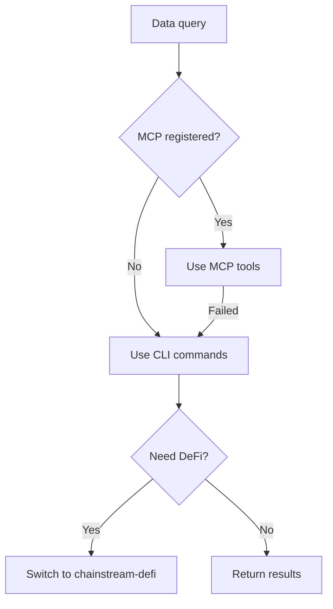
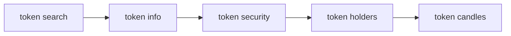
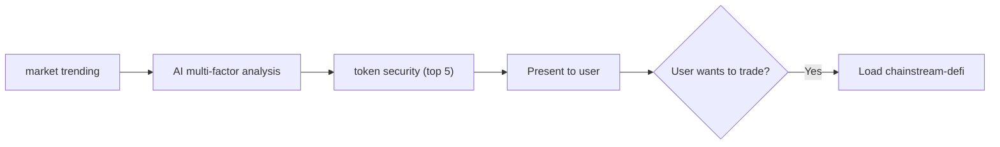
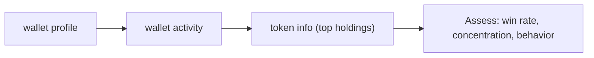

## 개요

`chainstream-data` 스킬은 Solana, BSC, Ethereum 전반에 걸친 읽기 전용 온체인 데이터 기능을 제공합니다. 토큰 분석, 시장 순위, 지갑 프로파일링, WebSocket 스트리밍을 지원합니다.

- **패턴**: Tool (읽기 전용, 서명 불필요)
- **MCP Server**: `https://mcp.chainstream.io/mcp` (17개 도구)
- **CLI**: `npx @chainstream-io/cli`
- **API Base**: `https://api.chainstream.io`

## 통합 경로

이 스킬은 의사결정 트리를 사용하여 적절한 실행 채널로 라우팅합니다:



## 채널 매트릭스

| 작업 | MCP 도구 | CLI 명령어 | SDK 메서드 |
|-----------|----------|-------------|------------|
| 토큰 검색 | `tokens_search` | `token search` | `client.token.search` |
| 토큰 분석 | `tokens_analyze` | `token info` | `client.token.getToken` |
| 보안 점검 | `tokens_analyze` | `token security` | `client.token.getSecurity` |
| 상위 홀더 | `tokens_analyze` | `token holders` | `client.token.getHolders` |
| 가격 이력 (K선) | `tokens_price_history` | `token candles` | `client.token.getCandles` |
| 유동성 풀 | `tokens_discover` | `token pools` | `client.token.getPools` |
| 인기 토큰 | `market_trending` | `market trending` | `client.ranking.*` |
| 신규 상장 | `market_trending` | `market new` | `client.ranking.*` |
| 최근 거래 | `trades_recent` | `market trades` | `client.trade.*` |
| 지갑 프로필 | `wallets_profile` | `wallet profile` | `client.wallet.*` |
| 지갑 PnL | `wallets_profile` | `wallet pnl` | `client.wallet.*` |
| 토큰 잔액 | `wallets_profile` | `wallet holdings` | `client.wallet.*` |
| 전송 이력 | `wallets_activity` | `wallet activity` | `client.wallet.*` |
| DEX 시세 | `dex_quote` | `dex route` | `client.dex.quote` |

## AI 워크플로우

### 토큰 리서치

완전한 토큰 분석 흐름입니다 — 토큰을 추천하기 전에 반드시 보안 점검을 수행하세요.



<Tabs>
  <Tab title="CLI">
    ```bash
    npx @chainstream-io/cli token search --keyword PUMP --chain sol
    npx @chainstream-io/cli token info --chain sol --address <addr>
    npx @chainstream-io/cli token security --chain sol --address <addr>
    npx @chainstream-io/cli token holders --chain sol --address <addr>
    npx @chainstream-io/cli token candles --chain sol --address <addr> --resolution 1h
    ```
  </Tab>
  <Tab title="MCP">
    ```
    tokens_search { "query": "PUMP", "chain": "solana" }
    tokens_analyze { "chain": "solana", "address": "<addr>" }
    tokens_price_history { "chain": "solana", "address": "<addr>", "resolution": "1h" }
    ```
  </Tab>
</Tabs>

### 시장 탐색

인기 토큰을 찾고, 다중 팩터 분석을 적용한 후 상위 후보에 대해 보안 점검을 수행합니다.



<Tabs>
  <Tab title="CLI">
    ```bash
    npx @chainstream-io/cli market trending --chain sol --duration 1h --limit 50
    # AI가 분석: 스마트 머니 시그널, 거래량, 모멘텀, 안전성
    npx @chainstream-io/cli token security --chain sol --address <candidate_1>
    npx @chainstream-io/cli token security --chain sol --address <candidate_2>
    ```
  </Tab>
  <Tab title="MCP">
    ```
    market_trending { "chain": "solana", "duration": "1h", "limit": 50 }
    tokens_analyze { "chain": "solana", "address": "<candidate>" }
    ```
  </Tab>
</Tabs>

### 지갑 프로파일링

지갑의 성과, 보유 자산, 거래 행동을 분석합니다.



<Tabs>
  <Tab title="CLI">
    ```bash
    npx @chainstream-io/cli wallet profile --chain sol --address <wallet>
    npx @chainstream-io/cli wallet activity --chain sol --address <wallet>
    npx @chainstream-io/cli token info --chain sol --address <top_holding>
    ```
  </Tab>
  <Tab title="MCP">
    ```
    wallets_profile { "chain": "solana", "address": "<wallet>" }
    wallets_activity { "chain": "solana", "address": "<wallet>" }
    ```
  </Tab>
</Tabs>

## 안전 규칙

<Warning>
이 규칙들은 데이터 정확성과 책임 있는 AI 행동을 보장하기 위해 스킬에 의해 강제 적용됩니다.
</Warning>

| 규칙 | 이유 |
|------|--------|
| 학습 데이터로 가격 질문에 답변 금지 | 암호화폐 가격은 수초 내에 오래되므로 항상 라이브 API 호출 필요 |
| 추천 전 반드시 `token security` 실행 | ChainStream의 리스크 모델이 허니팟, 러그풀, 집중도 시그널을 커버 |
| 요청하지 않는 한 MCP에 `format: "detailed"` 전달 금지 | `concise`보다 4-10배 많은 데이터를 반환하여 컨텍스트 윈도우 낭비 |
| `/multi` 엔드포인트에 50개 이상 주소 일괄 처리 금지 | API 하드 리밋 |
| 공개 RPC를 대체 수단으로 사용 금지 | 결과가 다르며 ChainStream 전용 보강 데이터 누락 |

## 오류 복구

| 오류 | 복구 방법 |
|-------|----------|
| 401 / "Not authenticated" | API Key를 설정하거나 `chainstream login` 실행 |
| 402 / "Payment required" | [x402 결제 흐름](/ko/guides/cli/x402-payment) 참조 |
| 429 / Rate limit | 1초 대기 후 지수 백오프 |
| 5xx / 서버 오류 | 2초 후 1회 재시도 |

## 관련 문서

<CardGroup cols={2}>
  <Card title="chainstream-defi" icon="right-left" href="/ko/guides/ai-infrastructure/agent-skills/chainstream-defi">
    리서치 후 트레이딩 실행
  </Card>
  <Card title="CLI 명령어" icon="terminal" href="/ko/guides/cli/commands">
    전체 CLI 명령어 레퍼런스
  </Card>
</CardGroup>
