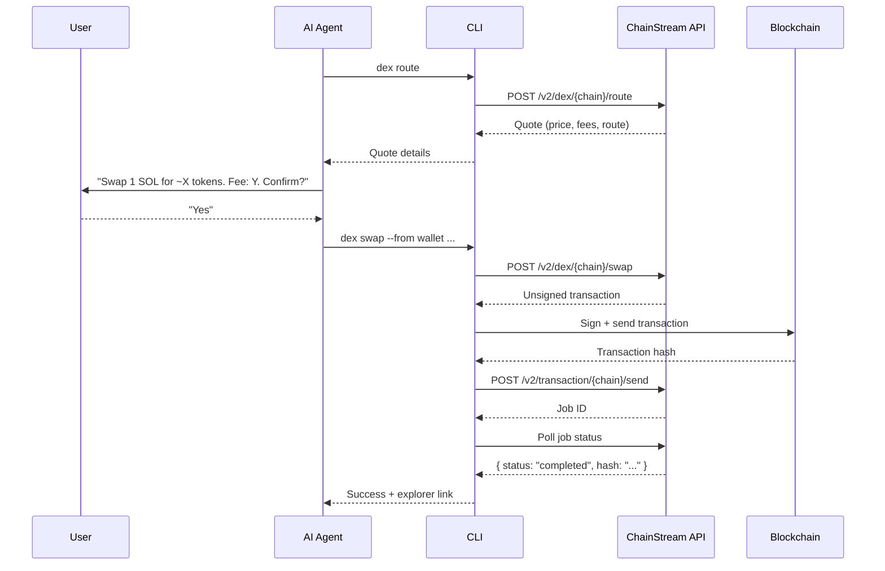
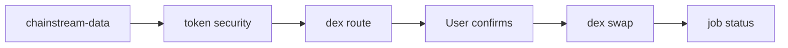

<Warning>
모든 DeFi 작업은 **실제이며 비가역적**입니다. 이 스킬은 모든 파괴적 작업 전에 사용자의 명시적 확인을 요구합니다. 트랜잭션을 자동 실행하지 마세요.
</Warning>

## 개요

`chainstream-defi` 스킬은 Solana, BSC, Ethereum 전반에 걸친 온체인 DeFi 실행을 처리합니다. DEX 토큰 스왑, 런치패드 토큰 생성, 서명된 트랜잭션 브로드캐스트를 지원합니다.

- **패턴**: Process (파괴적, 서명 필요)
- **CLI**: `npx @chainstream-io/cli` (주요 실행 경로)
- **SDK**: `@chainstream-io/sdk` + `WalletSigner`
- **MCP**: 시세, 스왑, 생성 도구 사용 가능 — 단, 온체인 실행은 호스트 측에서 지갑 기반 인증 필요

## 지갑 요구사항

DeFi 작업에는 트랜잭션에 서명할 수 있는 지갑이 필요합니다:

| 경로 | 서명 방식 | 설정 |
|------|---------|-------|
| CLI + TEE 지갑 | TEE 기반 서명 | `chainstream login` |
| CLI + 원시 키 | 로컬 서명 | `chainstream wallet set-raw --chain base` |
| SDK + WalletSigner | 커스텀 서명 | `signMessage` + `signTypedData` 구현 |
| MCP 단독 | **지원 안 됨** | MCP에는 지갑이 없음 — CLI 또는 SDK 사용 |
| API Key 단독 | **지원 안 됨** | API Key로는 서명 불가 — `chainstream login` 실행 |

## 4단계 프로토콜

모든 파괴적 DeFi 작업은 엄격한 4단계 프로토콜을 따릅니다:



### 1단계: 시세 조회

실행 전에 가격 시세를 받습니다. 읽기 전용이며 안전합니다.

```bash
chainstream dex route --chain sol --from <wallet> --input-token SOL --output-token <addr> --amount 1000000
```

### 2단계: 사용자 확인

**필수입니다.** 시세 요약을 사용자에게 보여주고 명시적 승인을 기다립니다:

- 입력 수량 및 토큰
- 예상 출력 수량
- 가격 영향 및 수수료
- 슬리피지 허용 범위

### 3단계: 서명 및 전송

확인 후 스왑을 실행합니다. CLI가 설정된 지갑을 통해 서명을 처리합니다.

```bash
chainstream dex swap --chain sol --from <wallet> --input-token SOL --output-token <addr> --amount 1000000
```

### 4단계: 작업 폴링

CLI가 작업 완료까지 자동으로 폴링하고 익스플로러 링크와 함께 트랜잭션 해시를 출력합니다.

```bash
# 수동 폴링 (필요한 경우)
chainstream job status --id <job_id> --wait
```

## 지원 작업

### 토큰 스왑

```bash
# 먼저 라우트 + 미서명 트랜잭션 조회
chainstream dex route --chain sol --from <wallet> --input-token SOL --output-token <token> --amount 1000000

# 사용자 확인 후 스왑 실행
chainstream dex swap --chain sol --from <wallet> --input-token SOL --output-token <token> --amount 1000000 --slippage 5
```

### 토큰 생성 (런치패드)

```bash
chainstream dex create --chain sol --name "My Token" --symbol MTK --uri <metadata_uri> --dex pumpfun
```

### 작업 상태 확인

```bash
chainstream job status --id <job_id> --wait --timeout 60000
```

## 블록 익스플로러

트랜잭션 성공 후 CLI가 익스플로러 링크를 출력합니다:

| 체인 | 익스플로러 URL |
|-------|-------------|
| Solana | `https://solscan.io/tx/{hash}` |
| BSC | `https://bscscan.com/tx/{hash}` |
| Ethereum | `https://etherscan.io/tx/{hash}` |

## 통화 변환

일반적인 토큰 식별자:

| 토큰 | Solana 주소 | EVM 주소 |
|-------|---------------|-------------|
| SOL (네이티브) | `So11111111111111111111111111111111111111112` | — |
| BNB (네이티브) | — | `0xEeeeeEeeeEeEeeEeEeEeeEEEeeeeEeeeeeeeEEeE` |
| ETH (네이티브) | — | `0xEeeeeEeeeEeEeeEeEeEeeEEEeeeeEeeeeeeeEEeE` |
| USDC (Solana) | `EPjFWdd5AufqSSqeM2qN1xzybapC8G4wEGGkZwyTDt1v` | — |
| USDC (Base) | — | `0x833589fCD6eDb6E08f4c7C32D4f71b54bdA02913` |

## 안전 규칙

<Warning>
이 규칙들은 협상 불가이며 스킬에 의해 강제 적용됩니다.
</Warning>

| 규칙 | 이유 |
|------|--------|
| **시세 조회 없이 스왑 금지** | 사용자가 커밋하기 전에 가격을 확인해야 함 |
| **사용자 동의를 추정하지 말 것** | 모든 파괴적 작업에 명시적 "예"가 필요 |
| **수수료나 가격 영향을 숨기지 말 것** | 비용에 대한 완전한 투명성 필요 |
| **프로덕션에서 `--yes` 플래그 사용 금지** | 확인 건너뛰기는 자동화 테스트 전용 |
| **주소를 항상 검증할 것** | Solana: base58, 32-44자; EVM: `0x` + 40자 hex |
| **외부 가격 데이터를 신뢰하지 말 것** | 항상 ChainStream의 시세 엔드포인트 사용 |

## 오류 복구

| 오류 | 복구 방법 |
|-------|----------|
| 슬리피지 초과 | `--slippage`를 늘리거나 새 시세로 재시도 |
| 잔액 부족 | `wallet balance --chain <chain>` 확인 |
| 트랜잭션 실패 | 익스플로러에서 실패 사유 확인; 자동 재시도 금지 |
| 작업 타임아웃 | `job status --id <id>` 확인 — 아직 처리 중일 수 있음 |
| 402 결제 필요 | CLI가 [x402 결제](/ko/docs/platform/billing-payments/x402-payments)를 통해 자동 처리 |
| 서명 무효 | `chainstream login`으로 재로그인 |

## 트레이딩 전 리서치

DeFi 작업을 실행하기 전에 항상 `chainstream-data`로 리서치하세요:



## 관련 문서

<CardGroup cols={2}>
  <Card title="chainstream-data" icon="magnifying-glass" href="/ko/docs/ai-agents/agent-skills/chainstream-data">
    트레이딩 전 토큰 리서치
  </Card>
  <Card title="chainstream-graphql" icon="diagram-project" href="/ko/docs/ai-agents/agent-skills/chainstream-graphql">
    커스텀 GraphQL을 통한 심층 분석
  </Card>
  <Card title="CLI 명령어" icon="terminal" href="/ko/api-reference/cli-commands/overview">
    전체 CLI 명령어 레퍼런스
  </Card>
</CardGroup>
