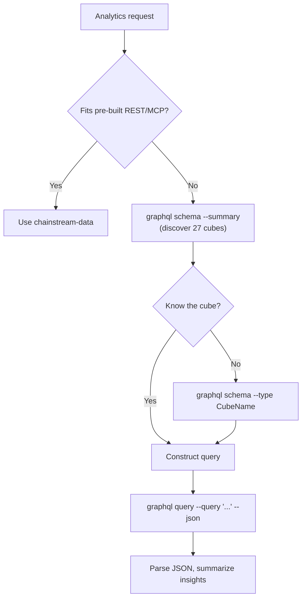

## 개요

`chainstream-graphql` 스킬은 AI 에이전트에게 GraphQL을 통한 ChainStream 온체인 데이터 웨어하우스에 대한 유연한 SQL 유사 접근을 제공합니다. 사전 구축된 REST/MCP 엔드포인트로 표현력이 부족할 때 — 큐브 간 JOIN, 커스텀 집계, 다중 조건 필터, 커스텀 시계열 해상도, 또는 GraphQL로만 노출된 데이터(예: PolyMarket 예측 큐브) — 적합한 도구입니다.

- **패턴**: Tool (읽기 전용, 서명 불필요)
- **엔드포인트**: `https://graphql.chainstream.io/graphql` (APISIX 경유)
- **CLI**: `npx @chainstream-io/cli graphql`
- **인증**: `X-API-KEY`를 통한 API Key 또는 SIWX 지갑 토큰
- **결제**: REST와 동일한 API Key / 구독 풀 (CLI가 x402 / MPP 자동 처리)
- **범위**: 3개 체인 그룹에 걸친 27개 큐브 — `Solana`, `EVM(network: eth | bsc | polygon)`, `Trading`

## 사용 시점

`chainstream-data`와의 결정 매트릭스:

| 시나리오 | 사용 | 이유 |
|----------|-----|-----|
| 표준 토큰 검색, 시장 트렌딩, 지갑 프로필 | `chainstream-data` | 사전 구축된 REST / MCP 엔드포인트, 더 간단 |
| 큐브 간 JOIN (trades + transfers, pools + events) | **chainstream-graphql** | `joinXxx` 지원 |
| 커스텀 집계 (`groupBy`와 함께 count / sum / avg) | **chainstream-graphql** | 메트릭 + 차원 그룹화 |
| 다중 조건 필터 (중첩, `any`를 통한 OR) | **chainstream-graphql** | 전체 필터 연산자 세트 |
| 커스텀 해상도 / 버킷의 시계열 | **chainstream-graphql** | 시간 구간 버킷팅 |
| 예측 시장 데이터 (Polygon의 PolyMarket) | **chainstream-graphql** | `PredictionTrades / Managements / Settlements` 큐브 |

## 통합 경로



## 채널 매트릭스

GraphQL은 서로 다른 호출자로부터 접근되는 단일 표면입니다:

| 작업 | CLI 명령어 | SDK 메서드 |
|-----------|-------------|------------|
| 전체 큐브 조회 (요약) | `graphql schema --summary` | N/A — 탐색에는 CLI 사용 |
| 하나의 큐브 상세 조회 | `graphql schema --type <CubeName>` | N/A |
| 전체 스키마 레퍼런스 | `graphql schema --full` | N/A |
| 캐시된 스키마 강제 새로고침 | `graphql schema --summary --refresh` | N/A |
| 인라인 쿼리 | `graphql query --query '<gql>'` | `client.graphql.query(gql)` |
| 파일에서 쿼리 | `graphql query --file ./q.graphql` | `client.graphql.query(fs.readFileSync(...))` |
| 변수 포함 쿼리 | `graphql query --query '...' --var '{"k":"v"}'` | `client.graphql.query(gql, vars)` |
| 머신 판독 출력 | `--json` 추가 | 네이티브 JSON 반환 |

## AI 워크플로우

### 스키마 탐색

에이전트가 어떤 큐브가 필요한지 아직 모른다면 항상 여기서 시작하세요.

```bash
npx @chainstream-io/cli graphql schema --summary
npx @chainstream-io/cli graphql schema --type DEXTrades
```

`--summary`는 체인(EVM / Solana / Trading)별로 그룹화된 27개 큐브의 압축 카탈로그를 최상위 필드와 설명과 함께 반환합니다. `--type`은 쿼리 구성을 위해 하나의 큐브 필드 트리를 확장합니다.

### 쿼리 작성 및 실행

스키마는 최상위 진입점으로 **체인 그룹 래퍼**를 사용합니다.

<Tabs>
  <Tab title="Solana">
    ```graphql
    query {
      Solana {
        DEXTrades(
          limit: { count: 25 }
          orderBy: { descending: Block_Time }
        ) {
          Block { Time }
          Trade {
            Buy  { Currency { MintAddress } Amount PriceInUSD }
            Sell { Currency { MintAddress } Amount }
            Dex  { ProtocolName }
          }
        }
      }
    }
    ```
  </Tab>
  <Tab title="EVM">
    ```graphql
    query {
      EVM(network: eth) {
        DEXTrades(
          limit: { count: 25 }
          orderBy: { descending: Block_Time }
          where: { Trade: { Buy: { Amount: { gt: "0" } } } }
        ) {
          Block { Time }
          Trade { Buy { Currency { Symbol } Amount } Sell { Currency { Symbol } Amount } }
        }
      }
    }
    ```
  </Tab>
  <Tab title="Trading">
    ```graphql
    query {
      Trading {
        Pairs(
          tokenAddress: { is: "So11111111111111111111111111111111111111112" }
          limit: { count: 24 }
        ) {
          TimeMinute
          Price { Open High Low Close }
        }
      }
    }
    ```
  </Tab>
</Tabs>

CLI로 실행:

```bash
npx @chainstream-io/cli graphql query --file ./query.graphql --json
```

또는 인라인:

```bash
npx @chainstream-io/cli graphql query \
  --query 'query { Solana { DEXTrades(limit:{count:5}) { Block { Time } } } }' \
  --json
```

## 쿼리 작성 빠른 레퍼런스

- **체인 그룹 래퍼**: 최상위 필수. `Solana`, `EVM(network: ...)`, 또는 `Trading`.
- **`network`**: `EVM`에만 적용. 값: `eth`, `bsc`, `polygon`.
- **`limit`**: `{ count: N, offset: M }`. 기본 25.
- **`orderBy`**: `{ descending: Field }` / `{ ascending: Field }`. 계산된 필드에는 `{ descendingByField: "field_name" }`.
- **`where`**: `{ Group: { Field: { operator: value } } }`. OR 조건은 `any: [{...}, {...}]`.
- **DateTime 형식**: `"YYYY-MM-DD HH:MM:SS"` — **`T` 없음, `Z` 없음** (ClickHouse 요구 사항).
- **DateTime 필터**: `since`, `till`, `after`, `before` — DateTime 필드에는 **절대 `gt` / `lt` 사용 금지**.
- **`joinXxx`**: 관련 큐브에 대한 LEFT JOIN. 여러 쿼리보다 우선.
- **`dataset`** 래퍼 인자: `realtime`, `archive`, `combined` (기본).
- **`aggregates`** 래퍼 인자: `yes`, `no`, `only`.

## 체인 그룹과 큐브

| 체인 그룹 | 래퍼 | 큐브 |
|-------------|---------|-------|
| **Solana** | `Solana { ... }` | DEXTrades, DEXTradeByTokens, Transfers, BalanceUpdates, Blocks, Transactions, DEXPools, Instructions, InstructionBalanceUpdates, Rewards, DEXOrders, TokenSupplyUpdates |
| **EVM** | `EVM(network: eth\|bsc\|polygon) { ... }` | DEXTrades, DEXTradeByTokens, Transfers, BalanceUpdates, Blocks, Transactions, DEXPoolEvents, Events, Calls, MinerRewards, DEXPoolSlippages, TokenHolders, TransactionBalances, Uncles, PredictionTrades\*, PredictionManagements\*, PredictionSettlements\* |
| **Trading** | `Trading { ... }` | Pairs, Tokens, Currencies, Trades |

\* 예측 큐브는 `polygon` 네트워크에서만 사용 가능.

## 안전 규칙

<Warning>
이 규칙들은 쿼리의 정확성을 유지하고 쿼터 낭비를 피하기 위해 스킬에 의해 강제 적용됩니다.
</Warning>

| 규칙 | 이유 |
|------|--------|
| 평면 `CubeName(network: sol)` 사용 금지 — 항상 체인 그룹에 래핑 | 서버가 래핑되지 않은 쿼리 거부 |
| 필드 이름 추측 금지 — 먼저 `graphql schema --type <cube>` 실행 | "필드가 존재하지 않습니다" 오류의 왕복 절약 |
| ISO-8601 `"2026-03-31T00:00:00Z"` 사용 금지 — `"2026-03-31 00:00:00"` 사용 | ClickHouse DateTime 형식 |
| DateTime에 `gt` / `lt` 사용 금지 — `since` / `after` / `before` / `till` 사용 | DateTime 필터는 이름 지정됨 |
| `joinXxx`로 결합 가능한 관련 데이터를 여러 쿼리로 분리 금지 | 여러 건 대신 한 번의 과금 요청 |
| 결제 플랜 자동 선택 금지 — 항상 사용자가 선택 | 청구 동의 |

## 오류 복구

| 오류 | 복구 방법 |
|-------|----------|
| 401 / "Not authenticated" | `config auth` — 로그인되지 않은 경우 `login` 실행 (nano trial 자동 지급, 50K CU). 그 후 재시도. |
| 402 / "Payment required" | `plan status`; 활성 구독이 없으면 `wallet pricing` → `plan purchase --plan <choice>`. [x402 결제](/ko/docs/platform/billing-payments/x402-payments)를 참고하세요. |
| `GraphQL error: field X does not exist` | `graphql schema --type <cube>`에 대해 필드 재확인. |
| 429 | 1초 대기, 지수 백오프. |
| 5xx | 2초 후 1회 재시도. |

## 관련 문서

<CardGroup cols={2}>
  <Card title="chainstream-data" icon="magnifying-glass" href="/ko/docs/ai-agents/agent-skills/chainstream-data">
    토큰, 시장, 지갑 분석용 표준 REST/MCP 쿼리
  </Card>
  <Card title="chainstream-defi" icon="right-left" href="/ko/docs/ai-agents/agent-skills/chainstream-defi">
    분석 후 트레이딩 실행 — 스왑, 토큰 생성
  </Card>
  <Card title="GraphQL 접근 방식" icon="diagram-project" href="/ko/docs/access-methods/graphql">
    엔드포인트 레퍼런스, 인증, 스키마 개요
  </Card>
  <Card title="CLI `graphql` 서브명령" icon="terminal" href="/ko/docs/access-methods/cli#graphql-서브명령">
    `chainstream graphql schema` 및 `query` 레퍼런스
  </Card>
</CardGroup>
