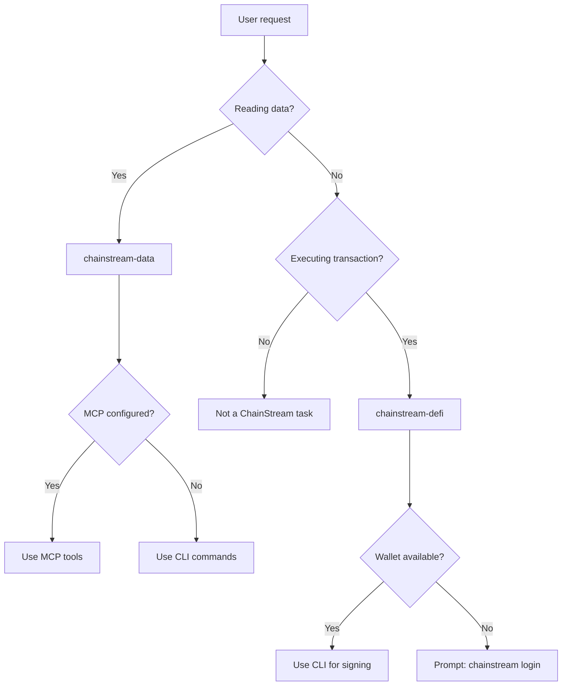

## Agent Skills란

Agent Skills는 AI 코딩 어시스턴트에게 ChainStream의 온체인 데이터 및 DeFi 기능 사용법을 가르치는 구조화된 명령어 패키지(`SKILL.md` 파일)입니다. 단순한 API 문서와 달리, Skills는 **의사결정 트리, 워크플로우, 안전 규칙, 오류 복구** 등 AI 에이전트가 자율적으로 작동하는 데 필요한 모든 것을 제공합니다.

<CardGroup cols={2}>
  <Card title="chainstream-data" icon="magnifying-glass" color="#4D9CFF">
    **Tool 패턴** — 읽기 전용 온체인 데이터: 토큰 분석, 시장 동향, 지갑 프로파일링, WebSocket 스트림
  </Card>
  <Card title="chainstream-defi" icon="right-left" color="#9333EA">
    **Process 패턴** — 비가역적 DeFi 실행: 스왑, 브릿지, 런치패드, 트랜잭션 브로드캐스트
  </Card>
</CardGroup>

## Skills vs MCP vs SDK

| 계층 | 정의 | 적합한 용도 |
|-------|-----------|----------|
| **Agent Skills** | 의사결정 트리, 워크플로우, 안전 규칙을 포함한 고수준 AI 명령어 세트 (SKILL.md) | AI 코딩 어시스턴트 (Cursor, Claude Code, Codex) |
| **MCP Server** | Model Context Protocol — AI 모델이 호출할 수 있는 17개 도구 | AI 채팅 어시스턴트 (Claude Desktop, ChatGPT) |
| **CLI** | 지갑 및 x402 결제 기능이 내장된 커맨드 라인 도구 | 스크립트, CI/CD, DeFi가 필요한 AI 에이전트 |
| **SDK** | TypeScript/Python/Go/Rust 클라이언트 라이브러리 | 커스텀 애플리케이션 |

Skills는 **가장 높은 추상화 계층**에 위치하며, 내부적으로 MCP 도구와 CLI 명령어를 참조하여 AI 에이전트를 각 작업에 적합한 도구로 라우팅합니다.

## 라우팅 의사결정 트리

## Skill 비교

| 항목 | chainstream-data | chainstream-defi |
|--------|-----------------|-----------------|
| 패턴 | Tool (읽기 전용) | Process (실행) |
| 위험 수준 | 낮음 | 높음 (비가역적) |
| 지갑 필요 여부 | 아니오 (API Key만으로 충분) | 예 (서명 필요) |
| MCP 지원 | 전체 (17개 도구) | 도구 사용 가능하지만 실행 시 호스트에 지갑 필요 |
| 사용자 확인 | 불필요 | 모든 트랜잭션 전 **필수** |
| 대표 작업 | 검색, 분석, 추적, 스트리밍 | 스왑, 브릿지, 생성, 브로드캐스트 |

## 공유 리소스

두 Skills 모두 공통 참조 문서를 공유합니다:

| 리소스 | 내용 |
|----------|---------|
| **인증** | 4가지 인증 경로 (API Key, 지갑 로그인, 원시 키, Tempo MPP) |
| **x402 결제** | x402 및 MPP 결제 프로토콜, 플랜 선택 흐름 |
| **오류 처리** | HTTP 상태 코드, 재시도 전략, DeFi 관련 오류 |
| **체인** | 지원 체인 매트릭스, 네이티브 토큰 주소, 블록 익스플로러 |

## 지원 플랫폼

Skills는 `SKILL.md` 파일을 지원하는 모든 AI 코딩 어시스턴트에서 사용할 수 있습니다:

| 플랫폼 | 설치 방법 |
|----------|-------------------|
| Cursor | `.cursor-plugin/`을 통해 자동 인식 |
| Claude Code | `/plugin install chainstream` |
| Codex | Clone + symlink |
| OpenCode | Clone + symlink |
| Gemini CLI | `gemini extensions install` |

설정 방법은 [설치 가이드](/ko/guides/ai-infrastructure/agent-skills/installation)를 참조하세요.

## 다음 단계

<CardGroup cols={2}>
  <Card title="설치" icon="download" href="/ko/guides/ai-infrastructure/agent-skills/installation">
    플랫폼에 Skills 설정하기
  </Card>
  <Card title="chainstream-data" icon="magnifying-glass" href="/ko/guides/ai-infrastructure/agent-skills/chainstream-data">
    데이터 조회 및 분석
  </Card>
  <Card title="chainstream-defi" icon="right-left" href="/ko/guides/ai-infrastructure/agent-skills/chainstream-defi">
    DeFi 실행 워크플로우
  </Card>
  <Card title="MCP Server" icon="plug" href="/ko/guides/ai-infrastructure/mcp-server/introduction">
    기반 MCP 프로토콜
  </Card>
</CardGroup>
