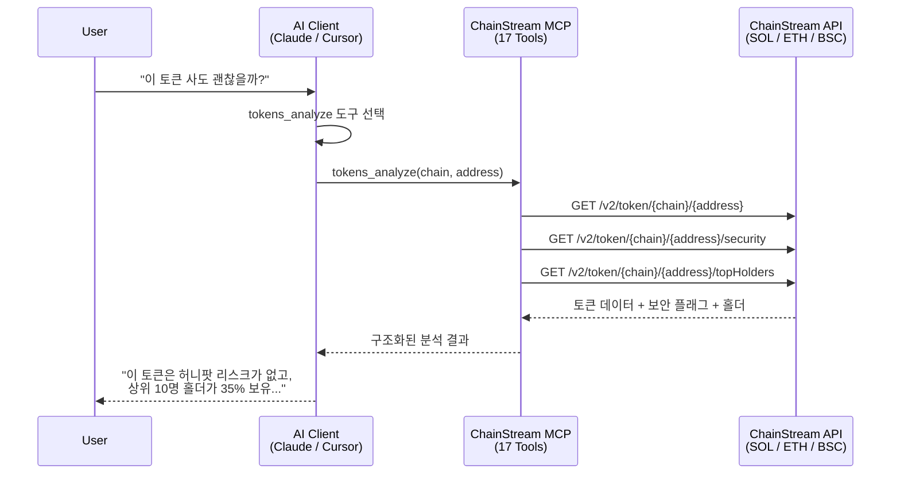

## MCP란

**MCP (Model Context Protocol)**는 AI 애플리케이션이 외부 데이터 소스에 연결하는 방식을 표준화하기 위해 Anthropic이 제안한 개방형 프로토콜입니다.

<Info>
간단히 말해, MCP를 통해 AI는 다음을 수행할 수 있습니다:
- 사용 가능한 도구와 데이터 소스를 탐색
- 외부 도구를 호출하여 작업 수행
- 반환된 구조화된 데이터를 이해
</Info>

### 기존 방식 vs MCP

| 방식 | 흐름 |
|------|------|
| **기존 방식** | 사용자 → 코드 작성 → API 호출 → 데이터 파싱 → AI에 입력 → 답변 획득 |
| **MCP** | 사용자 → 자연어 질문 → AI가 자동으로 도구 호출 → 답변 획득 |

### 핵심 개념

| 개념 | 설명 |
|------|------|
| **MCP Server** | 도구와 데이터를 제공하는 서버 (예: ChainStream MCP Server) |
| **MCP Client** | 도구를 사용하는 클라이언트 (예: Claude Desktop, Cursor) |
| **Tools** | AI가 호출할 수 있는 함수 (예: 잔액 조회, 지갑 분석) |
| **Resources** | AI가 접근할 수 있는 데이터 리소스 |

---

## MCP가 중요한 이유

### AI 에이전트에게 "손과 눈"이 필요합니다

AI 대규모 언어 모델은 강력한 추론 능력을 갖추고 있지만:

- ❌ 실시간 데이터에 직접 접근할 수 없습니다
- ❌ 외부 작업을 실행할 수 없습니다
- ❌ 학습 데이터 기준일이 있습니다

MCP는 AI가 다음을 할 수 있도록 이 문제를 해결합니다:

- ✅ 실시간 온체인 데이터 획득
- ✅ 전문 도구를 호출하여 분석 수행
- ✅ 외부 세계와 상호작용

<Note>
**비유**

AI에게 MCP란:
- **눈** → AI가 실시간 데이터를 볼 수 있게 합니다
- **손** → AI가 작업을 실행할 수 있게 합니다
- **도구** → AI가 전문 기능을 사용할 수 있게 합니다
</Note>

---

## ChainStream MCP 기능

ChainStream MCP Server는 MCP 프로토콜을 통해 블록체인 데이터와 분석 기능을 AI 애플리케이션에 제공합니다.

**MCP 엔드포인트**: `https://mcp.chainstream.io/mcp`

### 기능 매트릭스

ChainStream MCP Server는 API Reference에 정의된 모든 REST API 및 WebSocket 구독 기능을 지원합니다:

<Tabs>
  <Tab title="Token API">
    | 기능 | 설명 |
    |------|------|
    | 토큰 검색 | 이름/심볼로 토큰 검색 |
    | 토큰 정보 | 토큰 기본 정보 및 메타데이터 |
    | 토큰 가격 | 실시간 및 과거 가격 |
    | 토큰 통계 | 거래량, 시가총액 통계 |
    | 홀더 분석 | 홀더 분포 및 상위 홀더 |
    | 캔들스틱 데이터 | 다양한 기간의 OHLCV 데이터 |
    | 시장 데이터 | 유동성, 거래 쌍 정보 |
    | 보안 검사 | 토큰 컨트랙트 보안 분석 |
    | 생성 정보 | 토큰 생성자 및 생성 시간 |
    | 발행/소각 이력 | 토큰 발행 및 소각 기록 |
    | 유동성 스냅샷 | 과거 유동성 데이터 |
  </Tab>
  
  <Tab title="Wallet API">
    | 기능 | 설명 |
    |------|------|
    | 잔액 조회 | 지갑 토큰 잔액 |
    | PnL 계산 | 손익 분석 |
    | 지갑 통계 | 거래 횟수, 활동도 등 |
    | 잔액 이력 | 잔액 변동 기록 |
  </Tab>
  
  <Tab title="Trade API">
    | 기능 | 설명 |
    |------|------|
    | 거래 이력 | 거래 기록 조회 |
    | 거래 활동 | 실시간 거래 활동 |
    | 상위 트레이더 | 상위 트레이더 랭킹 |
  </Tab>
  
  <Tab title="DEX API">
    | 기능 | 설명 |
    |------|------|
    | 견적 조회 | 거래 견적 조회 |
    | 경로 계산 | 최적 거래 경로 |
    | 스왑 실행 | 스왑 트랜잭션 생성 |
    | DEX 목록 | 지원 DEX 정보 |
  </Tab>
  
  <Tab title="Ranking API">
    | 기능 | 설명 |
    |------|------|
    | 인기 토큰 | 기간별 랭킹 |
    | 신규 토큰 | 최근 상장된 토큰 |
    | 졸업 임박 | Bonding Curve 졸업 근접 토큰 |
    | 마이그레이션 완료 | DEX로 마이그레이션된 토큰 |
  </Tab>
  
  <Tab title="WebSocket">
    | 구독 유형 | 설명 |
    |-----------|------|
    | 토큰 캔들 | 실시간 캔들스틱 업데이트 |
    | 토큰 통계 | 실시간 통계 |
    | 토큰 홀더 | 홀더 변동 |
    | 신규 토큰 | 신규 토큰 생성 알림 |
    | 지갑 잔액 | 실시간 잔액 업데이트 |
    | 지갑 거래 | 실시간 거래 알림 |
    | 유동성 풀 | 풀 잔액 변동 |
  </Tab>
</Tabs>

### 지원 블록체인

| 체인 | 식별자 | 유형 | 상태 |
|------|--------|------|------|
| Solana | `sol` | L1 | ✅ |
| Ethereum | `eth` | L1 | ✅ |
| BSC | `bsc` | L1 | ✅ |

<Note>
모든 MCP 도구 파라미터에서 소문자 체인 식별자를 사용하세요: `sol`, `eth`, `bsc`.
</Note>

---

## 지원 플랫폼

### Claude Desktop

공식 지원 MCP 클라이언트로, 가장 완벽한 기능을 지원합니다.

| 기능 | 상태 |
|------|------|
| Tool Calling | ✅ |
| 멀티턴 대화 | ✅ |
| 스트리밍 응답 | ✅ |

```json
// claude_desktop_config.json
{
  "mcpServers": {
    "chainstream": {
      "url": "https://mcp.chainstream.io/mcp",
      "headers": {
        "X-API-KEY": "your-api-key"
      }
    }
  }
}
```

### Cursor IDE

MCP 통합을 지원하는 개발자 친화적 AI 코딩 어시스턴트입니다.

| 기능 | 상태 |
|------|------|
| Tool Calling | ✅ |
| 코드 컨텍스트 | ✅ |

```json
// .cursor/mcp.json
{
  "mcpServers": {
    "chainstream": {
      "url": "https://mcp.chainstream.io/mcp",
      "headers": {
        "X-API-KEY": "your-api-key"
      }
    }
  }
}
```

### 커스텀 에이전트

MCP 프로토콜을 따르는 모든 클라이언트가 연동할 수 있습니다.

```javascript
import { Client } from '@modelcontextprotocol/sdk/client/index.js';
import { StreamableHTTPClientTransport } from '@modelcontextprotocol/sdk/client/streamableHttp.js';

const transport = new StreamableHTTPClientTransport(
  new URL('https://mcp.chainstream.io/mcp'),
  {
    requestInit: {
      headers: {
        'X-API-KEY': process.env.CHAINSTREAM_API_KEY
      }
    }
  }
);

const client = new Client({
  name: 'my-agent',
  version: '1.0.0'
});

await client.connect(transport);

// List available tools
const { tools } = await client.listTools();

// Call a tool
const result = await client.callTool({
  name: 'wallets_profile',
  arguments: {
    address: '0x...',
    chain: 'eth'
  }
});
```

---

## 대표 활용 사례

### 사례 1: AI 리서치 어시스턴트

**요구사항**: AI를 사용하여 특정 지갑의 거래 행동 분석

<Steps>
  <Step title="사용자 질문">
    주소 `0xd8dA6BF26964aF9D7eEd9e03E53415D37aA96045`의 거래 스타일을 분석해 줘
  </Step>
  <Step title="AI 도구 호출">
    `wallets_profile` 도구 호출
  </Step>
  <Step title="AI 분석 결과 반환">
    분석 결과, 이 주소(Vitalik)의 특징:
    - 지갑 연령: 5년 이상
    - 주요 보유: ETH, 다양한 ERC-20 Tokens
    - 거래 스타일: 장기 보유, 간헐적 기부 및 프로젝트 지원
    - 활성 프로토콜: Uniswap, ENS, Gitcoin
    - 라벨: 핵심 개발자, 자선가
  </Step>
</Steps>

### 사례 2: Smart Money 추적

**요구사항**: Smart Money 대량 거래 추적

<Steps>
  <Step title="사용자 질문">
    지난 24시간 동안 어떤 Smart Money 주소가 ARB를 매수했나요?
  </Step>
  <Step title="AI 도구 호출">
    `market_trending` 도구 호출
  </Step>
  <Step title="AI 결과 반환">
    지난 24시간 동안 다음 Smart Money 주소가 ARB를 매수했습니다:

    1. `0xabc...123` (라벨: whale, defi_expert)
       - 수량: 500,000 ARB
       - 금액: $450,000
       - 시간: 2시간 전

    2. `0xdef...456` (라벨: institution)
       - 수량: 200,000 ARB
       - 금액: $180,000
       - 시간: 5시간 전

    전체 추세: Smart Money ARB 순매수
  </Step>
</Steps>

### 사례 3: 토큰 보안 분석

**요구사항**: 토큰 보안 분석

<Steps>
  <Step title="사용자 질문">
    이 토큰 `0x...`이 안전한지 확인해 줘
  </Step>
  <Step title="AI 도구 호출">
    `tokens_analyze` 도구 호출
  </Step>
  <Step title="AI 결과 반환">
    토큰 보안 검사 결과:

    | 검사 항목 | 결과 |
    |-----------|------|
    | 컨트랙트 검증 | ✅ |
    | 악성 함수 없음 | ✅ |
    | 유동성 잠금 | ✅ |
    | 홀더 분포 | ⚠️ 상위 10명이 45% 보유 |
    | 거래 수수료 | 매수 1% / 매도 1% |
    
    리스크 수준: 중간 (홀더 집중도 주의)
  </Step>
</Steps>

---

## 기술 아키텍처



### 연결 방식

| 방식 | 엔드포인트 | 적합한 용도 |
|------|-----------|------------|
| **Cloud** | `https://mcp.chainstream.io/mcp` | 설정 불필요, 항상 최신 상태 |
| **npm stdio** | `npx @chainstream-io/mcp` | 로컬 IDE 통합 (Claude Desktop, Cursor) |
| **npm HTTP** | `chainstream-mcp --transport http` | 팀 서버, 클라우드 배포 |

---

## 기존 API와의 차이점

| 특성 | 기존 API | MCP |
|------|----------|-----|
| 호출 방식 | HTTP REST | 프로토콜 표준화 |
| 대상 사용자 | 개발자 | AI 모델 |
| 파라미터 처리 | 수동 구성 | AI 자동 추론 |
| 오류 처리 | 상태 코드 | 시맨틱 오류 |
| 컨텍스트 | 무상태 | 세션 컨텍스트 유지 |

---

## 인증

ChainStream MCP Server는 **API Key**를 통해 인증합니다. [ChainStream Dashboard](https://www.chainstream.io/dashboard)에서 키를 발급받고, 사용하는 전송 방식에 맞게 설정하세요:

| 전송 방식 | API Key 전달 방법 |
|-----------|------------------|
| **npm 패키지** (stdio) | `CHAINSTREAM_API_KEY` 환경변수 또는 `--api-key` CLI 플래그 |
| **Cloud 엔드포인트** | `X-API-KEY` 요청 헤더 |

```bash
# Stdio: 환경변수 설정
export CHAINSTREAM_API_KEY=your-key
chainstream-mcp

# Stdio: 또는 CLI 플래그 사용
chainstream-mcp --api-key your-key
```

<Note>
API Key는 Dashboard에서 만료일을 설정하지 않는 한 만료되지 않습니다. 토큰 갱신이 필요 없습니다.
</Note>

---

## 보안 모델

<AccordionGroup>
  <Accordion title="인증" icon="key">
    두 가지 연결 방식 모두 API Key로 인증합니다. npm 패키지는 환경의 `CHAINSTREAM_API_KEY`를 읽으며, Cloud 엔드포인트는 `X-API-KEY` 헤더를 사용합니다.
  </Accordion>
  
  <Accordion title="도구 안전성" icon="lock">
    도구는 리스크 수준별로 분류됩니다:
    - **읽기 전용 도구**: 토큰 검색, 지갑 프로필, 시장 데이터 — 기본적으로 안전
    - **트레이딩 도구** (`dex_swap`, `dex_create_token`, `transaction_send`): 고위험으로 표시되며, MCP 클라이언트는 명시적 사용자 확인을 요구해야 합니다
  </Accordion>
  
  <Accordion title="감사 로그" icon="file-lines">
    모든 도구 호출은 완전히 로깅되며, Dashboard에서 확인할 수 있습니다.
  </Accordion>
</AccordionGroup>

---

## 다음 단계

<CardGroup cols={2}>
  <Card title="설정 가이드" icon="gear" href="/ko/guides/ai-infrastructure/mcp-server/setup-guide">
    5분 안에 MCP Server 설정 완료하기
  </Card>
  <Card title="도구 카탈로그" icon="wrench" href="/ko/guides/ai-infrastructure/mcp-server/tools-catalog">
    사용 가능한 모든 도구 상세 보기
  </Card>
</CardGroup>
