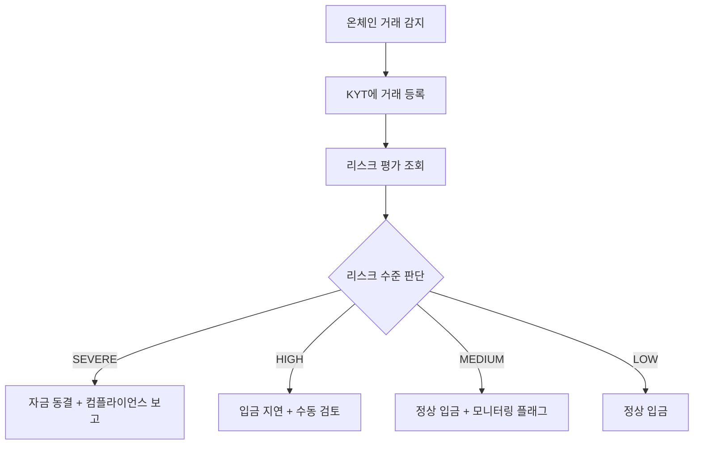
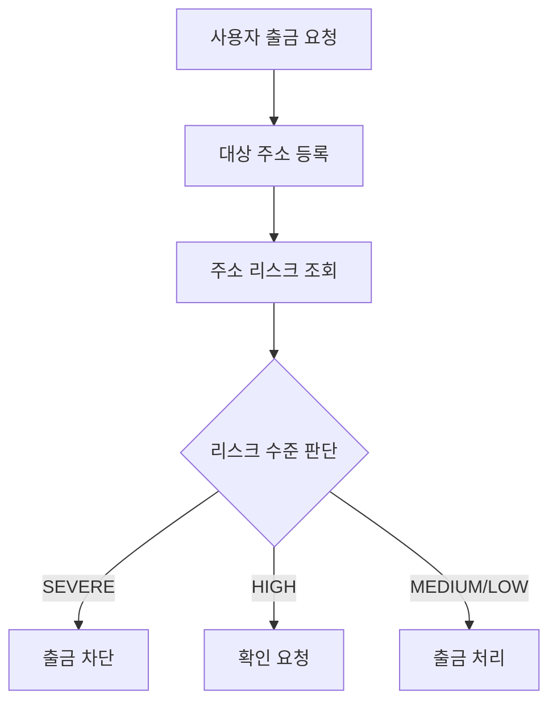
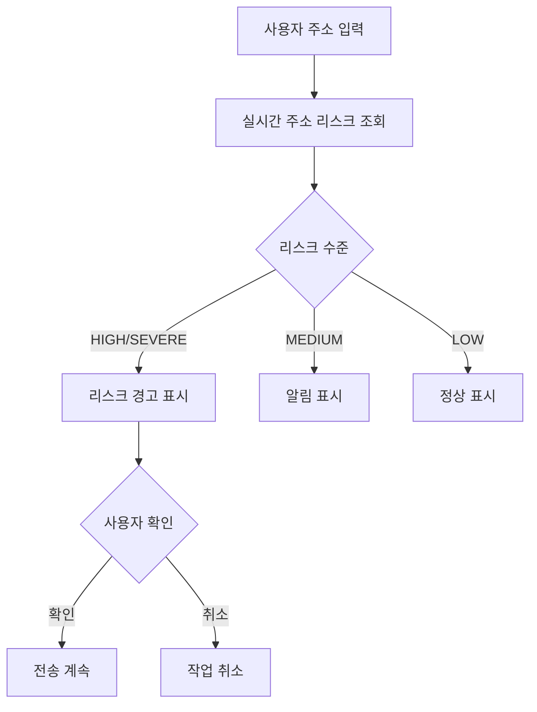

이 가이드에서는 ChainStream KYT/KYA 컴플라이언스 기능을 애플리케이션에 통합하는 방법을 다룹니다. CEX 입출금 리스크 관리, 지갑 리스크 알림, 일괄 스크리닝의 완전한 시나리오를 포함합니다.

---

## 사전 요구사항

### API 설정

| 설정 | 값 |
|:--|:--|
| Base URL | `https://api.chainstream.io/` |
| Auth Domain | `dex.asia.auth.chainstream.io` |
| Audience | `https://api.dex.chainstream.io` |

### KYT 관련 스코프

| 스코프 | 설명 |
|:--|:--|
| `kyt.read` | KYT API 읽기 권한 (거래 리스크 조회) |
| `kyt.write` | KYT API 쓰기 권한 (거래 분석 등록) |

### 액세스 토큰 생성

<CodeGroup>
```javascript JavaScript
import { AuthenticationClient } from 'auth0';

const auth0Client = new AuthenticationClient({
  domain: 'dex.asia.auth.chainstream.io',
  clientId: 'your-client-id',
  clientSecret: 'your-client-secret'
});

// 전체 KYT 권한으로 토큰 획득
const response = await auth0Client.oauth.clientCredentialsGrant({
  audience: 'https://api.dex.chainstream.io',
  scope: 'kyt.read kyt.write'
});

const accessToken = response.data.access_token;
```

```python Python
from auth0.authentication import GetToken

get_token = GetToken(
    'dex.asia.auth.chainstream.io',
    'your-client-id',
    client_secret='your-client-secret'
)

token = get_token.client_credentials(
    audience='https://api.dex.chainstream.io',
    scope='kyt.read kyt.write'
)

access_token = token['access_token']
```
</CodeGroup>

### API 호출

모든 요청에 헤더에 토큰을 포함해야 합니다:

```javascript
const response = await fetch('https://api.chainstream.io/v1/kyt/transfer', {
  method: 'POST',
  headers: {
    'Authorization': `Bearer ${accessToken}`,
    'Content-Type': 'application/json'
  },
  body: JSON.stringify({ /* 요청 본문 */ })
});
```

---

## CEX 입금 리스크 관리

거래소 입금 시나리오는 KYT의 핵심 사용 사례로, 자금이 입금되기 전에 리스크 평가가 필요합니다.

### 비즈니스 흐름



### 통합 단계

<Steps>
  <Step title="클라이언트 초기화">
    ```javascript
    import { AuthenticationClient } from 'auth0';

    // 토큰 생성 (캐싱 권장, 만료 전 갱신)
    async function getAccessToken() {
      const auth0Client = new AuthenticationClient({
        domain: 'dex.asia.auth.chainstream.io',
        clientId: process.env.CHAINSTREAM_CLIENT_ID,
        clientSecret: process.env.CHAINSTREAM_CLIENT_SECRET
      });

      const { data } = await auth0Client.oauth.clientCredentialsGrant({
        audience: 'https://api.dex.chainstream.io',
        scope: 'kyt.read kyt.write'
      });

      return data.access_token;
    }
    ```
  </Step>

  <Step title="거래 감지">
    사용자 입금 주소로의 수신 거래 모니터링:
    ```javascript
    async function onDepositDetected(tx) {
      const deposit = {
        network: 'ethereum',           // 네트워크: bitcoin, ethereum, Solana
        asset: tx.asset,               // 자산 유형: ETH, SOL 등
        transferReference: tx.hash,    // 거래 해시
        direction: 'received'          // 방향: sent 또는 received
      };
      
      // KYT 분석 호출
      const result = await registerTransfer(deposit);
      
      // 리스크 평가 조회
      const risk = await getTransferSummary(result.externalId);
      
      // 결정 실행
      await executeDecision(tx, risk);
    }
    ```
  </Step>

  <Step title="거래 등록">
    KYT API 호출로 거래 등록:
    ```javascript
    async function registerTransfer(deposit) {
      const response = await fetch('https://api.chainstream.io/v1/kyt/transfer', {
        method: 'POST',
        headers: {
          'Authorization': `Bearer ${accessToken}`,
          'Content-Type': 'application/json'
        },
        body: JSON.stringify({
          network: deposit.network,
          asset: deposit.asset,
          transferReference: deposit.transferReference,
          direction: deposit.direction
        })
      });
      
      return await response.json();
    }
    ```
  </Step>

  <Step title="리스크 평가 조회">
    거래 리스크 요약 조회:
    ```javascript
    async function getTransferSummary(transferId) {
      const response = await fetch(
        `https://api.chainstream.io/v1/kyt/transfers/${transferId}/summary`,
        {
          headers: {
            'Authorization': `Bearer ${accessToken}`
          }
        }
      );
      
      return await response.json();
    }
    ```
  </Step>

  <Step title="자동 결정">
    리스크 수준에 따라 적절한 조치 실행:
    ```javascript
    async function executeDecision(tx, risk) {
      const riskLevel = risk.rating; // SEVERE, HIGH, MEDIUM, LOW
      
      switch (riskLevel) {
        case 'SEVERE':
          await freezeDeposit(tx);
          await createSARReport(tx, risk);
          await notifyCompliance(tx, risk);
          break;
          
        case 'HIGH':
          await holdDeposit(tx, { hours: 24 });
          await createManualReview(tx, risk);
          break;
          
        case 'MEDIUM':
          await creditDeposit(tx);
          await flagForMonitoring(tx, risk);
          break;
          
        case 'LOW':
          await creditDeposit(tx);
          break;
      }
      
      // 감사 로그 기록
      await auditLog.record({
        action: 'DEPOSIT_RISK_DECISION',
        txHash: tx.hash,
        riskLevel,
        timestamp: new Date()
      });
    }
    ```
  </Step>
</Steps>

---

## 전체 흐름 상세

엔드투엔드 컴플라이언스 통합 흐름: 감지 → 등록 → 폴링 → 리스크 판단 → 해제/동결

### 1. 감지 단계

| 트리거 소스 | 설명 | 지연 시간 |
|:--|:--|:--|
| 온체인 모니터링 | 입금 주소 모니터링 | 블록 컨펌 시간 |
| 사용자 제출 | 출금 요청 | 즉시 |
| 스케줄 스캔 | 캐치업 메커니즘 | 설정 가능 |

### 2. 등록 단계

```bash
POST https://api.chainstream.io/v1/kyt/transfer
Authorization: Bearer <access_token>
Content-Type: application/json

{
  "network": "ethereum",
  "asset": "ETH",
  "transferReference": "0x1234567890abcdef...",
  "direction": "received"
}
```

**응답:**

```json
{
  "externalId": "123e4567-e89b-12d3-a456-426614174000",
  "asset": "ETH",
  "network": "ethereum",
  "transferReference": "0x1234567890abcdef...",
  "direction": "received",
  "updatedAt": "2024-01-15T10:30:00.000Z"
}
```

### 3. 조회 단계

<Tabs>
  <Tab title="폴링 방식">
    ```javascript
    async function pollForResult(transferId, maxAttempts = 10) {
      for (let i = 0; i < maxAttempts; i++) {
        const response = await fetch(
          `https://api.chainstream.io/v1/kyt/transfers/${transferId}/summary`,
          {
            headers: { 'Authorization': `Bearer ${accessToken}` }
          }
        );
        const data = await response.json();
        
        if (data.rating) {
          return data;
        }
        
        await new Promise(r => setTimeout(r, 3000)); // 3초 간격
      }
      
      throw new Error('Analysis timeout');
    }
    ```
  </Tab>
  <Tab title="상세 정보 조회">
    리스크 노출 상세 정보 조회:
    ```javascript
    // 직접 리스크 노출 조회
    const exposures = await fetch(
      `https://api.chainstream.io/v1/kyt/transfers/${transferId}/exposures/direct`,
      { headers: { 'Authorization': `Bearer ${accessToken}` } }
    );

    // 리스크 알림 조회
    const alerts = await fetch(
      `https://api.chainstream.io/v1/kyt/transfers/${transferId}/alerts`,
      { headers: { 'Authorization': `Bearer ${accessToken}` } }
    );
    ```
  </Tab>
</Tabs>

### 4. 판단 단계

리스크 판단 규칙 설정:

```yaml
risk_rules:
  severe:
    action: FREEZE
    auto_execute: true
    notify:
      - compliance@company.com
      - security@company.com
    
  high:
    action: MANUAL_REVIEW
    auto_execute: false
    hold_period: 24h
    escalation: 4h
    
  medium:
    action: FLAG
    auto_execute: true
    monitoring_period: 30d
    
  low:
    action: PASS
    auto_execute: true
```

### 5. 실행 단계

| 조치 | 트리거 조건 | 후속 조치 |
|:--|:--|:--|
| 해제 | LOW 리스크 | 정상 입금/결제 |
| 플래그 | MEDIUM 리스크 | 입금하되 모니터링 지속 |
| 보류 | HIGH 리스크 | 수동 검토 대기열 진입 |
| 동결 | SEVERE 리스크 | 동결 + 컴플라이언스 보고 |

---

## 전체 서비스 구현

<CodeGroup>
```javascript JavaScript
import { AuthenticationClient } from 'auth0';

class ComplianceService {
  constructor() {
    this.accessToken = null;
    this.tokenExpiry = null;
  }

  // 토큰 획득 또는 갱신
  async getAccessToken() {
    if (this.accessToken && this.tokenExpiry > Date.now()) {
      return this.accessToken;
    }

    const auth0Client = new AuthenticationClient({
      domain: 'dex.asia.auth.chainstream.io',
      clientId: process.env.CHAINSTREAM_CLIENT_ID,
      clientSecret: process.env.CHAINSTREAM_CLIENT_SECRET
    });

    const { data } = await auth0Client.oauth.clientCredentialsGrant({
      audience: 'https://api.dex.chainstream.io',
      scope: 'kyt.read kyt.write'
    });

    this.accessToken = data.access_token;
    // 토큰은 보통 24시간 유효, 1시간 전에 갱신
    this.tokenExpiry = Date.now() + (23 * 60 * 60 * 1000);
    
    return this.accessToken;
  }

  // 입금 컴플라이언스 확인
  async checkDeposit(deposit) {
    const token = await this.getAccessToken();
    
    // 1. 거래 등록
    const registerResponse = await fetch('https://api.chainstream.io/v1/kyt/transfer', {
      method: 'POST',
      headers: {
        'Authorization': `Bearer ${token}`,
        'Content-Type': 'application/json'
      },
      body: JSON.stringify({
        network: deposit.network,
        asset: deposit.asset,
        transferReference: deposit.txHash,
        direction: 'received'
      })
    });
    const registered = await registerResponse.json();

    // 2. 리스크 평가 대기 및 조회
    const risk = await this.waitForAnalysis(token, registered.externalId);
    
    // 3. 결정 생성
    const decision = this.makeDecision(risk);
    
    // 4. 감사 기록
    await this.auditLog(deposit, risk, decision);
    
    return decision;
  }

  async waitForAnalysis(token, transferId, maxAttempts = 10) {
    for (let i = 0; i < maxAttempts; i++) {
      const response = await fetch(
        `https://api.chainstream.io/v1/kyt/transfers/${transferId}/summary`,
        { headers: { 'Authorization': `Bearer ${token}` } }
      );
      const result = await response.json();
      
      if (result.rating) {
        return result;
      }
      await new Promise(r => setTimeout(r, 3000));
    }
    throw new Error('Analysis timeout');
  }

  makeDecision(risk) {
    const decisions = {
      'SEVERE': {
        action: 'FREEZE',
        requireSAR: true,
        notify: ['compliance@company.com', 'security@company.com']
      },
      'HIGH': {
        action: 'HOLD',
        requireReview: true,
        holdHours: 24
      },
      'MEDIUM': {
        action: 'PASS',
        flagMonitoring: true
      },
      'LOW': {
        action: 'PASS'
      }
    };
    return decisions[risk.rating] || decisions['LOW'];
  }

  async auditLog(deposit, risk, decision) {
    console.log({
      timestamp: new Date().toISOString(),
      type: 'COMPLIANCE_CHECK',
      deposit,
      risk,
      decision
    });
  }
}

// 사용 예시
const compliance = new ComplianceService();

app.post('/deposit/process', async (req, res) => {
  const deposit = req.body;
  const decision = await compliance.checkDeposit(deposit);
  res.json(decision);
});
```

```python Python
import os
import time
import requests
from auth0.authentication import GetToken

class ComplianceService:
    def __init__(self):
        self.access_token = None
        self.token_expiry = 0
        self.base_url = 'https://api.chainstream.io'
    
    def get_access_token(self):
        if self.access_token and self.token_expiry > time.time():
            return self.access_token
        
        get_token = GetToken(
            'dex.asia.auth.chainstream.io',
            os.environ['CHAINSTREAM_CLIENT_ID'],
            client_secret=os.environ['CHAINSTREAM_CLIENT_SECRET']
        )
        
        token = get_token.client_credentials(
            audience='https://api.dex.chainstream.io',
            scope='kyt.read kyt.write'
        )
        
        self.access_token = token['access_token']
        self.token_expiry = time.time() + (23 * 60 * 60)
        
        return self.access_token
    
    def check_deposit(self, deposit: dict) -> dict:
        token = self.get_access_token()
        headers = {
            'Authorization': f'Bearer {token}',
            'Content-Type': 'application/json'
        }
        
        # 거래 등록
        register_response = requests.post(
            f'{self.base_url}/v1/kyt/transfer',
            headers=headers,
            json={
                'network': deposit['network'],
                'asset': deposit['asset'],
                'transferReference': deposit['tx_hash'],
                'direction': 'received'
            }
        )
        registered = register_response.json()
        
        # 결과 대기
        risk = self.wait_for_analysis(token, registered['externalId'])
        
        # 결정 반환
        return self.make_decision(risk['rating'])
    
    def wait_for_analysis(self, token, transfer_id, max_attempts=10):
        headers = {'Authorization': f'Bearer {token}'}
        
        for _ in range(max_attempts):
            response = requests.get(
                f'{self.base_url}/v1/kyt/transfers/{transfer_id}/summary',
                headers=headers
            )
            result = response.json()
            
            if result.get('rating'):
                return result
            time.sleep(3)
        
        raise Exception('Analysis timeout')
    
    def make_decision(self, rating):
        decisions = {
            'SEVERE': {'action': 'FREEZE', 'requireSAR': True},
            'HIGH': {'action': 'HOLD', 'requireReview': True},
            'MEDIUM': {'action': 'PASS', 'flagMonitoring': True},
            'LOW': {'action': 'PASS'}
        }
        return decisions.get(rating, decisions['LOW'])
```
</CodeGroup>

---

## CEX 출금 리스크 관리

출금 시나리오에서는 사용자가 출금을 요청할 때 대상 주소의 리스크를 확인해야 합니다.

### 비즈니스 흐름



### 구현 예시

```javascript
async function handleWithdrawal(request) {
  const { toAddress } = request;
  const token = await complianceService.getAccessToken();
  
  // 1. 주소 등록
  const registerResponse = await fetch('https://api.chainstream.io/v1/kyt/address', {
    method: 'POST',
    headers: {
      'Authorization': `Bearer ${token}`,
      'Content-Type': 'application/json'
    },
    body: JSON.stringify({ address: toAddress })
  });
  await registerResponse.json();
  
  // 2. 주소 리스크 조회
  const riskResponse = await fetch(
    `https://api.chainstream.io/v1/kyt/addresses/${toAddress}/risk`,
    { headers: { 'Authorization': `Bearer ${token}` } }
  );
  const addressRisk = await riskResponse.json();
  
  // 3. 리스크 처리
  switch (addressRisk.rating) {
    case 'SEVERE':
      return {
        status: 'REJECTED',
        reason: 'Target address is associated with known criminal activity',
        riskLevel: 'SEVERE'
      };
      
    case 'HIGH':
      return {
        status: 'PENDING_CONFIRMATION',
        warning: 'This address has been flagged as high risk',
        riskDetails: addressRisk,
        requiresConfirmation: true
      };
      
    default:
      return {
        status: 'APPROVED',
        riskLevel: addressRisk.rating
      };
  }
}

// Express 라우트 예시
app.post('/withdraw/request', async (req, res) => {
  const result = await handleWithdrawal(req.body);
  res.json(result);
});
```

---

## 지갑 리스크 알림

지갑 애플리케이션에서 사용자가 전송을 시작하기 전에 리스크 알림을 제공합니다.

### 사용자 경험 흐름



### 프론트엔드/백엔드 통합

<Warning>
프론트엔드에서 clientSecret을 직접 노출하지 마세요. 백엔드 API 프록시를 사용하여 ChainStream을 호출하세요.
</Warning>

<Tabs>
  <Tab title="프론트엔드 호출">
    ```javascript
    // 주소 입력 변경 시 트리거
    async function onAddressChange(address) {
      if (!isValidAddress(address)) return;
      
      setLoading(true);
      
      try {
        // 백엔드 프록시 API 호출
        const response = await fetch('/api/risk/check-address', {
          method: 'POST',
          headers: { 'Content-Type': 'application/json' },
          body: JSON.stringify({ address })
        });
        const risk = await response.json();
        
        setRiskInfo({
          level: risk.rating,
          labels: risk.labels,
          warnings: risk.warnings
        });
      } finally {
        setLoading(false);
      }
    }
    ```
  </Tab>
  <Tab title="백엔드 프록시">
    ```javascript
    app.post('/api/risk/check-address', async (req, res) => {
      const { address } = req.body;
      const token = await complianceService.getAccessToken();
      
      // 주소 등록
      await fetch('https://api.chainstream.io/v1/kyt/address', {
        method: 'POST',
        headers: {
          'Authorization': `Bearer ${token}`,
          'Content-Type': 'application/json'
        },
        body: JSON.stringify({ address })
      });
      
      // 리스크 조회
      const riskResponse = await fetch(
        `https://api.chainstream.io/v1/kyt/addresses/${address}/risk`,
        { headers: { 'Authorization': `Bearer ${token}` } }
      );
      const result = await riskResponse.json();
      
      res.json({
        rating: result.rating,
        riskScore: result.riskScore,
        labels: result.labels || [],
        warnings: generateWarnings(result)
      });
    });

    function generateWarnings(result) {
      const warnings = [];
      if (result.exposures?.direct?.severe > 0) {
        warnings.push('알려진 범죄 주소와 직접 연관됨');
      }
      if (result.labels?.includes('Mixer User')) {
        warnings.push('믹싱 서비스와 상호작용한 이력 있음');
      }
      return warnings;
    }
    ```
  </Tab>
</Tabs>

---

## 일괄 주소 스크리닝

엔터프라이즈 수준의 기존 주소 컴플라이언스 스크리닝.

### 사용 사례

- 정기 컴플라이언스 감사
- 새로운 규제 요구사항 적용
- M&A 실사
- 리스크 스크리닝

### 일괄 스크리닝 구현

```javascript
async function batchScreenAddresses(addresses) {
  const token = await complianceService.getAccessToken();
  const results = [];
  
  for (const address of addresses) {
    try {
      // 주소 등록
      await fetch('https://api.chainstream.io/v1/kyt/address', {
        method: 'POST',
        headers: {
          'Authorization': `Bearer ${token}`,
          'Content-Type': 'application/json'
        },
        body: JSON.stringify({ address })
      });
      
      // 리스크 조회
      const riskResponse = await fetch(
        `https://api.chainstream.io/v1/kyt/addresses/${address}/risk`,
        { headers: { 'Authorization': `Bearer ${token}` } }
      );
      const risk = await riskResponse.json();
      
      results.push({
        address,
        rating: risk.rating,
        riskScore: risk.riskScore
      });
    } catch (error) {
      results.push({
        address,
        error: error.message
      });
    }
  }
  
  // 고위험 주소 처리
  const highRiskAddresses = results.filter(
    r => r.rating === 'SEVERE' || r.rating === 'HIGH'
  );
  
  return { all: results, highRisk: highRiskAddresses };
}
```

---

## 모범 사례

### 임계값 설정 권장

비즈니스 유형에 따라 리스크 임계값을 조정하세요:

| 비즈니스 유형 | SEVERE 처리 | HIGH 처리 | MEDIUM 처리 |
|:--|:--|:--|:--|
| 인가된 CEX | 자동 동결 | 수동 검토 | 모니터링 플래그 |
| 지갑 앱 | 강한 경고 | 경고 | 알림 |
| DeFi 프로토콜 | 상호작용 거절 | 경고 | 정상 |
| OTC 플랫폼 | 거래 거절 | 추가 KYC | 정상 |

### 감사 로그 요구사항

완전한 감사 추적 보장:

```json
{
  "eventId": "evt_123456",
  "timestamp": "2024-01-15T10:30:00Z",
  "eventType": "RISK_DECISION",
  "subject": {
    "transferId": "123e4567-e89b-12d3-a456-426614174000",
    "txHash": "0x...",
    "userId": "user_789"
  },
  "riskAssessment": {
    "rating": "HIGH",
    "riskScore": 72
  },
  "decision": {
    "action": "HOLD",
    "decidedBy": "SYSTEM",
    "reason": "Auto-hold per risk policy"
  },
  "metadata": {
    "policyVersion": "1.2.0",
    "engineVersion": "2024.01"
  }
}
```

---

## 다음 단계

<CardGroup cols={2}>
  <Card title="인증 문서" icon="key" href="/ko/docs/platform/authentication/api-keys-oauth">
    상세 인증 가이드
  </Card>
  <Card title="KYT 개념" icon="shield" href="/ko/docs/compliance/kyt-concepts">
    KYT 핵심 개념
  </Card>
  <Card title="KYA 개념" icon="user-shield" href="/ko/docs/compliance/kya-concepts">
    KYA 핵심 개념
  </Card>
  <Card title="KYT API 레퍼런스" icon="code" href="/ko/api-reference/endpoint/data/kyt/v2/kyt-transfer-post">
    KYT API 전체 문서
  </Card>
</CardGroup>
