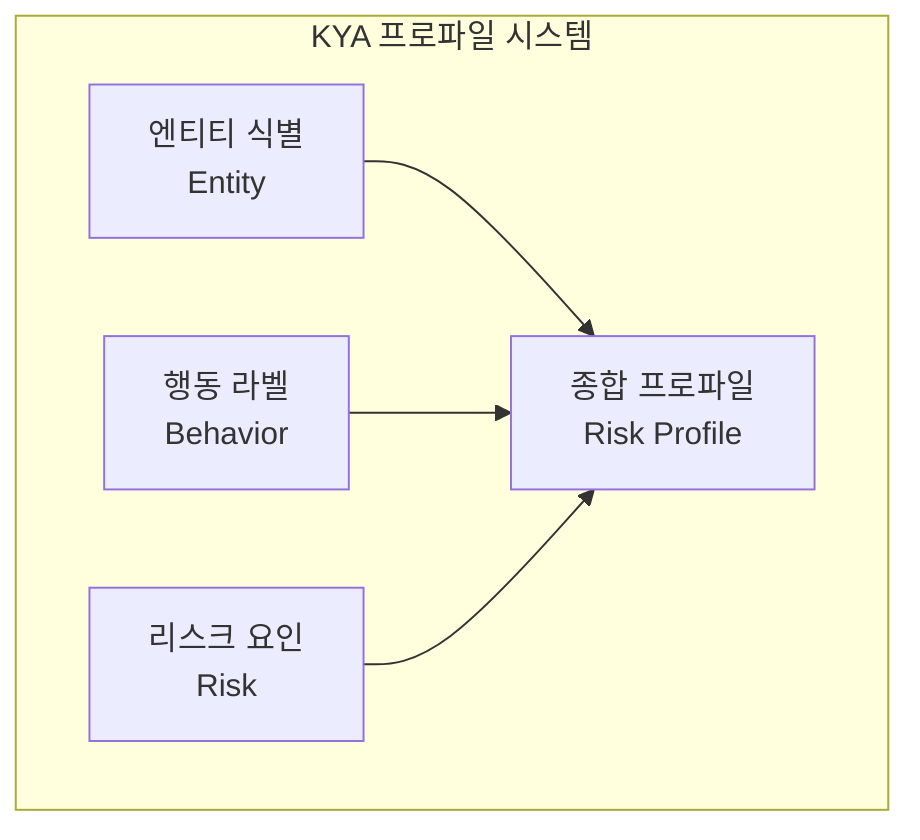
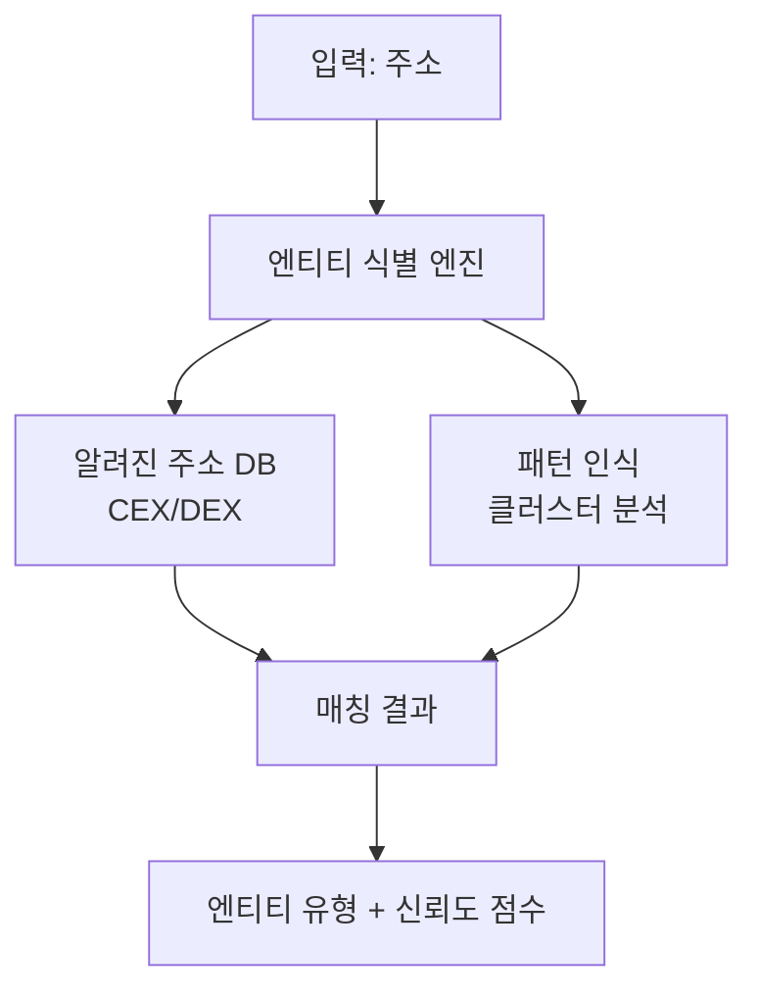
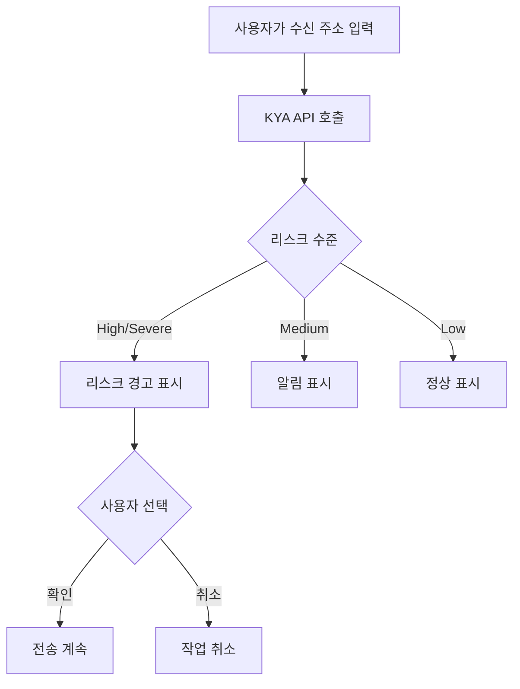
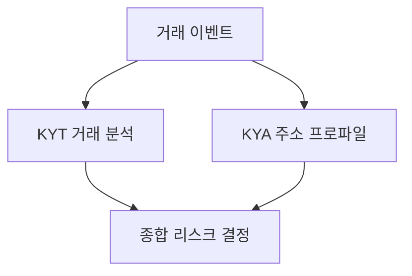

## KYA란

**KYA(Know Your Address)**는 암호화폐 주소에 대한 종합적인 프로파일링 및 리스크 평가 메커니즘입니다. 주소의 과거 행동, 연관 네트워크, 라벨 정보를 분석하여 완전한 리스크 프로파일을 구축합니다.

<Info>
**핵심 질문**: 이 주소는 신뢰할 수 있는가?

KYA는 주소와 상호작용하기 전에 해당 주소의 과거 행동과 리스크 상태를 완전히 이해할 수 있도록 도와줍니다.
</Info>

## KYA vs KYT

KYA와 KYT는 서로 다른 차원에서 리스크를 평가하는 상호 보완적인 리스크 관리 도구입니다:

| 차원 | KYT | KYA |
|-----------|-----|-----|
| **분석 대상** | 개별 거래 | 전체 주소 |
| **시간 차원** | 실시간 스냅샷 | 과거 누적 |
| **핵심 질문** | 이 거래는 안전한가? | 이 주소는 신뢰할 수 있는가? |
| **업데이트 빈도** | 거래별 트리거 | 주기적/온디맨드 |
| **데이터 깊이** | 거래 수준 | 프로파일 수준 |

---

## 프로파일링 차원

KYA는 세 가지 핵심 차원으로 주소 프로파일을 구축합니다:



---

## 엔티티 식별

주소 뒤에 있는 엔티티 유형을 식별하여 그 성격과 신뢰성을 파악합니다.

### 엔티티 분류

| 카테고리 | 설명 | 리스크 가중치 | 식별 방법 |
|----------|-------------|-------------|----------------------|
| **CEX** | 중앙화 거래소 | 낮음 | 알려진 핫월렛 주소, 입금 주소 패턴 |
| **DEX** | 탈중앙화 거래소 | 낮음-중간 | 스마트 컨트랙트 식별, 라우터 주소 |
| **개인** | 일반 사용자 주소 | 중간 | 행동 패턴 분석, 잔액 특성 |
| **컨트랙트** | 스마트 컨트랙트 | 가변 | 온체인 코드 검증 |
| **알려진 범죄자** | 확인된 범죄 주소 | 매우 높음 | 법 집행 보고서, 제재 목록 |

### 엔티티 식별 흐름



### 신뢰도 수준

엔티티 식별 결과에는 신뢰도 점수가 포함되어 신뢰성을 평가하는 데 도움을 줍니다:

| 수준 | 신뢰도 | 설명 | 권장 활용 |
|-------|------------|-------------|-----------------|
| **확인됨** | &gt;95% | 공식 확인 또는 법 집행 보고 | 직접 사용 |
| **높은 신뢰도** | 80-95% | 강한 특성 매칭 | 사용 권장 |
| **중간 신뢰도** | 50-80% | 부분 특성 매칭 | 참고용 |
| **낮은 신뢰도** | &lt;50% | 추정 | 참고만 |

---

## 행동 라벨

온체인 행동 특성에 기반하여 시스템이 자동으로 해당 라벨을 부여합니다.

<Tabs>
  <Tab title="역할 라벨">
    온체인 생태계에서 주소의 역할을 반영합니다:
    
    | 라벨 | 정의 | 리스크 함의 |
    |-------|------------|------------------|
    | `whale` | 대규모 보유 주소 (&gt;$1M) | 높은 시장 영향력 |
    | `trader` | 고빈도 거래 행동 | 정상 활동 |
    | `holder` | 장기 보유, 이동 없음 | 낮은 리스크 |
    | `bot` | 프로그래밍 거래 특성 | 주의 필요 |
    | `smart_money` | 스마트 머니 | 전문 트레이더 |
  </Tab>
  
  <Tab title="행동 라벨">
    특정 행동 패턴을 반영합니다:
    
    | 라벨 | 정의 | 리스크 함의 |
    |-------|------------|------------------|
    | `mixer_user` | 믹싱 서비스 사용 이력 | 높은 리스크 |
    | `bridge_user` | 크로스체인 브릿지 사용자 | 중간 리스크 |
    | `defi_active` | DeFi 프로토콜과 빈번한 상호작용 | 정상 |
    | `nft_trader` | 활발한 NFT 거래 | 정상 |
    | `new_address` | 새로 생성된 주소 | 관찰 필요 |
  </Tab>
  
  <Tab title="엔티티 라벨">
    식별된 소유 엔티티:
    
    | 라벨 | 설명 |
    |-------|-------------|
    | `exchange:binance` | 바이낸스 거래소 |
    | `exchange:coinbase` | 코인베이스 거래소 |
    | `defi:uniswap` | 유니스왑 프로토콜 |
    | `bridge:multichain` | 크로스체인 브릿지 |
    | `sanctions` | 제재 주소 |
  </Tab>
</Tabs>

### 라벨 조합 리스크

특정 라벨 조합은 리스크 신호를 증폭시킵니다:

<Warning>
**고위험 조합 예시**

`mixer_user` + `high_value` + `new_address`

**리스크 수준**: HIGH

**사유**: 새 주소가 믹서로부터 대규모 자금을 수신하는 것은 자금세탁 패턴과 일치
</Warning>

<Check>
**저위험 조합 예시**

`whale` + `holder` + `exchange:binance`

**리스크 수준**: LOW

**사유**: 거래소 연관 장기 대규모 보유자, 정상적인 행동
</Check>

---

## 리스크 요인

리스크 평가를 정량화하기 위한 핵심 메트릭으로, 종합 리스크 점수 계산에 사용됩니다.

### 핵심 리스크 요인

| 요인 | 설명 | 계산 방법 |
|--------|-------------|-------------------|
| **블랙리스트 노출** | 블랙리스트 주소와의 연관 정도 | 직접/간접 노출 비율 |
| **이상 지수** | 정상 행동에서의 이탈 정도 | 통계적 이상 탐지 |
| **프라이버시 서비스 사용** | 믹서/프라이버시 프로토콜 사용 | 상호작용 이력 분석 |
| **지리적 리스크** | 고위험 관할권 연관 | IP/거래소 상관관계 |
| **시간적 이상** | 비정상 시간 패턴 | 거래 시간 분석 |

---

## 사용 사례

### 1. 거래 상대방 실사

<Steps>
  <Step title="거래 상대방 주소 수집">
    OTC 거래 상대방의 지갑 주소 수집
  </Step>
  <Step title="주소 등록">
    ```bash
    POST https://api.chainstream.io/v1/kyt/address
    Authorization: Bearer <access_token>
    Content-Type: application/json

    {
      "address": "0x1234567890abcdef1234567890abcdef12345678"
    }
    ```
  </Step>
  <Step title="리스크 평가 조회">
    ```bash
    GET https://api.chainstream.io/v1/kyt/addresses/{address}/risk
    Authorization: Bearer <access_token>
    ```
  </Step>
  <Step title="결정">
    - `Severe/High` → 거래 거절
    - `Medium` → 추가 KYC 요청
    - `Low` → 정상 진행
  </Step>
</Steps>

### 2. 일괄 주소 스크리닝

기존 사용자 주소 정기 스크리닝:

```javascript
async function batchScreenAddresses(addresses) {
  const results = [];
  
  for (const address of addresses) {
    // 1. 주소 등록
    await fetch('https://api.chainstream.io/v1/kyt/address', {
      method: 'POST',
      headers: {
        'Authorization': `Bearer ${accessToken}`,
        'Content-Type': 'application/json'
      },
      body: JSON.stringify({ address })
    });
    
    // 2. 리스크 평가 조회
    const riskResponse = await fetch(
      `https://api.chainstream.io/v1/kyt/addresses/${address}/risk`,
      { headers: { 'Authorization': `Bearer ${accessToken}` } }
    );
    const risk = await riskResponse.json();
    
    results.push({
      address,
      risk: risk.risk,
      addressType: risk.addressType
    });
  }
  
  return results;
}
```

**비즈니스 흐름**:
1. 사용자 주소 목록 내보내기
2. 일괄 등록 및 리스크 조회
3. 고위험 주소 필터링
4. 후속 처리 트리거

### 3. 실시간 리스크 알림

지갑 사용자가 전송하기 전에 리스크 알림 제공:



---

## 데이터 요소

### 입력 데이터

| 필드 | 필수 | 설명 |
|-------|----------|-------------|
| address | ✅ | 조회할 주소 |

### 출력 데이터

```json
{
  "address": "0x0038AC785dfB6C82b2c9A7B3B6854e08a10cb9f1",
  "risk": "Low",
  "riskReason": null,
  "addressType": "PRIVATE_WALLET",
  "cluster": null,
  "addressIdentifications": [],
  "exposures": [
    {
      "category": "sanctions",
      "value": 0.0
    }
  ],
  "triggers": [],
  "status": "COMPLETE"
}
```

### 응답 필드 설명

| 필드 | 타입 | 설명 |
|-------|------|-------------|
| address | string | 조회된 주소 |
| risk | string | 리스크 수준: `Severe`, `High`, `Medium`, `Low` |
| riskReason | string | 리스크 사유 (null일 수 있음) |
| addressType | string | 주소 유형: `PRIVATE_WALLET`, `EXCHANGE`, `CONTRACT` 등 |
| cluster | string | 연관 클러스터 이름 (null일 수 있음) |
| addressIdentifications | array | 주소 식별 라벨 |
| exposures | array | 리스크 노출 목록 |
| triggers | array | 트리거된 리스크 규칙 |
| status | string | 분석 상태: `COMPLETE`, `PENDING` |

---

## KYT와의 시너지

실제로 KYA와 KYT를 함께 사용하여 종합적인 리스크 관리를 달성해야 합니다.

### 시너지 패턴



### 결정 매트릭스

| KYT 결과 | KYA 결과 | 종합 결정 |
|------------|------------|-------------------|
| SEVERE | 모두 | 즉시 동결 |
| HIGH | HIGH/SEVERE | 검토 대기 동결 |
| HIGH | LOW/MEDIUM | 수동 검토 |
| MEDIUM | HIGH/SEVERE | 수동 검토 |
| MEDIUM | MEDIUM | 강화 모니터링 |
| LOW | LOW | 자동 승인 |
| LOW | HIGH | 모니터링 플래그 |

---

## 모범 사례

### 1. 캐싱 전략

KYA 결과를 적절히 캐싱할 수 있습니다:

| 리스크 수준 | 권장 캐시 기간 | 사유 |
|------------|---------------------------|--------|
| SEVERE | 캐싱 불가 | 업데이트가 있을 수 있음 |
| HIGH | 1시간 | 최신 데이터 필요 |
| MEDIUM | 6시간 | 성능 균형 |
| LOW | 24시간 | 저위험은 안정적 |

### 2. 점진적 업데이트

기존 주소 모니터링:

<Note>
**권장 접근 방식**

1. 초기 전체 조회로 기준선 설정
2. HIGH 이상 주소에 대해 일일 점진적 업데이트
3. MEDIUM 주소에 대해 주간 점진적 업데이트
4. 월간 전체 새로고침
</Note>

### 3. 임계값 조정

비즈니스 시나리오에 따라 임계값을 조정하세요:

| 시나리오 | 권장 조정 |
|----------|----------------------|
| 고가치 고객 | MEDIUM 임계값 상향 |
| 신규 사용자 | 기본 임계값 엄격 적용 |
| 일괄 스크리닝 | 과도한 오탐 방지를 위해 약간 완화 |

---

## 다음 단계

<CardGroup cols={2}>
  <Card title="컴플라이언스 통합 가이드" icon="plug" href="/ko/guides/data-concepts/compliance-integration">
    KYA 통합 시작하기
  </Card>
  <Card title="KYT 핵심 개념" icon="magnifying-glass-dollar" href="/ko/guides/data-concepts/kyt-concepts">
    거래 수준 리스크 관리 알아보기
  </Card>
  <Card title="API 인증" icon="key" href="/ko/guides/getting-started/authentication">
    인증 방법 이해하기
  </Card>
  <Card title="KYA API 레퍼런스" icon="code" href="/ko/api-reference/endpoint/kyt/v1/kyt-address-post">
    API 문서 보기
  </Card>
</CardGroup>
