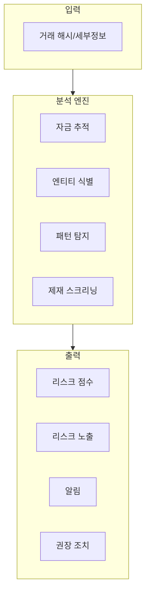
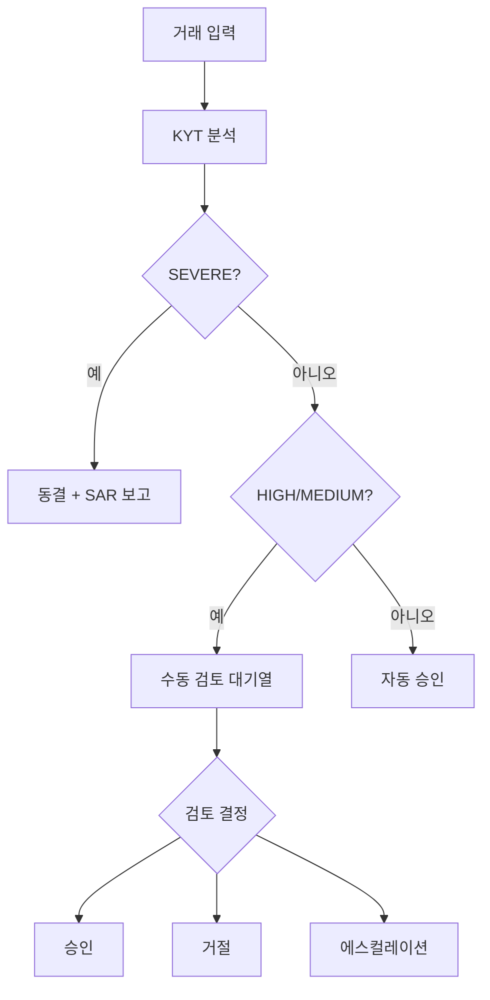

## KYT란

**KYT(Know Your Transaction)**는 개별 암호화폐 거래에 대한 리스크 식별 메커니즘으로, 각 온체인 거래를 실시간으로 분석하여 리스크 수준을 판단하고 대응 권장 사항을 제공합니다.

<Info>
**핵심 질문**: 이 거래는 안전한가?

KYT는 각 거래를 처리하기 전에 리스크 수준과 관련 리스크 엔티티를 신속하게 식별할 수 있도록 도와줍니다.
</Info>

## 전통 금융과의 비교

| 차원 | 전통 금융 | 암호화폐 KYT |
|-----------|---------------------|------------|
| **모니터링 방식** | 은행 거래 모니터링 | 온체인 거래 분석 |
| **데이터 기반** | 계정 이력 기반 | 주소 연관성 기반 |
| **처리 시간** | T+1 배치 처리 | 실시간/근실시간 |
| **규칙 엔진** | 주로 수동 규칙 | 알고리즘 + 라벨 기반 |

## 동작 원리



### 분석 흐름

1. **자금 추적**: 자금 출처와 목적지를 순방향/역방향으로 추적
2. **엔티티 식별**: 거래에 관련된 알려진 엔티티 식별 (거래소, 프로토콜, 라벨링된 주소)
3. **패턴 탐지**: 의심스러운 거래 패턴 식별 (분산, 난독화, 레이어링)
4. **제재 스크리닝**: 제재 목록과 대조

---

## 리스크 등급 정의

ChainStream은 4단계 리스크 분류 시스템을 사용합니다:

| 등급 | 표시 | 정의 | 일반적 트리거 |
|-------|-----------|------------|------------------|
| **SEVERE** | 🔴 | 알려진 범죄 연관 | 제재 주소, 확인된 해커 주소, 다크넷 마켓 |
| **HIGH** | 🟠 | 고위험 패턴 | 믹서 출력, 사기 연관, 비인가 도박 |
| **MEDIUM** | 🟡 | 주의 필요 | 고위험 거래소, 프라이버시 코인 스왑, 비정상 패턴 |
| **LOW** | 🟢 | 정상 | 알려진 규정 준수 엔티티, 일반 사용자 행동 |

### 등급 상세

<AccordionGroup>
  <Accordion title="SEVERE" icon="circle-exclamation">
    - **정의**: 확인된 범죄 활동과 직접 연관
    - **데이터 소스**: OFAC 제재 목록, 법 집행 보고서, 확인된 해킹 사건
    - **오탐률**: 매우 낮음 (&lt;0.1%)
    - **권장 조치**: 즉시 동결, 규제 기관에 보고
  </Accordion>
  
  <Accordion title="HIGH" icon="triangle-exclamation">
    - **정의**: 고위험 특성이 있으나 범죄 활동 미확인
    - **데이터 소스**: 믹서 식별, 사기 주소 클러스터링, 행동 패턴 분석
    - **오탐률**: 낮음 (&lt;5%)
    - **권장 조치**: 수동 검토, 처리 지연
  </Accordion>
  
  <Accordion title="MEDIUM" icon="circle-info">
    - **정의**: 리스크 신호가 있으나 추가 평가 필요
    - **데이터 소스**: 연관성 분석, 행동 이상 탐지
    - **오탐률**: 중간 (5-15%)
    - **권장 조치**: 강화된 모니터링, 처리 가능
  </Accordion>
  
  <Accordion title="LOW" icon="circle-check">
    - **정의**: 명확한 리스크 특성 없음
    - **데이터 소스**: 정상 거래 패턴, 알려진 규정 준수 엔티티
    - **권장 조치**: 정상 처리
  </Accordion>
</AccordionGroup>

---

## 권장 조치 매핑

리스크 수준에 따라 시스템이 표준화된 조치를 권장합니다:

| 리스크 등급 | 권장 조치 | 자동화 수준 | SLA |
|------------|-------------------|------------------|-----|
| **SEVERE** | 동결 | 자동 | 즉시 |
| **HIGH** | 수동 검토 | 수동 확인 필요 | 4시간 |
| **MEDIUM** | 강화 모니터링 | 반자동 | 24시간 |
| **LOW** | 통과 | 자동 | 즉시 |

### 조치 흐름



---

## 노출 유형

ChainStream은 두 가지 유형의 리스크 노출을 구분합니다:

<Tabs>
  <Tab title="직접 노출">
    **정의**: 거래가 리스크 주소와 직접 상호작용
    
    ```
    리스크 주소 ──────────────> 대상 주소
                 직접 전송
                 
    노출 유형: DIRECT
    리스크 전달: 100%
    ```
    
    **특성**:
    - 1홉 연관
    - 리스크 확실성 높음
    - 일반적으로 즉각적인 대응 트리거
    
    **예시 시나리오**:
    - 알려진 해커 주소로부터 자금 수신
    - 제재 주소로 송금
    - 믹서 출력에서 직접 수신
    
    ```json
    {
      "type": "DIRECT",
      "category": "SANCTIONS",
      "entity": "OFAC Sanctioned Address",
      "percentage": 100
    }
    ```
  </Tab>
  
  <Tab title="간접 노출">
    **정의**: N홉을 통해 리스크 주소와 연관
    
    ```
    리스크 주소 ──> 중개1 ──> 중개2 ──> 대상 주소
                 N홉 연관
                 
    노출 유형: INDIRECT
    리스크 전달: 감쇠 계산
    ```
    
    **특성**:
    - 다중 홉 연관 (일반적으로 2-5홉)
    - 거리에 따라 리스크 감쇠
    - 종합적 평가 필요
    
    **감쇠 모델**:
    
    `리스크 점수 = 기본 리스크 × (감쇠 계수 ^ 홉 수)`
    
    예시: 기본 리스크 100, 감쇠 계수 0.5, 3홉 후 = 100 × 0.5³ = 12.5
    
    ```json
    {
      "type": "INDIRECT",
      "category": "MIXER",
      "entity": "Tornado Cash",
      "percentage": 12.5,
      "hops": 3
    }
    ```
  </Tab>
</Tabs>

### 노출 처리 가이드라인

| 시나리오 | 직접 노출 처리 | 간접 노출 처리 |
|----------|-----------------|-------------------|
| SEVERE 소스 | 즉시 동결 | 2홉 이내 동결, 3홉 이상 수동 검토 |
| HIGH 소스 | 수동 검토 | 모니터링 플래그 |
| MEDIUM 소스 | 정상 처리 | 무시 |

---

## 비즈니스 흐름

### 표준 KYT 흐름

<Steps>
  <Step title="거래 등록">
    KYT API에 거래 정보 제출
    ```bash
    POST https://api.chainstream.io/v1/kyt/transfer
    Authorization: Bearer <access_token>
    Content-Type: application/json

    {
      "network": "ethereum",
      "asset": "ETH",
      "transferReference": "0x1234...abcd:0xRecipientAddress",
      "direction": "received"
    }
    ```
  </Step>
  <Step title="분석 대기">
    폴링을 통해 분석 완료 대기 (일반적으로 30초 이내)
  </Step>
  <Step title="결과 조회">
    리스크 평가 결과 조회
    ```bash
    GET https://api.chainstream.io/v1/kyt/transfers/{externalId}/summary
    Authorization: Bearer <access_token>
    ```
  </Step>
  <Step title="결정 실행">
    리스크 수준과 권장 사항에 따라 비즈니스 로직 실행
  </Step>
</Steps>

### 처리 시간

| 단계 | 목표 시간 | SLA 보장 |
|-------|-------------|----------------|
| 거래 등록 | &lt;100ms | 99.9% |
| 리스크 분석 | &lt;30초 | 95% |
| 결과 반환 | &lt;30초 | 95% |
| 엔드투엔드 | &lt;1분 | 90% |

<Note>
유효한 거래는 30초 이내에 분석이 완료됩니다. 복잡한 연관 관계는 더 긴 처리 시간이 필요할 수 있습니다.
</Note>

---

## 데이터 요소

### 입력 데이터 (거래 등록)

| 필드 | 필수 | 설명 |
|-------|----------|-------------|
| `network` | ✅ | 네트워크: `bitcoin`, `ethereum`, `Solana` |
| `asset` | ✅ | 자산 유형: `BTC`, `ETH`, `SOL` 등 |
| `transferReference` | ✅ | 전송 참조 (tx hash:address) |
| `direction` | ✅ | 방향: `sent` 또는 `received` |

### 입력 데이터 (출금 등록)

| 필드 | 필수 | 설명 |
|-------|----------|-------------|
| `network` | ✅ | 네트워크: `bitcoin`, `ethereum`, `Solana` |
| `asset` | ✅ | 자산 유형 |
| `address` | ✅ | 출금 대상 주소 |
| `assetAmount` | ✅ | 자산 금액 |
| `attemptTimestamp` | ✅ | 시도 타임스탬프 |
| `assetPrice` | 선택 | 자산 가격 |

### 출력 데이터

```json
{
  "externalId": "393905a7-bb96-394b-9e20-3645298c1079",
  "asset": "ETH",
  "network": "ethereum",
  "transferReference": "0x1234...abcd:0xAddress",
  "direction": "received",
  "tx": "0x1234...abcd",
  "outputAddress": "0xAddress",
  "assetAmount": "1.5",
  "usdAmount": "3000.00",
  "timestamp": "2024-01-15T10:30:00.000Z",
  "updatedAt": "2024-01-15T10:30:15.000Z"
}
```

### 응답 필드 설명

| 필드 | 타입 | 설명 |
|-------|------|-------------|
| externalId | string | 전송 ID (UUID), 후속 조회에 사용 |
| asset | string | 자산 유형 |
| network | string | 블록체인 네트워크 |
| transferReference | string | 전송 참조 |
| direction | string | 전송 방향 |
| tx | string | 거래 해시 |
| outputAddress | string | 출력 주소 |
| assetAmount | string | 자산 금액 |
| usdAmount | string | USD 금액 |
| timestamp | string | 거래 타임스탬프 |
| updatedAt | string | 업데이트 시간 |

---

## API 사용법

### 입금 거래 등록 (Transfer)

```bash
POST https://api.chainstream.io/v1/kyt/transfer
Authorization: Bearer <access_token>
Content-Type: application/json

{
  "network": "ethereum",
  "asset": "ETH",
  "transferReference": "0x9f318afbad2a183f97750bc51a75b582ad8f9e9c:0x17A16QmavnUfCW11DAApi",
  "direction": "received"
}
```

### 출금 거래 등록

```bash
POST https://api.chainstream.io/v1/kyt/withdrawal
Authorization: Bearer <access_token>
Content-Type: application/json

{
  "network": "Solana",
  "asset": "SOL",
  "address": "D1Mc6j9xQWgR1o1Z7yU5nVVXFQiAYx7FG9AW1aVfwrUM",
  "assetAmount": "5",
  "attemptTimestamp": "2024-01-15T10:30:00.000Z"
}
```

### 평가 상세 조회

```bash
# 전송 요약 조회
GET https://api.chainstream.io/v1/kyt/transfers/{externalId}/summary

# 직접 리스크 노출 조회
GET https://api.chainstream.io/v1/kyt/transfers/{externalId}/exposures/direct

# 리스크 알림 조회
GET https://api.chainstream.io/v1/kyt/transfers/{externalId}/alerts

# 네트워크 식별 조회
GET https://api.chainstream.io/v1/kyt/transfers/{externalId}/network-identifications
```

### 출금 관련 조회

```bash
# 출금 요약 조회
GET https://api.chainstream.io/v1/kyt/withdrawal/{withdrawalId}/summary

# 출금 직접 노출 조회
GET https://api.chainstream.io/v1/kyt/withdrawal/{withdrawalId}/exposures/direct

# 출금 알림 조회
GET https://api.chainstream.io/v1/kyt/withdrawal/{withdrawalId}/alerts

# 사기 평가 조회
GET https://api.chainstream.io/v1/kyt/withdrawal/{withdrawalId}/fraud-assessment
```

---

## 모범 사례

<AccordionGroup>
  <Accordion title="리스크 임계값 설정" icon="sliders">
    비즈니스 리스크 허용 범위에 따라 임계값을 조정하세요:
    
    | 비즈니스 유형 | SEVERE 임계값 | HIGH 임계값 | 권장 사항 |
    |---------------|------------------|----------------|----------------|
    | 인가된 CEX | 기본값 | 기본값 | 엄격 모드 |
    | 지갑 서비스 | 기본값 | 10% 상향 | 균형 모드 |
    | DeFi 프로토콜 | 기본값 | 20% 상향 | 완화 모드 |
  </Accordion>
  
  <Accordion title="오탐 처리" icon="flag">
    오탐 피드백 메커니즘을 구축하세요:
    
    1. 수동으로 뒤집은 모든 케이스 기록
    2. 오탐 패턴 정기 분석
    3. ChainStream에 오탐 피드백 제출
    4. 로컬 임계값 설정 조정
  </Accordion>
  
  <Accordion title="감사 추적" icon="file-lines">
    컴플라이언스 감사 요구사항 충족:
    
    - 모든 KYT 요청 및 응답 저장
    - 수동 결정 사항과 사유 기록
    - 최소 5년간 보관 (규제 요구사항에 따라)
    - 표준 보고서 형식 내보내기 지원
  </Accordion>
  
  <Accordion title="지속적 모니터링" icon="rotate">
    리스크 상태는 변경될 수 있습니다 (예: 주소가 이후에 제재됨). 권장 사항:
    
    - 과거 거래 정기적 재평가
    - 연관 주소의 새로운 활동 모니터링
    - 리스크 상태 변경에 대한 알림 메커니즘 구축
  </Accordion>
</AccordionGroup>

---

## 관련 자료

<CardGroup cols={2}>
  <Card title="KYA 핵심 개념" icon="user-shield" href="/ko/guides/data-concepts/kya-concepts">
    주소 수준 리스크 관리 알아보기
  </Card>
  <Card title="컴플라이언스 통합 가이드" icon="plug" href="/ko/guides/data-concepts/compliance-integration">
    KYT 통합 시작하기
  </Card>
  <Card title="API 인증" icon="key" href="/ko/guides/getting-started/authentication">
    인증 방법 이해하기
  </Card>
  <Card title="KYT API 레퍼런스" icon="code" href="/ko/api-reference/endpoint/kyt/v1/kyt-transfer-post">
    API 문서 보기
  </Card>
</CardGroup>
