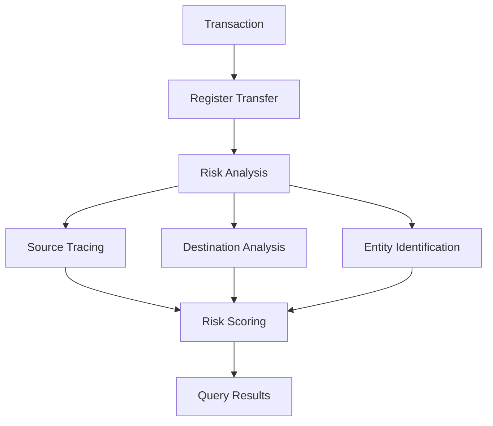

## 개요

암호화폐가 주류로 자리잡으면서 컴플라이언스 요구사항이 점점 더 엄격해지고 있습니다. ChainStream은 규제 요건 충족, 위험 거래 식별, 사용자 자산 보호를 위한 포괄적인 보안 및 컴플라이언스 솔루션을 제공합니다.

<CardGroup cols={2}>
  <Card title="KYT - 트랜잭션 확인" icon="magnifying-glass-dollar" color="#4D9CFF">
    트랜잭션 자금 출처 및 도착지를 실시간 분석하여 고위험 연관성을 식별합니다
  </Card>
  <Card title="KYA - 주소 확인" icon="user-shield" color="#16A34A">
    지갑 주소의 위험 수준 및 연관 엔티티를 평가합니다
  </Card>
</CardGroup>

## 온체인 컴플라이언스가 필요한 이유

<AccordionGroup>
  <Accordion title="규제 요구사항" icon="gavel">
    주요 관할권(미국, EU, 싱가포르, 홍콩 등)은 암호화폐 거래소 및 서비스 제공자에 대해 명확한 AML/CFT 컴플라이언스 요구사항을 두고 있습니다.
  </Accordion>
  
  <Accordion title="리스크 관리" icon="shield-halved">
    다음을 식별하고 차단합니다:
    - 해킹 관련 자금
    - 랜섬웨어 결제
    - 믹서 및 프라이버시 프로토콜 연관
    - 사기 및 피싱 주소
  </Accordion>
  
  <Accordion title="사용자 보호" icon="user-shield">
    - 사용자가 고위험 주소와 상호작용하는 것을 방지
    - 토큰 보안 검사 제공
    - 허니팟 및 러그풀 식별
  </Accordion>
</AccordionGroup>

## ChainStream 컴플라이언스 기능

### KYT (Know Your Transaction)

**개별 트랜잭션**에 대한 위험 평가:



**핵심 기능**:
- 트랜잭션 위험 점수 산출
- 자금 출처/도착지 추적
- 엔티티 식별
- 알림 생성

자세한 내용은 [KYT 개념](/ko/guides/data-concepts/kyt-concepts)을 참조하세요.

### KYA (Know Your Address)

**지갑 주소**에 대한 위험 평가:

- 주소 위험 등급
- 과거 행동 분석
- 엔티티 식별
- 라벨 분류

자세한 내용은 [KYA 개념](/ko/guides/data-concepts/kya-concepts)을 참조하세요.

## 커버리지

### 지원 체인

| 체인 | KYT | KYA | 비고 |
|-------|-----|-----|------|
| Ethereum | 전체 | 전체 | ERC-20 포함 |
| BSC | 전체 | 전체 | BEP-20 포함 |
| Polygon | 전체 | 전체 | |
| Arbitrum | 전체 | 전체 | |
| Solana | 전체 | 전체 | SPL 토큰 |
| Tron | 전체 | 전체 | TRC-20 |
| Bitcoin | 부분 | 부분 | 메인넷 |

### 위험 카테고리

ChainStream이 식별할 수 있는 위험 카테고리는 다음과 같습니다:

| 카테고리 | 설명 | 위험 수준 |
|----------|------|-----------|
| Sanctions | 제재 대상 엔티티/주소 | 심각 |
| Darknet | 다크넷 마켓 연관 | 심각 |
| Ransomware | 랜섬웨어 연관 | 심각 |
| Hacking | 해킹 관련 자금 | 심각 |
| Fraud | 사기/피싱 연관 | 높음 |
| Mixer | 믹서/프라이버시 프로토콜 | 높음 |
| Gambling | 도박 플랫폼 | 보통 |
| High Risk Exchange | 고위험 거래소 | 보통 |

## 연동

KYT/KYA는 **등록 + 조회** 2단계 모델을 사용합니다: 먼저 트랜잭션 또는 주소를 등록한 후, 시스템이 위험 분석을 완료하면 평가 결과를 조회합니다.

<Tabs>
  <Tab title="트랜잭션 위험 (KYT)">
    **1단계: 이체 등록**
    
    ```bash
    POST /v1/kyt/transfer
    {
      "network": "ethereum",
      "asset": "ETH",
      "transferReference": "your-unique-reference",
      "direction": "received",
      "transferTimestamp": "2024-01-15T10:30:00Z",
      "txHash": "0x...",
      "outputAddress": "0x..."
    }
    ```
    
    **2단계: 결과 조회**
    
    ```bash
    # Get risk summary
    GET /v1/kyt/transfers/{transferId}/summary
    
    # Get risk alerts
    GET /v1/kyt/transfers/{transferId}/alerts
    
    # Get direct risk exposure
    GET /v1/kyt/transfers/{transferId}/exposures/direct
    ```
  </Tab>
  
  <Tab title="주소 위험 (KYA)">
    **1단계: 주소 등록**
    
    ```bash
    POST /v1/kyt/address
    {
      "network": "ethereum",
      "address": "0x...",
      "asset": "ETH"
    }
    ```
    
    **2단계: 위험 등급 조회**
    
    ```bash
    GET /v1/kyt/addresses/{address}/risk
    ```
  </Tab>
  
  <Tab title="연동 예시">
    KYT를 입금 흐름에 통합합니다:
    
    ```javascript
    import { ChainStreamClient } from '@chainstream-io/sdk';
    
    const client = new ChainStreamClient(process.env.CHAINSTREAM_ACCESS_TOKEN);
    
    async function processDeposit(txHash, toAddress) {
      // Step 1: Register transfer
      const transfer = await client.kyt.registerTransfer({
        network: 'ethereum',
        asset: 'ETH',
        transferReference: `deposit-${txHash}`,
        direction: 'received',
        transferTimestamp: new Date().toISOString(),
        txHash: txHash,
        outputAddress: toAddress
      });
      
      // Step 2: Query risk summary
      const summary = await client.kyt.getTransferSummary(transfer.transferId);
      
      // Step 3: Make decision based on risk level
      if (summary.rating === 'highRisk' || summary.rating === 'severe') {
        // Get detailed alerts
        const alerts = await client.kyt.getTransferAlerts(transfer.transferId);
        await flagForReview(txHash, alerts);
        return { status: 'pending_review', alerts };
      }
      
      return { status: 'approved', rating: summary.rating };
    }
    ```
  </Tab>
</Tabs>

## 사용 사례

<CardGroup cols={2}>
  <Card title="입금 모니터링" icon="arrow-down-to-arc">
    입금 시 자금 출처 위험을 평가하여 문제 있는 자금을 차단합니다
  </Card>
  
  <Card title="출금 전 확인" icon="arrow-up-from-arc">
    출금 전 도착지 주소 위험을 평가하여 제재 대상 엔티티로의 자금 유출을 방지합니다
  </Card>
  
  <Card title="지갑 스크리닝" icon="wallet">
    사용자 등록 또는 KYC 과정에서 지갑 이력의 위험을 확인합니다
  </Card>
  
  <Card title="컴플라이언스 보고" icon="file-lines">
    규제 요건을 충족하는 트랜잭션 모니터링 보고서를 생성합니다
  </Card>
</CardGroup>

## 다음 단계

<CardGroup cols={3}>
  <Card title="KYT 개념" icon="magnifying-glass-dollar" href="/ko/guides/data-concepts/kyt-concepts">
    트랜잭션 위험 평가에 대한 심층 분석
  </Card>
  <Card title="KYA 개념" icon="user-shield" href="/ko/guides/data-concepts/kya-concepts">
    주소 위험 평가에 대한 심층 분석
  </Card>
  <Card title="연동 가이드" icon="plug" href="/ko/guides/data-concepts/compliance-integration">
    컴플라이언스 API 연동 방법 알아보기
  </Card>
</CardGroup>
