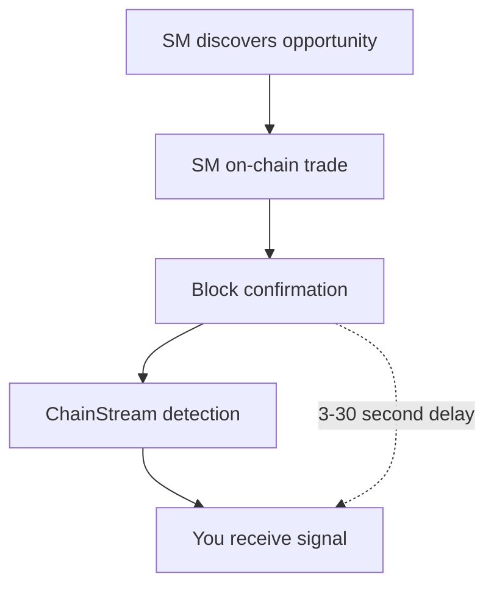

ChainStream의 스마트 머니 기능은 개발자가 암호화폐 시장에서 지속적으로 시장 평균 이상의 수익을 달성하는 주소인 "스마트 머니"를 추적하고 분석하는 데 도움을 줍니다. 이 문서에서는 스마트 머니 식별 방법론과 데이터 업데이트 메커니즘을 상세히 설명합니다.

---

## 스마트 머니란

### 정의

스마트 머니란 암호화폐 시장에서 다음과 같은 특성을 보이는 주소를 말합니다:

- 시장 벤치마크를 지속적으로 상회
- 양질의 프로젝트에 초기 진입
- 높은 승률 유지
- 전문적인 리스크 관리 능력

### 스마트 머니 유형

| 유형 | 설명 | 대표 특성 |
|:--|:--|:--|
| 기관 투자자 | 전문 투자 기관, 펀드 | 대규모 거래, 장기 보유, 분산 투자 |
| 전문 트레이더 | 전업 암호화폐 트레이더 | 고빈도 거래, 기술 분석, 다중 전략 |
| 초기 투자자 | 프로젝트 초기 참여자 | 1차 시장 참여, 장기 잠금 |
| KOL/인플루언서 지갑 | 업계 유명 인사 | 커뮤니티 영향력, 정보 우위 |

### 일반 주소와의 비교

| 차원 | 스마트 머니 | 일반 주소 |
|:--|:--|:--|
| 수익률 | 지속적 양의 수익, 시장 초과 | 높은 변동성, 빈번한 손실 |
| 진입 타이밍 | 조기 발견, 저점 매수 | 추격 매수, 고점 매수 |
| 승률 | &gt; 60% | &lt; 50% |
| 포지션 관리 | 명확한 익절/손절 전략 | 랜덤 거래, 규율 없음 |
| 자본 규모 | 보통 &gt; $100K | 광범위하게 분포 |

---

## 식별 방법론

### 데이터 소스

ChainStream은 다음 온체인 데이터를 분석합니다:

- 모든 DEX 거래 기록
- 토큰 보유 변동
- 자금 흐름 궤적
- 거래 시간 분포
- 가스 수수료 패턴

### 후보 풀 선정 방법

ChainStream은 신규 출시 토큰 성과를 기반으로 한 역추적 방법으로 스마트 머니 후보 풀을 구축합니다:

#### 선정 과정

<Steps>
  <Step title="토큰 성과 스크리닝">
    최근 60일 동안 새로 출시된 모든 토큰에서 시가총액 성장/거래량 지표를 기준으로 상위 1000개 최고 성과 토큰을 선정
  </Step>
  <Step title="초기 참여자 식별">
    위 토큰에 대해 초기 단계(출시 후 24시간 이내)에 매수한 주소를 식별
  </Step>
  <Step title="주소 노이즈 제거">
    다음 주소 유형을 제외:
    - DEV/프로젝트 주소 (거래 패턴으로 식별)
    - 마켓 메이커 주소 (고빈도 자전거래로 식별)
    - CEX 핫 월렛 주소 (알려진 주소 데이터베이스와 매칭)
    - 시빌 공격 주소 (상관관계 분석으로 식별)
  </Step>
  <Step title="빈도 통계 및 랭킹">
    상위 1000개 토큰에서 각 주소의 초기 매수 빈도를 집계하고, 빈도가 가장 높은 상위 200개 주소를 스마트 머니 후보 풀로 선정
  </Step>
</Steps>

### 동적 롤링 업데이트 메커니즘

스마트 머니 데이터의 시의성과 정확성을 유지하기 위해, ChainStream은 가중치 감소가 적용된 주간 롤링 업데이트를 구현합니다:

| 설정 | 값 |
|:--|:--|
| 업데이트 주기 | 매주 월요일 UTC 00:00 |
| 윈도우 크기 | 60일 (약 8주) |
| 롤링 방법 | 매주 가장 오래된 주의 데이터를 제거하고, 최신 주의 데이터를 포함 |

#### 가중치 감소 모델

| 데이터 기간 | 가중치 |
|:--|:--|
| 최근 1주 | 100% |
| 2주 전 | 85% |
| 3주 전 | 70% |
| 4주 전 | 55% |
| 5-8주 전 | 40% |

<Warning>
롤링 업데이트는 스마트 머니 목록이 동적으로 변한다는 것을 의미합니다. 최근 성과가 좋지 않은 과거 스마트 머니 주소는 점차 후보 풀에서 제거됩니다.
</Warning>

---

## 데이터 업데이트 주기

### 실시간 업데이트

| 데이터 유형 | 업데이트 지연 |
|:--|:--|
| 새로운 거래 탐지 | &lt; 1분 |
| 포지션 변동 | &lt; 5분 |

### 정기 업데이트

| 데이터 유형 | 업데이트 주기 |
|:--|:--|
| 스마트 머니 목록 | 매주 월요일 UTC 00:00 |
| 점수 재계산 | 매 24시간 |
| 전체 재평가 | 매 30일 |

---

## 사용 사례

<CardGroup cols={2}>
  <Card title="카피 트레이딩" icon="copy">
    스마트 머니의 매수 신호를 모니터링하여 거래 결정을 보조합니다.
  </Card>
  <Card title="프로젝트 발견" icon="magnifying-glass">
    스마트 머니가 관심을 보이는 새로운 프로젝트를 분석합니다:
    - 여러 스마트 머니가 동시에 매수
    - 빠른 매도보다 지속적 축적
  </Card>
  <Card title="시장 심리" icon="chart-mixed">
    스마트 머니의 행동을 통해 시장 심리를 판단합니다:
    - 대규모 매수: 강세 신호
    - 집중 매도: 약세 신호
  </Card>
  <Card title="리스크 경고" icon="triangle-exclamation">
    비정상적인 자금 흐름을 모니터링합니다:
    - 고래의 대규모 전송
    - 프로젝트 팀 주소 움직임
  </Card>
</CardGroup>

---

## 사용 가이드라인

<Warning>
스마트 머니 신호는 참고용이며 투자 조언이 아닙니다.
</Warning>

### 올바른 사용법

- 주목할 만한 토큰을 발견하기 위한 리서치 시작점으로 활용
- 펀더멘탈 분석과 결합하여 독자적 판단 수행
- 신호 지연 이해 — 온체인 트랜잭션에는 확인 시간이 필요
- 정확도를 높이기 위해 다중 신호 수렴에 집중

### 잘못된 사용법

- 리서치 없이 맹목적으로 카피 트레이딩
- 거래 비용 무시 (Gas, 슬리피지)
- 시장 환경과 매크로 요인 무시
- 단일 신호 소스에 지나친 의존

---

## 한계

### 1. 정보 지연

### 2. 역거래 리스크

- 일부 SM은 추적당하는 것을 인지하고 의도적으로 역거래를 할 수 있음
- 대규모 매수는 덤핑을 위한 허위 신호일 수 있음

### 3. 시장 용량 한계

- SM 매수를 따라가면 가격이 상승
- 소규모 시가총액 토큰은 용량이 제한적이며, 카피 트레이딩 효과가 감소

### 4. 과거 성과가 미래 결과를 보장하지 않음

- 과거 높은 수익률이 미래 성과를 보장하지 않음
- 시장 환경 변화로 전략이 실패할 수 있음

---

## 관련 문서

<CardGroup cols={2}>
  <Card title="스마트 머니 트래커" icon="user-secret" href="/ko/playbooks/tutorials/smart-money-tracker">
    실습 튜토리얼: SM 추적 시스템 구축
  </Card>
  <Card title="실시간 스트리밍" icon="bolt" href="/ko/guides/data-concepts/realtime-streaming">
    실시간 스트림 처리
  </Card>
</CardGroup>
