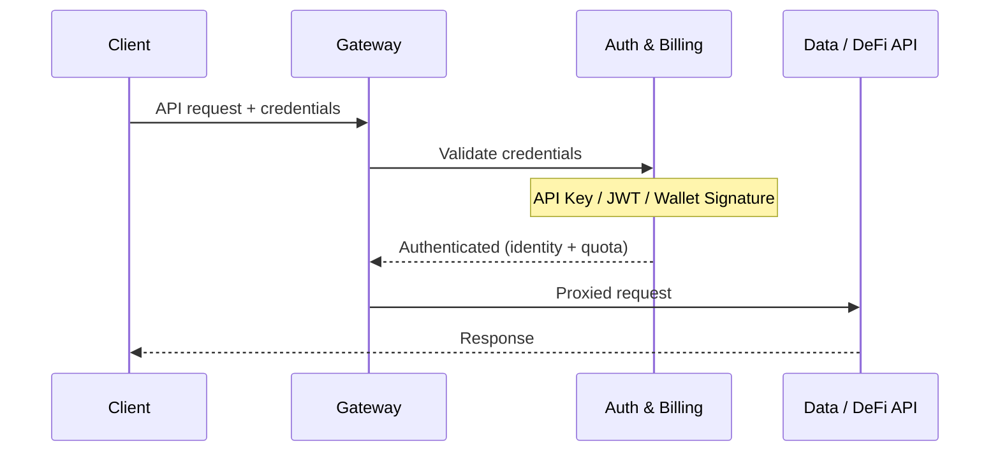

## 아키텍처

모든 API 요청은 **게이트웨이**를 통과하며, 게이트웨이는 백엔드 서비스로 전달하기 전에 자격 증명을 검증합니다. 게이트웨이는 인증 및 쿼터 확인을 내부 **인증 및 빌링 서비스**에 위임하여, 모든 요청이 단일 홉으로 검증되도록 합니다.



인증 실패 시 게이트웨이는 백엔드에 도달하지 않고 직접 오류를 반환합니다 (401 Unauthorized, 또는 x402가 활성화된 경우 402 Payment Required).

---

## 세 가지 인증 방법

ChainStream은 **세 가지** 자격 증명 유형을 지원하며, 다음 순서로 평가됩니다:

| 우선순위 | 방법 | 헤더 | 최적 용도 |
|----------|--------|--------|----------|
| 1 | **지갑 서명 (SIWX)** | `Authorization: SIWX <token>` | 온체인 지갑을 가진 AI 에이전트 (x402 구독자) |
| 2 | **API Key** | `X-API-KEY: <key>` | 애플리케이션, 스크립트, CLI, MCP Server |
| 3 | **JWT Bearer 토큰** | `Authorization: Bearer <jwt>` | OAuth 2.0 Client Credentials를 사용하는 대시보드 앱 |

<Info>
유효한 자격 증명이 없고 x402가 활성화된 경우, 게이트웨이는 `/x402/purchase`에 대한 포인터와 함께 **HTTP 402 Payment Required**를 반환합니다. 이를 통해 AI 에이전트가 구독을 자동 구매할 수 있습니다.
</Info>

---

## 방법 1: API Key (추천)

가장 간단한 인증 방법입니다. 대시보드에서 API Key를 생성하고 `X-API-KEY` 헤더로 전달합니다.

### API Key 발급

<Steps>
  <Step title="대시보드 로그인">
    [ChainStream 대시보드](https://www.chainstream.io/dashboard)를 방문하여 로그인
  </Step>
  <Step title="Applications으로 이동">
    사이드바에서 "Applications" 찾기
  </Step>
  <Step title="새 앱 생성">
    "Create New App"을 클릭하여 API Key 생성
  </Step>
</Steps>

### API Key 사용

<Tabs>
  <Tab title="cURL">
```bash
curl https://api.chainstream.io/v2/token/sol/So11111111111111111111111111111111111111112 \
  -H "X-API-KEY: your_api_key"
```
  </Tab>
  <Tab title="SDK">
```typescript
import { ChainStreamClient } from "@chainstream-io/sdk";

const cs = new ChainStreamClient({
  apiKey: "your_api_key",
});

const token = await cs.token.getToken("So11111111111111111111111111111111111111112", "solana");
```
  </Tab>
  <Tab title="CLI">
```bash
chainstream config set --key apiKey --value your_api_key
chainstream token info --chain sol --address So11111111111111111111111111111111111111112
```
  </Tab>
  <Tab title="MCP Server">
```bash
export CHAINSTREAM_API_KEY=your_api_key
npx @chainstream-io/mcp
```
  </Tab>
</Tabs>

### 동작 원리

1. 게이트웨이가 `X-API-KEY` 헤더를 추출
2. 인증 서비스가 데이터베이스에서 키를 검증
3. 성공 시 연관된 조직 및 권한 컨텍스트와 함께 요청이 전달
4. 키는 `active` 상태이고 만료되지 않아야 함

<Warning>
API Key를 안전하게 보관하세요. 코드 저장소에 커밋하지 마세요. 유출된 경우 대시보드에서 즉시 폐기하세요.
</Warning>

---

## 방법 2: JWT Bearer 토큰 (OAuth 2.0)

OAuth 2.0 Client Credentials 플로우를 사용하는 애플리케이션용입니다. Client ID와 Client Secret을 JWT 액세스 토큰으로 교환합니다.

### 액세스 토큰 생성

<Tabs>
  <Tab title="cURL">
```bash
curl -X POST "https://dex.asia.auth.chainstream.io/oauth/token" \
  -H "Content-Type: application/json" \
  -d '{
    "client_id": "YOUR_CLIENT_ID",
    "client_secret": "YOUR_CLIENT_SECRET",
    "audience": "https://api.dex.chainstream.io",
    "grant_type": "client_credentials"
  }'
```
  </Tab>
  <Tab title="JavaScript">
```javascript
const response = await fetch('https://dex.asia.auth.chainstream.io/oauth/token', {
  method: 'POST',
  headers: { 'Content-Type': 'application/json' },
  body: JSON.stringify({
    client_id: 'YOUR_CLIENT_ID',
    client_secret: 'YOUR_CLIENT_SECRET',
    audience: 'https://api.dex.chainstream.io',
    grant_type: 'client_credentials'
  })
});

const { access_token } = await response.json();
```
  </Tab>
  <Tab title="Python">
```python
import requests

response = requests.post(
    'https://dex.asia.auth.chainstream.io/oauth/token',
    json={
        'client_id': 'YOUR_CLIENT_ID',
        'client_secret': 'YOUR_CLIENT_SECRET',
        'audience': 'https://api.dex.chainstream.io',
        'grant_type': 'client_credentials'
    }
)

access_token = response.json()['access_token']
```
  </Tab>
</Tabs>

### 토큰 사용

```bash
curl https://api.chainstream.io/v2/token/sol/So11111111111111111111111111111111111111112 \
  -H "Authorization: Bearer YOUR_ACCESS_TOKEN"
```

### 동작 원리

1. 게이트웨이가 `Authorization: Bearer <jwt>` 헤더를 추출
2. 인증 서비스가 JWT 서명, 발급자, audience를 검증
3. `client_id` 클레임이 쿼터 추적을 위한 조직으로 해석됨

### 토큰 상세

- **유효기간**: 기본 24시간
- **알고리즘**: RS256
- **발급자**: `https://dex.asia.auth.chainstream.io/`
- **Audience**: `https://api.dex.chainstream.io`

### 스코프 권한

특정 엔드포인트는 특정 스코프를 필요로 합니다:

| 스코프 | 설명 | 적용 엔드포인트 |
|-------|-------------|---------------------|
| `webhook.read` | Webhook 읽기 권한 | Webhook 설정 조회 |
| `webhook.write` | Webhook 쓰기 권한 | Webhook 생성/수정/삭제 |
| `kyt.read` | KYT 읽기 권한 | 리스크 평가 결과 조회 |
| `kyt.write` | KYT 쓰기 권한 | 리스크 평가를 위한 거래/주소 제출 |

```javascript
const response = await auth0Client.oauth.clientCredentialsGrant({
  audience: 'https://api.dex.chainstream.io',
  scope: 'webhook.read webhook.write kyt.read kyt.write'
});
```

<Note>
스코프를 지정하지 않으면 토큰으로 모든 일반 API 엔드포인트에 접근할 수 있습니다. 스코프는 Webhook과 KYT 엔드포인트에만 필요합니다.
</Note>

---

## 방법 3: 지갑 서명 (SIWX)

[x402 결제](/ko/guides/getting-started/x402-payments)를 통해 구독을 구매한 온체인 지갑을 가진 AI 에이전트용입니다. **Sign-In with X (SIWX)** 표준 (EVM의 EIP-4361, Solana 동등 표준)을 사용합니다.

### 동작 원리

1. 에이전트가 도메인, 주소, 논스, 만료 시간이 포함된 표준 사인인 메시지를 구성
2. 에이전트가 지갑 프라이빗 키로 메시지에 서명
3. 서명된 토큰이 `Authorization: SIWX base64(message).signature`로 전송
4. 인증 서비스가 서명을 검증하고 유효한 x402 구독을 확인
5. 유효하고 만료되지 않은 구독이 있으면 인증 성공

### 토큰 형식

```
Authorization: SIWX base64(message).signature
```

메시지는 EIP-4361 형식을 따릅니다:

```
api.chainstream.io wants you to sign in with your Ethereum account:
0xYourWalletAddress

Sign in to ChainStream API

URI: https://api.chainstream.io
Version: 1
Chain ID: 8453
Nonce: abc123
Issued At: 2026-03-26T10:00:00Z
Expiration Time: 2026-03-27T10:00:00Z
```

### 지원 체인

| 체인 | 주소 형식 | 서명 유형 |
|-------|---------------|---------------|
| EVM (Base, Ethereum) | `0x` 접두사, 40자리 16진수 | EIP-191 personal_sign |
| Solana | Base58 인코딩, 32-44자 | Ed25519 |

### SDK 사용

```typescript
const cs = new ChainStreamClient({
  auth: {
    type: "siwx",
    address: "0xYourWalletAddress",
    signMessage: async (message: string) => {
      return await wallet.signMessage(message);
    },
  },
});
```

<Note>
SIWX 인증에는 활성 x402 구독이 필요합니다. 구독이 만료된 경우 요청이 거부됩니다. 구독 구매에 대해서는 [x402 결제](/ko/guides/getting-started/x402-payments)를 참고하세요.
</Note>

---

## WebSocket 인증

WebSocket 연결도 동일한 세 가지 인증 방법을 사용합니다. 게이트웨이는:

1. WebSocket 업그레이드 요청을 감지
2. 핸드셰이크를 허용하기 전에 자격 증명을 검증
3. 사용량 계측을 위해 세션을 추적
4. 연결 해제 시 사용량 메트릭 (전송 바이트, 지속시간)을 보고

WebSocket 토큰은 쿼리 파라미터로도 전달할 수 있습니다:

```
wss://realtime-dex.chainstream.io/connection/websocket?token=YOUR_ACCESS_TOKEN
```

---

## 인증 우선순위

단일 요청에 여러 자격 증명이 있는 경우 다음 순서로 평가됩니다:

1. **SIWX** -- `Authorization` 헤더가 `SIWX `로 시작하고 x402가 구성된 경우
2. **API Key** -- `X-API-KEY` 헤더가 있는 경우
3. **JWT Bearer** -- `Authorization` 헤더가 `Bearer `로 시작하는 경우
4. **402 Payment Required** -- 일치하는 자격 증명이 없고 x402가 활성화된 경우

첫 번째 성공한 매칭이 적용됩니다. 이후 방법은 평가되지 않습니다.

---

## API 엔드포인트

| 서비스 | URL |
|---------|-----|
| 메인넷 API | `https://api.chainstream.io/` |
| WebSocket | `wss://realtime-dex.chainstream.io/connection/websocket` |
| 인증 서비스 (OAuth) | `https://dex.asia.auth.chainstream.io/` |
| x402 가격 | `https://api.chainstream.io/x402/pricing` |
| x402 구매 | `https://api.chainstream.io/x402/purchase` |

---

## 인증 방법 선택

<CardGroup cols={3}>
  <Card title="API Key" icon="key" color="#4D9CFF">
    **최적 용도**: 애플리케이션, 스크립트, CLI, MCP Server

    가장 간단한 설정. 대시보드에서 생성하고 헤더로 전달. 토큰 갱신 불필요.
  </Card>
  <Card title="JWT Bearer" icon="shield-check" color="#9333EA">
    **최적 용도**: 대시보드 앱, 서버 간 통신

    표준 OAuth 2.0 플로우. 스코프 권한 지원. 24시간 토큰 TTL.
  </Card>
  <Card title="SIWX 지갑" icon="wallet" color="#16A34A">
    **최적 용도**: 온체인 지갑을 가진 AI 에이전트

    x402 구독을 통한 지갑 네이티브 인증. API 키 관리 불필요.
  </Card>
</CardGroup>

---

## FAQ

<AccordionGroup>
  <Accordion title="어떤 방법을 사용해야 하나요?">
    대부분의 사용 사례에는 **API Key**를 추천합니다. 설정이 가장 간단하며 모든 ChainStream 제품(SDK, CLI, MCP Server)에서 작동합니다. 스코프 권한이 필요한 OAuth 2.0 통합에는 **JWT**를 사용하세요. 자체 지갑이 있는 AI 에이전트를 구축하고 x402로 결제하려면 **SIWX**를 사용하세요.
  </Accordion>
  <Accordion title="토큰이 만료되면 어떻게 하나요?">
    JWT의 경우: Client ID와 Client Secret을 사용하여 새 토큰을 생성하세요. SIWX의 경우: 미래 만료 시간으로 새 메시지에 서명하세요. API Key는 대시보드에서 만료 날짜를 설정하지 않는 한 만료되지 않습니다.
  </Accordion>
  <Accordion title="여러 인증 방법을 사용할 수 있나요?">
    요청당 하나의 방법만 평가됩니다. `X-API-KEY`와 `Authorization: Bearer`를 모두 보내면 API Key가 우선합니다 (SIWX > API Key > JWT).
  </Accordion>
  <Accordion title="402 Payment Required 응답이란?">
    유효한 자격 증명이 없고 x402가 활성화된 경우, 게이트웨이는 `/x402/purchase`에서 구독 구매 안내와 함께 HTTP 402를 반환합니다. 이를 통해 AI 에이전트가 자동으로 접근 권한을 구매할 수 있습니다. [x402 결제](/ko/guides/getting-started/x402-payments)를 참고하세요.
  </Accordion>
  <Accordion title="자격 증명은 어떻게 폐기하나요?">
    **API Key**: 대시보드에서 앱을 삭제합니다. 키는 즉시 무효화됩니다. **JWT**: 대시보드에서 Client ID/Secret을 폐기합니다. **SIWX**: 구독은 자연 만료되며 수동 폐기가 없습니다.
  </Accordion>
</AccordionGroup>
