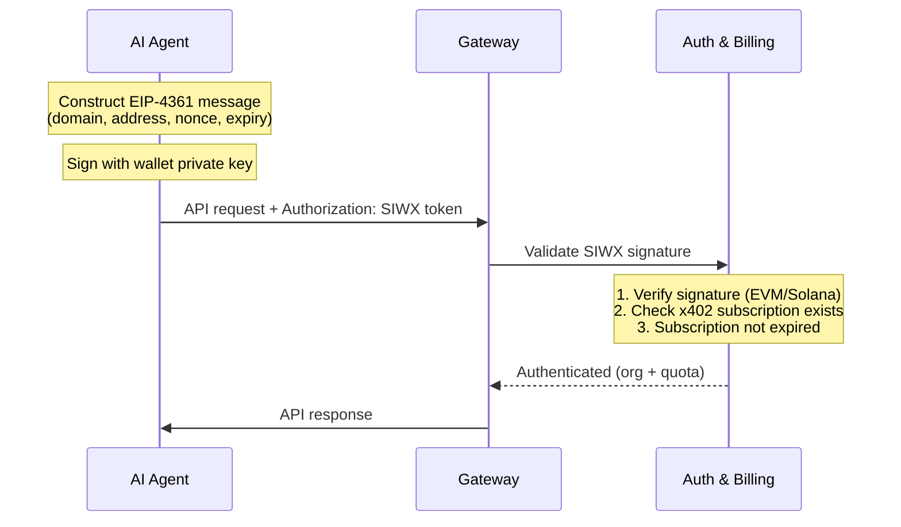

Sign-In with X (SIWX)는 모든 API 요청에서 지갑으로 메시지에 서명하여 ChainStream에 인증할 수 있게 합니다 — API Key나 OAuth 토큰이 필요 없습니다. [x402 결제](/ko/docs/platform/billing-payments/x402-payments)를 통해 구독을 구매한 **온체인 지갑을 가진 AI 에이전트**를 위해 설계되었습니다.

<Info>
SIWX는 API Key를 대체합니다. `X-API-KEY` 대신 각 요청에 `Authorization: SIWX <token>`을 전달합니다. 게이트웨이는 서명을 검증하고 실시간으로 유효한 x402 구독을 확인합니다.
</Info>

## 동작 원리

기존의 챌린지/응답 플로우와 달리, SIWX는 **무상태이며 자체 완결적**입니다. 클라이언트가 로컬에서 메시지를 구성하고 서명한 후 모든 요청에 첨부합니다.



### 단계별 설명

1. **EIP-4361 메시지 구성** — 지갑 주소, 도메인, 논스, 만료 시간 포함
2. **지갑 프라이빗 키로 메시지 서명**
3. **SIWX 토큰으로 인코딩**: `base64(message).signature`
4. **모든 API 요청에 첨부**: `Authorization: SIWX <token>`
5. 게이트웨이가 서명을 검증하고 지갑에 활성 x402 구독이 있는지 확인
6. 유효한 경우 요청이 정상적으로 처리됨 (API Key 인증과 동일)

## 토큰 형식

```
Authorization: SIWX base64(message).signature
```

메시지는 EIP-4361 표준을 따릅니다:

```
api.chainstream.io wants you to sign in with your Ethereum account:
0xYourWalletAddress

Sign in to ChainStream API

URI: https://api.chainstream.io
Version: 1
Chain ID: 8453
Nonce: abc123def456
Issued At: 2026-03-26T10:00:00Z
Expiration Time: 2026-03-27T10:00:00Z
```

### 필수 필드

| 필드 | 설명 |
|---|---|
| Domain | `api.chainstream.io`이어야 함 |
| Address | 지갑 주소 (EVM `0x...` 또는 Solana base58) |
| URI | `https://api.chainstream.io` |
| Version | `1` |
| Nonce | 랜덤 문자열 (클라이언트 생성, 리플레이 방지용) |
| Issued At | ISO 8601 타임스탬프 |
| Expiration Time | ISO 8601 타임스탬프 (이 시간 이후 토큰 거부) |

<Note>
만료 시간은 클라이언트가 설정합니다. 몇 분, 몇 시간, 또는 며칠 동안 유효한 메시지에 서명할 수 있습니다. 만료가 길수록 재서명이 적지만, 짧을수록 더 안전합니다.
</Note>

## 지원 체인

| 체인 | 주소 형식 | 서명 검증 |
|---|---|---|
| EVM (Base, Ethereum) | `0x` 접두사, 40자리 16진수 | EIP-191 `personal_sign` 복구 |
| Solana | Base58 인코딩, 32-44자 | Ed25519 서명 검증 |

## 사전 요구사항

SIWX 인증에는 지갑 주소에 연결된 **활성 x402 구독**이 필요합니다. 구독이 없으면 게이트웨이가 오류와 함께 요청을 거부합니다.

구독을 받으려면:

```bash
# CLI를 통해 (자동)
chainstream login
chainstream token info --chain sol --address So11111111111111111111111111111111111111112
# → 402가 플랜 선택을 트리거 → x402 결제 → API Key 저장

# 또는 직접 x402 구매를 통해
curl https://api.chainstream.io/x402/purchase?plan=nano
# → x402 결제 플로우 따르기
```

자세한 내용은 [x402 결제](/ko/docs/platform/billing-payments/x402-payments)를 참고하세요.

## 사용 예시

### cURL

```bash
# 1. 메시지 구성 및 서명 (선호하는 도구 사용)
# 2. 메시지를 Base64 인코딩하고 서명을 추가
TOKEN="base64EncodedMessage.signatureHex"

# 3. 모든 API 호출에 사용
curl https://api.chainstream.io/v2/token/sol/So11111111111111111111111111111111111111112 \
  -H "Authorization: SIWX $TOKEN"
```

### SDK

```typescript
import { ChainStreamClient } from "@chainstream-io/sdk";

const cs = new ChainStreamClient({
  auth: {
    type: "siwx",
    address: "0xYourWalletAddress",
    signMessage: async (message: string) => {
      return await wallet.signMessage(message);
    },
  },
});

const token = await cs.token.getToken("So11111111111111111111111111111111111111112", "sol");
```

### CLI

CLI는 지갑으로 로그인하면 자동으로 SIWX를 사용합니다:

```bash
chainstream login
chainstream token info --chain sol --address So11111111111111111111111111111111111111112
```

## SIWX vs API Key

| | SIWX | API Key |
|---|---|---|
| **헤더** | `Authorization: SIWX <token>` | `X-API-KEY: <key>` |
| **자격 증명 관리** | 키 저장 불필요 — 요청 시 서명 | 키를 저장하고 보호 |
| **사전 요구사항** | 지갑 + x402 구독 | 대시보드 계정 |
| **최적 용도** | 지갑이 있는 AI 에이전트 | 애플리케이션, 스크립트, MCP |
| **토큰 만료** | 클라이언트가 설정 (메시지별) | 대시보드에서 설정 (또는 만료 없음) |

## 보안 고려사항

- **무상태**: 서버 측 세션이 없습니다. 각 요청이 독립적으로 검증됩니다.
- **만료**: 클라이언트가 `Expiration Time` 필드를 통해 토큰 수명을 제어합니다. 만료된 토큰은 거부됩니다.
- **도메인 바인딩**: 메시지에 `api.chainstream.io`가 도메인으로 포함됩니다. 다른 도메인의 서명은 거부됩니다.
- **프라이빗 키 미노출**: 지갑은 평문 메시지에만 서명하며 — 프라이빗 키는 전송되지 않습니다.
- **구독 확인**: 유효한 서명이 있어도 지갑에 활성 x402 구독이 없으면 요청이 거부됩니다.
