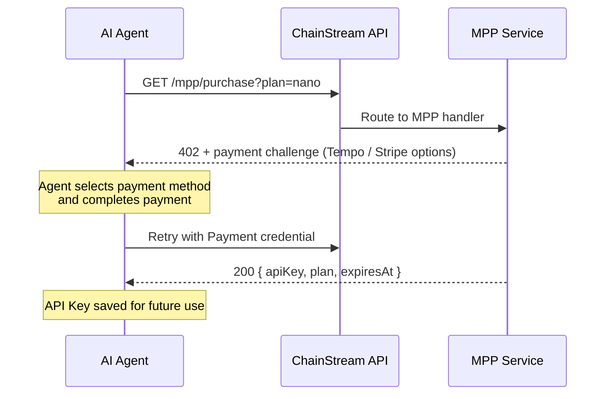

MPP (Machine Payment Protocol)는 AI 에이전트와 자동화 시스템을 위해 설계된 결제 프로토콜입니다. x402의 상위 집합으로, 하나의 통합 플로우에서 **Tempo 스테이블코인 결제**와 **Stripe 카드 결제**를 모두 지원합니다.

<Info>
온체인 USDC만 지원하는 x402와 달리, MPP는 Tempo 네트워크 스테이블코인과 기존 카드 결제를 추가 옵션으로 제공합니다.
</Info>

## 동작 원리



### 상세 플로우

1. **에이전트가 호출** — 결제 자격 증명 없이 `GET /mpp/purchase?plan=<plan>`
2. **MPP 서비스가 402 반환** — 금액, 통화, 수신자가 포함된 `WWW-Authenticate: Payment` 챌린지
3. **에이전트가 결제에 서명** — Tempo Wallet 또는 Stripe 사용
4. **에이전트가 재시도** — `Authorization: Payment` 자격 증명으로 구매 요청
5. **MPP 서비스가 결제 검증**, 구독 생성, API Key 반환

## 지원 결제 수단

| 수단 | 네트워크 | 통화 | 가스 수수료 | 최적 용도 |
|--------|---------|----------|---------|----------|
| **Tempo** | Tempo (chain ID 4217) | USDC.e (ERC-20) | **무료** (스테이블코인으로 가스 지불) | AI 에이전트, ETH 불필요 |
| **Stripe** | 기존 결제 | USD (카드) | N/A | 카드 접근이 가능한 에이전트, 암호화폐 불필요 |

<Tip>
Tempo 결제는 네이티브 가스 토큰이 필요 없습니다 — 가스가 스테이블코인으로 직접 지불됩니다. 이는 스테이블코인만 보유한 AI 에이전트에 이상적입니다.
</Tip>

## API 엔드포인트

| 엔드포인트 | 메서드 | 설명 |
|----------|--------|-------------|
| `/mpp/purchase?plan=<plan>` | GET / POST | MPP를 통한 구독 구매 |
| `/mpp/pricing` | GET | 사용 가능한 플랜 및 결제 수단 목록 |
| `/mpp/health` | GET | 상태 확인 |

### 가격 응답

```bash
curl https://api.chainstream.io/mpp/pricing
```

```json
{
  "plans": [
    { "name": "nano", "priceUsd": 5, "quotaTotal": 500000, "durationDays": 30 },
    { "name": "starter", "priceUsd": 199, "quotaTotal": 10000000, "durationDays": 30 }
  ],
  "currency": "USD",
  "paymentMethods": ["tempo", "stripe"],
  "note": "Prices in USD. Pay via MPP (Tempo stablecoin or Stripe card)."
}
```

### 구매 응답 (성공)

```json
{
  "status": "ok",
  "plan": "nano",
  "expiresAt": "2026-04-25T12:00:00.000Z",
  "apiKey": "cs_live_..."
}
```

## CLI 사용법

ChainStream CLI는 자동 구매 플로우에서 MPP를 결제 옵션으로 지원합니다:

```bash
chainstream token info --chain sol --address So11111111111111111111111111111111111111112
# → 402 → 플랜 선택 → "MPP Tempo" 선택 → 결제 → API Key 저장
```

ChainStream 지갑이 없는 에이전트의 경우 CLI가 Tempo 명령을 출력합니다:

```bash
tempo request "https://api.chainstream.io/mpp/purchase?plan=nano"
```

## 수동 통합 (Tempo Wallet)

### 설정

Tempo Wallet CLI를 설치하고 로그인합니다 (브라우저를 통한 일회성 패스키 인증):

```bash
curl -fsSL https://tempo.xyz/install | bash
tempo wallet login
```

<Note>
Tempo Wallet은 패스키 (WebAuthn) 인증을 사용합니다. 첫 설정에는 브라우저 인터랙션이 필요합니다. 이후 세션이 유지되어 추가 브라우저 인터랙션 없이 에이전트 작업이 가능합니다.
</Note>

### 구매

```bash
# 잔액 확인
tempo wallet balance

# 플랜 구매 (402 → 서명 → 재시도 자동 처리)
tempo request "https://api.chainstream.io/mpp/purchase?plan=nano"
```

Tempo CLI는 `WWW-Authenticate: Payment` 챌린지를 자동으로 처리하고, 트랜잭션에 서명하며, 성공 시 API Key를 반환합니다.

### 호환 지갑

Tempo는 EVM 호환 (chain ID 4217)입니다. Tempo에서 USDC.e를 보유한 모든 지갑이 작동합니다:

- **Tempo Wallet CLI** (`tempo request`) — 추천, 패스키 인증, 내장 MPP 지원
- 모든 EVM 지갑 (MetaMask, Coinbase CDP, Privy) — 커스텀 네트워크로 Tempo 추가

## MPP vs x402

| | MPP | x402 |
|---|---|---|
| **결제 수단** | Tempo 스테이블코인 + Stripe 카드 | 온체인 USDC만 |
| **네트워크** | Tempo (chain ID 4217) + Stripe | Base (EVM) + Solana |
| **가스 수수료** | 무료 (Tempo) / N/A (Stripe) | 무료 (facilitator) |
| **암호화폐 지갑 필요** | 아니오 (Stripe 옵션 가능) | 예 |
| **구매 엔드포인트** | `/mpp/purchase` | `/x402/purchase` |
| **프로토콜** | MPP (HTTP 402) | x402 프로토콜 |
| **최적 용도** | 암호화폐 지갑이 없는 에이전트 | Base/Solana에 USDC가 있는 에이전트 |

## 다음 단계

<CardGroup cols={2}>
  <Card title="x402 결제 프로토콜" icon="money-bill-wave" href="/ko/guides/getting-started/x402-payments">
    x402 프로토콜을 통한 온체인 USDC 결제
  </Card>
  <Card title="빌링과 Unit" icon="receipt" href="/ko/guides/getting-started/billing-and-units">
    CU 소비량 및 플랜 상세 이해하기
  </Card>
</CardGroup>
