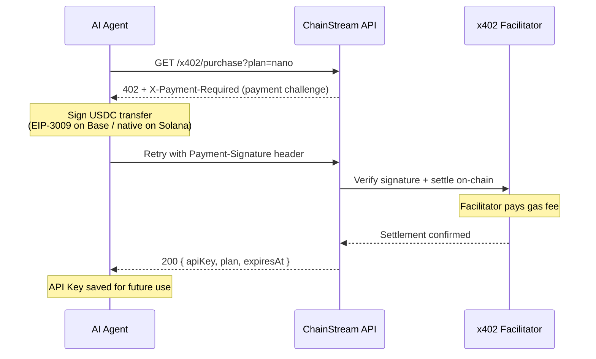

x402는 HTTP 402 Payment Required 상태 코드를 기반으로 한 결제 프로토콜입니다. 수동 빌링, 신용카드 또는 구독 관리 없이 API 접근을 위한 기계 간 마이크로결제를 가능하게 합니다. USDC로 요청당 결제하고 즉시 API 접근을 받으세요.

## 동작 원리



### 상세 플로우

1. **클라이언트가 요청을 보냅니다** — API 키 없이 또는 만료된 키로 ChainStream API에 요청합니다.

2. **게이트웨이가 HTTP 402를 반환합니다** — `/x402/purchase`를 가리키는 메시지와 함께.

3. **클라이언트가 `GET /x402/purchase?plan=<plan>`을 호출합니다** (결제 헤더 없이). 서버가 x402 결제 요구사항과 함께 HTTP 402를 반환합니다:

   | 응답 헤더 | 설명 |
   |---|---|
   | `X-Payment-Required` | 결제 세부 정보가 담긴 Base64 인코딩 JSON |
   | `Payment-Required` | 동일 값 (x402 클라이언트 호환성) |

   디코딩된 JSON 본문은 x402 v2 프로토콜을 따릅니다:

   ```json
   {
     "x402Version": 2,
     "resource": {
       "url": "/x402/purchase?plan=nano",
       "description": "ChainStream API access: nano plan"
     },
     "accepts": [
       {
         "scheme": "exact",
         "network": "eip155:8453",
         "asset": "0x833589fCD6eDb6E08f4c7C32D4f71b54bdA02913",
         "amount": "5000000",
         "payTo": "0xRecipientAddress",
         "maxTimeoutSeconds": 60
       },
       {
         "scheme": "exact",
         "network": "solana:5eykt4UsFv8P8NJdTREpY1vzqKqZKvdp",
         "asset": "EPjFWdd5AufqSSqeM2qN1xzybapC8G4wEGGkZwyTDt1v",
         "amount": "5000000",
         "payTo": "SolanaRecipientAddress",
         "maxTimeoutSeconds": 60
       }
     ]
   }
   ```

4. **클라이언트가 USDC 전송에 서명합니다** — `@x402` SDK를 사용하고 결제 증빙과 함께 `GET /x402/purchase?plan=<plan>`을 재시도합니다:

   | 요청 헤더 | 설명 |
   |---|---|
   | `Payment-Signature` | Base64 인코딩된 서명된 결제 페이로드 |

5. **서버가 결제를 검증하고 정산합니다**, 그런 다음 구독 세부 정보를 반환합니다:

   ```json
   {
     "status": "ok",
     "plan": "nano",
     "chain": "evm",
     "address": "0xPayerAddress",
     "expiresAt": "2026-04-25T12:00:00.000Z",
     "txHash": "0xabc123...",
     "apiKey": "cs_live_..."
   }
   ```

   클라이언트는 향후 모든 API 호출에 `apiKey`를 저장합니다.

## CLI 통합

ChainStream CLI는 `callWithAutoPayment`를 통해 x402 결제를 자동으로 처리합니다. 모든 명령이 402를 만나면 CLI가 플랜 선택과 결제를 안내합니다.

### 자동 플로우

CLI가 402 응답을 만나면:

1. `/x402/pricing`에서 사용 가능한 플랜을 가져와 선택 테이블을 표시
2. 플랜 선택을 요청
3. 결제 방법 선택: **x402** (Base/Solana USDC) 또는 **MPP** (Tempo USDC.e)
4. x402인 경우: `@x402/fetch`를 통해 결제를 서명하고 전송, 반환된 API Key를 설정에 저장
5. MPP인 경우: 수동 구매를 위한 `tempo request` 명령을 출력
6. 새 API Key로 원래 명령을 재시도

```bash
$ chainstream token info --chain sol --address So11111111111111111111111111111111111111112

[chainstream] No active subscription. Available plans:

   #  Plan       Price    Quota           Duration
   ── ────────── ──────── ──────────────── ────────
   1  nano       $5             500,000 CU  30 days
   2  starter    $199        10,000,000 CU  30 days
   3  pro        $699        50,000,000 CU  30 days

Select plan (1-3): 1

[chainstream] Choose payment method:
  1. x402 (USDC on Base/Solana)
  2. MPP Tempo (USDC.e on Tempo)

Select method (1-2): 1

[chainstream] Purchasing nano plan via x402...
[chainstream] Subscription activated: nano (expires: 2026-04-25T12:00:00.000Z)
[chainstream] API Key saved to config.
```

<Note>
API Key만 있고 지갑이 없는 경우, CLI는 x402를 건너뛰고 MPP 안내를 출력합니다.
</Note>

### 지갑 설정

CLI에서 x402 결제를 위해 자금이 있는 지갑이 필요합니다:

```bash
# ChainStream TEE 지갑 생성 (추천)
chainstream login

# 또는 원시 프라이빗 키 가져오기 (개발/테스트 전용)
chainstream wallet set-raw --chain base
```

## 수동 통합

커스텀 통합의 경우 `@x402` 패키지 패밀리를 사용하여 x402 플로우를 구현할 수 있습니다.

### 의존성

```bash
npm install @x402/core @x402/evm @x402/svm @x402/fetch
```

| 패키지 | 용도 |
|---|---|
| `@x402/core` | 프로토콜 타입, 헤더 파싱, 검증 로직 |
| `@x402/evm` | EVM 결제 실행 (viem 기반) |
| `@x402/svm` | Solana 결제 실행 (@solana/kit 기반) |
| `@x402/fetch` | 자동 402 처리가 포함된 드롭인 `fetch` 래퍼 |

### @x402/fetch 사용 (추천)

가장 간단한 통합 — 표준 `fetch`를 x402 지원으로 래핑:

```typescript
import { createX402Fetch } from "@x402/fetch";
import { createWalletClient, http } from "viem";
import { base } from "viem/chains";
import { privateKeyToAccount } from "viem/accounts";

// 결제용 지갑 생성
const account = privateKeyToAccount(process.env.PRIVATE_KEY as `0x${string}`);
const walletClient = createWalletClient({
  account,
  chain: base,
  transport: http(),
});

// x402 지원 fetch 생성
const x402Fetch = createX402Fetch({
  evm: { walletClient },
  autoApprove: true, // 프롬프트 없이 자동 결제
  maxAmount: "10.00", // 요청당 안전 한도
});

// 일반 fetch처럼 사용 — 402 결제가 자동으로 처리됩니다
const response = await x402Fetch(
  "https://api.chainstream.io/v1/tokens/analyze",
  {
    method: "POST",
    headers: { "Content-Type": "application/json" },
    body: JSON.stringify({ tokenAddress: "0x1234...abcd", chain: "ethereum" }),
  }
);

const data = await response.json();
console.log(data);
```

### 수동 플로우 (고급)

결제 플로우를 완전히 제어하려면:

```typescript
import { parsePaymentHeaders, createPaymentProof } from "@x402/core";
import { sendPayment } from "@x402/evm";

// 1. 초기 요청 보내기
const response = await fetch("https://api.chainstream.io/v1/tokens/analyze", {
  method: "POST",
  headers: { "Content-Type": "application/json" },
  body: JSON.stringify({ tokenAddress: "0x1234...abcd" }),
});

if (response.status === 402) {
  // 2. 헤더에서 결제 세부 정보 파싱
  const payment = parsePaymentHeaders(response.headers);
  console.log(`Payment required: ${payment.amount} USDC on ${payment.chain}`);

  // 3. USDC 결제 전송
  const txHash = await sendPayment({
    walletClient,
    to: payment.address,
    amount: payment.amount,
    token: payment.token,
    memo: payment.memo,
  });

  // 4. 결제 서명과 함께 재시도
  const retryResponse = await fetch(
    "https://api.chainstream.io/x402/purchase?plan=nano",
    {
      headers: {
        "Payment-Signature": paymentSignature,
      },
    }
  );

  // 5. 응답에서 API 키 추출
  const result = await retryResponse.json();
  console.log("API key for future use:", result.apiKey);
  console.log("Expires at:", result.expiresAt);
}
```

## 결제 지원 체인

| 체인 | 토큰 | 확인 시간 |
|---|---|---|
| Base | USDC | ~2초 |
| Solana | USDC | ~400ms |

## 가스 수수료 무료

ChainStream은 자체 **x402 facilitator**를 운영하여 에이전트를 대신해 온체인 결제 트랜잭션을 제출합니다. 이는 다음을 의미합니다:

- **가스 수수료 없음** — facilitator가 모든 가스 비용을 부담 (Base ETH / Solana SOL)
- **에이전트 지갑에 USDC만 필요** — 가스용 네이티브 토큰을 보유할 필요 없음
- 에이전트는 USDC 전송 승인에 서명하고, facilitator가 브로드캐스트하고 실행 비용을 지불

이를 통해 AI 에이전트의 가장 큰 마찰점인 여러 체인에서 네이티브 가스 토큰을 취득하고 관리하는 문제를 해결합니다.

## 보안 고려사항

- **결제 한도**: 예상치 못한 과금을 방지하기 위해 `@x402/fetch` 사용 시 항상 `maxAmount`를 설정하세요.
- **검증**: facilitator는 정산 전에 서명된 결제를 온체인에서 검증합니다. 유효하지 않은 서명은 거부됩니다.
- **멱등성**: 결제가 정산되었지만 응답이 실패한 경우 (네트워크 오류), 동일한 `Payment-Signature`를 다시 제출할 수 있습니다. 결제는 한 번만 소비됩니다.
- **컴플라이언스**: 지불자 주소는 정산 전에 스크리닝됩니다. 제재 대상 주소는 거부됩니다.
