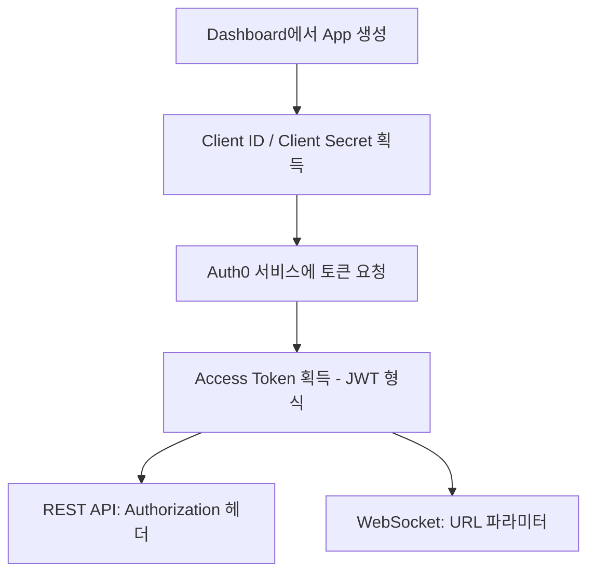

ChainStream은 API 접근을 보호하기 위해 다층 보안 메커니즘을 사용합니다. 이 문서에서는 API 보안 모범 사례, 일반적인 위협 대응, 보안 구성 가이드라인을 다룹니다.

<Info>
**최종 업데이트:** 2026년 2월 | **버전:** v2.0
</Info>

---

## 인증 보안

### 액세스 토큰 메커니즘

ChainStream은 OAuth 2.0 기반 인증 메커니즘을 사용합니다. Client ID와 Client Secret으로 JWT 액세스 토큰을 생성하여 API 인증에 사용합니다.

**인증 흐름:**



**인증 정보 사양**

| 항목 | 사양 |
|:--|:--|
| Client ID | 애플리케이션 고유 식별자 |
| Client Secret | 64자 랜덤 문자열 |
| Access Token | JWT 형식, 만료 시간 및 스코프 포함 |
| 토큰 유효기간 | 24시간 |

### 액세스 토큰 생성

<CodeGroup>
```javascript JavaScript
import { AuthenticationClient } from 'auth0';

const auth0Client = new AuthenticationClient({
  domain: 'dex.asia.auth.chainstream.io',
  clientId: process.env.CHAINSTREAM_CLIENT_ID,
  clientSecret: process.env.CHAINSTREAM_CLIENT_SECRET
});

const { data } = await auth0Client.oauth.clientCredentialsGrant({
  audience: 'https://api.dex.chainstream.io'
});

const accessToken = data.access_token;
```

```python Python
from auth0.authentication import GetToken

get_token = GetToken(
    'dex.asia.auth.chainstream.io',
    os.environ['CHAINSTREAM_CLIENT_ID'],
    client_secret=os.environ['CHAINSTREAM_CLIENT_SECRET']
)

token = get_token.client_credentials(
    audience='https://api.dex.chainstream.io'
)

access_token = token['access_token']
```
</CodeGroup>

### 인증 정보 보안

**저장 요구사항**

<Warning>
Client Secret은 ChainStream 서비스에 접근하기 위한 핵심 인증 정보입니다. 유출 시 서비스 남용과 재정적 손실이 발생할 수 있습니다.
</Warning>

| 저장 방식 | 보안 수준 | 비고 |
|:--|:--|:--|
| 환경 변수 | ✅ 권장 | 버전 관리에 포함하지 않음 |
| 시크릿 관리 서비스 | ✅ 최선 | AWS Secrets Manager, HashiCorp Vault 등 |
| 설정 파일 | ⚠️ 주의 | 반드시 .gitignore에 추가 |
| 하드코딩 | ❌ 금지 | 유출 위험 높음 |

### 코드 예시

<CodeGroup>
```javascript JavaScript
// ❌ 위험: 하드코딩된 인증 정보
const clientId = "your_client_id";
const clientSecret = "your_secret";

// ❌ 위험: 버전 관리에 커밋
// config.json: { "client_id": "...", "client_secret": "..." }

// ✅ 안전: 환경 변수 사용
const clientId = process.env.CHAINSTREAM_CLIENT_ID;
const clientSecret = process.env.CHAINSTREAM_CLIENT_SECRET;

// ✅ 안전: 시크릿 관리 서비스 사용
const credentials = await secretsManager.getSecret('chainstream-credentials');
```

```python Python
import os

# ❌ 위험: 하드코딩
client_id = "your_client_id"
client_secret = "your_secret"

# ✅ 안전: 환경 변수 사용
client_id = os.environ.get('CHAINSTREAM_CLIENT_ID')
client_secret = os.environ.get('CHAINSTREAM_CLIENT_SECRET')

# ✅ 안전: 시크릿 관리 서비스 사용 (AWS Secrets Manager 예시)
import boto3
client = boto3.client('secretsmanager')
credentials = client.get_secret_value(SecretId='chainstream-credentials')['SecretString']
```

```go Go
// ❌ 위험: 하드코딩
clientID := "your_client_id"
clientSecret := "your_secret"

// ✅ 안전: 환경 변수 사용
clientID := os.Getenv("CHAINSTREAM_CLIENT_ID")
clientSecret := os.Getenv("CHAINSTREAM_CLIENT_SECRET")
```
</CodeGroup>

### 멀티 앱 관리

환경 및 서비스별로 별도의 App을 생성하는 것을 권장합니다:

| 용도 | 권장 App 이름 | 설명 |
|:--|:--|:--|
| 프로덕션 | `prod-main` | 프로덕션 워크로드 |
| 테스트 | `test-dev` | 개발 및 테스트 |
| CI/CD | `ci-pipeline` | 자동화 테스트 |
| 모니터링 | `monitoring` | 모니터링 및 알림 |

---

## 전송 보안

### TLS 요구사항

| 항목 | 요구사항 |
|:--|:--|
| 최소 버전 | TLS 1.2 |
| 권장 버전 | TLS 1.3 |
| 인증서 검증 | 반드시 활성화 |
| 미지원 | HTTP, TLS 1.0/1.1 |

### 인증서 검증

<Warning>
프로덕션 환경에서 인증서 검증을 건너뛰지 마세요. 이는 중간자 공격(MITM) 위험에 노출됩니다.
</Warning>

<CodeGroup>
```javascript JavaScript
// ❌ 위험: 인증서 검증 건너뛰기
process.env.NODE_TLS_REJECT_UNAUTHORIZED = '0';

// ✅ 안전: 정상 인증서 검증 (기본 동작)
const response = await fetch('https://api.chainstream.io/v1/...');
```

```python Python
import requests

# ❌ 위험: 인증서 검증 건너뛰기
requests.get(url, verify=False)

# ✅ 안전: 정상 인증서 검증 (기본 동작)
requests.get(url)
```

```bash cURL
# ❌ 위험: 인증서 검증 건너뛰기
curl -k https://api.chainstream.io/v1/...

# ✅ 안전: 정상 인증서 검증 (기본 동작)
curl https://api.chainstream.io/v1/...
```
</CodeGroup>

---

## Webhook 보안

Webhook 메시지는 서명 메커니즘을 사용하여 메시지 출처의 신뢰성을 보장합니다.

### 서명 검증

Webhook 메시지를 수신하면 Webhook Secret을 사용하여 서명을 검증하여 메시지가 ChainStream에서 발송되었으며 변조되지 않았음을 확인해야 합니다.

| 항목 | 설명 |
|:--|:--|
| 알고리즘 | HMAC-SHA256 |
| 키 | Webhook Secret (Dashboard에서 설정) |
| 서명 헤더 | `X-Webhook-Signature` |

### 검증 예시

<CodeGroup>
```javascript JavaScript
const crypto = require('crypto');

function verifyWebhookSignature(payload, signature, secret) {
  const expectedSignature = crypto
    .createHmac('sha256', secret)
    .update(JSON.stringify(payload))
    .digest('hex');
  
  return crypto.timingSafeEqual(
    Buffer.from(signature),
    Buffer.from(expectedSignature)
  );
}

// Express 미들웨어 예시
app.post('/webhook', (req, res) => {
  const signature = req.headers['x-webhook-signature'];
  const isValid = verifyWebhookSignature(
    req.body,
    signature,
    process.env.WEBHOOK_SECRET
  );
  
  if (!isValid) {
    return res.status(401).send('Invalid signature');
  }
  
  // Webhook 메시지 처리
  console.log('Received webhook:', req.body);
  res.status(200).send('OK');
});
```

```python Python
import hmac
import hashlib
import json

def verify_webhook_signature(payload, signature, secret):
    expected_signature = hmac.new(
        secret.encode(),
        json.dumps(payload).encode(),
        hashlib.sha256
    ).hexdigest()
    
    return hmac.compare_digest(signature, expected_signature)

# Flask 예시
@app.route('/webhook', methods=['POST'])
def webhook():
    signature = request.headers.get('X-Webhook-Signature')
    is_valid = verify_webhook_signature(
        request.json,
        signature,
        os.environ['WEBHOOK_SECRET']
    )
    
    if not is_valid:
        return 'Invalid signature', 401
    
    # Webhook 메시지 처리
    print('Received webhook:', request.json)
    return 'OK', 200
```
</CodeGroup>

### Webhook Secret 교체

Webhook Secret을 교체하려면:

<Steps>
  <Step title="새 Secret 생성">
    Dashboard → Webhooks → 엔드포인트 선택 → Secret 교체
  </Step>
  <Step title="애플리케이션 설정 업데이트">
    애플리케이션에서 새 Webhook Secret으로 업데이트
  </Step>
  <Step title="서명 검증 확인">
    새 Secret으로 서명이 올바르게 검증되는지 확인
  </Step>
</Steps>

---

## 사용량 모니터링

### 메트릭스 대시보드

Dashboard의 Metrics 패널에서 API 및 WebSocket 호출 통계를 확인할 수 있습니다:

| 메트릭 | 설명 |
|:--|:--|
| 요청 IP | 소스 IP 주소 |
| User Agent | 클라이언트 식별자 |
| 상태 코드 | HTTP 상태 코드 |
| 지연 시간 | 요청 응답 시간 |
| 소비 Unit | 해당 요청이 소비한 사용량 단위 |
| 총 사용량 | 누적 소비 사용량 |

### 차트 데이터

Metrics 패널은 다양한 시간 차원의 차트를 제공합니다:

- **시간별** — 최근 24시간 호출 추이 확인
- **일별** — 최근 30일 호출 추이 확인
- **월별** — 월별 역사 통계 확인

**확인 경로:** Dashboard → Metrics

---

## 보안 모니터링

<Note>
🚧 **준비 중** — 보안 모니터링 기능이 개발 중이며 곧 제공될 예정입니다.
</Note>

제공 예정 기능:

- **이상 탐지** — 인증 실패 급증, 비정상 지역 등 자동 감지
- **알림 통지** — 이메일 및 Webhook 알림
- **자동 보호** — 임시 차단, 요청 제한 등

---

## IP 화이트리스트

<Note>
🚧 **준비 중** — IP 화이트리스트 기능이 개발 중이며 곧 제공될 예정입니다.
</Note>

제공 예정 기능:

- 단일 IP 설정 (예: `203.0.113.50`)
- IP 범위 설정 (예: `203.0.113.0/24`)
- 다중 IP (쉼표 구분)

---

## 일반적인 공격 대응

### 중간자 공격

**공격 방식:** 공격자가 클라이언트와 서버 간 통신을 가로챕니다.

**대응 조치:**

| 조치 | 설명 |
|:--|:--|
| HTTPS 강제 | TLS 1.2+ 만 지원 |
| 인증서 검증 | 인증서 검증 반드시 활성화 |
| HSTS | HTTPS 연결 강제 |

### 인젝션 공격

**공격 방식:** 공격자가 악의적인 입력 데이터를 통해 비인가 작업을 시도합니다.

**대응 조치:**

| 조치 | 설명 |
|:--|:--|
| 입력 검증 | 엄격한 파라미터 타입 검사 |
| 파라미터화 쿼리 | SQL/NoSQL 인젝션 방지 |
| 출력 인코딩 | XSS 방지 |

### 인증 정보 유출 대응

Client Secret 유출이 의심되면 즉시 다음 단계를 실행하세요:

<Steps>
  <Step title="즉시 App 삭제">
    Dashboard → Apps → App 선택 → 삭제
  </Step>
  <Step title="새 App 생성">
    Dashboard → Apps → 새 App 생성
  </Step>
  <Step title="애플리케이션 설정 업데이트">
    이전 인증 정보를 사용하는 모든 애플리케이션에서 새 Client ID와 Secret으로 업데이트
  </Step>
  <Step title="메트릭스 확인">
    Dashboard → Metrics → 비정상 호출 확인
  </Step>
  <Step title="보안 관행 검토">
    유출 원인 조사 및 보안 조치 개선
  </Step>
</Steps>

---

## 보안 오류 코드

### 인증 관련

| 오류 코드 | HTTP 상태 | 설명 |
|:--|:--|:--|
| `UNAUTHORIZED` | 401 | 인증 정보 없음 |
| `EXPIRED_TOKEN` | 401 | Access Token 만료 |
| `INVALID_TOKEN` | 401 | Access Token 무효 |
| `INVALID_CREDENTIALS` | 401 | Client ID 또는 Secret 오류 |

### 접근 제어 관련

| 오류 코드 | HTTP 상태 | 설명 |
|:--|:--|:--|
| `FORBIDDEN` | 403 | 권한 없음 또는 할당량 소진 |
| `RATE_LIMITED` | 429 | 요청 빈도 초과 |
| `INSUFFICIENT_SCOPE` | 403 | 토큰 권한 부족 |

### Webhook 관련

| 오류 코드 | 설명 |
|:--|:--|
| `INVALID_SIGNATURE` | Webhook 서명 검증 실패 |
| `MISSING_SIGNATURE` | 서명 헤더 누락 |

### 오류 응답 예시

```json
{
  "error": {
    "code": "EXPIRED_TOKEN",
    "message": "Access token has expired",
    "details": {
      "expired_at": "2024-01-15T10:30:00Z"
    }
  }
}
```

---

## 보안 구성 체크리스트

### 기본 구성 (필수)

- [ ] API 접근에 HTTPS 사용
- [ ] Client ID와 Client Secret을 환경 변수 또는 시크릿 관리 서비스에 저장
- [ ] 인증 정보를 코드 저장소에 커밋하지 않음
- [ ] 프로덕션/테스트 환경에 서로 다른 App 사용
- [ ] Webhook 서명 올바르게 검증

### 고급 구성 (권장)

- [ ] 시크릿 관리 서비스 연동 (AWS Secrets Manager / HashiCorp Vault)
- [ ] Metrics 대시보드에서 호출 통계 정기 확인
- [ ] 서비스별로 별도 App 생성

### 엔터프라이즈 구성 (선택)

- [ ] SIEM 시스템 연동으로 로그 분석
- [ ] 보안 인시던트 대응 프로세스 수립

---

## FAQ

<AccordionGroup>
  <Accordion title="Client Secret이 유출되면 어떻게 해야 하나요?">
    즉시 Dashboard에 로그인하여 해당 App을 삭제하고, 새 App을 생성한 후 해당 인증 정보를 사용하는 모든 애플리케이션 설정을 업데이트하세요. [인증 정보 유출 대응](#인증-정보-유출-대응)을 참고하세요.
  </Accordion>

  <Accordion title="Access Token이 만료되면 어떻게 하나요?">
    Access Token은 24시간 동안 유효합니다. 권장 사항:
    
    1. **토큰 캐싱** — 유효 기간 내 동일 토큰 재사용
    2. **사전 갱신** — 만료 약 1시간 전에 토큰 갱신
    3. **오류 재시도** — 401 오류 수신 시 자동으로 새 토큰 획득
  </Accordion>

  <Accordion title="API 호출 통계는 어떻게 확인하나요?">
    Dashboard → Metrics에 로그인하면 요청 IP, 상태 코드, 지연 시간, 소비 Unit, 시간 차원 차트를 확인할 수 있습니다.
  </Accordion>

  <Accordion title="Webhook 서명 검증 실패는 어떻게 해결하나요?">
    일반적인 원인:
    
    1. **Secret 불일치** — 올바른 Webhook Secret을 사용하고 있는지 확인
    2. **페이로드 처리 오류** — 서명 계산에 원본 JSON 문자열을 사용하고 있는지 확인
    3. **서명 헤더 누락** — 요청 헤더에 `X-Webhook-Signature`가 포함되어 있는지 확인
  </Accordion>

  <Accordion title="여러 개의 App을 만들 수 있나요?">
    네. 서로 다른 환경(프로덕션/테스트)과 서비스별로 별도 App을 생성하여 관리 및 문제 해결을 용이하게 하는 것을 권장합니다.
  </Accordion>
</AccordionGroup>

---

## 관련 문서

<CardGroup cols={2}>
  <Card title="인증" icon="key" href="/ko/docs/platform/authentication/api-keys-oauth">
    인증 및 인증 정보 관리
  </Card>
  <Card title="데이터 프라이버시" icon="shield" href="/ko/docs/platform/security/data-privacy">
    데이터 프라이버시 정책
  </Card>
  <Card title="오류 코드" icon="circle-exclamation" href="/ko/docs/reference/error-codes">
    전체 오류 코드 목록
  </Card>
  <Card title="Webhook 기본 개념" icon="webhook" href="/ko/docs/recipes/webhook-fundamentals">
    Webhook 구성 및 사용법
  </Card>
</CardGroup>
