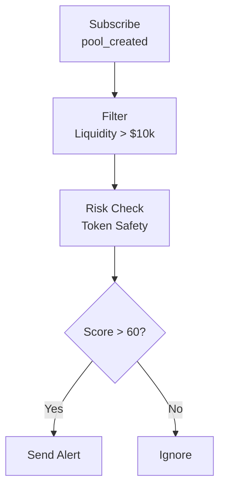

<Info>
ChainStream은 현재 **Solana**(`sol`), **Ethereum**(`eth`), **BSC**(`bsc`)를 지원합니다. 지원 DEX는 Jupiter, Raydium, PumpFun, Moonshot, Candy(Solana), KyberSwap(Ethereum/BSC)입니다. 아래 일부 예시는 개념 설명을 위해 추가 프로토콜을 참조합니다. 현재 지원 범위는 [지원 체인](/ko/docs/supported-chains)에서 확인하세요.
</Info>

<Warning>
**Coming Soon** - 이 기능은 현재 개발 중입니다. 계속 지켜봐 주세요!
</Warning>

본 문서에서는 ChainStream을 사용하여 DeFi 프로토콜 활동을 모니터링하는 방법을 소개합니다. 유동성 변화, 대규모 거래, 수익률 추적, 리스크 알림을 포함합니다.

---

## 지원 DeFi 프로토콜

### DEX (탈중앙화 거래소)

| 프로토콜 | 체인 | 지원 기능 |
|----------|--------|-------------------|
| **Jupiter** | Solana | 어그리게이트 거래 |
| **Raydium** | Solana | 거래, LP, 풀 데이터 |
| **PumpFun** | Solana | 런치/본딩, 거래 |
| **Moonshot** | Solana | 거래 |
| **Candy** | Solana | 거래 |
| **KyberSwap** | Ethereum, BSC | 거래, 견적 |

### 기타 DeFi 분야

대출, 수익률 애그리게이터, 리퀴드 스테이킹은 DeFi에서 일반적인 모니터링 대상입니다. ChainStream의 인덱싱된 스왑 및 DEX 분석은 **Solana**, **Ethereum**, **BSC** 위의 상기 프로토콜에 초점을 맞추고 있습니다. 대출이나 볼트 관련 알림을 구축하기 전에 API 레퍼런스와 [지원 체인](/ko/docs/supported-chains)에서 배포 환경이 제공하는 내용을 확인하세요.

---

## 모니터링 차원

### 1. 유동성 모니터링

#### 감시 이벤트

| 이벤트 | 설명 | 중요성 |
|-------|-------------|------------|
| `pool_created` | 새 풀 생성 | 새로운 기회 발견 |
| `liquidity_add` | 유동성 추가 | 신뢰도 지표 |
| `liquidity_remove` | 유동성 제거 | ⚠️ 러그풀 경고 |
| `pool_update` | 풀 파라미터 변경 | 프로토콜 거버넌스 |

#### 핵심 지표

| 지표 | 설명 | 건전성 기준 |
|--------|-------------|------------------|
| TVL | 총 잠긴 가치 | 안정적이거나 성장 |
| TVL 변동률 | 24h/7d TVL 변화 | &gt; -10%/일 |
| LP 홀더 수 | LP 토큰 홀더 분포 | 분산될수록 좋음 |
| 유동성 깊이 | ±2% 가격대 내 유동성 | 깊을수록 좋음 |

#### 러그풀 리스크 시그널

<Tabs>
  <Tab title="🔴 고위험">
    - 단일 인출 &gt; 풀의 30%
    - 24h 누적 인출 &gt; 50%
    - LP가 소수 주소에 집중 (&lt; 5)
  </Tab>
  <Tab title="🟡 중위험">
    - 단일 인출 &gt; 풀의 10%
    - LP 잠금 기간 만료 임박
    - 프로젝트 팀 주소가 인출 시작
  </Tab>
  <Tab title="🟢 저위험">
    - LP가 널리 분포
    - LP 잠금 기간 &gt; 6개월
    - TVL이 안정적 성장
  </Tab>
</Tabs>

---

### 2. 거래 모니터링

#### 실시간 거래 흐름

WebSocket을 통한 실시간 거래 구독:

| 이벤트 타입 | 설명 | 데이터 필드 |
|------------|-------------|-------------|
| `swap` | DEX 거래 | token_in, token_out, amount, price |
| `large_trade` | 대규모 거래 | threshold, trade_details |
| `arbitrage` | 차익거래 | profit, path |
| `mev` | MEV 관련 거래 | type, extracted_value |

```typescript
// DEX 거래 흐름 구독
ws.subscribe('defi_trades', {
  protocol: 'kyberswap',
  chain: 'eth',
  min_amount_usd: 10000
}, (trade) => {
  console.log(`${trade.type}: ${trade.token_in} → ${trade.token_out}`);
});
```

#### 거래 분석 차원

| 분석 차원 | 지표 | 의미 |
|--------------------|--------|--------------|
| 매수/매도 압력 | 매수량/매도량 비율 | &gt; 1 강세 |
| 거래량 추세 | 거래량 이동평균 | 활성도 |
| 고래 행동 | 대규모 거래 비율 | 시장 영향 |
| 페어 인기도 | 거래 빈도 순위 | 시장 관심도 |

---

### 3. 수익률 추적

#### 추적 내용

| 수익률 타입 | 설명 | 계산 방법 |
|------------|-------------|-------------------|
| **LP 마이닝** | 유동성 제공에 따른 거래 수수료 | 수수료 × 지분 비율 |
| **대출 이자** | 예금/차입 이자 | 원금 × APY |
| **스테이킹 보상** | 프로토콜 토큰 보상 | 스테이킹량 × 보상률 |
| **에어드롭 수익** | 프로토콜 에어드롭 | 스냅샷 보유량 |

#### 수익률 지표

| 지표 | 설명 | 비고 |
|--------|-------------|-------|
| **APY** | 연간 복리 수익률 | 실제 수익률 참고 |
| **APR** | 연간 단리 수익률 | 기본 수익률 |
| **비영구적 손실** | 단순 보유 대비 LP 손실 | 중요한 리스크 요소 |
| **순수익률** | 수익률 - 가스비 - 비영구적 손실 | 최종 수익률 |

#### 비영구적 손실 추정

<Info>
**비영구적 손실 공식**

```
비영구적 손실 = 2 × √(가격 비율) / (1 + 가격 비율) - 1
```
</Info>

| 가격 변동 | 비영구적 손실 |
|--------------|------------------|
| ±10% | -0.11% |
| ±25% | -0.64% |
| ±50% | -2.02% |
| ±100% | -5.72% |
| ±200% | -13.4% |

---

### 4. 리스크 알림

#### 프로토콜 레벨 리스크

| 리스크 유형 | 설명 | 알림 트리거 |
|-----------|-------------|---------------|
| **대규모 인출** | 큰 규모의 유동성 감소 | 단일 &gt; 풀의 5% |
| **TVL 급락** | 프로토콜 TVL의 급격한 하락 | 1h 내 &gt; 20% 하락 |
| **플래시론 공격** | 플래시론 패턴 감지 | 자동 감지 |
| **거버넌스 공격** | 비정상적 제안이나 투표 | 자동 감지 |
| **오라클 이상** | 비정상적 가격 데이터 | 편차 &gt; 5% |

#### 포지션 레벨 리스크

| 리스크 유형 | 설명 | 알림 트리거 |
|-----------|-------------|---------------|
| **청산 리스크** | 대출 포지션 청산 임박 | 건전성 비율 &lt; 1.2 |
| **비영구적 손실** | LP 비영구적 손실 확대 | 손실 &gt; 5% |
| **수익률 하락** | APY의 큰 폭 하락 | 하락 &gt; 50% |

#### 알림 설정 예시

```json
{
  "alert_type": "liquidity_remove",
  "protocol": "kyberswap",
  "pool": "0x...",
  "threshold": {
    "type": "percentage",
    "value": 10
  },
  "notification": {
    "webhook": "https://your-server.com/webhook",
    "email": "alert@example.com"
  }
}
```

---

## 모니터링 시나리오

### 시나리오 1: 신규 풀 발견

**목표**: 새로 생성된 트레이딩 풀을 가능한 빨리 발견



```typescript
ws.subscribe('pool_created', {
  chain: 'sol',
  min_liquidity_usd: 10000
}, async (pool) => {
  // 토큰 안전성 확인
  const risk = await checkTokenRisk(pool.token_address);
  if (risk.score > 60) {
    notify(`신규 풀 발견: ${pool.pair_name}, 유동성: $${pool.liquidity_usd}`);
  }
});
```

### 시나리오 2: 러그풀 경고

**목표**: 보유 중인 풀의 러그풀 리스크 모니터링

<Steps>
  <Step title="모니터링 추가">
    대상 풀을 모니터링 목록에 추가
  </Step>
  <Step title="임계값 설정">
    인출 임계값 설정 (예: 단일 &gt; 10%)
  </Step>
  <Step title="알림 수신">
    실시간 알림 수신
  </Step>
  <Step title="포지션 조정">
    신속하게 포지션 조정
  </Step>
</Steps>

```typescript
ws.subscribe('liquidity_remove', {
  pool: '0x...',
  threshold_percentage: 10
}, (event) => {
  alert(`⚠️ 러그풀 경고: ${event.percentage}%의 유동성이 제거되었습니다`);
});
```

### 시나리오 3: 차익거래 기회 발견

**목표**: DEX 간 가격 차이 발견

<Steps>
  <Step title="가격 피드 구독">
    여러 DEX의 가격 피드 구독
  </Step>
  <Step title="스프레드 계산">
    스프레드 비율 계산
  </Step>
  <Step title="비용 평가">
    가스비와 슬리피지 비용 고려
  </Step>
  <Step title="알림 전송">
    순이익 &gt; 임계값일 때 알림
  </Step>
</Steps>

```typescript
// 여러 DEX의 가격 모니터링
const prices = {};

ws.subscribe('token_price', { 
  token: 'SOL',
  dex: ['jupiter', 'raydium', 'pumpfun']
}, (data) => {
  prices[data.dex] = data.price;
  checkArbitrage(prices);
});

function checkArbitrage(prices) {
  const maxPrice = Math.max(...Object.values(prices));
  const minPrice = Math.min(...Object.values(prices));
  const spread = (maxPrice - minPrice) / minPrice;
  
  if (spread > 0.005) {  // 0.5% 스프레드
    notify(`차익거래 기회: ${spread * 100}% 스프레드`);
  }
}
```

### 시나리오 4: 청산 모니터링

**목표**: 대출 포지션 건전성 모니터링

<Steps>
  <Step title="포지션 조회">
    대상 주소의 대출 포지션 조회
  </Step>
  <Step title="건전성 비율 계산">
    실시간 건전성 비율 계산
  </Step>
  <Step title="경고">
    건전성 비율 &lt; 1.5일 때 경고
  </Step>
  <Step title="긴급 알림">
    건전성 비율 &lt; 1.2일 때 긴급 알림
  </Step>
</Steps>

```typescript
async function monitorLiquidationRisk(address: string) {
  // 배포 환경이 제공하는 대출 API에 연결 (DEX 한정이 아님)
  const position = await getLendingPosition(address);

  if (position.health_factor < 1.2) {
    urgentAlert(`🚨 청산 리스크! 건전성 비율: ${position.health_factor}`);
  } else if (position.health_factor < 1.5) {
    warnAlert(`⚠️ 낮은 건전성 비율: ${position.health_factor}`);
  }
}
```

---

## 데이터 지연시간

| 데이터 유형 | 지연시간 | 설명 |
|-----------|---------|-------------|
| 실시간 거래 | &lt; 3초 | 블록 확인 후 푸시 |
| TVL 데이터 | &lt; 1분 | 분 단위 업데이트 |
| APY 데이터 | &lt; 5분 | 최근 거래로부터 계산 |
| 홀더 데이터 | &lt; 1시간 | 시간별 스냅샷 |

---

## API 엔드포인트

| 기능 | 엔드포인트 |
|----------|----------|
| 프로토콜 TVL 조회 | `GET /v1/defi/{protocol}/tvl` |
| 풀 정보 조회 | `GET /v1/defi/{protocol}/pools/{pool_id}` |
| 사용자 포지션 조회 | `GET /v1/defi/{protocol}/positions/{address}` |
| 수익률 데이터 조회 | `GET /v1/defi/{protocol}/yields` |

---

## 관련 문서

<CardGroup cols={2}>
  <Card title="차익거래 스캐너" icon="magnifying-glass-dollar" href="/ko/docs/tutorials/build-arbitrage-scanner">
    차익거래 스캐닝 도구 구축
  </Card>
  <Card title="가격 알림 봇" icon="bell" href="/ko/docs/tutorials/build-price-alert-bot">
    가격 알림 시스템 구축
  </Card>
</CardGroup>
