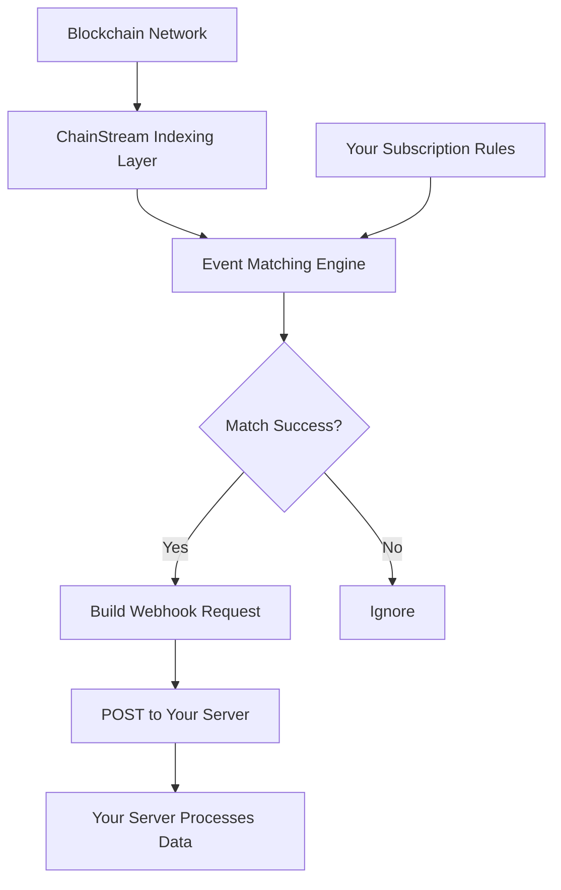
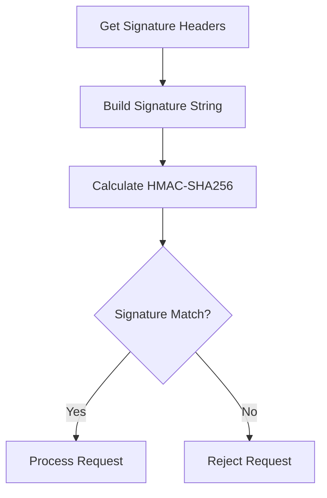

<Warning>
**Beta** — 이 기능은 현재 베타 버전입니다. API가 변경될 수 있습니다.
</Warning>

본 문서에서는 ChainStream Webhook의 작동 원리, 설정 방법, 모범 사례를 소개하여 실시간 온체인 이벤트 전달 구현을 돕습니다.

<Note>
Webhook 기능은 모든 사용자가 이용할 수 있습니다.
</Note>

---

## 작동 원리

### 데이터 흐름



### 핵심 기능

| 기능 | 설명 |
|---------|-------------|
| **실시간 전달** | 이벤트 발생 후 밀리초 단위로 전달 |
| **안정적 전달** | 실패 시 자동 재시도 |
| **서명 검증** | HMAC 서명 위조 방지 |
| **필터 규칙** | 이벤트 타입 필터링 지원 |

---

## 지원 이벤트 타입

Webhook은 현재 다음 이벤트 타입(채널)을 지원합니다:

| 채널 | 설명 | 일반적 용도 |
|---------|-------------|-------------|
| `sol.token.created` | Solana 새 토큰 생성 | 신규 토큰 발견, 초기 기회 |
| `sol.token.migrated` | Solana 토큰 졸업/마이그레이션 | Pump.fun 등의 플랫폼에서 졸업한 토큰 추적 |

<Info>
추가 이벤트 타입이 개발 중입니다. 계속 지켜봐 주세요!
</Info>

---

## Webhook 엔드포인트 생성

### API 엔드포인트

```bash
POST /v1/webhook/endpoint
Content-Type: application/json
Authorization: Bearer YOUR_ACCESS_TOKEN
```

### 요청 파라미터

| 파라미터 | 타입 | 필수 | 설명 |
|-----------|------|----------|-------------|
| `url` | string | 예 | Webhook 콜백 URL (HTTPS 필수) |
| `channels` | array | 예 | 구독할 이벤트 타입 목록 |
| `description` | string | 아니오 | 엔드포인트 설명 |
| `disabled` | boolean | 아니오 | 비활성화 여부, 기본값 false |
| `filterTypes` | array | 아니오 | 필터 타입 |
| `metadata` | object | 아니오 | 사용자 정의 메타데이터 |
| `rateLimit` | integer | 아니오 | 속도 제한 |

### 요청 예시

```json
{
  "url": "https://your-server.com/webhook",
  "channels": ["sol.token.created", "sol.token.migrated"],
  "description": "Monitor new tokens and graduated tokens"
}
```

### 응답 예시

```json
{
  "id": "ep_abc123",
  "url": "https://your-server.com/webhook",
  "channels": ["sol.token.created", "sol.token.migrated"],
  "description": "Monitor new tokens and graduated tokens",
  "disabled": false
}
```

---

## Webhook 알림 형식

Webhook 알림 데이터 구조는 WebSocket 푸시와 일관됩니다.

### 신규 토큰 생성 (sol.token.created)

```json
{
  "channel": "sol.token.created",
  "timestamp": 1706947200000,
  "data": {
    "a": "6p6xgHyF7AeE6TZkSmFsko444wqoP15icUSqi2jfGiPN",
    "n": "Example Token",
    "s": "EXT",
    "dec": 9,
    "cts": 1706947200000,
    "lf": {
      "pa": "6EF8rrecthR5Dkzon8Nwu78hRvfCKubJ14M5uBEwF6P",
      "pf": "pump_fun",
      "pn": "Pump.fun"
    }
  }
}
```

**필드 설명**:

| 필드 | 설명 |
|-------|-------------|
| `a` | 토큰 주소 |
| `n` | 토큰 이름 |
| `s` | 토큰 심볼 |
| `dec` | 소수점 자릿수 |
| `cts` | 생성 타임스탬프 (밀리초) |
| `lf.pa` | 런치 플랫폼 프로그램 주소 |
| `lf.pf` | 프로토콜 패밀리 |
| `lf.pn` | 프로토콜 이름 |

### 토큰 졸업 (sol.token.migrated)

```json
{
  "channel": "sol.token.migrated",
  "timestamp": 1706947200000,
  "data": {
    "a": "6p6xgHyF7AeE6TZkSmFsko444wqoP15icUSqi2jfGiPN",
    "n": "Example Token",
    "s": "EXT",
    "cts": 1706947200000,
    "lf": {
      "pa": "6EF8rrecthR5Dkzon8Nwu78hRvfCKubJ14M5uBEwF6P",
      "pf": "pump_fun",
      "pn": "Pump.fun"
    },
    "mt": {
      "pa": "675kPX9MHTjS2zt1qfr1NYHuzeLXfQM9H24wFSUt1Mp8",
      "pf": "raydium",
      "pn": "Raydium"
    }
  }
}
```

**추가 필드**:

| 필드 | 설명 |
|-------|-------------|
| `mt.pa` | 마이그레이션 대상 플랫폼 프로그램 주소 |
| `mt.pf` | 마이그레이션 대상 프로토콜 패밀리 |
| `mt.pn` | 마이그레이션 대상 프로토콜 이름 |

---

## Webhook URL 요구사항

| 요구사항 | 설명 |
|-------------|-------------|
| ✅ HTTPS | HTTPS 프로토콜 사용 필수 |
| ✅ 공개 접근 가능 | URL이 공용 인터넷에서 접근 가능해야 함 |
| ✅ 2xx 응답 | 성공 시 2xx 상태 코드 반환 필수 |
| ✅ 응답 시간 | 5초 이내 응답 필요 |
| ✅ 멱등 처리 | 중복 요청 처리 가능해야 함 |

---

## 보안 검증

### Webhook 시크릿 조회

엔드포인트 생성 후, 이 API로 시크릿을 조회합니다:

```bash
GET /v1/webhook/endpoint/{id}/secret
```

**응답**:

```json
{
  "secret": "whsec_abcdXXX"
}
```

### 서명 검증

각 Webhook 요청에는 요청 출처를 검증하기 위한 서명 헤더가 포함됩니다:

```
X-Webhook-Signature: <signature>
X-Webhook-Timestamp: <timestamp>
```

### 검증 흐름



### 코드 예시

<Tabs>
  <Tab title="Node.js">
```javascript
const crypto = require('crypto');

function verifyWebhook(req, secret) {
  const signature = req.headers['x-webhook-signature'];
  const timestamp = req.headers['x-webhook-timestamp'];
  const body = JSON.stringify(req.body);
  
  // 타임스탬프 확인 (5분 윈도우)
  const now = Date.now();
  if (Math.abs(now - parseInt(timestamp)) > 300000) {
    return false;
  }
  
  // 서명 계산
  const message = `${timestamp}.${body}`;
  const expectedSignature = crypto
    .createHmac('sha256', secret)
    .update(message)
    .digest('hex');
  
  // 안전한 비교
  return crypto.timingSafeEqual(
    Buffer.from(signature),
    Buffer.from(expectedSignature)
  );
}
```
  </Tab>
  <Tab title="Python">
```python
import hmac
import hashlib
import time

def verify_webhook(request, secret):
    signature = request.headers.get('X-Webhook-Signature')
    timestamp = request.headers.get('X-Webhook-Timestamp')
    body = request.get_data(as_text=True)
    
    # 타임스탬프 확인 (5분 윈도우)
    now = int(time.time() * 1000)
    if abs(now - int(timestamp)) > 300000:
        return False
    
    # 서명 계산
    message = f"{timestamp}.{body}"
    expected_signature = hmac.new(
        secret.encode(),
        message.encode(),
        hashlib.sha256
    ).hexdigest()
    
    # 안전한 비교
    return hmac.compare_digest(signature, expected_signature)
```
  </Tab>
  <Tab title="Go">
```go
import (
    "crypto/hmac"
    "crypto/sha256"
    "encoding/hex"
    "strconv"
    "time"
)

func verifyWebhook(signature, timestamp, body, secret string) bool {
    // 타임스탬프 확인
    ts, _ := strconv.ParseInt(timestamp, 10, 64)
    now := time.Now().UnixMilli()
    if abs(now-ts) > 300000 {
        return false
    }
    
    // 서명 계산
    message := timestamp + "." + body
    mac := hmac.New(sha256.New, []byte(secret))
    mac.Write([]byte(message))
    expected := hex.EncodeToString(mac.Sum(nil))
    
    return hmac.Equal([]byte(signature), []byte(expected))
}
```
  </Tab>
</Tabs>

---

## Webhook 엔드포인트 관리

### 엔드포인트 목록

```bash
GET /v1/webhook/endpoint
```

**쿼리 파라미터**:

| 파라미터 | 타입 | 설명 |
|-----------|------|-------------|
| `limit` | integer | 페이지당 항목 수 (1-100, 기본값 100) |
| `iterator` | string | 페이지네이션 이터레이터 |
| `order` | string | 정렬 순서 (오름차순/내림차순) |

### 엔드포인트 상세 조회

```bash
GET /v1/webhook/endpoint/{id}
```

### 엔드포인트 업데이트

```bash
PATCH /v1/webhook/endpoint
```

```json
{
  "endpointId": "ep_abc123",
  "channels": ["sol.token.created"],
  "description": "Monitor new tokens only"
}
```

### 엔드포인트 삭제

```bash
DELETE /v1/webhook/endpoint/{id}
```

### 시크릿 로테이션

```bash
POST /v1/webhook/endpoint/{id}/secret/rotate
```

---

## 모범 사례

### ✅ 빠른 응답

```python
# 권장: 먼저 응답하고 나중에 처리
@app.route('/webhook', methods=['POST'])
def webhook():
    # 서명 검증
    if not verify_webhook(request, SECRET):
        return "Invalid signature", 401
    
    # 큐에 넣어 비동기 처리
    queue.put(request.json)
    
    # 즉시 200 반환
    return "OK", 200
```

### ✅ 멱등성 처리

각 이벤트에는 고유 식별자가 포함됩니다. 서버에서 처리된 이벤트를 기록하세요:

```python
# Redis를 사용하여 처리된 이벤트 기록
def process_webhook(event):
    event_id = f"{event['channel']}:{event['data']['a']}:{event['timestamp']}"
    
    # 이미 처리되었는지 확인
    if redis.exists(f"processed:{event_id}"):
        return {"status": "already_processed"}
    
    # 이벤트 처리
    handle_event(event)
    
    # 처리됨으로 표시 (TTL 24시간)
    redis.setex(f"processed:{event_id}", 86400, "1")
    
    return {"status": "ok"}
```

### ✅ 보안

<CardGroup cols={2}>
  <Card title="항상 서명 검증" icon="shield-check">
    모든 요청에서 서명 검증
  </Card>
  <Card title="HTTPS 사용" icon="lock">
    전송 보안 확보
  </Card>
  <Card title="시크릿 정기 로테이션" icon="rotate">
    90일마다 권장
  </Card>
  <Card title="민감한 데이터 보호" icon="eye-slash">
    민감한 데이터를 로그에 기록하지 않기
  </Card>
</CardGroup>

### ✅ 안정성

<CardGroup cols={2}>
  <Card title="멱등성 구현" icon="repeat">
    중복 요청 처리
  </Card>
  <Card title="메시지 큐 버퍼" icon="layer-group">
    큐를 사용한 비동기 처리
  </Card>
  <Card title="적절한 타임아웃" icon="clock">
    장시간 블로킹 방지
  </Card>
  <Card title="포괄적 로깅" icon="file-lines">
    트러블슈팅을 위한 핵심 정보 기록
  </Card>
</CardGroup>

---

## FAQ

<AccordionGroup>
  <Accordion title="Webhook 요청이 수신되지 않는 경우" icon="circle-question">
    **문제 해결 단계**:

    1. **URL 접근 가능 여부 확인** — URL이 공용 인터넷에서 도달 가능한지 테스트
    2. **HTTPS 확인** — 유효한 SSL 인증서를 사용하고 있는지 확인
    3. **엔드포인트 상태 확인** — `disabled`가 `true`가 아닌지 확인
    4. **채널 확인** — 올바른 이벤트 타입을 구독하고 있는지 확인
  </Accordion>
  
  <Accordion title="중복 이벤트를 수신하는 경우" icon="clone">
    이는 재시도 메커니즘 때문일 수 있습니다. 멱등성 처리를 구현하세요:

    1. 고유한 이벤트 식별자 사용 (채널 + 토큰 주소 + 타임스탬프)
    2. 요청 수신 시 이미 처리되었는지 확인
    3. TTL이 있는 캐시 (Redis 등)를 사용하여 저장
  </Accordion>
  
  <Accordion title="Webhook을 테스트하려면?" icon="flask">
    1. ngrok을 사용하여 로컬 서비스 노출
    2. ngrok URL을 가리키는 Webhook 엔드포인트 생성
    3. 실제 이벤트 트리거를 기다리거나 테스트 환경 사용
    4. 로컬 서비스 로그 확인
  </Accordion>
</AccordionGroup>

---

## API 엔드포인트 요약

| 기능 | 엔드포인트 |
|----------|----------|
| 엔드포인트 목록 | `GET /v1/webhook/endpoint` |
| 엔드포인트 생성 | `POST /v1/webhook/endpoint` |
| 엔드포인트 업데이트 | `PATCH /v1/webhook/endpoint` |
| 엔드포인트 상세 조회 | `GET /v1/webhook/endpoint/{id}` |
| 엔드포인트 삭제 | `DELETE /v1/webhook/endpoint/{id}` |
| 시크릿 조회 | `GET /v1/webhook/endpoint/{id}/secret` |
| 시크릿 로테이션 | `POST /v1/webhook/endpoint/{id}/secret/rotate` |

---

## 관련 문서

<CardGroup cols={2}>
  <Card title="WebSocket API" icon="plug" href="/ko/api-reference/endpoint/websocket/api">
    실시간 데이터 구독
  </Card>
  <Card title="엔드포인트 API 레퍼런스" icon="code" href="/ko/api-reference/endpoint/data/webhook/v2/webhook-endpoint-post">
    전체 API 문서
  </Card>
</CardGroup>
