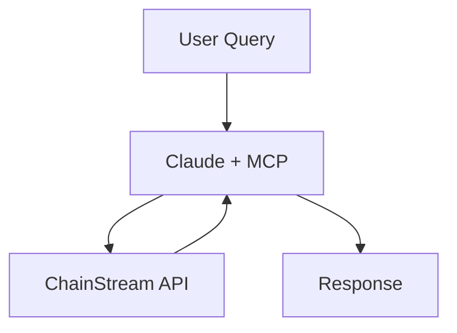

본 튜토리얼에서는 ChainStream MCP Server를 사용하여 온체인 데이터 조회, 시장 분석, 트레이딩 의사결정을 지원하는 AI 어시스턴트 구축 방법을 소개합니다.

<Info>
**예상 소요 시간**: 30분  
**난이도**: ⭐⭐ 초급
</Info>

---

## 목표

온체인 인식 능력을 갖춘 AI 어시스턴트를 구축합니다:



**기능**:
- ✅ 토큰 가격 및 잔액 조회
- ✅ 지갑 보유량 분석
- ✅ 스마트 머니 추적

---

## 1단계: MCP 설정

### 사전 요구사항

- ChainStream 계정 (Client ID와 Client Secret 획득용)
- Claude Desktop 또는 Cursor
- Node.js 18+

### MCP Server 설치

```bash
npm install -g @chainstream/mcp-server
```

### Claude Desktop 설정

설정 파일 편집:

<Tabs>
  <Tab title="macOS">
```bash
# 설정 파일 경로
~/Library/Application Support/Claude/claude_desktop_config.json
```
  </Tab>
  <Tab title="Windows">
```bash
# 설정 파일 경로
%APPDATA%\Claude\claude_desktop_config.json
```
  </Tab>
</Tabs>

설정 추가:

```json
{
  "mcpServers": {
    "chainstream": {
      "url": "https://mcp.chainstream.io/mcp",
      "headers": {
        "Authorization": "Bearer your_access_token"
      }
    }
  }
}
```

Claude Desktop을 재시작하세요.

<Note>
자세한 단계는 [MCP 설정 가이드](/ko/guides/ai-infrastructure/mcp-server/setup-guide)를 참조하세요.
</Note>

---

## 2단계: 대화 예시

### 예시 1: ETH 가격 확인

```
사용자: ETH 가격을 알려줘

Claude: [get_token_price 도구 호출]

ETH 현재 가격:
- 가격: $2,015.32
- 24h 변동: +2.5%
- 24h 거래량: $12.5B
- 시가총액: $242B
```

### 예시 2: 지갑 보유량 분석

```
사용자: 0xd8dA6BF26964aF9D7eEd9e03E53415D37aA96045의 보유량을 분석해줘

Claude: [get_token_balance와 analyze_wallet 도구 호출]

이 주소(vitalik.eth) 보유량 분석:

보유 개요
| 토큰 | 수량 | 가치 |
|-------|--------|-------|
| ETH | 1,234 | $2.48M |
| USDC | 50,000 | $50K |
| ENS | 10,000 | $25K |

지갑 특성
- 지갑 나이: 7년 이상
- 태그: 코어 개발자, 장기 보유자
- 주요 활동: DeFi, NFT, 기부
```

### 예시 3: 스마트 머니 추적

```
사용자: 최근 ARB를 매수하고 있는 스마트 머니 주소는?

Claude: [get_smart_money_activities 도구 호출]

최근 24h 스마트 머니 ARB 매수 기록:

1. 0xabc...123 (Smart Score: 92)
   - 매수: 500,000 ARB ($450K)
   - 시간: 2시간 전
   - 태그: DeFi 전문가, 높은 승률 트레이더

2. 0xdef...456 (Smart Score: 85)
   - 매수: 200,000 ARB ($180K)
   - 시간: 5시간 전
   - 태그: 기관 지갑

추세 분석: 스마트 머니 전체적으로 ARB에 대해 순매수 스탠스
```

---

## 3단계: 고급 활용

### 다단계 분석

```
사용자: 먼저 이 주소의 보유량을 확인하고, 최근 거래를 분석한 후,
투자 스타일을 판단해줘

Claude: 단계별로 분석하겠습니다:

1단계: 보유량 조회
[get_token_balance 호출]
...

2단계: 트랜잭션 이력
[get_transaction_history 호출]
...

3단계: 종합 분석
[analyze_wallet 호출]

위 데이터를 기반으로 이 주소의 투자 스타일은:
- 유형: 중장기 보유자
- 선호: DeFi 블루칩 + Layer2
- 리스크 성향: 보통
- 특징: 조정 시 추가 매수에 능숙
```

### 비교 분석

```
사용자: 이 두 주소의 트레이딩 전략을 비교해줘

Claude: [analyze_wallet x2 호출]

| 차원 | 주소 A | 주소 B |
|-----------|-----------|-----------|
| 거래 빈도 | 높음 (50/일) | 낮음 (5/일) |
| 보유 스타일 | 단기 | 장기 |
| 승률 | 62% | 78% |
| 선호 섹터 | 밈코인 | DeFi |
| 리스크 레벨 | 높음 | 보통 |
```

---

## 보안 고려사항

### 전략 제한

AI 어시스턴트는 데이터 조회와 분석만 제공하며, 직접적인 거래 실행은 하지 않습니다.

```
사용자: 100 USDC어치 ETH를 사줘

Claude: 현재 ETH 가격과 최적 거래 경로를 조회해 드릴 수 있지만,
직접 거래를 실행할 수는 없습니다.

현재 ETH 가격: $2,015
권장 실행 방법:
1. Uniswap V3 - 예상 슬리피지 0.1%
2. 1inch Aggregator - 더 좋은 가격을 얻을 수 있음

지갑에서 직접 거래를 실행해 주세요.
```

### 인간 확인

중요한 의사결정에 대해 AI는 분석을 제공하되 인간의 확인을 권장합니다:

<Warning>
분석에 따르면 여러 스마트 머니 주소가 ARB를 매수하고 있지만, 다음에 유의하세요:
- 이는 투자 조언이 아닙니다
- 시장에는 리스크가 있으므로 독자적으로 판단하세요
- 더 많은 정보 출처와 결합하는 것을 권장합니다
</Warning>

---

## 확장: 커스텀 에이전트

### MCP SDK로 구축

```javascript
import Anthropic from '@anthropic-ai/sdk';
import { Client } from '@modelcontextprotocol/sdk/client/index.js';
import { SSEClientTransport } from '@modelcontextprotocol/sdk/client/sse.js';

const anthropic = new Anthropic();

// MCP 클라이언트 초기화
async function createMcpClient() {
  const transport = new SSEClientTransport(
    new URL('https://mcp.chainstream.io/sse'),
    {
      requestInit: {
        headers: {
          'Authorization': `Bearer ${process.env.CHAINSTREAM_ACCESS_TOKEN}`
        }
      }
    }
  );

  const client = new Client({
    name: 'custom-agent',
    version: '1.0.0'
  });

  await client.connect(transport);
  return client;
}

async function chat(userMessage) {
  const mcp = await createMcpClient();

  // 사용 가능한 도구 조회
  const { tools } = await mcp.listTools();

  // Anthropic 형식으로 변환
  const anthropicTools = tools.map(tool => ({
    name: tool.name,
    description: tool.description,
    input_schema: tool.inputSchema
  }));

  // Claude 호출
  let response = await anthropic.messages.create({
    model: 'claude-sonnet-4-20250514',
    max_tokens: 1024,
    tools: anthropicTools,
    messages: [{ role: 'user', content: userMessage }]
  });

  // 도구 호출 처리
  while (response.stop_reason === 'tool_use') {
    const toolUse = response.content.find(c => c.type === 'tool_use');

    // MCP 도구 호출
    const toolResult = await mcp.callTool({
      name: toolUse.name,
      arguments: toolUse.input
    });

    // 도구 결과로 대화 계속
    response = await anthropic.messages.create({
      model: 'claude-sonnet-4-20250514',
      max_tokens: 1024,
      tools: anthropicTools,
      messages: [
        { role: 'user', content: userMessage },
        { role: 'assistant', content: response.content },
        {
          role: 'user',
          content: [{
            type: 'tool_result',
            tool_use_id: toolUse.id,
            content: JSON.stringify(toolResult.content)
          }]
        }
      ]
    });
  }

  await mcp.close();

  return response.content.find(c => c.type === 'text')?.text;
}

// 사용 방법
const result = await chat('Ethereum에서 ETH 가격을 확인해줘');
console.log(result);
```

---

## 사용 가능한 MCP 도구

| 도구 | 설명 |
|------|-------------|
| `get_token_balance` | 주소의 토큰 잔액 조회 |
| `get_token_price` | 실시간 토큰 가격 조회 |
| `get_transaction_history` | 주소의 트랜잭션 이력 조회 |
| `get_smart_money_activities` | 스마트 머니 활동 조회 |
| `get_defi_positions` | DeFi 포지션 조회 |
| `analyze_wallet` | 지갑 특성 분석 |
| `get_token_holders` | 토큰 홀더 분석 조회 |

---

## FAQ

<AccordionGroup>
  <Accordion title="Claude가 MCP 도구를 호출하지 않는 경우" icon="circle-question">
    1. MCP Server가 올바르게 설정되었는지 확인
    2. Claude Desktop 재시작
    3. Client ID와 Client Secret이 유효한지 확인
    4. "ChainStream을 사용하여 조회해줘..."와 같이 더 명시적인 프롬프트 시도
  </Accordion>

  <Accordion title="응답이 느린 경우" icon="clock">
    온체인 데이터 조회에는 시간이 걸립니다. 특히 복잡한 분석의 경우 더 그렇습니다. 다음을 시도해 보세요:
    1. 단계별로 질문하여 단일 쿼리 부하 경감
    2. 특정 체인을 지정하여 쿼리 범위 축소
  </Accordion>

  <Accordion title="AI가 자동 거래를 할 수 있나요?" icon="robot">
    현재 버전은 데이터 조회만 지원하며, 직접적인 거래 실행은 지원하지 않습니다. 이는 보안상의 이유입니다. 자동 거래의 경우, AI 분석 결과를 기반으로 별도의 트레이딩 시스템에서 실행하는 것을 권장합니다.
  </Accordion>
</AccordionGroup>

---

## 관련 문서

<CardGroup cols={2}>
  <Card title="MCP 설정 가이드" icon="gear" href="/ko/guides/ai-infrastructure/mcp-server/setup-guide">
    상세 설정 단계
  </Card>
  <Card title="MCP 도구 카탈로그" icon="wrench" href="/ko/guides/ai-infrastructure/mcp-server/tools-catalog">
    사용 가능한 모든 도구 확인
  </Card>
</CardGroup>
