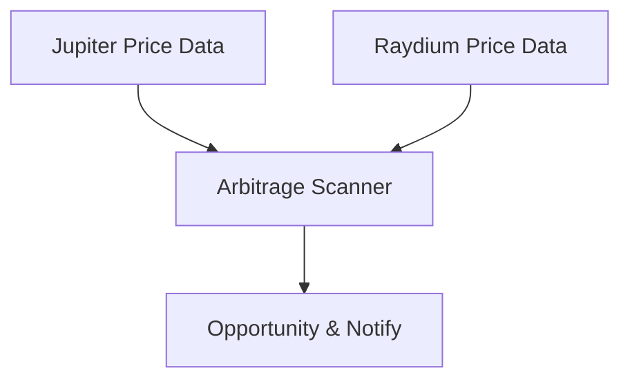

<Info>
ChainStream은 현재 **Solana**(`sol`), **Ethereum**(`eth`), **BSC**(`bsc`)를 지원합니다. 지원 DEX는 Jupiter, Raydium, PumpFun, Moonshot, Candy(Solana), KyberSwap(Ethereum/BSC)입니다. 아래 일부 코드 예시는 개념 설명을 위해 추가 DEX를 참조합니다. 현재 지원 범위는 [지원 체인](/ko/docs/supported-chains)에서 확인하세요.
</Info>

<Warning>
**Coming Soon** — 이 기능은 개발 중이며 아직 사용할 수 없습니다.
</Warning>

본 튜토리얼에서는 거래소 간 가격 차이를 실시간으로 발견하고 잠재적 차익거래 기회를 식별하는 크로스 DEX 차익거래 스캐너 구축 방법을 안내합니다.

<Info>
**예상 소요 시간**: 45분  
**난이도**: ⭐⭐⭐ 중급
</Info>

---

## 목표

크로스 DEX 가격차 차익거래 기회를 발견합니다:



**기능 체크리스트**:
- ✅ 다중 DEX 거래 쌍 가격 조회
- ✅ 스프레드 비율 계산
- ✅ 실행 가능성 평가 (가스, 슬리피지, 깊이 고려)
- ✅ 리스크 알림 (MEV, 프론트러닝)

---

## 차익거래 원리

### 크로스 DEX 차익거래

같은 토큰이 서로 다른 DEX에서 가격 차이를 보일 수 있습니다:

```
예시: Solana의 SOL/USDC

Jupiter:  1 SOL = $140.00
Raydium:  1 SOL = $140.70

스프레드 = ($140.70 - $140.00) / $140.00 = 0.5%

차익거래 경로:
Jupiter에서 SOL 매수 → Raydium에서 SOL 매도 → 차액으로 수익
```

### 수익 공식

<Info>
**순이익 = 스프레드 수익 - 가스비 - 슬리피지 손실**
</Info>

실무 고려사항:
- 두 건의 트랜잭션 가스비
- 매수/매도 슬리피지
- 유동성 깊이 제한
- MEV 프론트러닝 리스크

---

## 1단계: 거래 쌍 조회

### 1.1 의존성 설치

```bash
npm install @chainstream-io/sdk dotenv
```

### 1.2 설정 파일

```javascript
// config.js
import 'dotenv/config';

export const CHAINSTREAM_ACCESS_TOKEN = process.env.CHAINSTREAM_ACCESS_TOKEN;

// 모니터링할 DEX (Solana: Jupiter, Raydium, PumpFun, Moonshot, Candy; EVM: KyberSwap on eth/bsc)
export const DEXES = ['jupiter', 'raydium', 'pumpfun', 'moonshot', 'candy'];

// 모니터링할 거래 쌍 (다중 DEX 스프레드 확인은 현재 지원 범위에서 Solana가 가장 강력)
export const TRADING_PAIRS = [
  { base: 'SOL', quote: 'USDC', chain: 'sol' },
  { base: 'SOL', quote: 'USDT', chain: 'sol' },
];

// 차익거래 임계값
export const MIN_PROFIT_PERCENT = 0.3;   // 최소 수익률
export const MIN_LIQUIDITY_USD = 50000;  // 최소 유동성
```

### 1.3 가격 데이터 조회

```javascript
// scanner.js
import { ChainStreamClient } from '@chainstream-io/sdk';
import { CHAINSTREAM_ACCESS_TOKEN, DEXES } from './config.js';

export class PriceScanner {
  constructor() {
    this.client = new ChainStreamClient(CHAINSTREAM_ACCESS_TOKEN);
  }

  async getDexPrices(base, quote, chain) {
    // DEX 간 거래 쌍 가격 조회
    const prices = await this.client.dex.getPrices({
      base,
      quote,
      chain,
      dexes: DEXES
    });
    return prices;
  }
}
```

---

## 2단계: 스프레드 계산

```javascript
// evaluator.js
import { MIN_PROFIT_PERCENT, MIN_LIQUIDITY_USD } from './config.js';

export class ArbitrageEvaluator {

  findOpportunity(prices, pair) {
    // 낮은 유동성 필터링
    const validPrices = prices.filter(
      p => (p.liquidityUsd || 0) >= MIN_LIQUIDITY_USD
    );

    if (validPrices.length < 2) {
      return null;
    }

    // 최저 매수가와 최고 매도가 찾기
    const sortedPrices = [...validPrices].sort((a, b) => a.price - b.price);
    const buyFrom = sortedPrices[0];   // 최저가 - 매수
    const sellTo = sortedPrices[sortedPrices.length - 1]; // 최고가 - 매도

    // 스프레드 계산
    const spread = (sellTo.price - buyFrom.price) / buyFrom.price * 100;

    // 비용 추정
    const gasCostPercent = 0.1;  // ~0.1%
    const slippagePercent = 0.2; // ~0.2%
    const totalCost = gasCostPercent + slippagePercent;

    // 순이익
    const netProfit = spread - totalCost;

    if (netProfit < MIN_PROFIT_PERCENT) {
      return null;
    }

    return {
      pair: `${pair.base}/${pair.quote}`,
      buyDex: buyFrom.dex,
      buyPrice: buyFrom.price,
      sellDex: sellTo.dex,
      sellPrice: sellTo.price,
      spreadPercent: Number(spread.toFixed(3)),
      netProfitPercent: Number(netProfit.toFixed(3)),
      maxSizeUsd: Math.min(buyFrom.liquidityUsd, sellTo.liquidityUsd) * 0.02
    };
  }
}
```

---

## 3단계: 실행 가능성 평가

### 리스크 평가

```javascript
// risk.js
export function assessRisk(opportunity) {
  const risks = [];

  // MEV 리스크
  if (opportunity.netProfitPercent > 1.0) {
    risks.push('🔴 높은 수익은 MEV에 프론트런되기 쉬움');
  }

  // 유동성 리스크
  if (opportunity.maxSizeUsd < 5000) {
    risks.push('🟡 실행 가능한 크기가 작음');
  }

  // 타이밍 리스크
  risks.push('⚠️ 가격 데이터에는 지연이 있음');

  return {
    risks,
    executable: risks.filter(r => r.includes('🔴')).length === 0
  };
}
```

### 리스크 경고

<Warning>
**중요 리스크 경고**:

1. **MEV 프론트러닝**: 차익거래 거래는 MEV 봇에 프론트런되기 쉽습니다
2. **가격 지연**: 실행 시점에 가격이 변경되었을 수 있습니다
3. **가스비 변동**: 네트워크 혼잡 시 비용이 급등할 수 있습니다
4. **슬리피지**: 실제 슬리피지가 추정보다 클 수 있습니다

이 도구는 기회 발견만을 목적으로 하며 투자 조언을 구성하지 않습니다.
</Warning>

---

## 전체 코드

```javascript
// index.js
import { PriceScanner } from './scanner.js';
import { ArbitrageEvaluator } from './evaluator.js';
import { TRADING_PAIRS } from './config.js';

async function main() {
  const scanner = new PriceScanner();
  const evaluator = new ArbitrageEvaluator();

  console.log('🔍 차익거래 스캐너 시작...');

  while (true) {
    for (const pair of TRADING_PAIRS) {
      const prices = await scanner.getDexPrices(
        pair.base, 
        pair.quote, 
        pair.chain
      );

      const opp = evaluator.findOpportunity(prices, pair);

      if (opp) {
        console.log(`
🎯 차익거래 기회 발견!
   페어: ${opp.pair}
   매수: ${opp.buyDex} @ $${opp.buyPrice}
   매도: ${opp.sellDex} @ $${opp.sellPrice}
   스프레드: ${opp.spreadPercent}%
   순이익: ${opp.netProfitPercent}%
   최대 크기: $${opp.maxSizeUsd.toLocaleString()}
        `);
      }
    }

    // 10초마다 스캔
    await new Promise(resolve => setTimeout(resolve, 10000));
  }
}

main();
```

---

## 확장 제안

<CardGroup cols={3}>
  <Card title="플래시론 통합" icon="bolt">
    플래시론을 활용한 무자본 차익거래
  </Card>
  <Card title="멀티체인 스캔" icon="layer-group">
    Solana 거래소에 eth/bsc KyberSwap 견적 추가
  </Card>
  <Card title="자동 실행" icon="robot">
    지갑을 통합하여 자동 거래 (주의하여 사용)
  </Card>
</CardGroup>

---

## 관련 문서

<CardGroup cols={2}>
  <Card title="DeFi 모니터링 개요" icon="landmark" href="/ko/docs/recipes/defi-monitoring">
    DeFi 모니터링 차원 알아보기
  </Card>
  <Card title="가격 알림 봇" icon="bell" href="/ko/docs/tutorials/build-price-alert-bot">
    실시간 가격 모니터링 시작하기
  </Card>
</CardGroup>
