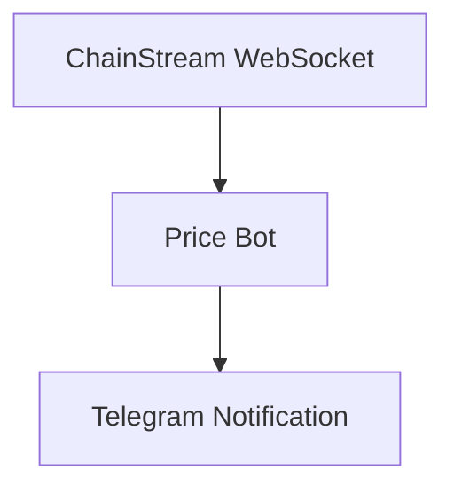

본 튜토리얼에서는 대상 토큰의 가격 변동이 설정한 임계값을 초과할 때 자동으로 Telegram 알림을 전송하는 실시간 가격 모니터링 봇을 처음부터 구축하는 방법을 안내합니다.

<Info>
**예상 소요 시간**: 30분  
**난이도**: ⭐⭐ 초급
</Info>

---

## 목표

토큰 가격을 모니터링하고 자동 알림을 전송하는 봇을 구축합니다:



**기능 체크리스트**:
- ✅ 실시간 가격 스트림 구독
- ✅ 가격 변동 트리거 조건 설정 (> X%)
- ✅ Telegram 알림 전송
- ✅ 다중 토큰 모니터링 지원

---

## 기술 스택

| 구성 요소 | 기술 | 용도 |
|-----------|------------|---------|
| 언어 | Node.js 18+ | 메인 개발 언어 |
| 실시간 데이터 | WebSocket | 가격 스트림 구독 |
| 알림 | Telegram Bot API | 알림 전송 |
| 설정 | 환경 변수 | 민감 정보 저장 |

---

## 사전 요구사항

- ChainStream 계정 (Access Token 획득용)
- Node.js 18+
- Telegram 계정

---

## 1단계: WebSocket 연결

### 1.1 의존성 설치

```bash
npm install @chainstream-io/sdk node-telegram-bot-api dotenv
```

### 1.2 프로젝트 구조

```
price-alert-bot/
├── .env
├── config.js
├── bot.js
└── index.js
```

### 1.3 설정 파일

**.env**:

```
CHAINSTREAM_ACCESS_TOKEN=your_access_token
TELEGRAM_BOT_TOKEN=your_bot_token
TELEGRAM_CHAT_ID=your_chat_id
```

**config.js**:

```javascript
import 'dotenv/config';

// ChainStream 설정
export const CHAINSTREAM_ACCESS_TOKEN = process.env.CHAINSTREAM_ACCESS_TOKEN;

// Telegram 설정
export const TELEGRAM_BOT_TOKEN = process.env.TELEGRAM_BOT_TOKEN;
export const TELEGRAM_CHAT_ID = process.env.TELEGRAM_CHAT_ID;

// 감시 설정
export const WATCH_TOKENS = [
  {
    chain: 'sol',
    address: '6p6xgHyF7AeE6TZkSmFsko444wqoP15icUSqi2jfGiPN',
    symbol: 'EXAMPLE',
    thresholdPercent: 3.0  // 3% 변동 시 트리거
  },
  {
    chain: 'sol',
    address: 'So11111111111111111111111111111111111111112',
    symbol: 'SOL',
    thresholdPercent: 5.0  // 5% 변동 시 트리거
  }
];
```

### 1.4 WebSocket 연결

**index.js**:

```javascript
import { ChainStreamClient } from '@chainstream-io/sdk';
import { CHAINSTREAM_ACCESS_TOKEN, WATCH_TOKENS } from './config.js';
import { sendAlert } from './bot.js';

class PriceMonitor {
  constructor() {
    this.client = new ChainStreamClient(CHAINSTREAM_ACCESS_TOKEN);
    this.lastPrices = new Map(); // 최근 가격 기록
  }

  async start() {
    console.log('✅ 가격 모니터링 시작...');

    // 각 토큰의 통계 구독
    for (const token of WATCH_TOKENS) {
      this.subscribeToken(token);
    }
  }

  subscribeToken(token) {
    this.client.stream.subscribeTokenStats({
      chain: token.chain,
      tokenAddress: token.address,
      callback: (data) => this.handlePriceUpdate(token, data)
    });

    console.log(`📡 ${token.symbol} 가격 스트림 구독`);
  }

  handlePriceUpdate(token, data) {
    const currentPrice = data.price || data.p;
    if (!currentPrice) return;

    const lastPrice = this.lastPrices.get(token.address);

    if (lastPrice) {
      // 변동률 계산
      const changePercent = ((currentPrice - lastPrice) / lastPrice) * 100;

      // 알림 트리거 여부 확인
      if (Math.abs(changePercent) >= token.thresholdPercent) {
        this.triggerAlert(token, currentPrice, changePercent);
      }
    }

    // 가격 기록 업데이트
    this.lastPrices.set(token.address, currentPrice);
  }

  async triggerAlert(token, price, change) {
    const direction = change > 0 ? '📈 UP' : '📉 DOWN';

    const message = `
${direction} 가격 알림!

🪙 토큰: ${token.symbol}
💰 현재 가격: $${price.toFixed(6)}
📊 변동: ${change >= 0 ? '+' : ''}${change.toFixed(2)}%
⚡ 임계값: ${token.thresholdPercent}%
    `.trim();

    await sendAlert(message);
    console.log(`🚨 알림 전송: ${token.symbol} ${change >= 0 ? '+' : ''}${change.toFixed(2)}%`);
  }
}

// 모니터링 시작
const monitor = new PriceMonitor();
monitor.start();
```

---

## 2단계: 트리거 조건 설정

트리거 조건은 `config.js`에서 설정합니다:

```javascript
export const WATCH_TOKENS = [
  {
    symbol: 'EXAMPLE',
    thresholdPercent: 3.0  // 가격 변동 > 3%일 때 트리거
  },
  // ...
];
```

### 고급 트리거 조건

더 복잡한 조건으로 확장할 수 있습니다:

```javascript
// 다중 조건 트리거
const ALERT_CONDITIONS = {
  priceChange: {
    enabled: true,
    thresholdPercent: 5.0
  },
  priceAbove: {
    enabled: true,
    value: 100  // 가격이 $100을 초과하면 트리거
  },
  priceBelow: {
    enabled: true,
    value: 50   // 가격이 $50 아래로 떨어지면 트리거
  }
};
```

---

## 3단계: 알림 전송

### 3.1 Telegram 봇 생성

<Steps>
  <Step title="봇 생성">
    Telegram에서 `@BotFather`를 검색하고 `/newbot` 전송
  </Step>
  <Step title="토큰 획득">
    안내에 따라 봇을 생성하고 Bot Token 획득
  </Step>
  <Step title="Chat ID 획득">
    - 봇에게 메시지 전송
    - `https://api.telegram.org/bot<TOKEN>/getUpdates` 방문
    - `chat.id` 확인
  </Step>
</Steps>

### 3.2 Telegram 알림 모듈

**bot.js**:

```javascript
import TelegramBot from 'node-telegram-bot-api';
import { TELEGRAM_BOT_TOKEN, TELEGRAM_CHAT_ID } from './config.js';

const bot = new TelegramBot(TELEGRAM_BOT_TOKEN);

export async function sendAlert(message) {
  try {
    await bot.sendMessage(TELEGRAM_CHAT_ID, message, {
      parse_mode: 'HTML'
    });
  } catch (error) {
    console.error(`❌ Telegram 전송 실패: ${error.message}`);
  }
}

export async function sendAlertWithRetry(message, maxRetries = 3) {
  for (let attempt = 0; attempt < maxRetries; attempt++) {
    try {
      await sendAlert(message);
      return true;
    } catch (error) {
      if (attempt < maxRetries - 1) {
        // 지수 백오프
        await new Promise(resolve => setTimeout(resolve, 2 ** attempt * 1000));
      } else {
        console.error(`❌ ${maxRetries}번 재시도 후 알림 실패`);
        return false;
      }
    }
  }
}
```

---

## 동작 확인

### 봇 실행

```bash
node index.js
```

### 예상 출력

```
✅ 가격 모니터링 시작...
📡 EXAMPLE 가격 스트림 구독
📡 SOL 가격 스트림 구독
```

### 트리거 테스트

빠른 테스트를 위해 임계값을 임시로 0.01%로 설정:

```javascript
thresholdPercent: 0.01  // 테스트용
```

---

## 확장 제안

<Tabs>
  <Tab title="다중 토큰 모니터링">
```javascript
// API에서 워치리스트를 동적으로 가져오기
async function fetchWatchlist() {
  const response = await fetch('https://api.chainstream.io/v1/watchlist');
  return response.json();
}
```
  </Tab>
  <Tab title="영구 스토리지">
```javascript
import Database from 'better-sqlite3';

const db = new Database('alerts.db');

// 테이블 생성
db.exec(`
  CREATE TABLE IF NOT EXISTS alerts (
    id INTEGER PRIMARY KEY AUTOINCREMENT,
    symbol TEXT,
    price REAL,
    change REAL,
    timestamp INTEGER
  )
`);

function saveAlert(alertData) {
  const stmt = db.prepare(`
    INSERT INTO alerts (symbol, price, change, timestamp)
    VALUES (?, ?, ?, ?)
  `);
  stmt.run(
    alertData.symbol,
    alertData.price,
    alertData.change,
    Date.now()
  );
}
```
  </Tab>
  <Tab title="웹 대시보드">
```javascript
import express from 'express';

const app = express();

app.get('/alerts', (req, res) => {
  const alerts = getRecentAlerts();
  res.json({ alerts });
});

app.post('/config', (req, res) => {
  // 모니터링 설정 업데이트
  updateConfig(req.body);
  res.json({ success: true });
});

app.listen(3000);
```
  </Tab>
  <Tab title="멀티채널 알림">
```javascript
async function sendNotification(message, channels) {
  const tasks = [];
  
  if (channels.includes('telegram')) {
    tasks.push(sendTelegram(message));
  }
  if (channels.includes('discord')) {
    tasks.push(sendDiscord(message));
  }
  if (channels.includes('email')) {
    tasks.push(sendEmail(message));
  }
  
  await Promise.all(tasks);
}
```
  </Tab>
</Tabs>

---

## FAQ

<AccordionGroup>
  <Accordion title="WebSocket 연결에 실패하는 경우" icon="plug">
    1. Access Token이 올바른지 확인
    2. 네트워크가 ChainStream에 접근 가능한지 확인
    3. 방화벽이 WebSocket을 차단하고 있지 않은지 확인
  </Accordion>
  
  <Accordion title="Telegram 알림이 오지 않는 경우" icon="telegram">
    1. Bot Token이 올바른지 확인
    2. Chat ID가 올바른지 확인
    3. 봇에게 메시지를 보냈는지 확인 (대화 활성화)
  </Accordion>
  
  <Accordion title="모니터링 토큰을 추가하려면?" icon="coins">
    `config.js`의 `WATCH_TOKENS` 배열에 설정을 추가하세요.
  </Accordion>
</AccordionGroup>

---

## 관련 문서

<CardGroup cols={2}>
  <Card title="WebSocket API" icon="plug" href="/ko/api-reference/endpoint/websocket/api">
    WebSocket 구독 상세
  </Card>
  <Card title="Webhook 기본 사항" icon="webhook" href="/ko/playbooks/frameworks/webhook-fundamentals">
    WebSocket 대신 Webhook 사용
  </Card>
</CardGroup>
