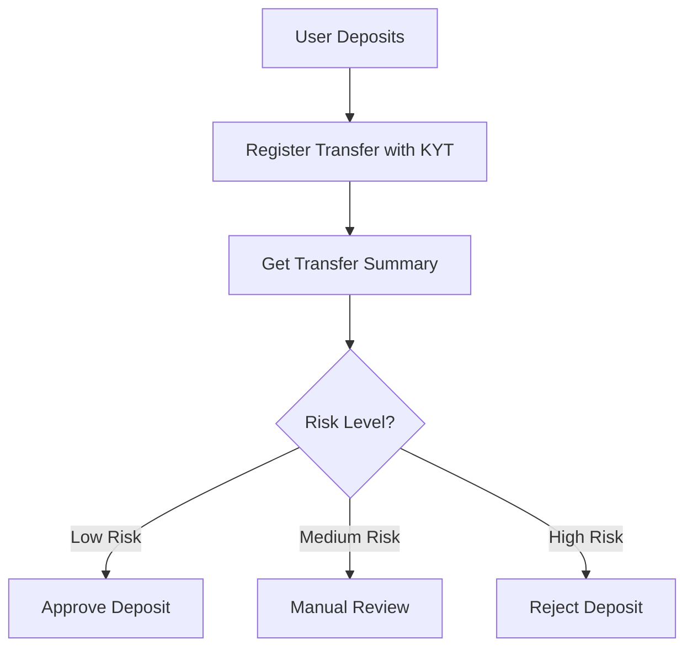

## 프로젝트 개요

본 튜토리얼에서는 사용자 입금 시 자금 출처의 리스크를 자동으로 평가하는 입금 리스크 관리 시스템을 구축합니다.

<Info>
**예상 소요 시간**: 30분  
**난이도**: ⭐⭐ 초급
</Info>

**기능**:
- KYT 분석을 위한 입금 트랜잭션 등록
- 트랜잭션 리스크 평가 결과 조회
- 리스크 레벨에 따른 입금 처리

---

## 작동 원리



---

## 1단계: 입금 트랜잭션 등록

입금이 감지되면 KYT API에 등록하여 분석합니다.

```javascript
import { ChainStreamClient } from '@chainstream-io/sdk';

const client = new ChainStreamClient(process.env.CHAINSTREAM_ACCESS_TOKEN);

async function registerDeposit(deposit) {
  // KYT 분석을 위해 트랜스퍼 등록
  const response = await client.kyt.registerTransfer({
    network: deposit.network,        // 'bitcoin', 'ethereum', 'Solana'
    asset: deposit.asset,            // 'BTC', 'ETH', 'SOL'
    transferReference: deposit.txHash, // 트랜잭션 해시
    direction: 'received'            // 입금 = received
  });

  return response.transferId;
}
```

---

## 2단계: 리스크 평가 조회

등록 후 트랜스퍼 요약을 조회하여 리스크 정보를 가져옵니다.

```javascript
async function getTransferRisk(transferId) {
  // 리스크 평가가 포함된 트랜스퍼 요약 조회
  const summary = await client.kyt.getTransferSummary(transferId);

  // 알림이 있는 경우 상세 조회
  const alerts = await client.kyt.getTransferAlerts(transferId);

  // 직접 노출 정보 조회
  const exposures = await client.kyt.getTransferDirectExposure(transferId);

  return {
    summary,
    alerts,
    exposures
  };
}
```

---

## 3단계: 리스크 기반 처리

리스크 기반 처리 로직을 구현합니다.

```javascript
async function evaluateDeposit(deposit) {
  // 입금 등록
  const transferId = await registerDeposit(deposit);

  // 리스크 평가 조회
  const { summary, alerts, exposures } = await getTransferRisk(transferId);

  // 알림에 따라 리스크 레벨 판단
  const hasHighRiskAlert = alerts.some(
    alert => alert.severity === 'high' || alert.severity === 'critical'
  );
  const hasMediumRiskAlert = alerts.some(
    alert => alert.severity === 'medium'
  );

  // 리스크에 따라 처리
  if (hasHighRiskAlert) {
    return rejectDeposit(deposit, alerts);
  }

  if (hasMediumRiskAlert) {
    return queueForReview(deposit, alerts);
  }

  return approveDeposit(deposit);
}

function approveDeposit(deposit) {
  console.log(`✅ 입금 승인: ${deposit.txHash}`);
  // 사용자 계정에 입금
  return { status: 'approved', deposit };
}

function queueForReview(deposit, alerts) {
  console.log(`⚠️ 입금 검토 대기: ${deposit.txHash}`);
  // 컴플라이언스 팀에 알림
  return { status: 'pending_review', deposit, alerts };
}

function rejectDeposit(deposit, alerts) {
  console.log(`❌ 입금 거부: ${deposit.txHash}`);
  // 로그 기록 및 알림
  return { status: 'rejected', deposit, alerts };
}
```

---

## 전체 예시

```javascript
import { ChainStreamClient } from '@chainstream-io/sdk';

const client = new ChainStreamClient(process.env.CHAINSTREAM_ACCESS_TOKEN);

class DepositRiskChecker {
  async checkDeposit(deposit) {
    try {
      // 1단계: 트랜스퍼 등록
      const { transferId } = await client.kyt.registerTransfer({
        network: deposit.network,
        asset: deposit.asset,
        transferReference: deposit.txHash,
        direction: 'received'
      });

      console.log(`📝 트랜스퍼 등록: ${transferId}`);

      // 2단계: 리스크 평가 조회
      const summary = await client.kyt.getTransferSummary(transferId);
      const alerts = await client.kyt.getTransferAlerts(transferId);

      console.log(`📊 리스크 평가 완료`);
      console.log(`   알림: ${alerts.length}건`);

      // 3단계: 판정
      return this.makeDecision(deposit, summary, alerts);

    } catch (error) {
      console.error(`❌ 입금 체크 오류: ${error.message}`);
      // 오류 시 수동 검토로 전환
      return { status: 'pending_review', reason: 'system_error' };
    }
  }

  makeDecision(deposit, summary, alerts) {
    const criticalAlerts = alerts.filter(a => a.severity === 'critical');
    const highAlerts = alerts.filter(a => a.severity === 'high');
    const mediumAlerts = alerts.filter(a => a.severity === 'medium');

    if (criticalAlerts.length > 0 || highAlerts.length > 0) {
      return {
        status: 'rejected',
        reason: 'high_risk_detected',
        alerts: [...criticalAlerts, ...highAlerts]
      };
    }

    if (mediumAlerts.length > 0) {
      return {
        status: 'pending_review',
        reason: 'medium_risk_detected',
        alerts: mediumAlerts
      };
    }

    return {
      status: 'approved',
      reason: 'low_risk'
    };
  }
}

// 사용 방법
const checker = new DepositRiskChecker();

const deposit = {
  network: 'Solana',
  asset: 'SOL',
  txHash: '39z5QAprVrzaFzfHu1JHPgBf9dSqYdNYhH31d3PEd4hWiWL1LML7qCct5MHGxaRAgjjj1nC3XUyLwtzGQmYqUk4y:address'
};

const result = await checker.checkDeposit(deposit);
console.log('판정 결과:', result);
```

---

## API 레퍼런스

| 엔드포인트 | 설명 |
|----------|-------------|
| `POST /v1/kyt/transfer` | KYT 분석을 위해 트랜스퍼 등록 |
| `GET /v1/kyt/transfers/{id}/summary` | 트랜스퍼 요약 조회 |
| `GET /v1/kyt/transfers/{id}/alerts` | 트랜스퍼 알림 조회 |
| `GET /v1/kyt/transfers/{id}/exposures/direct` | 직접 노출 정보 조회 |

---

## 다음 단계

<CardGroup cols={2}>
  <Card title="KYT 개념" icon="magnifying-glass-dollar" href="/ko/docs/compliance/kyt-concepts">
    KYT 작동 원리 알아보기
  </Card>
  <Card title="KYT API 레퍼런스" icon="code" href="/ko/api-reference/endpoint/kyt/v1/kyt-transfer-post">
    전체 API 문서
  </Card>
</CardGroup>
